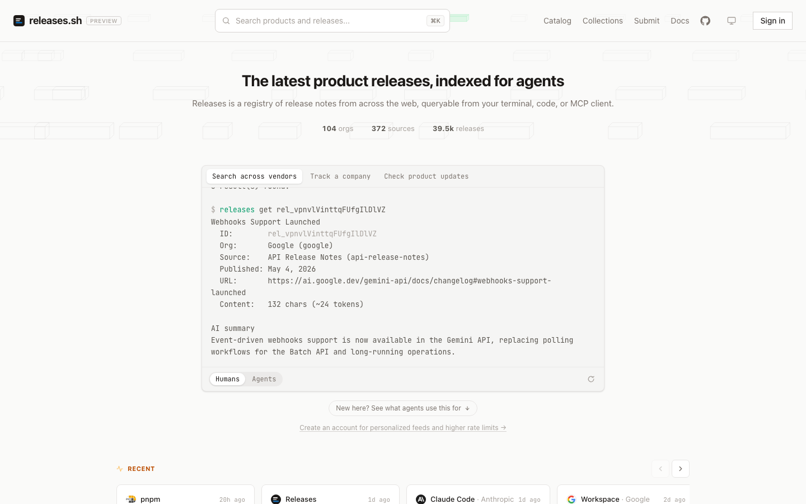
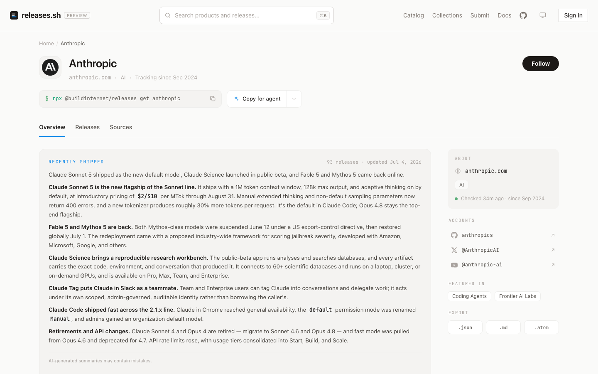

<div align="center">



<h1>Releases</h1>

**The latest product releases, indexed for agents.**

A registry of release notes from across the web — pulled from vendor changelogs,
normalized into one schema, summarized, and queryable from your terminal, your
code, or any MCP client. Readable by you and your agent.

<p>
  <a href="https://releases.sh"><b>releases.sh</b></a> &nbsp;·&nbsp;
  <a href="#use-it">Use it</a> &nbsp;·&nbsp;
  <a href="#whats-in-this-repo">What's in this repo</a> &nbsp;·&nbsp;
  <a href="#local-development">Develop</a>
</p>

<p>
  <a href="https://github.com/buildinternet/releases/actions/workflows/ci.yml"></a>
  <a href="https://www.npmjs.com/package/@buildinternet/releases"></a>
  <a href="https://registry.modelcontextprotocol.io/v0.1/servers?search=sh.releases/mcp"></a>
  <a href="LICENSE"></a>
</p>

</div>

---

## What is this?

"What changed?" is a question agents and developers ask constantly — before an
upgrade, after an incident, when a tool suddenly behaves differently. The answer
is scattered across GitHub releases, RSS feeds, changelog pages, and blog posts
in a hundred different formats.

**Releases** collects those into one registry. It watches hundreds of sources
across the vendors developers actually depend on, and for every release stores
the original content plus an AI-generated title, summary, and breaking-change
classification. Each organization gets a maintained overview of what it shipped
recently. The web page a human reads and the JSON an agent fetches are the same
content.

This repo is the source of the canonical deployment at
[releases.sh](https://releases.sh): the API worker (the authoritative data
plane), the MCP server, the web frontend, and the ingest pipeline + agent
harness that keep the registry fresh. The user-facing CLI ships separately from
[buildinternet/releases-cli](https://github.com/buildinternet/releases-cli)
(npm + Homebrew).

## Use it

No account or API key needed for reads — all four surfaces are public.

**MCP** — hosted at `mcp.releases.sh`, listed in the
[MCP Registry](https://registry.modelcontextprotocol.io/v0.1/servers?search=sh.releases/mcp)
as `sh.releases/mcp`:

```bash
claude mcp add --transport http releases https://mcp.releases.sh/mcp   # Claude Code
codex mcp add releases --url https://mcp.releases.sh/mcp               # Codex
npx -y mcp-remote https://mcp.releases.sh/mcp                          # stdio bridge (VS Code, Zed, …)
```

**CLI** — one-off via npx, or `brew install buildinternet/tap/releases`:

```bash
npx @buildinternet/releases get anthropic     # what did Anthropic ship lately?
npx @buildinternet/releases search "MCP"      # search across every vendor
```

**REST API** — public GET endpoints on `api.releases.sh`, spec at
[/v1/openapi.json](https://api.releases.sh/v1/openapi.json):

```bash
curl "https://api.releases.sh/v1/releases/latest?limit=5"
```

**Agent skills** — install the published skills into any agent (Claude Code /
Codex / Cursor / OpenCode) without checking out anything:

```bash
npx skills add buildinternet/releases-cli
```

Agents consuming the product start from
[releases.sh/llms.txt](https://releases.sh/llms.txt); the full MCP tool catalog
and auth model live in [docs/architecture/mcp.md](docs/architecture/mcp.md).
Creating a [free account](https://releases.sh/signup) unlocks higher rate
limits (mint an API key at [releases.sh/account](https://releases.sh/account)),
plus follows, personalized feeds, webhooks, and email digests.

<div align="center">
  
  <br>
  <sub>Every org page carries an AI-maintained overview and exports as JSON, Markdown, or Atom.</sub>
</div>

## What's in this repo

| Path                 | What                                                                                          |
| -------------------- | --------------------------------------------------------------------------------------------- |
| `workers/api/`       | Hono API on Cloudflare D1 — the authoritative data plane                                      |
| `workers/mcp/`       | Remote MCP server at `mcp.releases.sh`                                                        |
| `workers/discovery/` | Durable-Object agent-session orchestrator                                                     |
| `workers/webhooks/`  | Signs + delivers `release.created` events (HMAC-SHA256, retry/DLQ) — [docs](docs/webhooks.md) |
| `web/`               | Next.js frontend, deploys on Vercel                                                           |
| `packages/`          | Shared code — `core` + `api-types` publish to npm; the rest are private workspaces            |
| `src/agent/`         | Managed-agents discovery + worker harness (prompt builder + shared types)                     |
| `.claude/`           | Claude Code config — `skills/` (canonical skill home), `agents/`, `commands/`, `workflows/`   |

How it fits together:

- **Storage** — Cloudflare D1 (FTS5 + Vectorize). The API worker is the sole data plane.
- **Ingest** — adapters for GitHub Releases, RSS/Atom/JSON feeds, and a browser-rendering fallback for feed-less pages (`packages/adapters/`). The crawler signs outbound fetches (RFC 9421) as a Cloudflare Verified Bot.
- **AI** — changelog parsing, summarization, grouping, and org overviews run in the API worker as direct Anthropic SDK calls.
- **Agents** — discovery + worker run as Anthropic-hosted managed agents; definitions auto-deploy on merge when their source changes.

Per-package detail and project conventions live in [AGENTS.md](AGENTS.md) — the
agent entry point for working in this repo. Architecture deep-dives are in
[docs/architecture/](docs/architecture/), with a reader's guide at
[docs/README.md](docs/README.md).

## Local development

**Prerequisites:** [Bun](https://bun.sh). No external accounts needed for the
core loop:

```bash
bun install
bun run check            # lint + type-check + format (the CI gate)
bun test                 # full test suite, secret-free
bun run db:reset:local   # build a local D1 from migrations
bun run dev:api          # API worker on local D1
bun run dev:web          # Next.js frontend
```

AI passes, scrape fetches, and semantic search take your own keys
(`ANTHROPIC_API_KEY`, Cloudflare Browser Rendering, `VOYAGE_API_KEY`) and
degrade gracefully without them. Setup detail, environment variables, testing,
deployment, and the full no-accounts / bring-your-own-keys / hosted-only
breakdown live in [CONTRIBUTING.md](CONTRIBUTING.md).

## License

[Apache-2.0](LICENSE). The published npm packages
([`releases-core`](packages/core), [`api-types`](packages/api-types)) are
deliberately MIT for maximum reuse. The "Releases" name, releases.sh domain, and
registry branding are not part of the code grant — see
[TRADEMARKS.md](TRADEMARKS.md).
