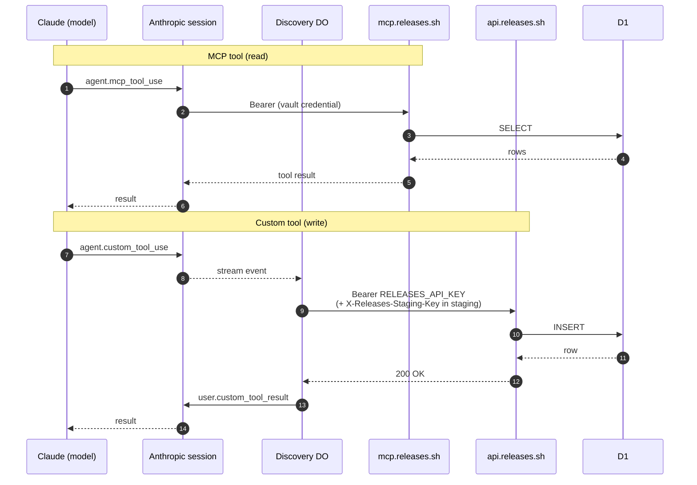

# Agent Architecture

Two Anthropic managed agents handle changelog work, sharing the same tools (`AGENT_TOOLS`) and skills:

- **Discovery agent** (`claude-sonnet-4-6`) — Onboarding, evaluation, and judgment-heavy tasks. System prompt: `src/shared/discovery-prompt.ts`.
- **Worker agent** (`claude-haiku-4-5`) — Fetches, updates, and mechanical operations at ~3x lower cost. System prompt: `src/shared/worker-prompt.ts`. The discovery worker DO routes `mode: "update"` sessions to this agent via `ANTHROPIC_WORKER_AGENT_ID`.

Both agents are auto-deployed by `.github/workflows/deploy-managed-agents.yml` on any push to `main` that touches `src/shared/agent-tools.ts`, `src/shared/worker-prompt.ts`, `src/shared/discovery-prompt.ts`, `src/agent/skills/**`, or `scripts/sync-agent-skills.ts` — live Anthropic state stays in lockstep with `main`. For local / ad-hoc deploys: `bun run deploy:agents` (both), `deploy:agents:discovery`, or `deploy:agents:worker`. Agent IDs and skill mappings live in `scripts/agent-skills.json` (prod) and `scripts/agent-skills.staging.json` (staging).

### Per-environment agents

Staging uses a parallel set of Anthropic resources so prompt/skill changes can be iterated without touching prod.

| Resource                 | Production                       | Staging                             |
| ------------------------ | -------------------------------- | ----------------------------------- |
| Discovery agent (Sonnet) | `agent_011CZtWpasPtsYjF3aysf2ZH` | `agent_011CaHHrroDymm1aEitzUmz1`    |
| Worker agent (Haiku)     | `agent_011CZvdgPKDQ2eRs8gTrLnNA` | `agent_011CaHHqcTEy9WDeLPzqsmHP`    |
| Environment              | `env_01Tq7S8F2FK1KBz68NMje2RU`   | `env_015c9WRKAWFfSqAV6tsAj6Qf`      |
| Vault                    | `vlt_011CZvFkwFPgCkGqRqP87AKB`   | `vlt_011CaHHvBA7pA6GDwRHJa4TN`      |
| Worker                   | `releases-discovery`             | `releases-discovery-staging`        |
| Config file              | `scripts/agent-skills.json`      | `scripts/agent-skills.staging.json` |
| Skill display titles     | `Finding Changelogs`, …          | `Finding Changelogs (staging)`, …   |

Skills are account-level Anthropic resources identified by `skill_…` IDs. Staging uses **separate skill resources** (different IDs, suffixed display title) so pushing a new version does not immediately affect prod agents. Add `--env staging` to any of the deploy scripts to target staging:

```bash
bun run deploy:skills -- --env staging              # push staging skill versions only
bun run deploy:agents -- --env staging              # sync prompt/tools/model on both staging agents
bun run deploy:agents:discovery -- --env staging    # discovery only
bun run deploy:agents:worker -- --env staging       # worker only
```

The `deploy-managed-agents.yml` workflow exposes the same selector as a `workflow_dispatch` input for manual deploys (environment/deploy-scope/agent-scope). Automatic push deploys always target production with `deploy=both`, `agent=all`.

**Follow-up (not yet done):** there's no CLI/API surface to trigger a staging discovery session against `releases-discovery-staging` — the worker is service-bound from `releases-api-staging` but we haven't threaded an `--env staging` flag through the CLI's onboard/update commands. Track via issue #447.

### Version-controlled definitions (render + verify)

The agent definitions aren't hand-authored YAML — the source of truth is TypeScript (the prompt builders, `AGENT_TOOLS`, and the per-env skill IDs), which the deploy assembles. To make that assembled state reviewable and diffable, a committed mirror lives under `managed-agents/` (`<kind>.<env>.agent.yaml`, six files = discovery/worker/coordinator × production/staging):

```bash
bun scripts/render-managed-agents.ts          # regenerate the six YAML files from source
bun scripts/render-managed-agents.ts --check  # CI drift gate — fails if any file is stale
bun scripts/verify-managed-agents.ts --env staging   # diff committed YAML against the LIVE agents
```

- **`render … --check`** runs in CI (`.github/workflows/ci.yml`, the `test` job). It re-renders from source and fails if the committed YAML drifted — so changing a prompt builder, a tool schema, or the category list without re-rendering is caught at PR time. Pure codegen; no network.
- **`verify`** retrieves each live agent via `ant beta:agents retrieve` and classifies every field diff: `match`, `api-default` (server-injected toolset defaults like `configs: []` / `permission_policy` — benign), `source-ahead` (the live agent predates a merged change; a redeploy reconciles it), or `MISMATCH` (a renderer bug or unexplained live drift — the only thing that fails the run). It's an on-demand check, not a CI gate.
- **Workspace caveat:** `ant`'s default OAuth login resolves to the Rally "Default" workspace, which holds the **staging** agents and both coordinators but not the **prod** discovery/worker agents (they live in a sibling Rally workspace, the one the CI `ANTHROPIC_API_KEY` is scoped to). Bind to that workspace — or export its API key — before running `verify --env production`, or those two agents report `UNREACHABLE`.

### Applying: fetch path vs. render-then-apply (`ant`)

The deploy (`scripts/sync-agent-skills.ts`) has two ways to push an existing agent's config:

- **Render-then-apply via `ant` (default).** Each agent's committed `managed-agents/<kind>.<env>.agent.yaml` is fed verbatim to `ant beta:agents update --agent-id <id> --version <current>` — so the committed YAML is the literal deploy artifact. Because the YAML is the full body, this path also (idempotently) re-asserts `name` and the coordinator's `multiagent` roster; the API re-resolves the roster's worker reference to its current version. It uses the YAML's model verbatim, ignoring `RELEASES_*_AGENT_MODEL` overrides (CI never sets them), and relies on the render `--check` drift gate keeping the YAML current. Skills and memory stores stay on the fetch path regardless. (Renames flow through this path too, since `name` is part of the body.)
- **Fetch path (rollback).** Builds the update body in JS from the same source and `POST`s it to `/v1/agents/{id}`, omitting `name`/`multiagent`. The historical path; reachable via a dispatch that unchecks `apply_via_ant`.

The deploy workflow installs the pinned `ant` CLI (conditional on `AGENT_APPLY_VIA_ANT=1`, which is the default for push deploys and dispatches) and uses the `ant` path. To fall back to fetch for a given run — e.g. if a release download is unavailable — dispatch with `apply_via_ant` unchecked. Both environments were cut over to the `ant` path on 2026-06-02 and verify all-match.

### Per-session cost observability

After each managed-agent session ends — both successful completions and terminal failures (provider `session.error`, retries-exhausted idle) — the discovery DO retrieves the final usage envelope via `client.beta.sessions.retrieve(session.id)` (the shared `captureFinalUsage` helper) and computes a list-price USD estimate using `@releases/lib/anthropic-pricing`. The full block — `inputTokens`, `outputTokens`, `cacheWriteTokens`, `cacheReadTokens`, `model`, and `estimatedUsd` — is forwarded to StatusHub via the `session:complete` / `session:error` events and stored on `SessionState.usage`. The web `/status` page renders it under each session card with an `≈ $` qualifier. The dollar figure is from list prices (not the actual billed amount) — for ground truth use the Anthropic console or AI Gateway dashboards. Pricing constants for new models go in `packages/lib/src/anthropic-pricing.ts`. See #657.

- **Agent skills** live in this monorepo at `src/agent/skills/`. Each skill is a `SKILL.md` with YAML frontmatter. Skills are uploaded to the managed agent definition via `bun run deploy:skills`.
- **Deterministic pipeline** (ingest, incremental, summarize) stays as direct Messages API calls — not routed through the agent.
- **URL evaluation** runs pre-checks only (provider detection, feed discovery) via `POST /v1/evaluate`. The discovery agent handles deeper evaluation when needed.

## Tool surfaces: MCP vs custom tools

Managed agents operate against two tool surfaces. They share the same tool-use protocol from the model's perspective but are executed completely differently — the MCP surface is a public Worker, the custom-tool surface runs inside the discovery DO. Contributors frequently conflate them.

| Surface          | Declared in                                     | Executed by                           | Writes? |
| ---------------- | ----------------------------------------------- | ------------------------------------- | ------- |
| **MCP tools**    | `workers/mcp/src/mcp-agent.ts` (`createServer`) | `mcp.releases.sh` — remote MCP server | No      |
| **Custom tools** | `src/shared/agent-tools.ts` (`AGENT_TOOLS`)     | Discovery DO (`ManagedAgentsSession`) | Yes     |

Custom tools are plain Anthropic tool definitions ([Managed Agents → Custom tools](https://platform.claude.com/docs/en/managed-agents/tools#custom-tools)) that aren't served by any worker. When the model emits an `agent.custom_tool_use` event, the DO intercepts it, dispatches to `createTypedExecutor`, and sends the result back via `user.custom_tool_result`. Every write the agent performs (`manage_source`, `manage_playbook`, `manage_org`, `manage_product`, etc.) is a custom tool — writes run inside the trust boundary using the shared admin API key, not through the public MCP server.

### Request flow



### Where to look

- **Add / edit a custom tool** — append to `AGENT_TOOLS` in `src/shared/agent-tools.ts`, add a `case` to `createTypedExecutor` mapping it to a REST call. Merging to `main` auto-deploys both managed agents; `bun run deploy:agents` is only needed for local iteration or staging.
- **Add / edit an MCP tool** — register it inside `createServer` in `workers/mcp/src/mcp-agent.ts`, deploy the `mcp` worker.
- **DO interception point** — `workers/discovery/src/managed-agents-session.ts`, the `agent.custom_tool_use` case inside `runSession()`.

### Why not put writes in MCP?

A single write tool in MCP would expose destructive operations to every unauthenticated caller of `mcp.releases.sh`. Adding principal resolution + per-org scoping to the MCP server is real work that depends on a staging auth story (issue #455) and vault-credential → principal mapping. Folding writes into MCP is planned but not scheduled.

### How the agent gets MCP access

Each agent must register two things at create/update time for the MCP read surface to work:

1. **`mcp_servers`** — `[{ name: "releases", type: "url", url: "https://mcp.releases.sh" }]` (or `mcp-staging.releases.sh` in staging). Names the server inside the agent definition.
2. **`mcp_toolset`** in `tools` — `{ type: "mcp_toolset", mcp_server_name: "releases", default_config: { enabled: true, permission_policy: { type: "always_allow" } } }`. Without this entry the platform never registers MCP tools with the model. Without `always_allow`, the platform's default `always_ask` policy resolves to deny in non-interactive sessions and every MCP call comes back as `Permission to use <tool> has been denied`.

`scripts/sync-agent-skills.ts` builds both via `buildMcpServerDefinition(env)` and `buildMcpToolset()` from `src/shared/agent-tools.ts`. The vault attached to each session (`vault_ids: [...]`) carries the bearer credential the platform uses when calling out to the MCP server — the credential entry must be named to match `mcp_servers.name` (`"releases"`) so the platform pairs them up.

### Discovery column and on-demand rows

The `discovery` column (text, nullable, indexed) on both `organizations` and `sources` records the origin of each row:

| Value         | Set by                                                          |
| ------------- | --------------------------------------------------------------- |
| `'curated'`   | Manual admin operations; backfilled on all pre-existing rows    |
| `'agent'`     | Discovery agent via `manage_source` / `manage_org` custom tools |
| `'on_demand'` | `POST /v1/lookups` (on-demand GitHub coordinate lookup)         |

Agent-created rows (`discovery = 'agent'`) are treated as curated for AI-feature purposes — they get org overviews, summarization, and playbook regen just like manually added rows. On-demand rows (`discovery = 'on_demand'`) skip all AI features except embeddings; they fold into the normal smart-fetch cron at `low` tier once materialized.

If an agent encounters a source or org with `discovery = 'on_demand'` in the DB, it can promote it to curated by calling `manage_source` / `manage_org` action "edit" — no special promotion command exists; updating any field (e.g. name, description) with an explicit `discovery: 'curated'` value is the promotion ceremony.

### Skills vs. playbooks

Agents operate on three layers of fetch guidance:

| Layer                 | Scope      | Location                                     | Example                                     |
| --------------------- | ---------- | -------------------------------------------- | ------------------------------------------- |
| **Global skills**     | All orgs   | `src/agent/skills/**/SKILL.md`               | `parsing-changelogs`, `managing-sources`    |
| **Playbook**          | One org    | `knowledge_pages` rows with `scope=playbook` | "Vercel canary releases ship empty content" |
| **parseInstructions** | One source | `sources.parseInstructions` column           | "Skip entries tagged `marketing`"           |

**A playbook is a per-org skill.** Same mental model as the global skill corpus — imperative instructions an LLM follows when fetching — scoped to one organization. When an agent fetches any of an org's sources, it should load that org's playbook into context alongside the global skills. Global skills teach general patterns; the playbook overrides with org-specific behavior (naming conventions, what counts as a release, rollup cadence, cross-source dedup rules); per-source `parseInstructions` add source-specific hints on top.

Playbook notes are written by the discovery/worker agents themselves — inline during onboarding/fetch using the rubric in the `managing-sources` skill (Playbooks → Writing good agent notes), or in bulk via the `seeding-playbooks` skill. They're owned by agents, not humans — think "the agent's own notebook for this company," not "operator documentation."

The rubric defines a three-layer routing rule: target-shaped facts go in the playbook; adapter/harness errors route to the `releases-tool-notes` memory store; raw org observations route to the `releases-errata` store. Agents use it to keep playbooks tight and skill-shaped instead of letting transient bugs and onboarding narration pollute the body. `seeding-playbooks` is the bulk-orchestration wrapper — it dispatches sub-agents that follow the same rubric to write or rewrite many playbooks in parallel.

## Claude Code Plugin

The monorepo publishes a single Claude Code plugin named **`releases-dev`** via `.claude-plugin/marketplace.json` at the repo root. It targets monorepo developers — end users install the public `releases` / `releases-admin` plugins from the [`buildinternet/releases-cli`](https://github.com/buildinternet/releases-cli) marketplace instead. The two repos publish under different marketplace identities to avoid the silent name shadowing that motivated the rename (see [#1087](https://github.com/buildinternet/releases/issues/1087)).

**Components:** every skill in `src/agent/skills/` (referenced by path, no mirror), the `discovery` / `worker` / `grader` agents under `plugins/claude/releases/agents/`, the `/releases` command, and the `.mcp.json` pointing at `mcp.releases.sh`.

**Manifest layout:** `strict: false` on the plugin entry means the marketplace.json IS the entire definition. There is no per-plugin `plugin.json`; adding one back would create a conflict and the plugin would fail to load.

**Install (monorepo developers):**

```bash
/plugin marketplace add buildinternet/releases
/plugin install releases-dev@releases-monorepo
```

**Validate:** `claude plugin validate . --strict` from the repo root. The same command runs in CI on every PR.

**Skill sources of truth.** Two skill trees coexist but no longer copy:

- `src/agent/skills/` (this monorepo) is the canonical source for managed agents AND for this repo's `releases-dev` plugin. The marketplace.json references these paths directly via `./src/agent/skills/<name>`. No mirror tree, no sync script. After editing `src/agent/skills/<skill>/SKILL.md`, run `bun run deploy:skills` to push the managed-agents update; the plugin picks up the change with no extra step.
- The OSS CLI at [`buildinternet/releases-cli`](https://github.com/buildinternet/releases-cli) ships its own `skills/` tree (publishes `@buildinternet/releases-skills` + the `releases` / `releases-admin` plugins) that includes the six user-oriented skills plus `releases-cli` / `releases-mcp`. When you edit one of the six shared skills here, mirror the change into the OSS CLI so the published package doesn't drift. Cross-repo skill drift is a known follow-up tracked separately from the marketplace rename.
