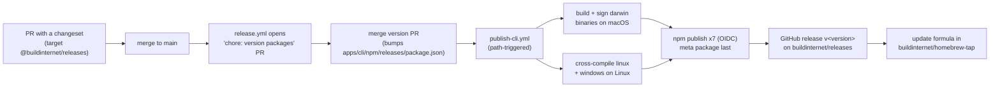

# CLI Distribution

The `releases` CLI is built and published from this monorepo (#2445). The source is `apps/cli/` (private workspace `@releases/cli`, run from source with `bun apps/cli/src/index.ts`). It used to live in `buildinternet/releases-cli`; that repo is archived. Its history and old GitHub releases stay there; its open issues move here.

## Packages

Seven packages ship together as one changesets `fixed` group (see `.changeset/config.json`), so they always carry the same version:

| Package                                                                                             | Source                    | What it is                                                      |
| --------------------------------------------------------------------------------------------------- | ------------------------- | --------------------------------------------------------------- |
| `@buildinternet/releases`                                                                           | `apps/cli/npm/releases`   | Meta package: README, launcher, optional deps on the five below |
| `@buildinternet/releases-darwin-arm64`, `-darwin-x64`, `-linux-x64`, `-linux-arm64`, `-windows-x64` | `apps/cli/npm/releases-*` | Platform packages, each holding one compiled binary             |
| `@buildinternet/releases-lib`                                                                       | `packages/releases-lib`   | CLI helpers (`config`, `legacy-env`, `logger`)                  |

`@buildinternet/releases-lib` is owned by this repo and is a workspace; the CLI and other packages consume it via `workspace:*`.

`@buildinternet/releases-core` and `@buildinternet/releases-api-types` are still published to npm for outside consumers, from `publish-core.yml` and `publish-api-types.yml`. They are not in the fixed group. The CLI consumes both through `workspace:*`, so a schema or wire change and the CLI code that adopts it land in one PR, with no version bump to chase. `@releases/core-internal` stays private (DB-coupled and worker-only helpers). Skills ship from the repo tree via `npx skills add`, not npm; the `releases` Claude Code plugin lives at `plugins/claude/releases/`.

## How a CLI change ships

1. Add a changeset with `bun run changeset`, targeting `@buildinternet/releases`. The fixed group cascades the bump to all seven packages.
2. Merging to `main` makes `release.yml` open (or update) the "chore: version packages" PR. Version PRs opened by the bot need a manual workflow approval before CI runs.
3. Merging the version PR changes `apps/cli/npm/releases/package.json`, which triggers `.github/workflows/publish-cli.yml`. The workflow also has a dry-run `workflow_dispatch`.
4. `publish-cli.yml` builds and signs the darwin binaries on macOS (a Linux cross-compile breaks Bun's signature and the binary is killed on launch), cross-compiles linux and windows on Linux, and publishes the seven packages with OIDC trusted publishing. The meta package goes last, so "meta on npm" means everything shipped, and a partial failure re-runs cleanly.
5. It then creates the GitHub release `v<version>` on this repo with the binaries and checksums, and updates the Homebrew formula in `buildinternet/homebrew-tap`.

`.../releases/latest/download/<asset>` URLs (used by the install docs and the shell installer) resolve against this repo's "latest" release. The core and api-types publish workflows create their GitHub releases with `--latest=false` so they never take that marker; only the CLI release does.

## Trusted publishers

npm trusted publishing (OIDC) must be registered for all seven packages: repo `buildinternet/releases`, workflow file `publish-cli.yml`, for example `npm trust github <pkg> --repo buildinternet/releases --file publish-cli.yml`. A newly added trusted publisher expires if it goes unused for two days, so register them shortly before the first release, not weeks ahead. Missing one package fails the publish part-way; fix the publisher and re-run, and the per-package "already published" check skips what landed.

## Homebrew

`brew install buildinternet/tap/releases` installs from the formula in `buildinternet/homebrew-tap`. `publish-cli.yml` regenerates the formula from the new release's binaries and checksums on every CLI release. The formula installs shell completions automatically; other install paths run `releases completion install`. The shell installer at `releases.sh/install` and the npm package both use the same release binaries.
