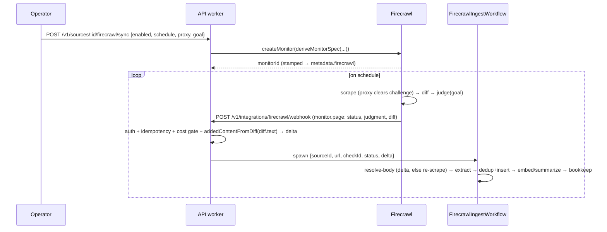

# Firecrawl monitoring

External fetch + change-detection backend for sources our own pipeline can't reach. Some changelog pages (OpenAI's `help.openai.com` articles, and the rest of the [Cloudflare managed-challenge set](remote-mode.md)) sit behind an anti-bot challenge that our `scrape` adapter's Cloudflare Browser Rendering can't clear. [Firecrawl](https://firecrawl.dev)'s `/v2/monitor` API scrapes them on a schedule, diffs each check, runs an AI "meaningfulness" judge, and POSTs a webhook when something changes. We turn that webhook into a release.

Firecrawl is **not a new source type**. It's a fetch backend for an existing `scrape` source, toggled per source via `source.metadata.firecrawl`. `source.url` stays the human-readable page; the monitor config and IDs live in metadata (see [remote-mode.md → Display URL vs. fetch routing](remote-mode.md#display-url-vs-fetch-routing)).

Live since 2026-05-29 on OpenAI `chatgpt-release-notes` (`src_GOemdYESxsfNSMVhbjwjy`). ~14 conservative beneficiary candidates (paused scrape sources with no feed, behind a challenge). **Prod-only** — see [Config & secrets](#config--secrets).



## Monitor lifecycle (admin)

`POST /v1/sources/:slug/firecrawl/sync` — body `{ enabled: boolean, schedule?, proxy?: "auto"|"basic"|"stealth"|"enhanced", goal? }`. Takes a typed `src_…` ID (via `resolveSourceFromContext`), admin-gated through `publicReadAuthMiddleware`'s non-SAFE_METHODS branch, hidden from the prod OpenAPI spec. Enabling creates the monitor; disabling deletes it. Implemented in `workers/api/src/routes/firecrawl.ts` + `workers/api/src/lib/firecrawl-sync.ts`.

`deriveMonitorSpec` is a pure, reconcile-safe spec builder:

- `name` = `releases:<source.id>` (keyed on the id, not slug — slugs aren't globally unique post-#690).
- `schedule` — `{ text, timezone: "UTC" }`, default `every 6 hours`; `targets: [{ type: "scrape", urls: [url], scrapeOptions: { formats: ["markdown"], proxy } }]` (proxy default `auto`).
- `webhook` — `url` from **`ADMIN_BASE_URL`** (`api.releases.sh`, the API worker — _not_ the public web origin), `headers: { "X-Firecrawl-Token": <FIRECRAWL_WEBHOOK_SECRET> }`, `metadata: { sourceId }`, `events: ["monitor.page"]`.
- `goal` — default "Detect new product releases…"; drives the AI change judge.

**Create vs. update is asymmetric.** `createMonitor` sends the full spec. `updateMonitor` (a `PATCH`) reconciles **only the app-owned webhook** (URL + token + sourceId). `schedule`/`proxy`/`goal` are sent once at create and are **dashboard-authoritative thereafter** — an operator tuning cadence/proxy in the Firecrawl dashboard sticks, and a later `sync` can never revert it. A `404` on update self-heals by recreating with the full spec. `monitorId` / `lastCheckId` / `lastChangeAt` are stamped on `metadata.firecrawl`.

## Webhook wire format

The receiver is `POST /v1/integrations/firecrawl/webhook` (in neither `publicReadRoutes` nor `adminRoutes`, so no auth middleware runs — it self-authenticates). Payload is nested and carries a **diff, not markdown**:

```jsonc
{
  "success": true, "type": "monitor.page", "id": "...", "webhookId": "...",
  "metadata": { "sourceId": "src_…" },          // echoed back for routing
  "data": [{
    "monitorId": "...", "checkId": "...", "url": "...",
    "status": "new" | "changed" | "same" | "removed" | "error",
    "isMeaningful": true,
    "judgment": { "meaningful": true, "confidence": "high", "reason": "...", "meaningfulChanges": [...] },
    "diff": { "text": "...", "json": {...} },
    "previousScrapeId": "...", "currentScrapeId": "..."
  }]
}
```

### `diff.text` is a hunkless whole-document diff

This is the load-bearing, easy-to-get-wrong detail. Firecrawl's **published docs** show `diff.text` as a textbook unified diff with `@@ -x,y +a,b @@` hunk headers and `---`/`+++` file headers. The **live `monitor.page` webhook does not.** In the default (markdown text-diff) monitor mode it sends the **entire page** as one diff body:

- **no `@@` hunk headers, no `---`/`+++` file headers**;
- every page line prefixed with a single space (context), `+` (added), or `-` (removed);
- so a small change ships as a ~150 KB `diff.text` (the whole page) with a handful of `+` lines in it.

`diff.json` is populated **only** in changeTracking `json` mode; in the default mode it arrives empty (`{ "files": [] }`), so `diff.text` is the only carrier.

`addedContentFromDiff` (`packages/adapters/src/firecrawl-diff.ts`) reduces `diff.text` to just the added lines. It handles **both** shapes: when `@@` headers are present it gates collection on them (skipping the file-header preamble); when **no** `@@` header is present it treats the whole body as one implicit hunk and collects the `+` lines directly. Context/removed/header lines are dropped. Returns `""` when nothing was added.

> History: the original parser only collected `+` lines _after_ a `@@` header, so it returned `""` on every real change — silently forcing the full-page re-scrape fallback below. Fixed in #1262; the `@@`-only assumption originated in the design doc (see [Further reading](#further-reading)).

## Ingest workflow

`FirecrawlIngestWorkflow` (`workers/api/src/workflows/firecrawl-ingest.ts`), spawned by the receiver after the cost gate, with small params `{ sourceId, url, checkId, status, delta }` (no markdown blob through Workflow serialization). Steps:

1. **load-source** — refuses to run if `metadata.firecrawl.enabled` is false.
2. **resolve-body** — if `delta` is present, return it and **skip the paid full-page re-scrape** (steady state). Only a `new`/baseline event (or an empty delta) calls `client.scrapeOnce(url)` for the full markdown.
3. **extract** — `extractFirecrawlMarkdown` → `extractFromBody`, one-shot, model **Haiku 4.5** (`FIRECRAWL_EXTRACT_MODEL`), **temperature 0** (`EXTRACTION_TEMPERATURE`, `packages/adapters/src/extract/shared.ts` — extraction is non-deterministic at the SDK default of 1.0). Inputs over `DEFAULT_CHANGELOG_SLICE_TOKENS` (10 K) are windowed to the newest entries via `sliceChangelog`, logging `input-windowed` + `droppedChars` (no silent caps).
4. **dedup-insert** — `ingestRawReleases`, the shared poll-fetch tail: marketing classify → feed-enrich → media pre-pass → chunked insert (dedup on `UNIQUE(source_id, url)`) → coverage clustering → publish events → IndexNow.
5. **embed + generate-content** — only when new rows landed (embeddings + Haiku summaries/titles).
6. **bookkeep** — write a `fetch_log` row (`sessionId = firecrawl:<checkId>`, status `success`/`no_change`), stamp `lastCheckId`/`lastChangeAt`, reset `consecutiveErrors`/`consecutiveNoChange`.

**Cost gate** (in the receiver, before spawn): `new` always ingests; `changed` ingests when the judge is off, judgment is absent, or `judgment.meaningful === true` (fail-open — never silently drop a real change); `same`/`removed`/`error` are no-ops. KV idempotency on `(checkId + url)` via `LATEST_CACHE`.

**Failure handling**: the pipeline is wrapped so a terminal failure writes an `error` `fetch_log` row and bumps `consecutiveErrors` (single-attempt, no retry — writes aren't idempotent), classified by `FirecrawlError.status`: `402` → `credits-exhausted`, `401`/`403` → `auth-failed`, else `ingest-failed`.

## Poll-fetch exclusion & resilience

Firecrawl-enabled sources are **excluded from the poll-fetch cron** — `queryDueSources` reads `json_extract(metadata, '$.firecrawl.enabled')` and drops them, plus a workflow-side guard — so we never double-fetch or clobber monitor bookkeeping.

Because a hard-blocked source has **no in-repo fetch fallback** (that's why it's on Firecrawl), the only signal that ingestion stalled is "the monitor went quiet." An hourly `scanStaleFirecrawlSources` (`workers/api/src/cron/firecrawl-staleness.ts`) emits a warn-level event when a `firecrawl.enabled` source's `lastFetchedAt` is older than its staleness window. The window is `max(FIRECRAWL_STALE_HOURS, 2× the monitor's actual cadence)`: `FIRECRAWL_STALE_HOURS` (default **48**) is a _floor_, and the monitor's live `schedule.cron` — read back via `getMonitor`, since the Firecrawl dashboard is a second writer and the stored `metadata.firecrawl.schedule` can be stale — only ever _raises_ the threshold, so a deliberately slow (e.g. weekly) monitor isn't false-warned. A source still inside the floor window needs no schedule read, so the only `getMonitor` calls are for sources already past the floor; any read failure (no API key, getMonitor error, unparseable cron) falls back to the floor rather than suppressing the warning. `cronIntervalHours` recognizes the handful of shapes Firecrawl normalizes to — it is deliberately not a general cron parser.

## Config & secrets

- `FIRECRAWL_API_KEY` (note: **`_KEY`**, not `_TOKEN`) and `FIRECRAWL_WEBHOOK_SECRET` — Cloudflare Secrets Store + root `.env`.
- **Prod-only bindings.** The Firecrawl bindings are removed from the staging wrangler block: staging shares prod's Secrets Store, so a staging sync would create/patch/delete **prod** monitors. Do not add them to `[env.staging]`.

## Diagnostics & debugging

Axiom (`releases-cloudflare-logs`), JSON in `body`:

- `firecrawl-webhook` — `enqueued` (carries `diffTextLen`, `deltaLen`, `path: "delta"|"rescrape"`), `gate-skip`, `skip-unknown-source`, `spawn-failed`.
- `firecrawl-ingest-workflow` — `ingested` (`found`, `inserted`), `input-windowed` (`droppedChars`), `credits-exhausted`/`auth-failed`/`ingest-failed`.
- `firecrawl-staleness` — `scan-complete` (`scanned`, `stale`).

**Fast-path miss signal:** an `enqueued` event with `path: "rescrape"` **and** `diffTextLen > 0` means the diff carried no extractable added content (an unexpected diff shape, or a genuinely added-nothing change) and the workflow fell back to a full-page re-scrape + window.

**Inspect a check's stored diff/judgment** (read-only) via Firecrawl: `GET /v2/monitor/{monitorId}/checks` (list) and `/v2/monitor/{monitorId}/checks/{checkId}` (detail — per-page `diff{text,json}` + `judgment`). NB: the response JSON can contain raw unescaped control characters inside strings — `jq` rejects it; parse leniently (e.g. Python `json.load(..., strict=False)`).

## Content-fidelity caveat

The full-page **fallback** path runs the extract over many entries at once; under output pressure Haiku may **condense** an entry's body (paraphrase, drop links) rather than preserve it verbatim. The delta path (one entry, small input) preserves much better. There is no release content-PATCH API, and the batch upsert only backfills `content` when the existing value is empty (`RELEASE_URL_UPSERT`), so correcting an already-stored row is a manual fix: a direct D1 `UPDATE` of `content` + `content_hash` (recompute via `contentHash()` in `packages/adapters/src/content-hash.ts`) + `content_chars`/`content_tokens` (`computeContentSize()` in `@buildinternet/releases-core/tokens`), then re-embed via `POST /v1/workflows/embed-releases`.

## Full-history backfill (`POST /v1/workflows/backfill-source`)

The steady-state ingest windows a baseline scrape to the recent `DEFAULT_CHANGELOG_SLICE_TOKENS` slice (`extractFirecrawlMarkdown`), so older history is dropped on onboard. To recover it, an operator or local sub-agent POSTs `{ sourceId, markdown?, maxWindows?, dryRun? }` to `/v1/workflows/backfill-source` (admin-gated, sibling of `enrich-feed-content`).

**Corrected cost model.** The Firecrawl scrape itself is fast (~0.2s). The long pole is sequential Haiku extraction at ~1.8s per extracted entry — a dense source (~200 entries) takes ~6 min total. `FIRECRAWL_BACKFILL_MAX_WINDOWS` (8) is a sane upper-bound ceiling, not a durability mechanism; it cannot bound a dense page's total extraction time.

### Path A — supplied markdown / plain fetch (synchronous)

Runs via `runSourceBackfill` in a single request. Supplied `markdown` (any scrape source, incl. JS/CF-blocked pages the worker can't fetch) → plain `fetch` + `htmlToMarkdown`. No scrape cost; unclamped window budget (1–200). This is the path for arbitrarily-deep histories — a local agent renders the page and the worker does cheap Haiku extraction over the supplied text. A partial run self-heals on re-run (writes are idempotent; missing summaries drain via autogen).

### Path B — deep Firecrawl (durable, gated by `BACKFILL_WORKFLOW_ENABLED`)

When the source has `metadata.firecrawl.enabled`, no `markdown` is supplied, and the `BACKFILL_WORKFLOW_ENABLED` flag is on with the `BACKFILL_SOURCE_WORKFLOW` binding present, the route hands off to `BackfillSourceWorkflow` and returns `202 { instanceId, statusUrl, async: true }` immediately. Poll `GET /v1/workflows/backfill-source/status/:instanceId` for the report; dry-run counts come from the instance's `status().output`. Flag default **off** — behavior is 100% the existing synchronous path until deliberately enabled. See issue #1281.

**Durable design.** Each `BackfillSourceWorkflow` instance runs as resumable Cloudflare Workflow steps:

1. **`scrape`** — `client.scrapeOnce(url)` (~0.2s); raw markdown saved to R2 (`released-raw` bucket) keyed by content-hash; a `source_raw_snapshots` pointer row is inserted. All subsequent steps receive the small R2 key, not the multi-MB body (avoids the CF step-state size limit; no re-scrape on resume).
2. **`plan-windows`** — `sliceChangelog` precomputes all window slice offsets without the LLM. Applies `FIRECRAWL_BACKFILL_MAX_WINDOWS` (8) ceiling; sets `cappedAtWindow` if tail was truncated.
3. **`extract-window-{i}`** (one step per window) — loads raw from R2 → slices to this window → Haiku 4.5 extraction → `ingestRawReleases` (idempotent upsert). A failure or client disconnect resumes from the failed window; completed windows are already durably written (`RELEASE_URL_UPSERT`).
4. **`finalize`** — aggregates globally-unique counts and date range across windows, runs embed + summary regeneration, assembles the `SourceBackfillReport` (including `guidance` when the cap bit is set).

### Shared properties (both paths)

- **Body acquisition ladder (Path A):** supplied `markdown` → plain `fetch` + `htmlToMarkdown`. (Path B uses Firecrawl `scrapeOnce`.)
- **Extraction:** `extractChangelogAllWindows` / per-step `extractFromBody` — Haiku 4.5, temp 0, one-shot per window.
- **Dedup contract:** reuses the exact prod `extractFromBody` + `mapEntries` slugs (`${sourceUrl}#${slug(version ?? title)}`). `RELEASE_URL_UPSERT` no-ops already-stored rows; in-memory dedup collapses within-batch duplicates. Re-running is idempotent.
- **`dryRun` (default true):** returns `windows`, `extracted`, `deduped`, `dateRange` (and `guidance` when capped) without writing.
- **`guidance`:** set when the Firecrawl ceiling reduced a deeper request and the run stopped with untouched tail — tells the caller to supply `markdown` to go deeper.

Not wired into any cron — runs only when explicitly POSTed. See `docs/superpowers/specs/2026-05-30-backfill-source-durable-workflow-r2-design.md` (durable path) and `docs/superpowers/specs/2026-05-30-backfill-source-primitive-design.md` (original synchronous design).

## Further reading

- Design + plan (dated, historical): `docs/superpowers/specs/2026-05-29-firecrawl-monitoring-integration-design.md` and `docs/superpowers/plans/2026-05-29-firecrawl-monitoring-integration.md`. These predate the live-API findings — the webhook delivers a diff (not markdown), and `diff.text` is hunkless; see the correction notes at the top of each.
- [extract.md](extract.md) — the shared `extractFromBody` two-tier extraction path this reuses.
- Key PRs: monitor lifecycle + receiver #1243/#1246, incremental extraction + dashboard-authoritative sync #1252, extraction determinism (temp 0) + Haiku #1255, hunkless-diff parser fix + `enqueued` diagnostics #1262.
