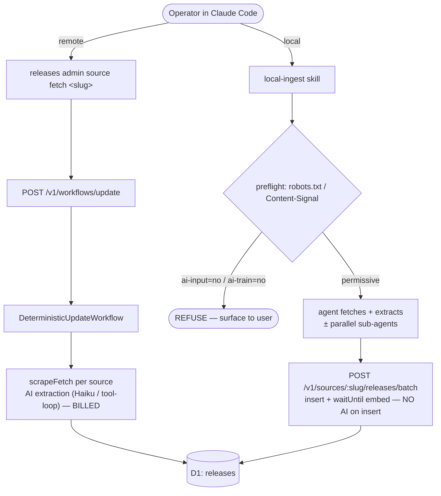

# Local ingest

A **local-ingest path** for onboarding a changelog: a local Claude Code agent fetches the pages, extracts release records itself (optionally fanning out to parallel sub-agents), and writes them through the existing batch-upsert endpoint — **without dispatching the remote managed agent (MA)**.

This is an assembly of production-tested building blocks, not new infrastructure. The capability lives in the **`local-ingest` skill** (`.claude/skills/local-ingest/`), a Claude-Code-local operator skill alongside `seeding-playbooks`. A companion `--local` handoff flag on `releases admin source fetch` lives in the OSS CLI repo ([buildinternet/releases-cli](https://github.com/buildinternet/releases-cli)) and only stages the work — no extraction in the thin client.

## Why

`releases admin source fetch <slug>` POSTs to `/v1/workflows/update`, which starts a deterministic update run (the API worker's `DeterministicUpdateWorkflow`, #1946 — formerly a discovery-worker MA session). The body→records extraction runs server-side (`scrapeFetch` → incremental Haiku or the DeepSeek/OpenRouter tool-loop), and that inference is billed **even when it yields zero releases**.

Onboarding `conductor.build` is the canonical failure: the remote path burned a full Sonnet `web_fetch` loop _and_ a Haiku oneshot fallback (both hit `max_tokens`) and wrote **0 releases**. A local agent is already a capable model with web-fetch + file tools — it can do the per-page extraction inline (folded into the session you're already running) and only needs a deterministic write path. That write path already exists.

## The two paths

The local path never calls `/v1/workflows/update`, so no update run is created. The confirming negative signal is in Axiom `releases-cloudflare-logs`: no `POST .../fetch?sessionId=det-…` and no `extract-deps-worker` events for the source.

## Cost contract

|                        | Remote update path                                                 | Local-ingest path                                       |
| ---------------------- | ------------------------------------------------------------------ | ------------------------------------------------------- |
| Extraction             | server-side `scrapeFetch` (incremental Haiku / tool-loop)          | the agent itself (± sub-agents, operator-chosen model)  |
| `/v1/workflows/update` | called                                                             | **never called**                                        |
| AI on insert           | summarization + marketing classifier + feed enrichment (cron path) | **none** — `insert` + fire-and-forget vector embed only |

The batch endpoint deliberately omits the AI fields (`title_generated` / `title_short` / `summary`) and org overviews. They remain settable manually afterward — see [Manual enrichment](#manual-enrichment).

## Building blocks

- **Batch write, no AI on insert** — `POST /v1/sources/:slug/releases/batch` and the org-scoped `/v1/orgs/:orgSlug/sources/:sourceSlug/releases/batch` (handler `postReleasesBatchHandler`, `workers/api/src/routes/sources.ts`). Body `{ releases: [{ version?, title, content, url?, contentHash?, publishedAt?, media?, type?, prerelease? }] }`. Upserts on `UNIQUE(source_id, url)` — idempotent, safe to re-run and page. Requires `write` scope; the static `RELEASES_API_KEY` (root) satisfies it.
- **Pure extract libs (optional, "Approach A")** — `packages/adapters/src/extract/*` (`extractFromBody`, `extractWithTools`, `runDirectFetchExtraction`). `ExtractDeps.cloudflare` is nullable and `repo` can be a noop, so they run with just an Anthropic key (proof: `scripts/smoke-toolloop.ts`). These packages are `private: true` — monorepo-only, never the thin CLI.
- **Shared conventions** — `.claude/skills/{parsing-changelogs,managing-sources,finding-changelogs}` carry the release `type`, version-format, date-normalization, media-unwrap, and dedup rules the local output must match.
- **Media unwrap** — `normalizeMediaUrl` (`packages/rendering/src/media-url.ts`) strips `_next/image` / Vercel optimizer wrappers.

## Preflight: the Content-Signal opt-out gate

The skill's mandatory first step is `.claude/skills/local-ingest/preflight.ts <url>` — it fetches `robots.txt` (following apex→www redirects), parses Cloudflare's [Content Signals](https://developers.cloudflare.com/bots/additional-configurations/managed-robots-txt/) policy, and gates on exit code: `0` proceed, `1` refuse, `2` unknown (surface to user).

It **refuses** when the publisher declares `ai-input=no` or `ai-train=no` anywhere in robots.txt. `conductor.build` (`Content-Signal: ai-train=no, search=yes, ai-input=no`) is the regression target and must be refused.

This is a **policy** choice, not a technical limit. Only Cloudflare's `/crawl` endpoint hard-enforced the signal for Conductor; `web_fetch` and CF Browser Rendering still retrieved the page. A local onboard must not silently spend tokens or ingest content against an opt-out — so the gate refuses by default, with an explicit-permission escape hatch (the CLI exposes `--force`; the skill requires a documented human go-ahead). The `conductor` org/source is already in the registry, paused for exactly this reason.

## Parity

Local output matches production shape so a source can later be picked up by the normal pipeline with no cleanup: `type` (`feature`/`rollup`), real version strings with `<UNKNOWN>`/`n/a` pre-stripped (the `/batch` path does not strip — the single-insert path does), ISO-8601 `publishedAt` (approximate from month/quarter/year rather than omit), unwrapped media URLs, and an always-populated per-release `url` (the dedup key).

## Manual enrichment

The out-of-scope AI fields stay settable, case by case:

- **Per-release:** `PATCH /v1/releases/:id` accepts `summary`, `titleGenerated`, `titleShort`, `composition`, `version`, … and re-embeds on change.
- **At insert time:** the single-release insert `POST /v1/sources/:slug/releases` accepts `summary?`/`titleGenerated?`/`titleShort?` — use it instead of `/batch` when enrichment should land in the same write.
- **Bulk, after the fact:** `bun scripts/generate-release-content.ts --orgs=<slug>`.

### Content enrichment via `/batch` (`mode: "upsert-content"`)

The default `/batch` upsert is **fill-don't-clobber** (`RELEASE_URL_UPSERT`, #958): on a same-URL collision it only writes content/media when the stored row is _empty_. That protects routine cron/MA re-fetches from a sparser re-extraction overwriting a good row — but it also means a **deliberate second pass cannot replace a non-empty stub** (seed index summaries first, then re-POST the full detail-page body), and for scrape sources the title-dedup pre-filter (#1410) can drop the same-title re-POST before the upsert even runs.

`mode: "upsert-content"` at the top level of the `/batch` body opts into the clobbering `RELEASE_CONTENT_UPSERT` (#1526): same-URL collisions **overwrite** content/contentHash/size and media when the incoming row carries them, the scrape title-dedup pre-filter is skipped, and the R2 media pre-pass processes existing URLs too (so media re-mirrors). A blank incoming `content`/`media` never wipes a stored value. It is opt-in only — the default path is unchanged, so a normal re-fetch can never clobber. The `url` must match the seeded row exactly (enrich keys on URL); if the URL scheme changed, hard-delete + re-seed instead.

## Pointers

- Skill: `.claude/skills/local-ingest/SKILL.md` + `preflight.ts`.
- Batch / single-insert / PATCH handlers: `workers/api/src/routes/sources.ts`.
- MA model choice (what local-ingest avoids): `workers/discovery/src/managed-agents-session.ts`.
- Extract libs + smoke: `packages/adapters/src/extract/`, `scripts/smoke-toolloop.ts`.
- CLI `--local` handoff (separate repo): `buildinternet/releases-cli`, `src/cli/commands/fetch.ts`.

## Backfill workflow

For full-history backfills, the `backfill-source` / `backfill-sweep` dynamic Workflows (`.claude/workflows/`) wrap these same primitives in a deterministic harness: the fail-closed preflight gate, the window cap with skip-logging, the budget gate between extract waves, the known-URL dedup, and the chunked `/batch` write (by typed `src_` id) all live in JS rather than prose, so a long backfill can't silently truncate, blow its budget, or lose its place. Model-tiered — Sonnet for the two judgment phases (map, extract), Haiku for the mechanical ones (preflight, run-setup, write, validate, report). Launch them via the `backfilling-sources` skill (dry-run is the default); runs are recorded under `~/.releases/work/` via `releases admin work start`. The decision logic is unit-tested in `tests/workflows/backfill-helpers.js` and inlined into the workflow (scripts can't import); `tests/workflows/workflow-scripts.test.ts` guards the copies against drift.

**Scrape sources: re-seed on first backfill.** The `scrape` adapter stores releases with `url = null` — the rendered index is split into entries without capturing per-release URLs. Because the workflow's dedup step (`selectNewUrls`) keys on stored release URLs, a dry-run against these url-null rows reports `skippedKnown=0` even when rows already exist. A `dryRun:false` run would then write the overlap as new url'd rows alongside the old url-null rows (SQL NULLs are always distinct under the `UNIQUE(source_id, url)` constraint) — duplicates, not a gap-fill. The correct first-run path is to hard-delete the existing rows first (`releases admin release delete --source <slug> --hard`), then run the backfill; subsequent re-runs are safely incremental once real per-release URLs are stored.
