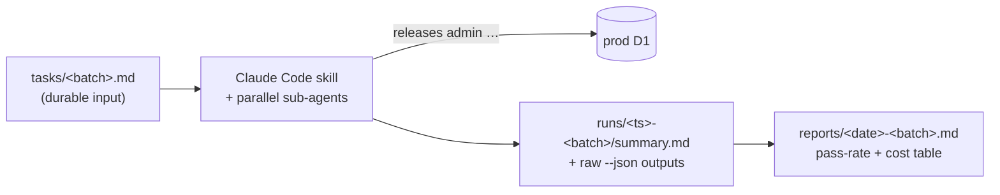

# Maintenance workspace

A per-user **`~/.releases/work/`** workspace that gives agent-driven admin maintenance a durable, reviewable, cost-aware trail. When a local agent (Claude Code running a skill like [seeding-playbooks](../../src/agent/skills/seeding-playbooks/SKILL.md), `maintaining-orgs`, `managing-sources`, or `regenerating-overviews`) makes real prod mutations, the only other record is the ephemeral conversation transcript. This workspace is where the agent writes down what it set out to do, what it actually did, and what it cost.

Inspired by Browserbase's [`autobrowse`](https://github.com/browserbase/skills/tree/main/skills/autobrowse) `tasks` / `traces` / `reports` convention. Two deliberate divergences: (1) this is a **skill convention, not a CLI feature** — the agent creates the folders and writes the artifacts while running a maintenance skill; the `releases` CLI stays a pure HTTP client. (2) autobrowse keeps its workspace in CWD; ours lives in the **home dir** instead, because this work spans repos — we move between the monorepo and the [`releases-cli`](https://github.com/buildinternet/releases-cli) checkout (and worktrees), and a single per-user trail both can write to and read beats a per-checkout silo.

## Layout

`~/.releases/work/` (honors `RELEASED_DATA_DIR` — `$RELEASED_DATA_DIR/work/` when set; sits beside the CLI's existing `logs/`, `credentials`, and caches):

```
~/.releases/work/
├── tasks/      ← durable batch definitions you (or the agent) author up front
├── runs/       ← per-run evidence: what the agent did, with raw --json outputs
└── reports/    ← cross-run session summaries (pass-rate + cost table)
```



## Why the home dir (and not CWD)

- **Reachable from any checkout.** You run these skills from the monorepo and admin commands from the `releases-cli` repo. A home-dir workspace gives one audit trail both reach, instead of artifacts stranded in whichever directory happened to be CWD that session.
- **Survives worktree churn.** Worktrees come and go; `~/.releases/work/` persists, so the trail isn't lost when an isolated checkout is cleaned up.
- **Consistent with the CLI's data dir.** It uses the same root as `getDataDir()` (`RELEASED_DATA_DIR` || `~/.releases`), so maintenance artifacts sit next to the per-day `logs/`, `credentials`, and caches the CLI already owns — one place for per-user state.
- **Not committed, by design.** It's outside any repo — these are working artifacts, not source. Promote anything durable (a recurring task definition, a notable finding) into `.context/` or an issue deliberately.

## Artifacts

### `tasks/<batch>.md` — the durable input

What this batch is meant to accomplish. Authored once, not edited mid-run. Mirrors the existing `onboard → state-file → apply` shape — a task you can re-run.

```markdown
# Task: <short description>

One sentence on the goal.

## Targets

- org-slug-a
- org-slug-b

## Workflow

Which skill / model / flags. e.g. "seeding-playbooks, verified workflow, Sonnet, batches of 10".

## Done when

- [ ] Every target shows a playbook >100 chars
- [ ] Data-quality issues surfaced are filed or noted in the report
```

### `runs/<timestamp>-<batch>/summary.md` — per-run evidence

One directory per run (`YYYY-MM-DD-HHMM-<batch>/`). The agent writes a `summary.md` and drops the raw `--json` outputs of the mutations it made (the CLI already emits these) beside it, so the run is auditable after the transcript scrolls away.

```markdown
# <batch> — run <timestamp>

**Status:** completed | partial | failed
**Targets:** N | **Succeeded:** N | **Cost:** ~$X.XX (managed-session estimatedUsd + local sub-agent cost)

## Per-target

| Target | Result | Notes                                         |
| ------ | ------ | --------------------------------------------- |
| org-a  | ok     | playbook 1.2k chars                           |
| org-b  | failed | parent-saves: heredoc blocked, saved manually |

## What changed

- Raw outputs in ./outputs/ (one <slug>.json per mutation)

## Findings

- org-b feed is stale (lastFetchedAt 40d old) — candidate for follow-up
```

### `reports/<date>-<batch>.md` — durable session summary

Written once per session, after all runs. The cross-run record you can read later or share — the pass-rate / cost table is the heart of it.

```markdown
# Maintenance session — <date> — <batch>

**Scope:** <what was attempted> | **Total cost:** ~$X.XX

## Results

| Target | Runs | Final | Cost  | Notes              |
| ------ | ---- | ----- | ----- | ------------------ |
| org-a  | 1    | ok    | $0.03 | —                  |
| org-b  | 2    | ok    | $0.06 | needed manual save |

## Findings worth acting on

- <data-quality issue, coverage gap, or onboarding candidate>
```

## Managed-agent sessions slot in here too

Server-triggered sessions (`onboard`, `source fetch --wait`, `overview batch --wait`) already return full session records — steps, `usage.inputTokens/outputTokens/estimatedUsd`, `model`, `result` — that the CLI reads but does not persist. Phase B of this convention (tracked in the OSS CLI repo) gives those commands a `--trace-dir` flag (defaulting to `~/.releases/work/runs/`) and `admin discovery task get <id> --save <dir>` so a managed session lands as `runs/<sessionId>/{trace.json,summary.md}` in the same shape. Because the workspace is per-user, a session triggered from the `releases-cli` repo and a playbook batch run from the monorepo land in the same `runs/` — a single, greppable cost ledger for the money-spending operations, defense-in-depth alongside the server-side spend cap.
