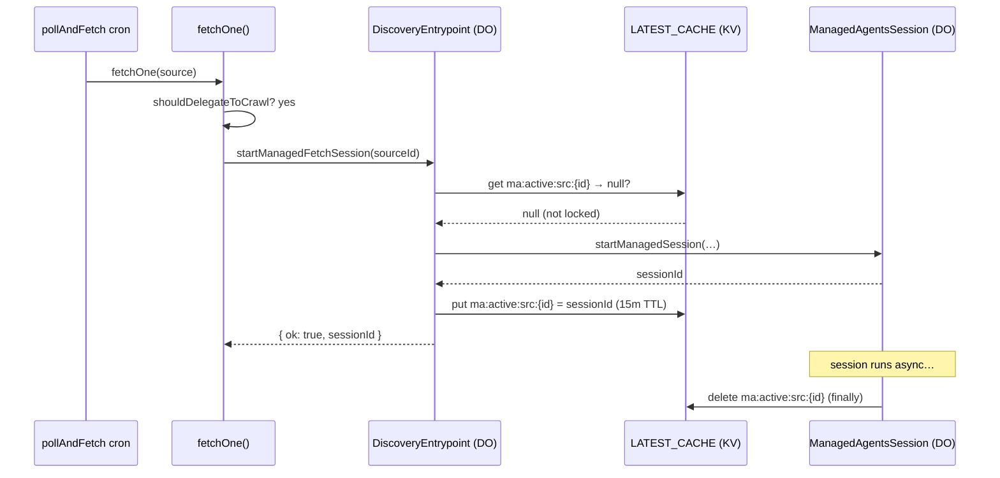
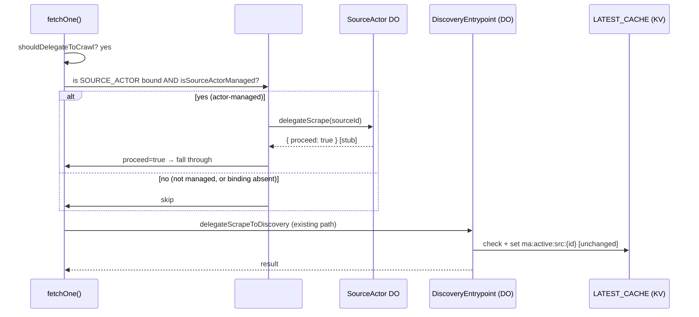

# SourceActor delegation seam — implementation plan (#1780)

> **Status: scaffold merged, staged rollout pending.** This doc describes the
> planned phased routing of managed-source scrape/agent delegation through the
> `SourceActor` DO so its single-thread serialization can eventually replace
> three per-source coordination bolt-ons. Parent epic: #1778. First scaffold: #1780.

## Overview

`SourceActor` (#1776) gave each source a self-driving alarm-based fetch timer and
the **structural foundation** for single-threaded serialization (one DO instance
→ one JS event loop → no concurrent fetches for the same source). The timer half
is live and serving the 5% canary cohort.

The serialization half — using the DO's single-event-loop guarantee to replace the
KV `ma:active:src:{sourceId}` mutex, the session-dedup window, and the
`skipDelegation` header guard — is the remaining work. This plan stages that
migration safely.

## Current state

### How delegation works today

When `fetchOne` determines a feed/scrape source needs full managed-agent crawl
extraction (see `shouldDelegateToCrawl`), it calls `delegateScrapeToDiscovery`.
That function calls `startManagedFetchSession` on the discovery worker's `DiscoveryEntrypoint`.

Three coordination bolt-ons prevent the same source from spawning two concurrent
managed-agent sessions:

1. **KV lock** (`ma:active:src:{sourceId}`, 15-min TTL in `LATEST_CACHE`): set
   immediately after a session is minted; checked at the top of
   `startManagedFetchSession`. Released in the session's `finally` block (or
   expires after 15 min if the DO crashes before cleanup).

2. **Session-dedup window** (`UPDATE_DEDUP_WINDOW_MINUTES = 5`): `startManagedFetchSession`
   also rejects if an active session for the same source was started within the
   last 5 minutes, checked via the `/v1/sessions?recent_minutes=5` query.

3. **`skipDelegation` guard**: `POST /v1/sources/:slug/fetch` sets
   `skipDelegation = true` when the caller is a managed-agent session
   (`X-Releases-MA-Session` header), preventing a session from re-entering the
   delegation path and self-colliding on the KV lock (bug fixed in #1061).

These three bolt-ons exist because the API worker has no per-source serialization
primitive. Once the `SourceActor` DO is the sole fetch scheduler for a source,
the DO's single-event-loop guarantee gives that primitive for free.



### What the SourceActor adds

For actor-managed sources (`isSourceActorManaged(…)` returns true), the DO alarm
fires `PollAndFetchWorkflow` directly. The actor's single-event-loop guarantee
means only one alarm runs at a time per source — the in-flight guard (`inFlight`
flag + `SAFETY_WINDOW_MS`) further prevents duplicate workflow spawns within one
safety window. This is structurally stronger than a KV mutex (TTL expiry can race;
the DO's event loop cannot).

## Proposed routing through SourceActor

The plan has three ordered phases. **This document covers Phase 1 only.** Phases 2
and 3 are approved but not yet implemented.

### Phase 1 — Route + scaffold (this PR, #1780)

Add a `delegateScrape(sourceId)` RPC stub to `SourceActor` and a gated call seam
in `fetchOne` that tries the actor before falling through to the existing
`delegateScrapeToDiscovery` path. **Net behavior: unchanged.** No lock is removed.
The stub always returns `{ proceed: true }`, so the caller always delegates via
the existing path.

Purpose: the routing infrastructure exists and is type-checked/tested before the
behavioral change in Phase 2.

### Phase 2 — Drop KV lock for actor-managed sources

Once the 5% canary from #1776 shows clean (no double-sessions, no missed fetches),
expand to Phase 2:

- Make `delegateScrape` actually serialize the call: acquire a DO-local mutex
  (or simply use the event loop's single-threadedness) and invoke
  `startManagedFetchSession` itself, returning `{ proceed: false }` so the caller
  skips the duplicate `delegateScrapeToDiscovery` call.
- For actor-managed sources, stop writing/checking the KV `ma:active:src:{id}`
  key. The DO's single-event-loop is the mutex now.

### Phase 3 — Delete dead code at 100% cohort

Once the cohort is at 100% and the system is stable:

- Remove the KV lock acquisition/release from `startManagedFetchSession` and the
  session `finally` block.
- Remove the `skipDelegation` guard (no longer needed since actor-managed sources
  serialize through the DO and non-actor sources still use the lock, until they
  are also migrated).
- Delete the guard entirely once cohort = 100%.

## Phase 1: actor RPC entry point

### New `delegateScrape` method on `SourceActor`

```ts
/**
 * Phase 1 stub (#1780). Returns { proceed: true } so the caller falls through
 * to the existing delegateScrapeToDiscovery path unchanged.
 *
 * Phase 2 will implement actual serialization here: acquire the DO-local mutex,
 * call startManagedFetchSession, and return { proceed: false } so the caller
 * skips the duplicate delegation call.
 */
async delegateScrape(sourceId: string): Promise<{ proceed: boolean }> {
  logEvent("info", {
    component: "source-actor",
    event: "delegate-scrape-stub",
    sourceId,
  });
  return { proceed: true };
}
```

### Gated call seam in `fetchOne`

Right before the `return await delegateScrapeToDiscovery(db, source, env)` line,
add:

```ts
// #1780 scaffold: if this source is actor-managed, route through the DO.
// Phase 1: stub always returns { proceed: true }, so we fall through to the
// existing delegation path. No KV lock is removed. No behavior change.
if (env.SOURCE_ACTOR) {
  const cohortPct = parseCohortPct(env.SOURCE_ACTOR_COHORT_PCT);
  const enabled = await flag(env.FLAGS, env.SOURCE_ACTOR_ENABLED, FLAGS.sourceActorEnabled);
  if (isSourceActorManaged(source.id, enabled, cohortPct, true)) {
    try {
      const stub = env.SOURCE_ACTOR.getByName(source.id) as unknown as SourceActorDelegateRpc;
      const signal = await stub.delegateScrape(source.id);
      if (!signal.proceed) {
        // Phase 2+: actor serialized the call; skip the direct delegation.
        return {
          releasesFound: 0,
          releasesInserted: 0,
          durationMs: 0,
          status: "no_change" as const,
        };
      }
      // Phase 1: proceed === true → fall through to existing path below.
    } catch {
      // Actor unavailable or error → fail open to existing path.
      logEvent("warn", {
        component: "cron-poll-fetch",
        event: "source-actor-delegate-scrape-failed",
        sourceId: source.id,
        sourceSlug: source.slug,
      });
    }
  }
}
return await delegateScrapeToDiscovery(db, source, env);
```

### `FetchOneEnv` additions

Three new optional fields:

```ts
/** DO binding for the SourceActor delegation seam (#1780). Optional — absent → existing path only. */
SOURCE_ACTOR?: DurableObjectNamespace;
SOURCE_ACTOR_ENABLED?: string;
SOURCE_ACTOR_COHORT_PCT?: string;
```

## How serialization replaces the KV lock (Phase 2 preview)

A Durable Object processes one request at a time on its event loop. When Phase 2
makes `delegateScrape` actually invoke `startManagedFetchSession` (instead of
returning `{ proceed: true }`), two concurrent callers for the same source will
queue at the DO instead of racing at KV. The first call acquires no KV lock
because the DO IS the mutex. The second call's `delegateScrape` invocation queues
behind the first; by the time it runs, the session is already active and the inner
`startManagedFetchSession` rejects on the dedup window (still present during
Phase 2 transition, removed in Phase 3).

## Fail-safe fallback

The seam is gated on `env.SOURCE_ACTOR != null`. If the binding is absent (e.g.
local dev, staging without the binding, or an emergency "binding removed" rollback):

- The `if (env.SOURCE_ACTOR)` guard is false → seam is a complete no-op.
- `delegateScrapeToDiscovery` runs as before.

If the binding is present but `isSourceActorManaged` is false (cohort not reached,
flag off):

- The inner `if` is false → seam is a no-op for this source.

If the actor call throws (DO evicted, network error):

- The `try/catch` swallows the error, logs a warning, and falls through to
  `delegateScrapeToDiscovery`.

In all error cases the system degrades to today's behavior.

## Staged retirement order

| Phase       | Gate                           | What changes                                                     |
| ----------- | ------------------------------ | ---------------------------------------------------------------- |
| 1 (this PR) | Flag off, cohort 0%            | Routing infrastructure exists; no behavior change                |
| 2           | 5% canary clean (#1776 proven) | Actor serializes call; KV lock dropped for actor-managed sources |
| 3           | Cohort at 100%, stable         | KV lock code deleted; `skipDelegation` guard removed             |

## Test plan

- [ ] `bun run check` passes (excluding pre-existing `workers/mcp` zod-split tsc errors)
- [ ] `bun test tests/ web/ workers/discovery workers/mcp workers/webhooks` passes
- [ ] `bun test workers/api` passes
- [ ] Existing `delegateScrapeToDiscovery` tests pass unchanged (seam is a no-op in tests without `SOURCE_ACTOR` binding)
- [ ] Verify `SourceActor.delegateScrape` is callable as a DO RPC (type-checked by `SourceActor extends DurableObject`)
- [ ] Smoke: deploy to staging; trigger a crawl-delegation source manually; confirm existing KV lock + MA session behavior unchanged
- [ ] Canary (#1776's 5% cohort): observe no double-sessions, no missed fetches over 48h before Phase 2

## Sequence diagram — Phase 1 (scaffold, net behavior unchanged)



## Sequence diagram — Phase 2 (actor serializes, KV lock retired)

```mermaid
sequenceDiagram
    participant FO as fetchOne()
    participant Seam as #1780 seam
    participant SA as SourceActor DO
    participant DW as DiscoveryEntrypoint (DO)

    FO->>FO: shouldDelegateToCrawl? yes
    FO->>Seam: isSourceActorManaged? yes
    Seam->>SA: delegateScrape(sourceId)
    Note over SA: DO event loop serializes concurrent calls
    SA->>DW: startManagedFetchSession(sourceId)
    DW-->>SA: { ok: true, sessionId }
    SA-->>Seam: { proceed: false }
    Seam->>FO: proceed=false → skip delegateScrapeToDiscovery
    Note over FO: returns no_change; DO session runs async
```
