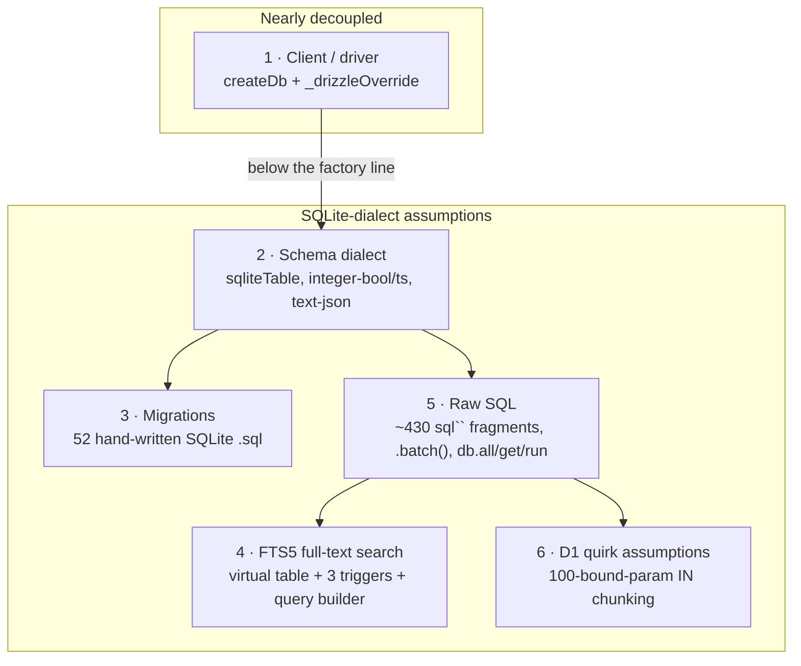

# Storage portability (D1 today, Postgres as a future option)

The relational store is **Cloudflare D1 (SQLite) via Drizzle**, and that is the
only supported backend today. This doc exists because we want to keep the _option_
of running on Postgres open — for a self-hoster, an OSS fork, or the day we hit a
D1 ceiling — **without** committing to the port before there's a concrete reason to
pay for it. It maps exactly where SQLite/D1 assumptions live, records what is
already decoupled, and lays out a phased path so a future contributor doesn't have
to rediscover the seams.

> **Status:** aspirational, not in progress. Nothing here is a backend swap you can
> flip on. The near-term investment is keeping the coupling _narrow and documented_,
> which is good architecture regardless of whether Postgres ever ships.

## The one thing to internalize

The **D1 binding** is nearly fully seamed — construction goes through a single
factory and an injectable override. But the **SQLite dialect** is assumed pervasively
below that line: in the schema column modes, in ~430 raw `sql\`\`` fragments, in the
FTS5 full-text search, and in 52 hand-written SQLite migrations. Swapping backends is
therefore _not_ a driver-line change; it is a real port dominated by three of the six
seams below.

**IDs are not the hard part.** Entity primary keys are already backend-neutral
typed strings (see [Entity IDs](#entity-ids-invariant)). A future Postgres port is
dominated by FTS, raw SQL dialect, and schema builders — not by switching UUID PKs.

## Entity IDs (invariant)

**Single typed nanoid = primary key = public ID.** Registry entities use one string
identity end-to-end:

| Layer | Value |
| --- | --- |
| Generation | App code via `@buildinternet/releases-core/id` (`newReleaseId()`, …) |
| Storage | `TEXT` PK / FK (SQLite today; `text` on any future SQL backend) |
| API / MCP / CLI / webhooks / URLs | Same string (`rel_…`, `src_…`, `org_…`, `prod_…`, …) |

Prefixes are load-bearing product surface (`getEntityType`, bare-path rules, release
URL parsing as `rel_` + 21 chars). They are not a display veneer over a second
internal key.

### Why not dual-ID (UUID PK + public nanoid)?

Blog posts often recommend dual-ID for Postgres: native `uuid` for JOINs, prefixed
nanoid for the wire. That pattern is a good fit when **Postgres is home** and
public IDs are added later.

It is a **poor prep step** for this codebase:

1. **D1 has no native UUID type.** UUID-as-`TEXT` is 36 chars; typed nanoid is often
   shorter. Dual-ID on D1 adds a second unique index + a resolve hop with no real
   storage win.
2. **Portability favors one string.** `text` PKs work identically on SQLite and
   Postgres. A dual schema (native `uuid` on PG only) is optional later, not required
   for a sane port.
3. **The public contract is already the PK.** Rewriting every FK to introduce an
   internal UUID is a platform migration, not an additive column. LocalCan-style
   "add `public_id`" only works when UUID is already the PK — the opposite of our
   starting point.
4. **Random UUID ≠ better B-trees.** UUIDv4 and nanoid are both random. Index locality
   would need time-sortable keys (UUIDv7/ULID), which leak creation time — a separate
   product decision, not a free dual-ID side effect.

**Deferred:** dual-ID as a Postgres-dialect optimization (internal `uuid`, public
typed `text` unique), only if a real PG backend ships _and_ measured join/index
pressure justifies it. Domain code and the public API keep speaking typed IDs either
way. Do **not** dual-ID the D1 schema "to prepare."

### Rules for new tables

- Public/registry entities: typed nanoid `TEXT` PK via `$defaultFn(new…Id)` from
  `packages/core/src/id.ts`. Same string on the wire.
- Internal counters / append-only telemetry may use integer autoincrement
  (`usage_log`) — those IDs are not product surface.
- Never assume integer PKs, UUID shape, or a separate `public_id` column in
  application code. Lookups stay `WHERE id = ?` (or slug/domain resolvers that
  eventually resolve to `id`).
- Better Auth / workspace tables keep their own ID conventions; they are not registry
  entities and are out of this invariant.

## Backend capability map

What a relational backend must provide for the app to run at full fidelity. Today
there is one production shape (D1). Self-host / Postgres rows are the intended
future matrix — fill them in when a second backend is real; until then they mark
degradation points honestly.

| Capability | Production (D1) | Portable constant / owner | Self-host SQLite (future) | Postgres (future) |
| --- | --- | --- | --- | --- |
| Relational driver | `drizzle-orm/d1` via `createDb` | `@releases/lib/db` | file / LiteFS + sqlite driver | `postgres-js` / `node-postgres` branch in `createDb` |
| Schema dialect | `sqliteTable`, integer bool/ts, text json | `packages/core/src/schema.ts` | same as D1 | parallel `pgTable` (phase 2) |
| Migrations | hand-written SQLite `.sql` | `workers/api/migrations/` | same set or subset | parallel PG set (phase 2) |
| Bound-param ceiling | 100 / statement | `@buildinternet/releases-core/d1-limits` | likely higher; keep chunking | higher; raise constants |
| Multi-statement batch | D1 `.batch()` | call sites + test `ensureBatchShim` | transaction | transaction analog |
| Lexical full-text | FTS5 `releases_fts` + triggers | [Lexical search](#lexical-search-ownership) | FTS5 if available | `tsvector` / `pg_trgm` or degrade |
| Semantic search | Vectorize | `packages/search` | optional / off | optional / off / other vector store |
| Entity IDs | typed nanoid `TEXT` | `@buildinternet/releases-core/id` | same | same (`text`; dual-ID optional later) |

**Orthogonal (not relational):** KV, R2, Durable Objects, Flagship, managed agents.
A self-host without those bindings degrades features; it does not change entity ID
shape. See [What is NOT in scope](#what-is-not-in-scope) and
[deploy-coupling.md](deploy-coupling.md).

## Lexical search ownership

Highest-risk portability seam (#4). Lexical search is **not** abstracted behind a
pluggable interface yet (one production impl — premature). Phase 0 discipline is
**ownership**: do not grow new `releases_fts` / `MATCH` call sites.

### Query sanitization (backend-neutral)

[`packages/core/src/fts.ts`](../../packages/core/src/fts.ts) —
`toFtsMatchQuery` / `toFtsPrefixMatchQuery`. Pure string shaping for FTS5 syntax.
Safe to keep even if the MATCH backend changes; a Postgres port may replace or
bypass these helpers behind the same call sites.

### Production `MATCH` call sites (closed set)

| File | Role |
| --- | --- |
| [`workers/api/src/queries/search.ts`](../../workers/api/src/queries/search.ts) | Primary release FTS for `/v1/search` |
| [`workers/api/src/queries/orgs.ts`](../../workers/api/src/queries/orgs.ts) | Org-scoped release filter (`MATCH ?` fragment) |
| [`workers/api/src/queries/sources.ts`](../../workers/api/src/queries/sources.ts) | Source-scoped release filter (`MATCH ?` fragment) |
| [`packages/search/src/hybrid-search-worker.ts`](../../packages/search/src/hybrid-search-worker.ts) | Hybrid RRF lexical leg (IDs only, then rehydrate) |
| [`workers/mcp/src/tools.ts`](../../workers/mcp/src/tools.ts) | MCP search path (prefer converging onto `queries/search` over time) |

Schema / sync (not query):

- `releases_fts` virtual table + INSERT/UPDATE/DELETE triggers in
  `workers/api/migrations/` (baseline).

**Rule:** new lexical behavior goes through an existing site above (extend the
helper, do not open a sixth MATCH). When a second SQL backend is real, replace
these sites with one `LexicalSearch` module (FTS5 vs `tsvector` vs empty degrade) —
that is phase 3, not a D1 rewrite today.

**Degrade path already exists in spirit:** hybrid search can run vector-only or
lexical-only when the other leg fails or is unbound. A Postgres self-host without
FTS can lean on Vectorize (if configured) or LIKE/entity match until lexical is
ported.

## Current construction seam (done)

All relational-DB construction funnels through **one factory**, `createDb` in
[`packages/lib/src/db.ts`](../../packages/lib/src/db.ts) (`@releases/lib/db`):

```ts
// packages/lib/src/db.ts
export function createDb(dbOrD1: AnyD1Database | D1Db): D1Db {
  // Tests pass a pre-built handle (bun:sqlite) — pass it through untouched.
  if (dbOrD1 && typeof (dbOrD1 as { select?: unknown }).select === "function") {
    return dbOrD1 as D1Db;
  }
  return drizzle(dbOrD1 as AnyD1Database, { schema });
}
```

The established call convention, used everywhere (routes, crons, workflows, queues,
and the `SourceActor`/`OrgActor` Durable Objects):

```ts
const db = env._drizzleOverride ?? createDb(env.DB);
```

`_drizzleOverride` is the test-injection seam (a `bun:sqlite` handle) and doubles as
the natural place a future backend would branch. **This is the choke point to change
when adding a Postgres driver** — ideally the only place. Historically ~16 sites
constructed Drizzle inline (`drizzle(env.DB)`); those were converged onto `createDb`
so "swap the backend" is a one-factory change for the api worker rather than a
20-file sweep.

The factory now lives in **one place** —
[`packages/lib/src/db.ts`](../../packages/lib/src/db.ts), exported as `@releases/lib/db`.
All four consumers build through it: the three worker `db.ts` files
([`workers/api`](../../workers/api/src/db.ts),
[`workers/mcp`](../../workers/mcp/src/db.ts),
[`workers/webhooks`](../../workers/webhooks/src/db.ts)) are thin re-exports, and
[`packages/search/src/log-search.ts`](../../packages/search/src/log-search.ts)
constructs via `createDb` instead of hand-rolling `drizzle(env.DB)`. The shared factory
stays zod-free so it doesn't split `workers/mcp`'s SDK-pinned zod type graph, and it
takes drizzle's structural `AnyD1Database` (not the workers-types `D1Database` global) so
it compiles under `packages/lib`'s tsconfig. This was follow-up #1 (below), now done.

One thing that _looks_ like a gap but isn't:
[`workers/api/src/workflows/deterministic-update.ts`](../../workers/api/src/workflows/deterministic-update.ts)
already constructs through `createDb(resolveDb(env))` and passes the resulting `D1Db`
to `d1ScrapePersister`. Its `resolveDb` helper returns the **raw `D1Database` binding**
(or the test override) only so `buildStepEnv()` can forward it into a reshaped
`PollAndFetchWorkflowEnv` for the shared ingest-step helpers — not because the persister
needs a raw binding. If you grep `resolveDb` here, that's why: it's an env-forwarding
helper, not an inline-construction escape hatch.

## The six seams



| #   | Seam                      | Effort                  | Why                                                                                                                                                                                                                                                                                                                                                                                                                                                                                                                                                                                                                                                                                                                                                                                                                               |
| --- | ------------------------- | ----------------------- | --------------------------------------------------------------------------------------------------------------------------------------------------------------------------------------------------------------------------------------------------------------------------------------------------------------------------------------------------------------------------------------------------------------------------------------------------------------------------------------------------------------------------------------------------------------------------------------------------------------------------------------------------------------------------------------------------------------------------------------------------------------------------------------------------------------------------------- |
| 1   | **Client / driver**       | Easy (done)             | Single `createDb` factory in `@releases/lib/db` + `_drizzleOverride`, shared by all four consumers (`api`, `mcp`, `webhooks`, `packages/search`). A Postgres backend branches here on `drizzle-orm/postgres-js` (or `node-postgres`) — one edit, not 3–4.                                                                                                                                                                                                                                                                                                                                                                                                                                                                                                                                                                         |
| 2   | **Schema dialect**        | Medium-large            | [`packages/core/src/schema.ts`](../../packages/core/src/schema.ts) (~36 `sqliteTable`s + 6 `sqliteView`s) plus aux schema in `workers/api/src/db/schema-*.ts` and [`packages/core-internal`](../../packages/core-internal/). SQLite-isms: `integer({ mode: "boolean" })`, `integer({ mode: "timestamp" })`, `text({ mode: "json" })`, `AUTOINCREMENT`. Postgres wants native `boolean` / `timestamptz` / `jsonb` / identity. Drizzle is multi-dialect but the `sqliteTable`/`pgTable` builders are **not shared** — this is a real port, not a config flag.                                                                                                                                                                                                                                                                       |
| 3   | **Migrations**            | Medium                  | [`workers/api/migrations/`](../../workers/api/migrations/) — 52 hand-written, timestamp-prefixed SQLite `.sql` files (incremental `add_*`/`marker_*`, plus a squashed baseline with `AUTOINCREMENT`, `CREATE VIRTUAL TABLE … fts5`, `CREATE VIEW`, `CREATE TRIGGER`, `PRAGMA`). A Postgres backend needs a parallel migration set; these are not reusable as-is.                                                                                                                                                                                                                                                                                                                                                                                                                                                                  |
| 4   | **FTS5 full-text search** | **Large, highest-risk** | `releases_fts` virtual table + three sync triggers + the query builder in [`packages/core/src/fts.ts`](../../packages/core/src/fts.ts) + every `MATCH` site. No structural Postgres equivalent — must be reimplemented on `tsvector`/`tsquery` or `pg_trgm`. **Mitigant:** search is already _hybrid_ (FTS5 + Vectorize), so a Postgres port can lean harder on the vector leg and degrade lexical search rather than block on a full FTS rewrite. Ownership rules: [Lexical search](#lexical-search-ownership).                                                                                                                                                                                                                                                                                                              |
| 5   | **Raw SQL**               | Large, diffuse          | ~430 `sql\`\`` fragments, heaviest in [`workers/mcp/src/tools.ts`](../../workers/mcp/src/tools.ts) and [`workers/api/src/queries/`](../../workers/api/src/queries/). Most idioms survive; SQLite-isms need case-by-case audit: `LOWER(...) LIKE`, integer-boolean predicates (`IS NULL OR = 0`), `db.all/get/run`result shapes, and D1's`.batch()`(needs a Postgres transaction analog; tests use`ensureBatchShim`).                                                                                                                                                                                                                                                                                                                                                                                                              |
| 6   | **D1 quirk assumptions**  | Small (parameterized)   | The 100-bound-parameter limit and the generic `IN`-clause chunk live as named capabilities in [`@buildinternet/releases-core/d1-limits`](../../packages/core/src/d1-limits.ts) (`D1_MAX_BINDINGS = 100`, `IN_ARRAY_CHUNK_SIZE = 90`), re-exported from [`workers/api/src/lib/d1-limits.ts`](../../workers/api/src/lib/d1-limits.ts) (which keeps the per-statement INSERT chunk sizes + bind-budget invariant tests). Shared with `packages/core-internal` (eligibility + overview-upsert) so a higher-limit backend can bump both layers in one place. (`search.ts` deliberately _caps_ its product-scoped `sourceIds` list rather than chunk-unions — a single product owning >90 sources is not a served shape.) The per-INSERT `.batch()` chunk sizes stay distinct constants by design — each divisor is row-shape-specific. |

## What is NOT in scope

These Cloudflare-specific stores are orthogonal to the _relational_ abstraction and
would remain as-is under a Postgres backend:

- **Vectorize** (semantic search) — coupled to the relational layer only at the hybrid-search seam (#4).
- **KV** (`EMBED_CACHE`, `LATEST_CACHE`, rate-limit / dedup namespaces), **R2** (`MEDIA`, `RAW_SNAPSHOTS`), **Durable Objects** (`StatusHub`, `ReleaseHub`, `SourceActor`, `OrgActor`). Note `StatusHub` uses DO-embedded storage; the actors re-read D1 through `createDb` and so are relational call sites, not independent stores.

## A phased path (only if/when there's a real driver)

The forcing function is concrete: a paying self-hoster, an OSS PR, or a D1 ceiling
(10 GB/db, the 100-param limit). Until then, stop at phase 0.

- **Phase 0 — keep the door open (ongoing, cheap, pays off regardless).**
  - Construction stays funneled through `createDb`.
  - **Repository layer:** new query code goes through `workers/api/src/queries/*`,
    not inline into route handlers, crons, or workflows. Prefer extending an
    existing query module over a sixth raw-SQL island (especially for search/FTS).
  - **Dialect hygiene on new code:** prefer ISO `text` timestamps; avoid new
    ad-hoc `json_extract` / integer-boolean predicates outside helpers; never
    hardcode bind-list sizes — use `@buildinternet/releases-core/d1-limits`.
  - **Entity IDs:** single typed nanoid; no dual-ID prep migrations
    ([Entity IDs](#entity-ids-invariant)).
  - **Lexical search:** no new `MATCH` call sites
    ([Lexical search](#lexical-search-ownership)).
  - Keep this doc current when a new seam appears.
- **Phase 1 — one factory, one layer (done).** The DB factory is hoisted into
  `@releases/lib/db`; `api`, `mcp`, `webhooks`, and `packages/search` all construct
  through it. This is the prerequisite that makes a backend branch a single edit.
- **Phase 2 — dialect-parameterize the schema.** Introduce a Postgres schema variant
  (`pgTable`/`pgView`, native `boolean`/`timestamptz`/`jsonb`/identity) behind a
  dialect switch. Generate a parallel Postgres migration set. Keep entity IDs as
  `text` typed nanoids unless dual-ID is explicitly chosen as a PG-only optimization.
- **Phase 3 — the hard seams.** Reimplement FTS on Postgres (`tsvector`/`pg_trgm`)
  behind one lexical module, audit the ~430 raw-SQL fragments for SQLite-isms,
  provide a transaction-based `.batch()` analog, and re-tune the bound-param
  chunking constants for the new ceiling.

## Follow-ups (deferred, not blocking)

1. ~~**Hoist `createDb` into a shared package**~~ — **done** ([#2002](https://github.com/buildinternet/releases/issues/2002)).
   `createDb` now lives in `@releases/lib/db`; all four consumers (`api`, `mcp`,
   `webhooks`, `packages/search`) build through it — removing the 3× duplication and the
   `log-search.ts` boundary violation. It landed in `packages/lib` (private,
   `db-errors`-adjacent) rather than a dedicated `@releases/db` package deliberately: a
   single ~30-line factory doesn't earn its own package, and `packages/lib` is already a
   dep of every consumer with no publish/CLI-install cost (it's `private`, and exports are
   per-entrypoint so importing `@releases/lib/logger` never pulls `drizzle-orm`).
   **Promote `@releases/lib/db` → a dedicated `@releases/db` package when phase 2/3 lands**
   (a `pgTable` schema variant behind a dialect switch, a parallel Postgres migration set,
   an FTS abstraction) — that's when a package named for its job stops being over-engineering
   and starts paying for itself. The move is mechanical: rename the export, update ~4 import
   sites.
2. ~~**Parameterize the D1 100-bound-param chunking**~~ (seam #6) — **done**
   ([#2009](https://github.com/buildinternet/releases/issues/2009),
   [#2011](https://github.com/buildinternet/releases/issues/2011)). The bare `90` in
   `queries/orgs.ts` and `queries/search.ts` routes through `IN_ARRAY_CHUNK_SIZE`; the
   capability constants themselves live in `@buildinternet/releases-core/d1-limits`
   (shared with `packages/core-internal`), re-exported from
   `workers/api/src/lib/d1-limits.ts` which keeps the per-statement INSERT chunk sizes +
   bind-budget invariant tests. A higher-limit backend can bump both layers in one place.
   `search.ts`'s `IN`-list cap was confirmed a deliberate product-scope ceiling
   (a product owning >90 sources isn't a served shape) and documented as such.
3. ~~**Document FTS ownership + entity-ID invariant**~~ — **done** (this doc:
   [Entity IDs](#entity-ids-invariant), [Lexical search](#lexical-search-ownership),
   [Backend capability map](#backend-capability-map)). Code comments in
   `packages/core/src/{id,fts}.ts` point here.
4. **Converge MCP lexical search onto `queries/search`** — `workers/mcp/src/tools.ts`
   still has its own `releases_fts MATCH` path. Prefer shared query helpers so the
   closed MATCH set shrinks before a second backend lands.
5. **Phase 3 only:** introduce a real `LexicalSearch` interface when implementing a
   non-FTS5 backend (or when deliberately degrading lexical for self-host). Not before.
