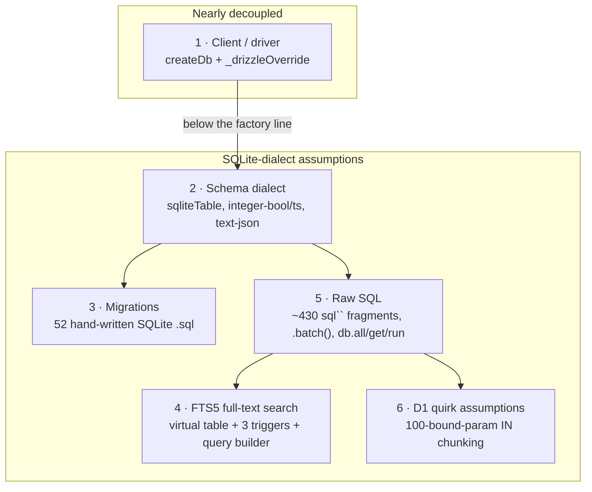

# Storage portability (D1 today, Postgres as a future option)

The relational store is **Cloudflare D1 (SQLite) via Drizzle**, and that is the
only supported backend today. This doc exists because we want to keep the _option_
of running on Postgres open — for a self-hoster, an OSS fork, or the day we hit a
D1 ceiling — **without** committing to the port before there's a concrete reason to
pay for it. It maps exactly where SQLite/D1 assumptions live, records what is
already decoupled, and lays out a phased path so a future contributor doesn't have
to rediscover the seams.

> **Status:** aspirational, not in progress. Nothing here is a backend swap you can
> flip on. The near-term investment is keeping the coupling _narrow and documented_,
> which is good architecture regardless of whether Postgres ever ships.

## The one thing to internalize

The **D1 binding** is nearly fully seamed — construction goes through a single
factory and an injectable override. But the **SQLite dialect** is assumed pervasively
below that line: in the schema column modes, in ~430 raw `sql\`\`` fragments, in the
FTS5 full-text search, and in 52 hand-written SQLite migrations. Swapping backends is
therefore _not_ a driver-line change; it is a real port dominated by three of the six
seams below.

## Current construction seam (done)

All relational-DB construction funnels through **one factory**, `createDb` in
[`packages/lib/src/db.ts`](../../packages/lib/src/db.ts) (`@releases/lib/db`):

```ts
// packages/lib/src/db.ts
export function createDb(dbOrD1: AnyD1Database | D1Db): D1Db {
  // Tests pass a pre-built handle (bun:sqlite) — pass it through untouched.
  if (dbOrD1 && typeof (dbOrD1 as { select?: unknown }).select === "function") {
    return dbOrD1 as D1Db;
  }
  return drizzle(dbOrD1 as AnyD1Database, { schema });
}
```

The established call convention, used everywhere (routes, crons, workflows, queues,
and the `SourceActor`/`OrgActor` Durable Objects):

```ts
const db = env._drizzleOverride ?? createDb(env.DB);
```

`_drizzleOverride` is the test-injection seam (a `bun:sqlite` handle) and doubles as
the natural place a future backend would branch. **This is the choke point to change
when adding a Postgres driver** — ideally the only place. Historically ~16 sites
constructed Drizzle inline (`drizzle(env.DB)`); those were converged onto `createDb`
so "swap the backend" is a one-factory change for the api worker rather than a
20-file sweep.

The factory now lives in **one place** —
[`packages/lib/src/db.ts`](../../packages/lib/src/db.ts), exported as `@releases/lib/db`.
All four consumers build through it: the three worker `db.ts` files
([`workers/api`](../../workers/api/src/db.ts),
[`workers/mcp`](../../workers/mcp/src/db.ts),
[`workers/webhooks`](../../workers/webhooks/src/db.ts)) are thin re-exports, and
[`packages/search/src/log-search.ts`](../../packages/search/src/log-search.ts)
constructs via `createDb` instead of hand-rolling `drizzle(env.DB)`. The shared factory
stays zod-free so it doesn't split `workers/mcp`'s SDK-pinned zod type graph, and it
takes drizzle's structural `AnyD1Database` (not the workers-types `D1Database` global) so
it compiles under `packages/lib`'s tsconfig. This was follow-up #1 (below), now done.

One thing that _looks_ like a gap but isn't:
[`workers/api/src/workflows/deterministic-update.ts`](../../workers/api/src/workflows/deterministic-update.ts)
already constructs through `createDb(resolveDb(env))` and passes the resulting `D1Db`
to `d1ScrapePersister`. Its `resolveDb` helper returns the **raw `D1Database` binding**
(or the test override) only so `buildStepEnv()` can forward it into a reshaped
`PollAndFetchWorkflowEnv` for the shared ingest-step helpers — not because the persister
needs a raw binding. If you grep `resolveDb` here, that's why: it's an env-forwarding
helper, not an inline-construction escape hatch.

## The six seams



| #   | Seam                      | Effort                  | Why                                                                                                                                                                                                                                                                                                                                                                                                                                                                                                                                                         |
| --- | ------------------------- | ----------------------- | ----------------------------------------------------------------------------------------------------------------------------------------------------------------------------------------------------------------------------------------------------------------------------------------------------------------------------------------------------------------------------------------------------------------------------------------------------------------------------------------------------------------------------------------------------------- |
| 1   | **Client / driver**       | Easy (done)             | Single `createDb` factory in `@releases/lib/db` + `_drizzleOverride`, shared by all four consumers (`api`, `mcp`, `webhooks`, `packages/search`). A Postgres backend branches here on `drizzle-orm/postgres-js` (or `node-postgres`) — one edit, not 3–4.                                                                                                                                                                                                                                                                                                   |
| 2   | **Schema dialect**        | Medium-large            | [`packages/core/src/schema.ts`](../../packages/core/src/schema.ts) (~36 `sqliteTable`s + 6 `sqliteView`s) plus aux schema in `workers/api/src/db/schema-*.ts` and [`packages/core-internal`](../../packages/core-internal/). SQLite-isms: `integer({ mode: "boolean" })`, `integer({ mode: "timestamp" })`, `text({ mode: "json" })`, `AUTOINCREMENT`. Postgres wants native `boolean` / `timestamptz` / `jsonb` / identity. Drizzle is multi-dialect but the `sqliteTable`/`pgTable` builders are **not shared** — this is a real port, not a config flag. |
| 3   | **Migrations**            | Medium                  | [`workers/api/migrations/`](../../workers/api/migrations/) — 52 hand-written, timestamp-prefixed SQLite `.sql` files (incremental `add_*`/`marker_*`, plus a squashed baseline with `AUTOINCREMENT`, `CREATE VIRTUAL TABLE … fts5`, `CREATE VIEW`, `CREATE TRIGGER`, `PRAGMA`). A Postgres backend needs a parallel migration set; these are not reusable as-is.                                                                                                                                                                                            |
| 4   | **FTS5 full-text search** | **Large, highest-risk** | `releases_fts` virtual table + three sync triggers + the query builder in [`packages/core/src/fts.ts`](../../packages/core/src/fts.ts) + every `MATCH` site. No structural Postgres equivalent — must be reimplemented on `tsvector`/`tsquery` or `pg_trgm`. **Mitigant:** search is already _hybrid_ (FTS5 + Vectorize), so a Postgres port can lean harder on the vector leg and degrade lexical search rather than block on a full FTS rewrite.                                                                                                          |
| 5   | **Raw SQL**               | Large, diffuse          | ~430 `sql\`\`` fragments, heaviest in [`workers/mcp/src/tools.ts`](../../workers/mcp/src/tools.ts) and [`workers/api/src/queries/`](../../workers/api/src/queries/). Most idioms survive; SQLite-isms need case-by-case audit: `LOWER(...) LIKE`, integer-boolean predicates (`IS NULL OR = 0`), `db.all/get/run`result shapes, and D1's`.batch()`(needs a Postgres transaction analog; tests use`ensureBatchShim`).                                                                                                                                        |
| 6   | **D1 quirk assumptions**  | Small                   | The 100-bound-parameter limit is hardcoded as 90-per-`IN` chunking in [`workers/api/src/queries/search.ts`](../../workers/api/src/queries/search.ts) and [`workers/api/src/queries/orgs.ts`](../../workers/api/src/queries/orgs.ts). Harmless on Postgres (far higher limit) but backend-specific; ideally parameterized.                                                                                                                                                                                                                                   |

## What is NOT in scope

These Cloudflare-specific stores are orthogonal to the _relational_ abstraction and
would remain as-is under a Postgres backend:

- **Vectorize** (semantic search) — coupled to the relational layer only at the hybrid-search seam (#4).
- **KV** (`EMBED_CACHE`, `LATEST_CACHE`, rate-limit / dedup namespaces), **R2** (`MEDIA`, `RAW_SNAPSHOTS`), **Durable Objects** (`StatusHub`, `ReleaseHub`, `SourceActor`, `OrgActor`). Note `StatusHub` uses DO-embedded storage; the actors re-read D1 through `createDb` and so are relational call sites, not independent stores.

## A phased path (only if/when there's a real driver)

The forcing function is concrete: a paying self-hoster, an OSS PR, or a D1 ceiling
(10 GB/db, the 100-param limit). Until then, stop at phase 0.

- **Phase 0 — keep the door open (ongoing, cheap, pays off regardless).**
  Construction stays funneled through `createDb`. New query code goes through the
  `workers/api/src/queries/*` repository layer, not inline into route handlers. Keep
  this doc current when a new seam appears.
- **Phase 1 — one factory, one layer (done).** The DB factory is hoisted into
  `@releases/lib/db`; `api`, `mcp`, `webhooks`, and `packages/search` all construct
  through it. This is the prerequisite that makes a backend branch a single edit.
- **Phase 2 — dialect-parameterize the schema.** Introduce a Postgres schema variant
  (`pgTable`/`pgView`, native `boolean`/`timestamptz`/`jsonb`/identity) behind a
  dialect switch. Generate a parallel Postgres migration set.
- **Phase 3 — the hard seams.** Reimplement FTS on Postgres (`tsvector`/`pg_trgm`),
  audit the ~430 raw-SQL fragments for SQLite-isms, provide a transaction-based
  `.batch()` analog, and parameterize the 100-bound-param chunking.

## Follow-ups (deferred, not blocking)

1. ~~**Hoist `createDb` into a shared package**~~ — **done** ([#2002](https://github.com/buildinternet/releases/issues/2002)).
   `createDb` now lives in `@releases/lib/db`; all four consumers (`api`, `mcp`,
   `webhooks`, `packages/search`) build through it — removing the 3× duplication and the
   `log-search.ts` boundary violation.
2. **Parameterize the D1 100-bound-param chunking** (seam #6) behind a named constant so
   it reads as a backend capability, not a magic 90.
3. **Track FTS5's hybrid-search coupling** (seam #4) as the single highest-risk item for
   any future port.
