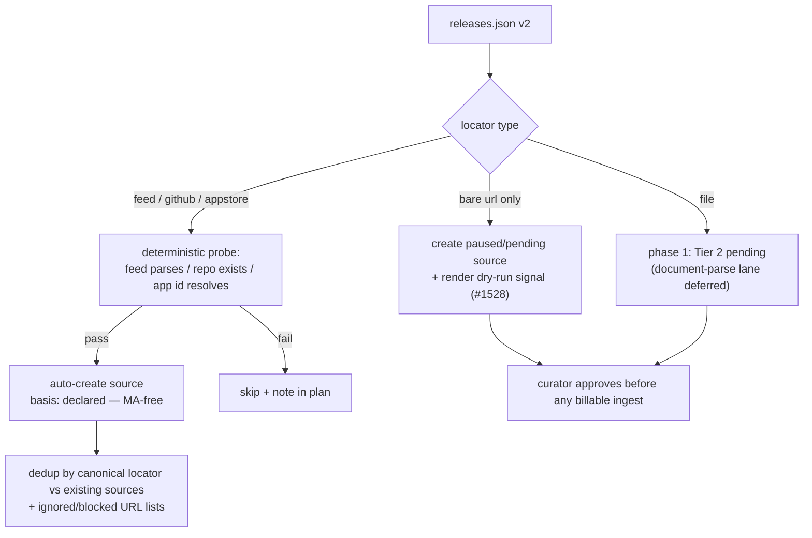

# Owner-declared manifest (`releases.json` v2)

Owners declare **what products exist and where release information is published** with a
small, `$schema`-validated **manifest** at a **well-known URI (RFC 8615)**. Authority is
scoped by **where the file is hosted**, not by what it claims.

v2 is a **declaration manifest**, not an org profile. v1 honored display metadata
(`name`, `description`, `category`, `avatar`, `tags`, `social`, `notice`) that the registry
already fills via curation and discovery — and because reconciliation is fill-if-empty,
publishing v1 usually changed nothing for a listed org. The one fact only the owner
authoritatively knows — products and release-note locations — was explicitly out of scope.
v2 inverts that: **locators are the payload**; display fields are secondary and advisory.

**No v1 back-compat.** The reconciler parses only `version: 2`. Stray v1 files fail
validation → existing fail-closed no-op. The canonical schema at
`https://releases.sh/schemas/releases.json` is replaced in place (see [Schema
versioning](#schema-versioning)).

Design source: [#1908](https://github.com/buildinternet/releases/issues/1908) (full
rationale in the issue; the underlying evaluation doc is local-only under `.context/`).

## File scopes

| Location                                     | Scope          | What it declares                                                             |
| -------------------------------------------- | -------------- | ---------------------------------------------------------------------------- |
| `https://{domain}/.well-known/releases.json` | Org identity   | Org fields, optional `products[]`, top-level `releases[]`, `registries` bind |
| `{owner}/{repo}/releases.json` (repo root)   | That repo only | `product` mapping, repo-scoped `releases[]`, `registries` product bind       |

Host-scoped authority is unchanged: the domain file is the only place to declare org
identity; a repo file cannot define the org. A repo file binds **this repo's** sources to
a product and may declare where **this repo's** releases canonically land.

## Schema versioning

`https://releases.sh/schemas/releases.json` is the single canonical URL and evolves in
place (SchemaStore / `package.json` convention). `$schema` is editor/validator tooling;
the in-document `version: 2` integer is the parser contract. Frozen snapshots (e.g.
`releases.v2.json`) only if a breaking v3 ever demands them. The #1441 CI drift gate
(`bun run gen:releases-schema`) applies unchanged.

## Domain file — `https://{domain}/.well-known/releases.json`

```json
{
  "$schema": "https://releases.sh/schemas/releases.json",
  "version": 2,
  "name": "Acme",
  "description": "CI for teams that ship.",
  "category": "developer-tools",
  "tags": ["ci", "observability"],
  "avatar": "https://acme.com/logo.png",
  "social": { "github": "acme", "twitter": "acmehq" },
  "products": [
    {
      "name": "Acme Cloud",
      "slug": "acme-cloud",
      "kind": "platform",
      "category": "cloud",
      "description": "Managed CI runners.",
      "website": "https://acme.com/cloud",
      "docs": "https://docs.acme.com/cloud",
      "support": "https://acme.com/support",
      "social": { "twitter": "acmecloud" },
      "releases": [
        {
          "url": "https://acme.com/whats-new",
          "feed": "https://acme.com/whats-new/rss.xml",
          "canonical": true
        },
        { "github": "acme/cloud-sdk" }
      ]
    },
    { "name": "Acme Legacy Agent", "archived": true }
  ],
  "releases": [{ "file": "https://acme.com/CHANGELOG.md" }],
  "registries": {
    "releases.sh": {
      "org": "org_abc123",
      "verification": "rlsv_…"
    }
  }
}
```

- **Root = org identity, flat** (no `org` nesting). No org `website` — the domain hosting
  the file is the website.
- **`notice` is cut** (no prior art in well-known manifests; curator entity notices via
  #1389 are unaffected).
- **`products[]`:** `name` required; `slug`, `kind`, `category`, `description`, `website`,
  `docs`, `support`, `social`, `archived`, `releases[]` optional. `archived: true` =
  discontinued (display + ranking + stop-fetch for declared sources under it; curator
  sources untouched). No bespoke no-crawl flag — consent belongs to robots.txt /
  Content-Signal; not declaring locations means nothing gets added.
- **Top-level `releases[]`:** org-scoped release locations — **the primary on-ramp**, not an
  edge case. The minimal useful manifest is just `version` + `releases[]`:

  ```json
  {
    "$schema": "https://releases.sh/schemas/releases.json",
    "version": 2,
    "releases": [
      {
        "url": "https://updates.acme.com",
        "feed": "https://updates.acme.com/rss.xml"
      }
    ]
  }
  ```

  `products[]` is the optional deeper level to grow into. Both levels may coexist (e.g. a
  combined changelog feed _and_ per-product feeds) — overlap between a company-wide
  firehose and product-scoped locations is the existing `release_coverage` grouping +
  dedup problem ([coverage.md](coverage.md)), so no schema mechanism is needed. Sources
  do not require a product in the DB.

## Release location entry

Each `releases[]` item declares a **location where release information is published** — a
dev changelog, an `updates.example.com`, a `/whats-new` page, an App Store listing. The
array is named `releases` (not `changelogs`) to stay audience-neutral and match the
manifest and registry noun.

Locator keys double as the type discriminator (no separate `type` field — the per-type
payload _is_ the locator, and combos like `url`+`feed` legitimately describe one source):

| Field       | Maps to                                      | Notes                                                                                                  |
| ----------- | -------------------------------------------- | ------------------------------------------------------------------------------------------------------ |
| `url`       | `source.url` (human page); `scrape` if alone | Canonical release-notes page — [source.url is for humans](remote-mode.md#display-url-vs-fetch-routing) |
| `feed`      | `type: feed` + `metadata.feedUrl`            | RSS/Atom; may be third-party-hosted (Canny, Beamer, …)                                                 |
| `github`    | `type: github` (`owner/repo`)                | In repo files, `"github": "self"` = this repo (tagged releases / CHANGELOG)                            |
| `appstore`  | `type: appstore`                             | App Store URL                                                                                          |
| `file`      | Raw changelog document at a URL              | Hosted `CHANGELOG.md` outside GitHub; document-parse, not render+extract                               |
| `title`     | Source display name                          | Optional                                                                                               |
| `canonical` | Coverage hint                                | At most one per product/repo scope; feeds `release_coverage` grouping                                  |

**Constraint:** at least one of `url` / `feed` / `github` / `appstore` / `file` per entry.

**Caps** (tune at implementation): ≤ 24 products, ≤ 8 release locations per product, ≤ 32 per
file. Fetch guards unchanged: 64 KB body cap, 5 s timeout, SSRF blocklist, no redirects.

## Repo file — same schema, repo scope

```json
{
  "$schema": "https://releases.sh/schemas/releases.json",
  "version": 2,
  "product": { "name": "Acme Cloud", "slug": "acme-cloud" },
  "releases": [{ "url": "https://acme.com/whats-new", "canonical": true }, { "github": "self" }],
  "registries": { "releases.sh": { "product": "prd_…" } }
}
```

Repo scope does two things:

1. **Product mapping** (as v1): bind this repo's source to a product — by stable ID
   (`registries` block), by locator match, or by slug suggestion at creation, in that
   order.
2. **Release-location hints** (new): declare where _this repo's_ releases end up — an
   external canonical URL/feed, or `{ "github": "self" }` to state the repo itself is the
   source of record. External locators become source candidates under the same tiering as
   domain files, attributed to the mapped product.

Still cannot declare org identity.

## Locators, slugs, and registries

**Locators are identity; slugs are suggestions.** URLs, repos, feeds, and files are the
stable keys for matching declared entries to registry entities. A declared `slug` only
suggests the URL segment at creation. Slugs are never used for matching.

**Explicit binding** uses stable typed IDs in a namespaced `registries` block:

```json
"registries": {
  "releases.sh": {
    "org": "org_abc123",
    "product": "prd_…",
    "verification": "rlsv_…"
  }
}
```

Recognized `releases.sh` keys: `org` (domain file), `product` (repo file),
`verification` (domain↔account ownership token — schema slot in phase 1; claim flow is
phase 2+). Unknown registries and unknown keys are ignored, fail-closed.

**Everything taxonomic is advisory.** `category`, `tags`, `kind`, and product grouping are
owner suggestions mapped leniently — invalid values are ignored, never an error. Mobile-app
discovery stays standards-based (AASA / assetlinks) per #1907, not manifest fields.

## Reconciliation

Kept from v1:

- **Precedence:** a field is owner-writable only if it is empty or was previously
  self-declared (tracked at `metadata.selfDeclared`). Curator-set and editorial fields
  (`featured`, `isHidden`, `discovery`, `fetchPaused`, collections, blocked/ignored URLs;
  source `isPrimary`/`fetchPriority`) are never touched.
- **Fill-if-empty** across repos for product metadata — two repos claiming the same product
  cannot fight over its fields.
- **Hash short-circuit:** unchanged content skips writes.
- **Fail-closed:** missing / invalid / oversized / SSRF-blocked fetch → safe no-op.
- **`version`** is validated (`2` only); it is not a reconciled entity field.

v2 additions:

- **Locator-first matching/dedup** against existing sources and `ignored_urls` /
  `blocked_urls`. A declared entry matching an existing source gains the self-declared
  marker (`metadata.selfDeclared`) instead of creating a duplicate. Marker logic is
  centralized in one helper so [#1872](https://github.com/buildinternet/releases/issues/1872)'s
  `mergeWithBasis` (`curator > declared > detected > generated`) can replace it as a
  follow-up — v2 reconciliation is its first consumer.
- **`archived: true`** on a product: display badge + pause declared sources under it.

### Materialization

Materialization is the v2 path that makes the manifest useful: declared locators can
**create** registry sources, not just decorate existing rows. Cost-tiered, fail-closed:



| Tier | Locators                     | Behavior                                                                                                                                                                                            |
| ---- | ---------------------------- | --------------------------------------------------------------------------------------------------------------------------------------------------------------------------------------------------- |
| 1    | `feed`, `github`, `appstore` | Deterministic probe → auto-create source with `basis: declared`. MA-free ingestion paths; no curator wait.                                                                                          |
| 2    | Bare `url` only (⇒ `scrape`) | Billable (MA extraction). Created in a paused/pending state with the #1528 render dry-run for signal; curator (or a later budgeted queue) enables ingest. Never triggers billable ingest on create. |
| 2    | `file` (phase 1)             | Accepted by the schema; treated as Tier 2 pending until the document-parse ingest lane ships.                                                                                                       |

**Cross-entity safety:** a domain file proves control of _that domain_ only. A declared
`github` repo auto-creates only when the repo owner matches the org's known GitHub identity
(declared `social.github`, existing source owners, or the repo's own `releases.json` pointing
back); otherwise the source lands in the Tier 2 pending path. Third-party `feed` hosts are
fine — the content probe is the gate.

**Kill switch:** `well-known-materialization-enabled` (Flagship, default on) gates entity
**creation** only. Matching, marking `declared` basis, and fill-if-empty reconciliation run
regardless.

## Triggers

- `POST /v1/orgs/:slug/sync-well-known` (write scope). `?dryRun=1` returns a plan object
  enumerating intended field fills, basis markers, and source creations/skips (no writes).
- Daily sweep (`0 6 * * *`), two passes (org domain files, then GitHub repo files). Schema
  generated from api-types zod via `bun run gen:releases-schema`, served at
  `https://releases.sh/schemas/releases.json`.

### Sweep capping + due-filtering (#1440)

Each pass issues one outbound fetch per entity (the org pass may cost a second for an avatar
mirror). The sweep is self-limiting:

- **Due-filter.** Each entity carries `metadata.wellKnownSweptAt`, stamped via `json_set`
  after the reconciler returns on **every** outcome (applied, unchanged, fetch-skipped,
  errored) — distinct from `metadata.selfDeclared.syncedAt`, which only advances on a
  successful apply. An entity swept within `WELL_KNOWN_SWEEP_INTERVAL_HOURS` (default **168 /
  7 days**) is skipped; never-swept rows (`NULL`) are always due.
- **Hard cap, oldest-first.** Each pass processes at most `WELL_KNOWN_MAX_PER_RUN` (default
  **250**) entities, ordered by `wellKnownSweptAt ASC` (NULLs first). Worst-case
  subrequests are `cap × 2 + cap = cap × 3` (≤ 750 at default), under Cloudflare's
  1000-subrequest ceiling. Deferred rows lead the next run so the corpus is covered across
  runs.
- **No silent caps.** The `sweep-done` event logs `orgProcessed` / `sourceProcessed` and
  `orgCapped` / `sourceCapped`.

Both knobs are numeric env vars (not Flagship), floor 1, fallback to default on invalid
value.

## Public docs

The owner-facing version lives at `/docs/listing` (`web/src/content/docs/listing.md`), linked
from `/submit`. Keep that page in sync when schema or reconciliation rules change; this file
stays the engineering reference.

## Composition

| Issue                                                          | How v2 composes                                                                                                                         |
| -------------------------------------------------------------- | --------------------------------------------------------------------------------------------------------------------------------------- |
| [#1908](https://github.com/buildinternet/releases/issues/1908) | v2 design — this doc                                                                                                                    |
| [#1872](https://github.com/buildinternet/releases/issues/1872) | `mergeWithBasis` enum; v2 reconciliation is the first consumer                                                                          |
| [#1871](https://github.com/buildinternet/releases/issues/1871) | OSS catalog git tree shares vocabulary (`org.json` ≈ root fields, `products/*.json` ≈ product entry, `sources/*.json` ≈ location entry) |
| [#1907](https://github.com/buildinternet/releases/issues/1907) | Mobile-app discovery via AASA/assetlinks — deliberately out of manifest scope                                                           |
| [#1441](https://github.com/buildinternet/releases/issues/1441) | Schema drift gate on regenerated v2 schema                                                                                              |

## Out of scope (phase 2+)

- **Self-serve listing:** extend `/v1/lookups` by-domain (and `/submit`) to consult the
  manifest when the domain is not yet in the registry — publish file → look up / submit domain
  → org + Tier-1 sources materialize with `declared` basis.
- **CLI:** `releases json validate [path|domain]`.
- **Verification claim flow:** observe `registries.releases.sh.verification` → domain↔account
  linkage for owner edit rights and a future GitHub-app/webhook push lane.
- **Declared-lane pruning:** pause/remove entries this file previously declared and no longer
  lists (curator rows never touched), behind a shrinkage circuit breaker.
- **OSS convergence:** #1871 catalog tree + #1867 provenance on read.
