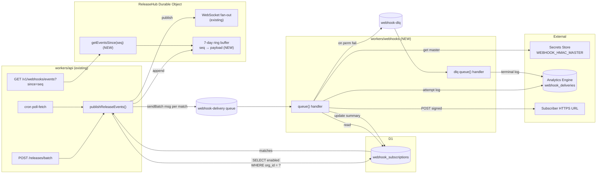
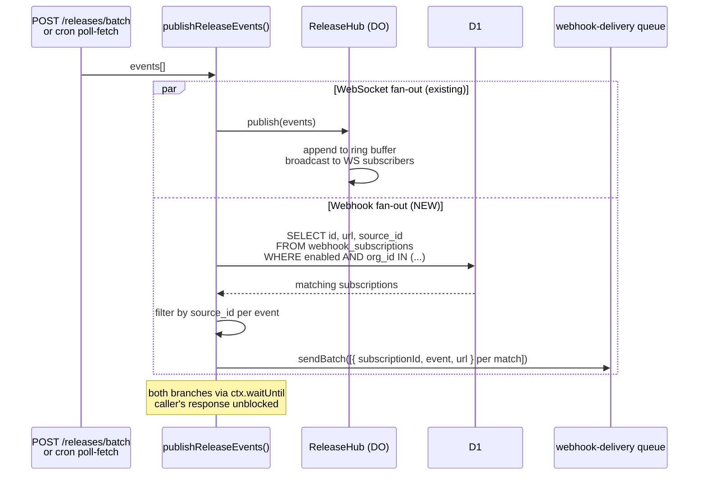
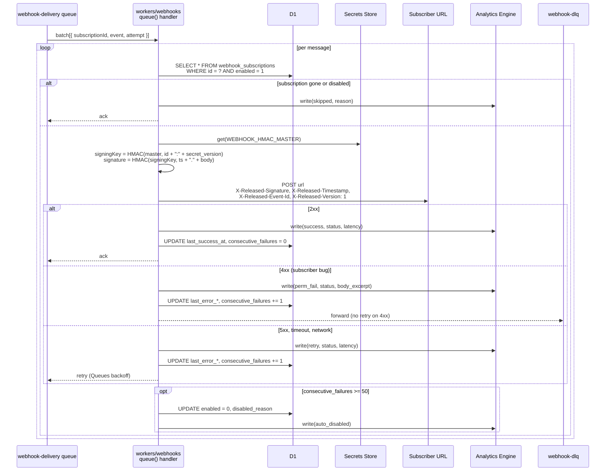
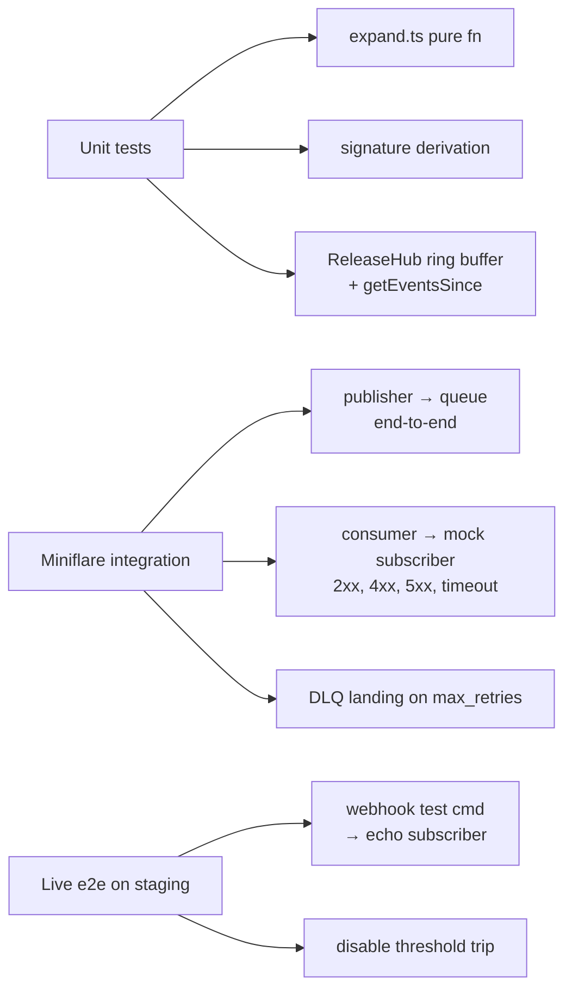

# Webhook Delivery via Cloudflare Queues — Design

**Date:** 2026-04-18
**Parent issue:** [#343](https://github.com/buildinternet/releases/issues/343)
**Depends on:** [#341](https://github.com/buildinternet/releases/issues/341) (release event bus foundation, merged)
**Recon:** `.context/2026-04-18-issue-343-recon.md`

## Context

The release event bus shipped in #341 added a `ReleaseHub` Durable Object that fans out `release.created` / `release.updated` events to WebSocket subscribers. Today the only consumer is the CLI's `releases tail -f`. This spec adds a second consumer shape — outbound HTTP webhooks — that lets external systems subscribe to release events with retry, signing, and replay semantics.

The original #343 issue body bundled webhooks with a "web live view" route on releases.sh. **The web live view is split out of this spec** and tracked separately; it shares nothing with webhooks except the same upstream bus, and it's a frontend-only piece (one Next.js route + a `useReleaseStream` hook) that ships independently. This document covers webhook delivery only.

### Phasing

The feature ships in two consumer phases. Both are addressed by the v1 design; phase B is deferred.

- **Phase C — internal dogfood (v1).** Rally consumes its own webhooks into a Slack/Notion/digest feed for internal release awareness. Validates the full pipeline end-to-end.
- **Phase A — named customers (v1).** A handful of known-name customers receive webhook URLs we maintain on their behalf via the admin CLI. They get their signing key once at handoff.
- **Phase B — self-service (deferred).** Any API-key holder creates webhook subscriptions themselves via CLI or web UI. Out of scope for v1; requires per-caller API keys (no user identity layer exists today).

### Decisions reference

Quick index of the choices that shape this design (decided in the brainstorm; rationale in the relevant sections below):

| Area | Choice |
|---|---|
| Scope | Webhooks only; web live view split out |
| Identity | Org-scoped under shared `RELEASED_API_KEY` |
| Durability | Best-effort + 7-day `seq`-based replay endpoint |
| Replay store | Ring buffer in `ReleaseHub` DO storage |
| Delivery telemetry | Cloudflare Analytics Engine + summary cols on subscription row |
| HMAC secrets | Master in Secrets Store + per-sub keys derived |
| Consumer Worker | New `workers/webhooks/` (matches `workers/discovery/`, `workers/mcp/`) |
| Queue topology | One global queue, one message per (event × subscription) |
| Filter dimensions v1 | Required `orgId`, optional `sourceId` |

## Architecture



**Three Workers, two Queues, one DO extension.**

- **`workers/api` (existing)** — gains a queue-producer binding and a new `expandAndEnqueue()` call alongside the existing `ReleaseHub.publish()`. Both fire-and-forget via `ctx.waitUntil`. Also gains `GET /v1/webhooks/events?since=<seq>` (the replay endpoint, proxies to `ReleaseHub.getEventsSince`).
- **`ReleaseHub` (existing DO in workers/api)** — gains a 7-day ring buffer in DO storage plus `getEventsSince(seq)` method. WebSocket fan-out unchanged. TTL maintained by a recurring DO alarm: each `alarm()` invocation deletes `event:` keys older than 7 days, then calls `storage.setAlarm(now + 1h)` to reschedule itself.
- **`workers/webhooks` (NEW)** — Queue consumer Worker. Bindings: D1 (`webhook_subscriptions`), Secrets Store (`WEBHOOK_HMAC_MASTER`), Analytics Engine (`webhook_deliveries` dataset), `webhook-delivery` queue (consumer), `webhook-dlq` queue (producer + consumer), Cloudflare Rate Limiting binding scoped per `subscriptionId`.
- **`webhook-delivery` queue** — single Cloudflare Queue, one message per (event × subscription). Built-in retry handles transient failures; DLQ on `max_retries`.
- **`webhook-dlq` queue** — terminal failures land here; consumer logs + writes a final AE entry tagged `dlq`. No retry.

**Failure isolation:** each subscription's deliveries retry independently because each is a distinct queue message. One slow subscriber URL can't backpressure the rest.

**No tenant secrets stored anywhere.** Per-subscription signing keys are derived at delivery time from the master in Secrets Store. Compromise of D1 alone leaks zero signing material.

## Data model

### D1 — `webhook_subscriptions`

Lives in `packages/core/src/schema.ts` alongside other Drizzle table definitions. Org-scoped ownership pattern mirrors `ignoredUrls`.

```sql
CREATE TABLE webhook_subscriptions (
  id              TEXT PRIMARY KEY,             -- whk_<nanoid>; feeds HMAC derivation
  org_id          TEXT NOT NULL REFERENCES organizations(id) ON DELETE CASCADE,
  url             TEXT NOT NULL,                -- HTTPS only, validated on insert
  source_id       TEXT REFERENCES sources(id) ON DELETE CASCADE,  -- NULL = all org sources
  enabled         INTEGER NOT NULL DEFAULT 1,
  description     TEXT,                         -- human-readable label
  secret_version  INTEGER NOT NULL DEFAULT 1,   -- bumps on rotate-secret to invalidate
  created_at      TEXT NOT NULL,
  -- summary columns updated by consumer; AE has the per-attempt detail
  last_success_at      TEXT,
  last_error_at        TEXT,
  last_error_msg       TEXT,
  consecutive_failures INTEGER NOT NULL DEFAULT 0,
  disabled_reason      TEXT                     -- set when auto-disabled at threshold
);

CREATE INDEX idx_webhook_subs_org_enabled
  ON webhook_subscriptions(org_id, enabled);
CREATE INDEX idx_webhook_subs_org_source
  ON webhook_subscriptions(org_id, source_id) WHERE enabled = 1;
```

The publisher's hot-path query is `SELECT id, url, source_id FROM webhook_subscriptions WHERE enabled = 1 AND org_id IN (...)`. The first index covers it; the second is for the future case of looking up subscriptions for a specific source directly.

**Migration** lives at `workers/api/migrations/<timestamp>_webhook_subscriptions.sql`. Per the project's "Check Drizzle migrations" convention, the local SQLite path is verified before declaring done.

### Analytics Engine — `webhook_deliveries`

Schemaless dataset. One data point per delivery attempt.

```
dataset: webhook_deliveries
indexes: ['subscription_id']                    -- primary lookup dimension
blobs:   [event_id, error_message, error_code, outcome]
doubles: [http_status, latency_ms, attempt_number]
```

`outcome` ∈ `success | retry | perm_fail | skipped | dlq | auto_disabled`. Cost-bounded: at phase A scale (~100 events/day × 10 subs × 1.1 attempts) we're ~33k points/month, well inside free tier. Workers Paid bumps included quota to 25M/month. **Caveat:** AE retains queryable data for ~90 days on default sampling; longer retention requires a separate export job (D1 wouldn't help here either — we'd be purging at the same horizon).

### ReleaseHub DO storage extension

New keyspace inside the existing DO. `seq` is already monotonic across the DO (added in #341). 7-day TTL maintained by a DO alarm that runs hourly and deletes keys older than the cutoff.

```
event:<seq>  → JSON ReleaseEventPayload    (TTL: 7 days)
seq:latest   → number                       (current high-water mark)
```

The replay endpoint `GET /v1/webhooks/events?since=<seq>` calls `ReleaseHub.getEventsSince(seq, limit=500)`, which scans `event:` keys with `seq > since` and returns them in order. Capped at 500 per call; pagination via `since=<last_returned_seq>` continuation.

## Publisher path



**Key behaviors:**

- **One D1 read per batch, not per event.** Batches arrive with N events spanning M orgs (often M=1). Publisher does a single `SELECT ... WHERE enabled AND org_id IN (?, ...)` covering every distinct org, then matches in-memory against per-event `source_id`. At dogfood/phase-A volume this is one query per batch insert and one per cron tick.
- **Queue `sendBatch`, not single `send`.** Cloudflare Queues supports up to 100 messages per batch. A batch of 50 events × 3 matching subscriptions = 150 messages goes through in 2 sendBatch calls. Cuts producer latency vs. per-message send.
- **Failure isolation from existing path.** The new branch is wrapped in its own try/catch; any failure (D1 down, queue down) logs to stderr and returns. WebSocket fan-out and the DB write are never affected. Same posture as the existing `publishReleaseEvents` — fire-and-forget, never blocks ingest.
- **No retries at publish time.** If the queue send fails, the events are simply not delivered to webhooks for that batch. Subscribers can backfill via the replay endpoint. Deliberate tradeoff: keeps the publisher dumb and the consumer authoritative on retry.
- **`expand(events, subscriptions)` is a pure function** producing the message set; `expandAndEnqueue` is the thin wrapper that combines the SELECT + the pure expand + the queue `sendBatch`. The pure piece lives in `workers/api/src/webhooks/expand.ts` and is the unit-testable seam.

**Subtlety to note:** publisher computes per-event matches in-memory rather than via a SQL JOIN. With ~10s of subscriptions per org this is correct. If subscription count ever explodes (1000s per org), it becomes a `WHERE` predicate join. Fine for v1.

## Consumer path



**Key behaviors:**

- **Wrangler config:** `queues.consumers[0]` binds `webhook-delivery` with `max_batch_size: 10`, `max_batch_timeout: 5`, `max_retries: 6`, `dead_letter_queue: webhook-dlq`. Six retries with default backoff covers ~2 hours of upstream flakiness. Past that, DLQ.
- **Per-subscription rate limiting.** Cloudflare Rate Limiting binding scoped per `subscriptionId`. 10 rps sustained, burst 30. If exceeded, the consumer holds the message — Queues backs off. Prevents a runaway publisher from hammering a single subscriber.
- **Signing key derivation is local + cheap.** `HMAC-SHA256(master, subscriptionId + ":" + secretVersion)` produces the per-sub key on every delivery. Master fetched from Secrets Store once per Worker isolate (cached via module-level promise). No KV lookup per delivery.
- **Subscriber timeout = 10s.** AbortController on the fetch; timeout counts as a 5xx-equivalent retry.
- **D1 update batching.** Per-message `UPDATE ... WHERE id = ?` is fine at v1 volume. If write contention emerges, batch updates per consumer batch (one UPDATE per distinct subscription_id touched).
- **DLQ consumer is trivial.** Same Worker, separate `queue()` handler bound to `webhook-dlq`. Writes a final AE entry tagged `dlq`, logs to stderr. No retry. Operators triage via `releases admin webhook deliveries <id> --failed`.
- **At-least-once delivery.** Cloudflare Queues guarantees at-least-once. Subscribers will occasionally see the same event twice (retry happens after subscriber acked but the ack didn't reach Cloudflare). The `X-Released-Event-Id` header is the contract for handling that — subscribers dedup using that ID.

### Delivery contract

Every delivery is an `HTTPS POST` to the subscriber URL with these headers and body:

```
POST <subscription.url>
Content-Type: application/json
X-Released-Version: 1
X-Released-Event-Id: rel_evt_<id>           # idempotency key
X-Released-Timestamp: 1729281234            # unix seconds, signed
X-Released-Signature: sha256=<hex>          # HMAC-SHA256(signingKey, "${timestamp}.${body}")
User-Agent: releases-webhooks/1

{
  "type": "release.created",
  "id": "rel_evt_...",
  "seq": 12345,
  "ts": "2026-04-18T...",
  "release": {
    "id": "rel_...",
    "title": "...",
    "version": "...",
    "publishedAt": "...",
    "sourceName": "...",
    "sourceSlug": "...",
    "contentSummary": "...",
    "media": [...]
  }
}
```

**Subscriber semantics:**
- Respond `2xx` to ack. Anything else triggers retry (5xx) or terminal failure (4xx).
- Verify signature with `HMAC-SHA256(signingKey, timestamp + "." + raw_body)`. Reject if mismatch.
- Reject timestamps older than 5 minutes to prevent replay attacks.
- Dedup using `X-Released-Event-Id` if doing anything other than fire-and-forget.

## CLI surface

All admin commands ship in the OSS-distributed binary (`src/cli/` compiles via `bun build --compile`). API enforces who can call them via the existing admin API key check.

### Admin commands (`releases admin webhook ...`)

Source: `src/cli/commands/admin/webhook.ts`. Modeled after the multi-level pattern in `src/cli/commands/admin/source.ts` with org-scoped CRUD ergonomics from `ignore.ts`.

| Command | Purpose |
|---|---|
| `webhook add --org <slug> --url <url> [--source <slug>] [--description <text>]` | Create subscription. Prints derived signing key **once**. Re-running prints "see rotate-secret to regenerate." |
| `webhook list [--org <slug>] [--enabled\|--disabled] [--json]` | List subscriptions; default groups by org. |
| `webhook show <id>` | Full row + last 10 deliveries from AE + current `consecutive_failures`. |
| `webhook edit <id> --url <new>` / `--enable` / `--disable` / `--description <text>` | Mutations. URL change does **not** rotate the signing key. |
| `webhook remove <id>` | Hard delete. Cascades nothing (deliveries are AE-only). |
| `webhook deliveries <id> [--failed] [--since <iso>] [--limit N]` | AE query, paged. Outputs status, latency, error per attempt. |
| `webhook test <id>` | Sends a synthetic `release.created` event. Useful before handing the URL to a customer. |
| `webhook rotate-secret <id>` | Bumps `secret_version`. Old key invalidated; new key printed. |

### Subscriber-facing utility (`releases webhook verify`)

One small read-only command on the OSS CLI. Local-only, no network call.

```
releases webhook verify --secret <key> --signature <header> --timestamp <header> --body-file <path>
```

Subscribers building integrations use this to sanity-check their own signature verification logic against a captured payload. ~30 lines. Ships in v1 because phase A support loops will frequently be "did you copy the right secret?" and this gives customers a self-serve answer before they file a ticket.

### Public docs

Two additions to the OSS / `docs/` site:

1. **`docs/webhooks.md`** — integration guide. Payload shape, headers, verification examples in Node/Python/Go (~30 lines each), retry/idempotency contract, replay endpoint usage, signature verification walkthrough.
2. **README mention** under "Features" so it's discoverable.

No new infrastructure needed for docs.

## Testing



- **Unit tests:** `expand.ts` (events × subscriptions = correct message set), signature derivation (vectors against a known-good HMAC implementation), ring buffer wraparound + TTL, replay endpoint `since=` semantics.
- **Miniflare integration:** publisher path with mock D1 + mock queue, asserting the exact message set produced for various event/subscription combinations. Consumer path with mock D1 + mock fetch, asserting status-code branching, AE writes, and summary column updates.
- **Live e2e:** one staging test in CI on the workers/webhooks deploy job. Creates a subscription pointing at an echo Worker, fires `releases admin webhook test`, verifies the echo Worker received the right headers + signature.
- **Manual post-deploy verification** (per the same playbook used for #341): create a subscription against a real source, trigger a real fetch via `releases admin source fetch <slug>`, confirm AE shows the delivery, confirm `consecutive_failures` updates correctly. Capture in PR description.

## Out of scope

- **Web live view route on releases.sh.** Tracked separately. Shares only the upstream bus; ships independently.
- **Per-caller API keys / first-party user identity.** Phase B prerequisite. Subscriptions are org-scoped under the shared `RELEASED_API_KEY` for v1.
- **Self-service subscription management** (web UI or non-admin CLI). Phase B; deferred.
- **Durable event log beyond 7 days.** Replay is bounded by the DO ring buffer's TTL. Past 7 days, subscribers backfill via `/v1/releases/latest`.
- **Per-event filter dimensions beyond `sourceId`** (categories, types, productId). Trivial to add v2 if a phase A customer asks; deliberately not pre-built.
- **Webhook payload v2.** The `X-Released-Version: 1` header is the only forward-compat hook in v1. Future v2 ships under `X-Released-Version: 2`; subscriptions opt in via a column at that point.
- **`ReleaseHub` sharding.** Single global instance is correct at current scale. If concurrent WS subscribers + replay load grows past the low thousands, shard by `orgId`. Not v1.

## Open issues / followups

- **AE 90-day retention.** Acknowledged caveat. If a customer ever needs >90 days of delivery history, that becomes a separate export job to D1 or R2 — not a v1 concern.
- **Auto-disable threshold (50 consecutive failures).** Tunable. Picked 50 as a reasonable starting point; revisit if real-world data shows it's too sensitive or too lenient.
- **Master key rotation procedure.** Out of scope for v1 design; documented separately if/when a rotation is actually needed (involves a brief dual-sign window where consumer signs with both old and new master and emits both signatures).

## References

- [#336 — release event bus foundation](https://github.com/buildinternet/releases/issues/336) (closed; shipped by PR #341)
- [PR #341 — implementation of the foundation](https://github.com/buildinternet/releases/pull/341) (merged)
- [#343 — parent issue (this work)](https://github.com/buildinternet/releases/issues/343)
- [#347 — end-to-end smoke verification](https://github.com/buildinternet/releases/issues/347) (closed)
- [docs/architecture/events.md](../../architecture/events.md)
- [docs/architecture/remote-mode.md](../../architecture/remote-mode.md) — D1 binding limits, auth model
- [docs/architecture/cli-distribution.md](../../architecture/cli-distribution.md) — OSS binary distribution
- Recon: [`.context/2026-04-18-issue-343-recon.md`](../../../.context/2026-04-18-issue-343-recon.md) (gitignored)
