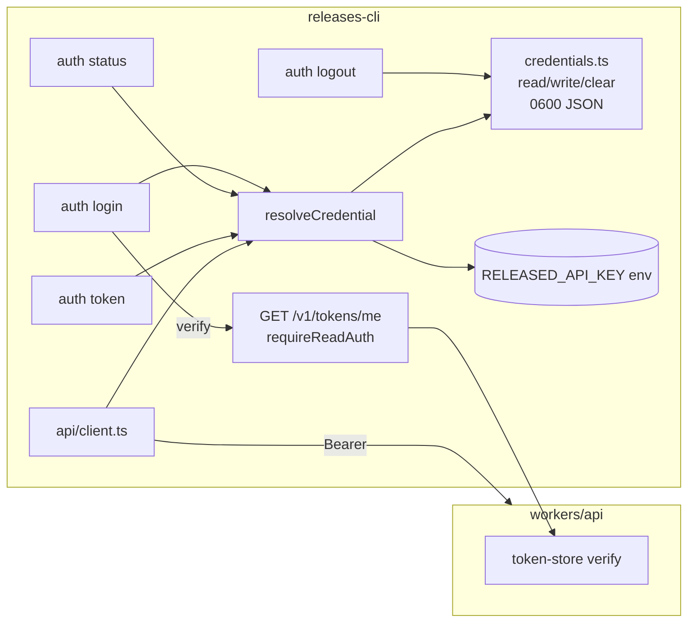
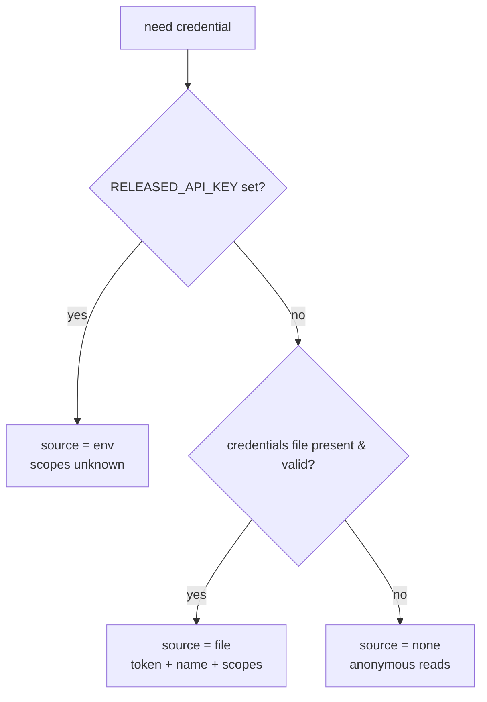

# CLI Auth — Token Storage & `releases auth` — Design

**Date:** 2026-05-20
**Status:** Approved (design); pending implementation plan
**Surfaces:** OSS CLI (`~/Code/releases-cli/`) primarily; one small read-gated endpoint added to the API worker (`workers/api/`) and one wire shape to `@buildinternet/releases-api-types`.

## Summary

Today the OSS CLI authenticates entirely through the `RELEASED_API_KEY` environment variable. `isAdminMode()` is a single boolean gate: if the env var is present, the CLI attaches `Authorization: Bearer <key>` to every request and unlocks the entire `admin` command subtree; if absent, reads run anonymously. There is no `login`/`logout`/`auth` command, no credential file, and no way for a user who already holds a token to persist it without editing their shell profile.

This design adds a **`releases auth` command namespace** that lets a user store a token they already hold (a scoped `relk_` token or the static root key), verify it against the server at save time, and have the CLI use it on subsequent invocations. It introduces a small, `0600` credential file under `~/.releases/`, a credential-resolution layer with env-over-file precedence, and a lightweight self-introspection endpoint (`GET /v1/tokens/me`) so the CLI can confirm a token and display its identity.

This is explicitly **not** token _minting_ (that stays the scoped-API-tokens roadmap item) and **not** an interactive OAuth/browser login (the `--web` flag is reserved in the command shape but deferred until a public token page exists). It is the client-side convenience layer that makes scoped tokens usable from the terminal.

## Goals

- Let a user persist a token they already have so the CLI uses it without exporting an env var each session.
- Support both an **interactive** hidden-input prompt and **non-interactive** entry (`--token <t>`, stdin `-`) as co-equal paths — scripting/CI/agents are first-class.
- **Verify** the token against the server before saving; on failure, reject and don't persist.
- Show the authenticated **identity** (name + scopes) at login and via `auth status`.
- Store credentials securely (`0600`, atomic write, never logged) under the existing `~/.releases/` data dir.
- Keep the `RELEASED_API_KEY` env var working and authoritative (explicit override wins).
- Degrade gracefully now that a stored token may carry less than `admin` scope (read-only / write-only), without breaking the existing `admin` subtree.

## Non-goals (named boundaries)

- **Token minting from the CLI** (`releases admin token create | list | revoke`) — separate scoped-API-tokens roadmap item; this design only _stores_ a token the user already holds.
- **`--web` browser hand-off login** — the command shape reserves the `--web` flag, but it is not registered in v1. It needs a public token page (the current `/admin/api-tokens` web UI is dev-only) plus a loopback callback server. The deferred flow is documented below so the v1 command shape accommodates it without rework.
- **Multi-host / profile credentials** (gh-style `--host`, named profiles) — a single stored credential, bound to one `apiUrl`. Revisit only if multi-environment use becomes common.
- **Per-token rate limiting** — a server-side concern tracked as its own subsystem; out of scope here.
- **Changing the server scope model** — the API worker's scope ladder and route gating are unchanged except for adding the read-gated `/v1/tokens/me` route.

## Decisions and rationale

| Decision             | Choice                                                                               | Why                                                                                                                      |
| -------------------- | ------------------------------------------------------------------------------------ | ------------------------------------------------------------------------------------------------------------------------ |
| Primary mechanism    | Interactive paste prompt **and** non-interactive `--token`/stdin                     | User requires non-interactive as co-equal; interactive is the friendly default.                                          |
| Verification         | Verify against new `GET /v1/tokens/me`; show name + scopes; reject on failure        | Catches typos / revoked / expired tokens at save time; identity display is genuinely useful and `auth status` reuses it. |
| Scope gating in CLI  | **Hybrid** — cache scopes, pre-flight warning, server authoritative                  | Best messaging without making a client-side cache a hard gate (scopes can drift; env tokens have unknown scopes).        |
| Command shape        | `auth` namespace (`login`/`logout`/`status`/`token`); `whoami` aliases `auth status` | Clean home for future `--web` and `auth token`; mirrors `gh auth`.                                                       |
| Precedence           | `RELEASED_API_KEY` env wins → stored file → none                                     | Standard explicit-override behavior (gh/aws/npm); CI and one-offs stay simple.                                           |
| Storage              | `~/.releases/credentials`, JSON, `0600`, atomic write                                | Reuses the existing data dir; restrictive perms; survives partial writes.                                                |
| Integration approach | Minimal resolver shim, not a full config subsystem                                   | Surgical; existing `getApiKey()`/`isAdminMode()` callers route through one new function.                                 |

## Architecture

Two repos, one new endpoint.



Credential resolution precedence (used by `getApiKey()`, `isAuthenticated()`, and `client.ts`):



## Part 1 — API worker: `GET /v1/tokens/me`

Self-introspection: returns the **caller's own** identity. Requires **any valid identity** (`read` scope or higher) — deliberately **not** `admin`, so a read-only token can introspect itself. Anonymous or invalid → `401`.

- **Wire shape** (new `TokenIdentity` in `@buildinternet/releases-api-types`):

  ```ts
  type TokenIdentity = {
    kind: "root" | "token";
    name: string; // "root" for the static key
    scopes: string[]; // e.g. ["read","write"] or ["*"]
    principalType: "internal" | "agent" | "user";
    principalId?: string | null;
    expiresAt?: string | null; // ISO-8601
    lastUsedAt?: string | null; // ISO-8601
  };
  ```

- The static root key returns a synthetic identity: `{ kind: "root", name: "root", scopes: ["*"], principalType: "internal" }`, so `auth login`/`auth status` work for the break-glass key too.
- A `relk_` token returns its row's `name`, `scopes`, `principalType`/`principalId`, `expiresAt`, `lastUsedAt` (from the existing `api_tokens` table — no schema change).

**Gating wrinkle.** The rest of `/v1/tokens*` is admin-gated via the `adminRoutes` allowlist, but `/me` must be only `read`-gated. Add a third middleware instance:

```ts
const requireReadAuthMiddleware = createAuthMiddleware({
  allowPublicReads: false, // anonymous → 401
  requiredScope: "read", // any valid identity (root or any active token) passes
});
```

Mount `/v1/tokens/me` with `requireReadAuthMiddleware` **explicitly and ahead of** the admin-gated token router so the `/:id` route can't capture `me`. Honors `API_TOKENS_DISABLED` exactly like the other token routes (the relk\_ path is disabled; the static key still resolves as root). Because `/me` is read-gated rather than under `publicReadRoutes`, it is outside the OpenAPI coverage gate and needs no `describeRoute` annotation.

## Part 2 — CLI: credential storage (`src/lib/credentials.ts`, new)

- **Path:** `join(getDataDir(), "credentials")` (reuses `@buildinternet/releases-lib`'s `getDataDir()`, honoring `RELEASED_DATA_DIR`).
- **Format:** JSON
  ```json
  {
    "token": "relk_…",
    "name": "laptop",
    "scopes": ["read", "write"],
    "apiUrl": "https://api.releases.sh",
    "savedAt": "2026-05-20T12:00:00.000Z"
  }
  ```
  `apiUrl` records the environment the token was verified against (prod/staging tokens don't cross D1 databases).
- **Functions:** `readCredential(): StoredCredential | null` (absent/corrupt → `null`), `writeCredential(c)` (atomic temp-file + rename, `chmod 0600` on every write), `clearCredential()` (unlink, no-op if absent).

## Part 3 — CLI: credential resolution (`src/lib/mode.ts` refactor)

- `resolveCredential(): { token: string | null; source: "env" | "file" | "none"; scopes?: string[]; name?: string }`.
  **Precedence:** `RELEASED_API_KEY` env (scopes unknown) → stored file (carries `name`/`scopes`) → none. Result cached per process like the existing `getApiUrl()` cache.
- `isAdminMode()` is renamed conceptually to `isAuthenticated()` — true when any credential resolves. Keep `isAdminMode` as a thin alias re-exporting `isAuthenticated()` to minimize churn across existing call sites.
- `getApiKey()` returns the resolved token or throws (message updated to mention `releases auth login` as well as the env var).
- `validateConfig()` is **relaxed**: `RELEASED_API_URL` set without `RELEASED_API_KEY` is no longer fatal when a stored credential exists. Additionally, if the active `apiUrl` (from `RELEASED_API_URL` or the default) differs from the stored credential's `apiUrl`, emit a warning (token verified against a different environment).
- `api/client.ts`: attach `Authorization: Bearer <token>` whenever a credential resolves from either source (same logic, sourced through the resolver). `whoami`'s independent header construction is updated to match.

## Part 4 — CLI: `auth` command namespace (`src/cli/commands/auth/`)

Registered like the other command modules (a `registerAuthCommand(parent)` exporting an `auth` parent with subcommands). `auth` itself is public (no admin gate); it is the thing that _establishes_ credentials.

- **`releases auth login [--token <t>|-]`**
  - Token source order: `--token <value>`; `--token -` or piped stdin (read one line); else, if a TTY, a **hidden interactive prompt** (echo-off readline, extending the existing `src/lib/confirm.ts` readline pattern). No TTY and no `--token` → error instructing to pass `--token`.
  - **Verify:** `GET /v1/tokens/me` against the active `apiUrl` with the presented token. Non-`200` → print the server's error (`401` → "token rejected"; other → status + message) and exit `1` **without saving**.
  - **Success:** `writeCredential({ token, name, scopes, apiUrl, savedAt })`; print `✓ Verified — "<name>" (scopes: <list>)` and the saved path.
  - **`--web`:** documented in this spec, **not registered** in v1.
- **`releases auth logout`**: `clearCredential()`; if `RELEASED_API_KEY` is still set in the env, note that env auth remains active (the CLI can't unset a parent env var).
- **`releases auth status`**: rich output — `source` (env/file), `name`, `scopes`, `apiUrl`, `expiresAt` (from stored data). `--verify` re-checks live against `/v1/tokens/me` and reports drift (e.g. scopes changed, token revoked). For an env-var token with no stored metadata, `--verify` is the only way to show name/scopes.
- **`releases auth token`**: prints the raw token to stdout (single trailing newline) for scripting — `export TOK=$(releases auth token)`. Errors if unauthenticated. This is the only intentional plaintext emission.
- **`releases whoami`**: delegates to `auth status` (back-compat; the command stays, public as today).

## Part 5 — CLI: hybrid scope pre-flight (admin subtree)

- The admin subtree gate (`gateAdminArgv` in `src/index.ts` and the `preAction` hooks in `src/cli/program.ts`) flips from `isAdminMode()` to `isAuthenticated()`.
- **Coarse pre-flight warning:** before an `admin` command runs, if the resolved credential is **file-sourced** and its cached `scopes` do not satisfy `write` (`!scopeSatisfies(scopes, "write")`), print a `⚠` heads-up ("cached scopes (…) may not cover this command — trying anyway") and proceed. The server remains authoritative.
  - **Env-sourced** tokens have unknown scopes → no pre-flight warning; the server still returns `403` with a clear message.
  - No per-command scope map in v1 (YAGNI) — a single write-tier check covers the warning; the server's `403 insufficient_scope` is the precise enforcement.
- `api/client.ts`: surface `403 insufficient_scope` responses with the server's `message` cleanly (it already throws on non-ok with the API `message`; ensure the scope message is not swallowed).

## Part 6 — Security considerations

1. **Never log the token.** The CLI's daily logger (`~/.releases/logs/`) must never receive the token or the `Authorization` header; redact at the logging boundary. `auth token` is the sole deliberate plaintext emission (to stdout, by request).
2. **File permissions.** `credentials` written `0600` via atomic temp-file + rename; `chmod` re-applied on every write in case the file pre-exists with looser perms.
3. **Verify before persist.** A token is only written after a `200` from `/v1/tokens/me`, so revoked/expired/typo'd tokens never land on disk.
4. **Environment binding.** The stored `apiUrl` records where the token was verified; a mismatch with the active `apiUrl` warns the user (prod/staging tokens are non-interchangeable).
5. **Bearer-only.** The token is sent only as `Authorization: Bearer`, never a query param — unchanged from today.
6. **Static-key parity.** Storing the static root key in the `0600` file is the same trust posture as keeping it in a shell rc or env var; `auth status` clearly labels it as `root` (all scopes).

## Testing

- **CLI — credentials (`src/lib/credentials.ts`):** write→read round-trip; corrupt/absent → `null`; file mode is `0600`; atomic write leaves no partial file on failure; `clearCredential` is a no-op when absent.
- **CLI — resolution (`src/lib/mode.ts`):** precedence env > file > none; `isAuthenticated()`/`isAdminMode` alias parity; `validateConfig()` relaxation (URL set + stored creds = ok; URL set + no creds = still fatal); apiUrl-mismatch warning fires.
- **CLI — `auth` commands (mocked fetch):** `login` happy path saves + prints identity; `login` with `401`/`5xx` rejects and does not save; `--token -`/stdin path; non-TTY + no `--token` errors; `logout` clears + notes lingering env; `status` renders source/name/scopes/apiUrl and `--verify` reports drift; `token` prints raw token and errors when unauthenticated; `whoami` delegates to `auth status`.
- **CLI — pre-flight:** file creds lacking `write` → warning emitted before an `admin` command, command still attempted; env creds → no warning; `403 insufficient_scope` surfaced with the server message.
- **API — `GET /v1/tokens/me` (`tests/db-helper.ts` fixtures):** read/write/admin token each returns correct `scopes`/`name`/`principalType`; static root key returns synthetic root identity; anonymous → `401`; invalid/revoked/expired → `401`; respects `API_TOKENS_DISABLED` (relk\_ path off, static key still root); a read-only token _can_ reach `/me` (not admin-gated); `/me` is not shadowed by the admin `/:id` route.

## Future work

- **`releases auth login --web`** — loopback browser hand-off: CLI starts an ephemeral localhost server, opens `https://releases.sh/cli/auth?port=<p>&state=<csrf>`, the public token page POSTs the chosen token to `http://127.0.0.1:<p>/callback?state=<csrf>`, CLI verifies via `/v1/tokens/me` and stores it. Blocked on a **public** token page (current web UI is dev-only) and a CSRF/state handshake. The v1 `auth login` command shape reserves `--web` so this drops in without renaming.
- **CLI token minting** (`releases admin token create | list | revoke`) — the downstream wrapper over the existing `/v1/tokens` admin CRUD; pairs naturally with this storage layer.
- **Multi-host / profile credentials** — only if multi-environment use becomes common.
- **`auth status` richer drift reporting** — e.g. proactive expiry warnings.
