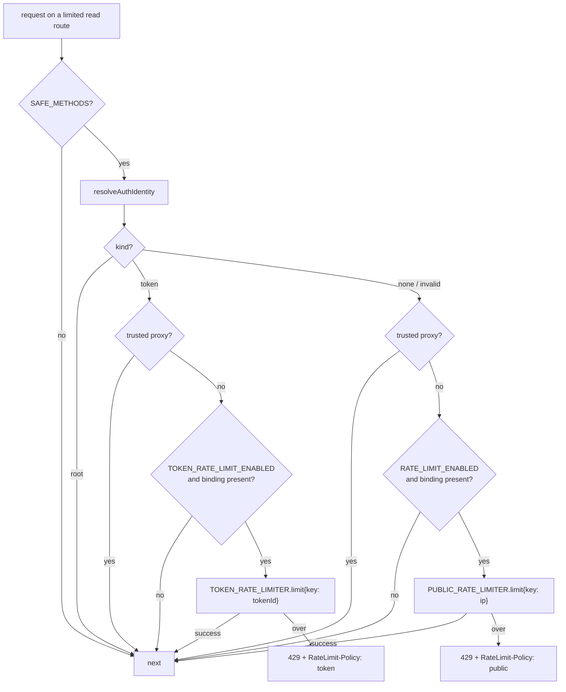

# Per-token Rate Limiting — Design

**Date:** 2026-05-20
**Status:** Approved (design)
**Surfaces:** API worker only (`workers/api/`). No wire-shape, schema, CLI, or MCP changes.
**Tracking:** [#1100](https://github.com/buildinternet/releases/issues/1100)
**Lineage:** Closes the deferred non-goal from `2026-05-20-scoped-api-tokens-design.md` and `2026-05-20-cli-auth-token-storage-design.md`.

## Summary

Today the public rate limiter (`publicRateLimitMiddleware`) is **per-IP and anonymous-only**. Any valid Bearer credential — the static root key **or any `relk_` scoped token of any scope** — bypasses it entirely (`if (await hasValidAuth(c)) return next()`). A leaked or abused `relk_` token therefore gets an unlimited rate-limit pass. This was an accepted posture while tokens were internal-only; it needs a real cap before less-trusted tokens are issued.

This design adds a **per-token** limiter: each `relk_` token gets its own flat quota, keyed by its `tokenId`, enforced by a second Cloudflare Rate Limiting binding. The static root key and the trusted web-frontend proxy stay exempt. The whole path is behind a new kill switch (`TOKEN_RATE_LIMIT_ENABLED`), default off, so deploying this changes nothing until the switch is flipped.

## Goals

- Give every `relk_` token a per-token request cap so one token can't monopolize the API.
- Keep the static root key (CLI/MCP/scripts) and the trusted proxy (web SSR) exempt.
- Ship dark: default-off kill switch; flag-off behavior is byte-for-byte today's behavior.
- Reuse the existing Cloudflare Rate Limiting mechanism — no new infra, no schema change.
- Shape the limiter key so scope-tiered quotas are a later config/binding change, not a logic rewrite.

## Non-goals (named boundaries)

- **Scope-tiered quotas** (read tokens get a different ceiling than write/admin) — a flat per-token cap ships first; tiering is deferred until user-facing tokens exist. The key already carries enough to tier later.
- **Write / admin-route coverage** — the limiter is mounted only on the public-read route group and `/graphql`, and only acts on `SAFE_METHODS`. Admin routes don't mount the limiter at all today. Extending coverage to mutations is future work.
- **Global (cross-colo) counting** — Cloudflare Rate Limiting bindings are per-colo, same constraint as today's IP limiter. A Durable Object / KV counter would be needed for global counts; out of scope.
- **Changing the auth/scope model** — `resolveAuth`, the scope ladder, and route gating are unchanged. This design only adds a read-only identity accessor and a new limiter branch.

## Decisions and rationale

| Decision            | Choice                                                       | Why                                                                                                 |
| ------------------- | ------------------------------------------------------------ | --------------------------------------------------------------------------------------------------- |
| Quota model         | **Flat** per-token cap                                       | YAGNI — user tokens don't exist yet; a flat cap closes the "any token = unlimited" gap. Tier later. |
| Mechanism           | **2nd CF Rate Limiting binding** keyed by `tokenId`          | Mirrors `PUBLIC_RATE_LIMITER`; zero new infra; cheapest; per-colo (same constraint as today).       |
| Kill switch         | **New `TOKEN_RATE_LIMIT_ENABLED`**, default off              | Independent of the IP limiter's `RATE_LIMIT_ENABLED` (which is off in prod); ships dark.            |
| Root / proxy        | **Exempt** (unchanged)                                       | Break-glass key and web SSR are trusted internal callers.                                           |
| Invalid token       | Treated as anonymous → **per-IP** limiter                    | A bogus `relk_`-shaped string can't dodge the IP cap.                                               |
| Identity in limiter | New exported `resolveAuthIdentity(c)` wrapping `resolveAuth` | Limiter needs the `tokenId`, not just a bool; reuse resolution rather than re-implement it.         |

## Architecture

One behavior change, localized to `publicRateLimitMiddleware`. The early guards are unchanged: non-`SAFE_METHODS` requests return early (writes are auth-gated, not rate-limited here).

Resolution precedence inside the limiter: **root → bypass; trusted proxy → bypass; token → per-token limit; anonymous/invalid → per-IP limit.** Root is checked before proxy so a request carrying both still bypasses cleanly.

## Components

### `workers/api/wrangler.jsonc`

- Second binding in the existing `ratelimit` block: `{ "name": "TOKEN_RATE_LIMITER", "type": "ratelimit", "namespace_id": "1002", "simple": { "limit": 600, "period": 60 } }`. The namespace_id is unique within the worker; `600/60s` is a generous starting cap (well above any legitimate single-token read pattern) — tune on the binding, not in user docs.
- New var `"TOKEN_RATE_LIMIT_ENABLED": "false"` in the top-level `vars` and in the `[env.staging]` `vars` block, mirroring `RATE_LIMIT_ENABLED`.

### `workers/api/src/index.ts` (`Env`)

- `TOKEN_RATE_LIMIT_ENABLED?: string;`
- `TOKEN_RATE_LIMITER?: { limit(options: { key: string }): Promise<{ success: boolean }> };` (same shape as `PUBLIC_RATE_LIMITER`).

### `workers/api/src/middleware/auth.ts`

- Export `resolveAuthIdentity(c): Promise<AuthContext | null>` — returns `{ kind: "root", scopes }` or `{ kind: "token", tokenId, scopes }` for a valid credential, else `null` (anonymous, invalid, or local-dev skip). A thin wrapper over the existing private `resolveAuth(c, bearer(c))`; collapses `{ kind: "none" }` to `null`. `hasValidAuth` can be re-expressed as `(await resolveAuthIdentity(c)) !== null` to avoid two resolution paths drifting.

### `workers/api/src/middleware/rate-limit.ts`

- Add `TOKEN_RATE_LIMIT_QUOTA = 600` / `TOKEN_RATE_LIMIT_WINDOW_SECONDS = 60` constants (mirror the binding) and a `"token"` policy header builder, alongside the existing `"public"` ones.
- Replace the `hasValidAuth` bypass with the branch above, using `resolveAuthIdentity`.
- Token path, when enabled: `TOKEN_RATE_LIMITER.limit({ key: identity.tokenId })`. On over-limit, emit `RateLimit-Policy`/`RateLimit`/`Retry-After` with the `"token"` policy name and the same `{ error: "rate_limited", message }` body + 429 as the IP path, and `logEvent("warn", { component: "rate-limit", event: "token-throttled", tokenId })`. On success, advertise the `"token"` policy header and continue.

## Error handling

- Binding absent (local dev, or env without the binding) → bypass, exactly like the IP path's `if (!c.env.PUBLIC_RATE_LIMITER) return next()`.
- Flag off → bypass (preserves today's behavior; the existing "read-only token bypasses" test stays green because it doesn't set the flag).
- The `.limit()` call returns only `{ success }` (CF constraint), so `RateLimit-Remaining` is not emitted precisely — clients pace off the advertised policy, identical to the IP path.

## Testing

Extend `tests/api/rate-limit.test.ts` (reuses `seedToken(db, scopes)` → `{ token, tokenId }`, `mockLimiter`, `mockSecret`):

- **Token over quota → 429** with `RateLimit-Policy` carrying the `"token"` policy and `Retry-After: 60`; `TOKEN_RATE_LIMITER` keyed by the token's `tokenId` (`tok_…`); `PUBLIC_RATE_LIMITER` never consulted.
- **Token under quota → 200**, token limiter consulted once, IP limiter untouched.
- **Root key → bypass:** neither limiter consulted (root is exempt even with the flag on).
- **Trusted proxy → bypass** even when carrying a token-shaped header.
- **Flag off (default) → token bypasses:** the existing read-only-token test stays green unchanged; add an explicit assertion that `TOKEN_RATE_LIMITER` is never called when `TOKEN_RATE_LIMIT_ENABLED` is unset.
- **Binding absent + flag on → bypass.**
- **Invalid token + flag on → per-IP limiter** (existing "invalid Bearer token" test stays green; the IP path still fires).
- **Non-safe method → still skipped** (existing test unchanged).

## Documentation

- Update the rate-limiting section of `docs/architecture/remote-mode.md`: today's "authenticated callers bypass entirely" becomes "root and the trusted proxy bypass; `relk_` tokens get a per-token cap when `TOKEN_RATE_LIMIT_ENABLED` is on."

## Future work

- **Scope-tiered quotas** — separate bindings (or one keyed by `scope:tokenId`) once user-facing tokens exist and need differentiated ceilings.
- **Write / admin-route coverage** — mount limiting on mutation paths and admin routes; pairs with the above.
- **Global counts** — a Durable Object or KV counter if per-colo accuracy proves insufficient.
- **`RateLimit-Remaining`** — only if Cloudflare's binding starts returning remaining budget.
