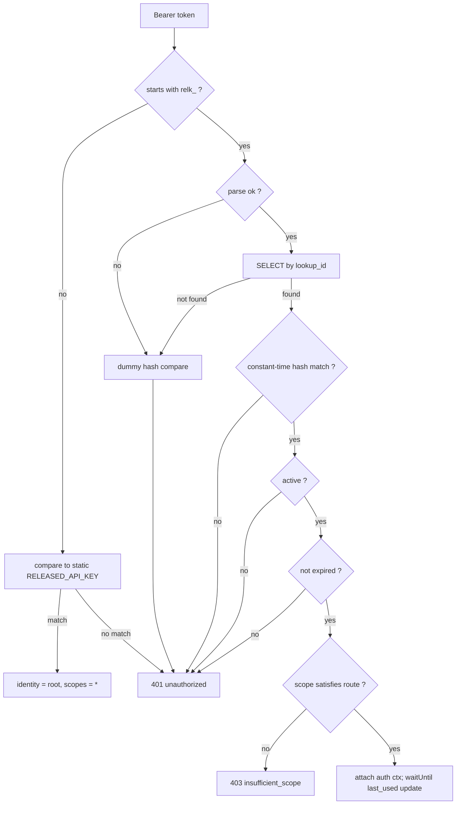

# Scoped API Tokens — Design

**Date:** 2026-05-20
**Status:** Approved (design); pending implementation plan
**Surface:** API worker (`workers/api/`) first; shared validation in `@buildinternet/releases-core` so the MCP worker can adopt it next.

## Summary

Today the API worker authenticates with a **single static secret** (`RELEASED_API_KEY`, resolved from Cloudflare Secrets Store) compared by string equality in `workers/api/src/middleware/auth.ts`. Identity is binary: a request either holds the one key (full admin + rate-limit bypass) or it doesn't. There is no way to mint a read-only token, an admin-task-scoped token, or a differently-scoped credential for a managed agent.

This design adds **opaque, database-backed, scoped API tokens** alongside the existing static key. Each token carries a set of named scopes, can be revoked instantly, can expire, and records last-used. The static key is retained as an implicit **root** credential so nothing currently wired to it breaks. This is also the precursor to a future where registered users mint their own tokens — the schema and token shape are chosen so that arrives without a migration.

## Goals

- Mint multiple tokens with different permission scopes (read-only, write, admin).
- Store tokens securely — only a hash, never plaintext; the token shape is distinct from normal entity IDs.
- Revoke a token instantly; optionally expire it; track last-used for audit.
- Attribute a token to a principal (internal system, managed agent, future user) without a later migration.
- Keep the existing static `RELEASED_API_KEY` working as a root/break-glass credential.
- Put the verification primitives in a shared, runtime-neutral package so the MCP worker reuses them.

## Non-goals (named boundaries)

- **MCP scope enforcement** and the confused-deputy fix on the MCP→API internal forward — Phase 2, its own spec.
- **Per-token rate limiting** — today any valid identity bypasses rate limiting; that stays. Per-token throttling is deferred to when less-trusted (user) tokens exist.
- **JWT / OAuth interactive login** — a separate, later subsystem for browser sessions. Opaque API keys are _not_ converted to JWTs; the two coexist when OAuth arrives.
- **User-facing self-service token UI / endpoints** — management is admin-gated (CLI/script) for now.
- **Server-side pepper** and a **KV verification cache** — noted as future hardening / scaling levers, not built (a cache would reintroduce revocation lag).

## Decisions and rationale

| Decision                   | Choice                                                   | Why                                                                                                                             |
| -------------------------- | -------------------------------------------------------- | ------------------------------------------------------------------------------------------------------------------------------- |
| Permission model           | Named scope **sets** (OAuth/GitHub style)                | Maps onto the existing `publicReadRoutes`/`adminRoutes` split; the exact shape to expose to users later.                        |
| Relationship to static key | Keep static key as implicit **root**; layer DB tokens on | Lowest-risk rollout; nothing wired to `RELEASED_API_KEY` breaks; static key becomes break-glass.                                |
| Lifecycle                  | Revocation + nullable expiry + last-used/audit           | Requested; all cheap now, awkward to retrofit.                                                                                  |
| Surfaces                   | API worker now; pure helpers shared for MCP next         | Proves the model on the surface that already does Bearer auth; keeps blast radius small.                                        |
| Storage/verification       | **Opaque split token**: public lookup-id + hashed secret | Clean non-secret handle for listing/logging/revoking; O(1) indexed lookup. Closest real-world analog: GitHub fine-grained PATs. |
| Hashing                    | Single **SHA-256** of the secret, **no salt**            | Tokens are high-entropy random; salt/slow-KDF defend low-entropy passwords, which doesn't apply. Standard for API keys.         |
| Attribution                | `principal_type` enum + nullable `principal_id` now      | Mirrors the existing `discovery` enum pattern; lets `user` tokens drop in with no migration/backfill.                           |

## Data model — `api_tokens`

New table in the Drizzle schema (`packages/core/src/schema.ts`, the source of truth) with a migration under `workers/api/migrations/` (after `20260520010000_squashed_baseline.sql`).

| Column           | Type                                | Notes                                                                                                            |
| ---------------- | ----------------------------------- | ---------------------------------------------------------------------------------------------------------------- |
| `id`             | TEXT PK                             | Typed id `tok_<nanoid>`. Internal handle, immutable.                                                             |
| `lookup_id`      | TEXT, UNIQUE, NOT NULL              | Public, non-secret. Indexed. The column we `SELECT` by.                                                          |
| `token_hash`     | TEXT, NOT NULL                      | `SHA-256(secret)` as hex. Never the plaintext.                                                                   |
| `name`           | TEXT, NOT NULL                      | Human display label. Required, non-empty, **not** unique.                                                        |
| `scopes`         | TEXT, NOT NULL                      | JSON array of scope strings, e.g. `["read","write"]`.                                                            |
| `principal_type` | TEXT, NOT NULL, indexed             | `internal \| agent \| user`. Queryable attribution handle.                                                       |
| `principal_id`   | TEXT, nullable                      | Typed id of the owning entity when one exists (`user_…`, agent id); null for `internal`. Loosely coupled, no FK. |
| `active`         | INTEGER (bool), NOT NULL, default 1 | Fast revocation check. `integer({ mode: "boolean" })`.                                                           |
| `revoked_at`     | TEXT, nullable                      | ISO-8601. Audit trail for when revoked.                                                                          |
| `expires_at`     | TEXT, nullable                      | ISO-8601. NULL = never expires.                                                                                  |
| `last_used_at`   | TEXT, nullable                      | ISO-8601. Updated on successful auth (throttled).                                                                |
| `created_at`     | TEXT, NOT NULL                      | ISO-8601, `$defaultFn(() => new Date().toISOString())`.                                                          |
| `created_by`     | TEXT, nullable                      | Provenance: who _minted_ it (`"static-key"`, a minting token's id, later a user id).                             |
| `metadata`       | TEXT, nullable                      | JSON string, default `"{}"`. Forward-compat incidental detail.                                                   |

Timestamps are ISO-8601 **text** with `$defaultFn(() => new Date().toISOString())`, matching the existing `schema.ts` convention (e.g. `organizations.createdAt`). Enum columns use Drizzle's `text(col, { enum: [...] })` form (matching `discovery`); booleans use `integer(col, { mode: "boolean" })`. `tok_` is added to the `nanoid` prefix scheme in `packages/core/src/id.ts`. The shared helper module is named **`api-token`** (not `token`/`tokens` — `@buildinternet/releases-core/tokens` already exists for tiktoken counting).

**The four orthogonal axes** (kept distinct on purpose):

- `name` — what we call it.
- `scopes` — what it can do.
- `principal_type` / `principal_id` — whom it acts as (ownership).
- `created_by` — who minted it (provenance).

## Token format

```text
relk_<lookupId>_<secret>
```

- `relk_` — fixed prefix. Enables GitHub secret-scanning / pre-commit detection of leaked tokens.
- `lookupId` — 12 chars, **base62** alphabet (`0-9A-Za-z`), CSPRNG. ~71 bits, unique-indexed, non-secret.
- `secret` — 32 chars base62, ~190 bits, CSPRNG.

Base62 (not nanoid's default `A-Za-z0-9_-`) is deliberate so the `_` delimiter is unambiguous. Parsing: strip `relk_`, split on the first `_`, yielding `[lookupId, secret]`; reject anything that doesn't match shape.

No environment marker — prod and staging are **separate D1 databases** (`released-db` vs `released-db-staging`), so a token cannot cross environments.

The full token string is shown **exactly once** at creation and is never retrievable again.

## Scope model

Closed vocabulary defined in `packages/core` (alongside patterns like `CATEGORIES`), stored per-token as a JSON **set**:

| Scope   | Grants                                                                                 |
| ------- | -------------------------------------------------------------------------------------- |
| `read`  | Authenticated reads (rate-limit bypass; future gated reads).                           |
| `write` | POST/PATCH/DELETE on `publicReadRoutes`.                                               |
| `admin` | Everything on `adminRoutes`.                                                           |
| `*`     | Root — all scopes. What the static key maps to (not assignable to ordinary DB tokens). |

A pure `scopeSatisfies(tokenScopes, required)` helper encodes a monotonic ladder (`* ⊇ admin ⊇ write ⊇ read`) but evaluates against the stored set, so finer namespaced scopes (`orgs:write`, `sources:read`) can be added later without reworking callers. v1 deliberately tracks the existing two route tiers (write-tier, admin-tier) — no per-namespace granularity yet.

Route → required-scope mapping is driven by the existing two middlewares, not a new per-namespace table:

- `publicReadAuthMiddleware`: safe methods (GET/HEAD/OPTIONS) require no scope; unsafe methods require `write`.
- `authMiddleware`: requires `admin`.

## Validation flow

Pure, runtime-neutral helpers live in **`packages/core/src/api-token.ts`**, exported as `@buildinternet/releases-core/api-token` (adds an entry to the package's `exports` map): `generateApiToken`, `parseApiToken`, `hashSecret` (Web Crypto `crypto.subtle.digest`), `constantTimeEqual`, `scopeSatisfies`, and the scope vocabulary. The DB read and the `last_used_at` write stay worker-side in `workers/api/src/middleware/auth.ts`.



Security mitigations baked into this path (see Security considerations for the full list):

- **Uniform failure:** not-found and malformed inputs run a **dummy hash compare** against a fixed dummy hash, then return the **identical 401** as a wrong-secret — no timing or response-shape enumeration oracle.
- **Constant-time compare** for the hash check (Workers has no `timingSafeEqual`; implement a small constant-time byte compare).
- **401 vs 403:** auth failures (malformed / unknown / revoked / expired / wrong secret) → `401 unauthorized`; a valid token lacking the required scope → `403 insufficient_scope`.
- **Single path:** a `relk_`-prefixed token is validated via the DB path _only_; everything else goes to the static-key path. No token is eligible for both — overlapping paths are how bypasses get introduced.
- **No cache:** verification reads D1 directly each authed request (internal/dev volume), so revocation is instant.
- `last_used_at` is updated via `c.executionCtx.waitUntil()`, throttled to skip if updated within the last 60s, so the hot path isn't gated on a write and D1 isn't hammered.

## Middleware integration

Both existing middlewares delegate to a shared `resolveAuth(c)` returning an `AuthContext | failure`. `AuthContext` carries `{ kind: "root" | "token", tokenId?, scopes }` and is attached to the Hono context (`c.set("auth", …)`).

- `publicReadAuthMiddleware`: safe methods pass; if a token is present it is still resolved (for rate-limit bypass and future gated reads). Unsafe methods require `write`.
- `authMiddleware`: requires `admin`.
- Two predicates, deliberately split (see the implementation plan's Self-Review for the rationale): `hasValidAuth` answers "is there _any_ valid identity — static key or active DB token of any scope" and is consumed **only** by `workers/api/src/middleware/rate-limit.ts` (so any valid token bypasses rate limiting — accepted; see non-goals). `isValidBearerAuth` stays **admin-level** — true only for the static root key or a DB token whose scopes satisfy `admin` — and is what the field-unlock call sites (GraphQL resolver, `routes/search.ts`, `routes/orgs.ts`) use, so a read/write-only token can never escalate to admin-only content.
- `isTrustedProxy` (`RELEASES_PROXY_KEY`) is unchanged.
- **Local dev unchanged:** when no `RELEASED_API_KEY` secret is bound (local), auth is skipped exactly as today.

## Management surface

Per repo convention — resource CRUD on the canonical path, gated by the `adminRoutes` allowlist in `workers/api/src/route-namespaces.ts` — add `tokens` to `adminRoutes` and create `/v1/tokens`:

- `POST /v1/tokens` `{ name, scopes, principalType?, principalId?, expiresAt? }` → mints a token. `scopes` is **required** (no default, to avoid accidental over-provisioning); `principalType` defaults to `internal`. Returns the **full token string once** plus the row (never the hash). Requires `admin`.
- `GET /v1/tokens`, `GET /v1/tokens/:id` → list / detail. Never returns the secret or hash; exposes `lookup_id`, `name`, `scopes`, `principal_type`/`principal_id`, `active`, `last_used_at`, `expires_at`, `created_at`, `created_by`.
- `POST /v1/tokens/:id/revoke` → set `active=0`, `revoked_at=now`.
- `PATCH /v1/tokens/:id` → edit `name` / `scopes` / `expires_at` (scopes are editable by design).

These are admin-gated, so they fall **outside** the OpenAPI coverage gate (`scripts/check-openapi-coverage.ts` only covers `publicReadRoutes`); no `describeRoute` annotation is required.

`created_by` is set to `"static-key"` when minted by the root key, or to the minting token's `id` when minted by a DB admin token.

The OSS CLI wrapper (`releases admin token create | list | revoke`, following the `releases admin <noun> <verb>` convention) is a downstream change in the `releases-cli` repo — out of scope here. A `scripts/mint-token.ts` covers immediate internal use against this monorepo.

## Bootstrapping and rollout

- **Bootstrap:** the first token is minted using the static root key (the only `admin`-capable credential at first).
- **Migration:** add the table via a new migration; test on staging first via `bunx wrangler d1 migrations apply DB --env staging --remote` (records the `d1_migrations` row, per the staging migration-drift guidance), then prod with confirmation.
- **Additive by default:** the static-key path is untouched and DB tokens are inert until rows exist, so no flag is strictly required.
- **Kill switch:** `API_TOKENS_DISABLED=true` (matching the existing `*_DISABLED` flag convention — `INDEXING_DISABLED`, `SEARCH_QUERY_LOG_DISABLED`) bypasses the DB-token path entirely, leaving only the static key. This is the rollback lever.

## Security considerations

1. **`lookup_id` is public** — it is loggable and embedded in the token. All security rests on the secret. `lookup_id` is random (CSPRNG), not sequential, so tokens can't be enumerated by guessing ids.
2. **No enumeration / timing oracle** — unknown `lookup_id` and wrong secret return the identical `401` and run the same dummy hash comparison so timing matches. Hash comparison is constant-time.
3. **Never log or cache the plaintext** — the `Authorization` header and full token are redacted in all logging (`logEvent`, `search_queries`, telemetry, error traces). Only `lookup_id` and `tok_…` ids are safe to log. No plaintext is stored anywhere, including caches.
4. **CSPRNG + entropy** — secret generated via `crypto.getRandomValues` (never `Math.random`), ≥128 bits (spec'd ~190). Never truncated.
5. **Bearer-only** — token is accepted only via `Authorization: Bearer`. Never a query param (would leak into logs, history, `Referer`).
6. **Single validation path** — `relk_` → DB only; otherwise → static key. No dual eligibility.
7. **Instant revocation** — no verification cache in v1, so a revoked token fails on the very next request.
8. **DB-leak posture** — high-entropy tokens mean stored SHA-256 hashes are not reversible; a read-only DB leak can't forge tokens. (A write-capable DB compromise is a broader problem, out of this scope. Optional future pepper noted in non-goals.)
9. **Rate-limit bypass caveat** — any valid token (including read-only) bypasses rate limiting today; acceptable for internal/dev, revisit before issuing user tokens.

## Testing

- **Pure unit (`packages/core/src/api-token.ts`):** generate→parse round-trip; malformed-parse rejection; `hashSecret` determinism; `constantTimeEqual` correctness; `scopeSatisfies` ladder + set logic; secret length/entropy; base62 alphabet (no delimiter collision).
- **Middleware (`workers/api`, using `tests/db-helper.ts` `bun:sqlite` fixtures):** valid token grants per scope; revoked → 401; expired → 401; wrong secret → 401; unknown `lookup_id` → 401 **and byte-identical to wrong-secret**; insufficient scope → 403; static key still works as root; public GET with no token passes; `last_used_at` update fires and is throttled.
- **Management endpoints:** mint requires `admin`; token returned exactly once; list/detail never leak hash or secret; revoke flips `active` and sets `revoked_at`; PATCH edits scopes; `principal_type` defaults to `internal`.
- **Security-specific:** assert the full token/secret never appears in emitted logs (redaction); assert the uniform 401 response shape across failure modes.

## Future work

- Phase 2: MCP worker adopts the shared validation helpers; fix the confused-deputy risk on the MCP→API internal forward so a low-scope MCP caller can't trigger a root-privileged internal call.
- Per-token rate limiting once user tokens exist.
- JWT/OAuth interactive login as a separate subsystem (coexists with these keys).
- Optional server-side pepper; optional short-TTL KV verification cache if authed volume grows.
- OSS CLI `releases admin token …` commands.
- User-facing self-service token management UI.
