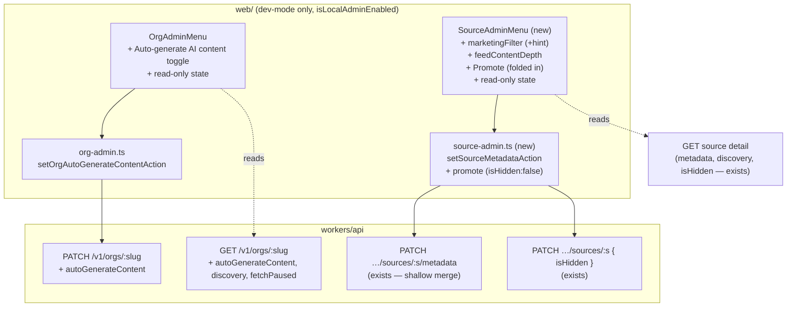

# 2026-05-21 — Dev-mode admin controls for AI-feature opt-in

## Problem

Several AI/automation features are **opt-in per organization or per source**, but the
opt-in switches have no UI and (in one case) no API at all. To enable them today an
operator edits the database directly. The dev-mode admin menus in the web app
(`OrgAdminMenu`, the source "Promote" button, `ReleaseAdminMenu`) expose only a thin
slice of this control surface — org hide/unhide, release suppress/delete, and a
one-way source un-hide.

This adds **visibility and control** for the AI-feature opt-in flags to those menus.

### The flags involved

| Flag                                                | Level      | Controls                                                                    | Storage                                                          | Writable today                | UI today                    |
| --------------------------------------------------- | ---------- | --------------------------------------------------------------------------- | ---------------------------------------------------------------- | ----------------------------- | --------------------------- |
| `auto_generate_content`                             | org        | **Both** automatic overviews **and** per-release summaries (one flag, both) | `organizations.auto_generate_content` (bool, default `false`)    | **SQL only**                  | none                        |
| `metadata.marketingFilter` (+`marketingFilterHint`) | source     | Marketing classifier on ingest                                              | `sources.metadata` JSON key                                      | `PATCH …/sources/:s/metadata` | none                        |
| `metadata.feedContentDepth`                         | source     | Feed enrichment (also gated by worker env `FEED_ENRICH_ENABLED`)            | `sources.metadata` JSON key (`"full"`\|`"summary-only"`\|absent) | `PATCH …/sources/:s/metadata` | none                        |
| `isHidden`                                          | org        | Listings + skips AI                                                         | `organizations.is_hidden`                                        | `PATCH /v1/orgs/:slug`        | yes (`OrgAdminMenu`)        |
| `isHidden`                                          | source     | Skips AI pipelines                                                          | `sources.is_hidden`                                              | `PATCH …/sources/:s`          | partial (one-way "Promote") |
| `fetchPaused`                                       | org        | Pauses all ingest                                                           | `organizations.fetch_paused`                                     | `PATCH /v1/orgs/:slug`        | none                        |
| `discovery`                                         | org/source | `curated`/`agent`/`on_demand`; `on_demand` orgs excluded from overviews     | `*.discovery` enum                                               | not via standard PATCH        | none                        |

**Key realisation:** the user's two requested toggles ("automatic overviews" and
"automatic summaries") are the _same_ backend flag — `auto_generate_content`. There
is no way to enable one without the other. The design models it as one combined
toggle, matching backend reality.

## Goals

- Add a combined **Auto-generate AI content** toggle to `OrgAdminMenu` (writes
  `auto_generate_content`), with copy that names what it governs (overviews +
  per-release summaries).
- Add a new **`SourceAdminMenu`** with controls for `marketingFilter` (+ hint) and
  `feedContentDepth`, absorbing the existing one-way "Promote source" action.
- Surface read-only **state** in both menus (`discovery`, `fetchPaused`, `isHidden`)
  so an operator can see _why_ a toggle may have no effect — notably that
  `on_demand` orgs are excluded from overview generation regardless of the flag.

## Non-goals

- **Not** splitting `auto_generate_content` into two columns. Explicitly declined;
  one toggle reflects the single backend flag.
- **Not** adding write toggles for org `fetchPaused` or source `isHidden` (beyond the
  existing one-way Promote). These remain read-only state in the menus.
- No change to the eligibility queries, cron gating, or the worker-level
  `FEED_ENRICH_ENABLED` / `BATCH_*_ENABLED` env switches.
- No production-facing UI. All controls stay behind `isLocalAdminEnabled()`
  (non-prod + `RELEASED_API_KEY` set), unchanged from today.

## Architecture

Two layers. The org flag needs a small API addition (read + write); the source flags
already have full read + write API support, so the source work is web-only.



## API changes (org only)

### `packages/api-types/src/schemas/orgs.ts`

- `UpdateOrgBodySchema`: add
  ```ts
  /** Admin-only: opt the org into automatic AI content — org overviews AND per-release summaries (single backend flag). */
  autoGenerateContent: z.boolean().optional(),
  ```
- `OrgDetailSchema`: add (all optional, for older workers mid-deploy)
  ```ts
  autoGenerateContent: z.boolean().optional(),
  fetchPaused: z.boolean().optional(),
  discovery: z.enum(["curated", "agent", "on_demand"]).optional(),
  ```
  (Reuse the existing discovery enum source if one is already exported; otherwise an
  inline `z.enum`.)

Both are **additive** — no renames/removals, so no deprecation alias needed.

### `workers/api/src/routes/orgs.ts`

- **PATCH `/orgs/:slug`** (~line 571): add `autoGenerateContent?: boolean` to the body
  type, and after the existing `isHidden` line:
  ```ts
  if (body.autoGenerateContent !== undefined)
    updates.autoGenerateContent = body.autoGenerateContent;
  ```
- **GET `/orgs/:slug`** detail (`result` object, ~line 400): add
  ```ts
  autoGenerateContent: org.autoGenerateContent,
  fetchPaused: org.fetchPaused,
  discovery: org.discovery,
  ```
  (`org` is the full selected row, so all three columns are present.)

No migration — `auto_generate_content`, `fetch_paused`, `discovery` all exist.

### Source side — no API change

- Read: source detail already returns raw `metadata` (JSON string) + `discovery` +
  `isHidden` (`SourceDetailSchema`).
- Write: `PATCH /v1/orgs/:orgSlug/sources/:sourceSlug/metadata` already shallow-merges
  (a `null` value deletes a key) and echoes the merged object; `PATCH …/sources/:s`
  already accepts `{ isHidden }`.

## Web changes — org

### `web/src/app/actions/org-admin.ts`

Add a sibling to `setOrgHiddenAction`:

```ts
export async function setOrgAutoGenerateContentAction(input: {
  slug: string;
  enabled: boolean;
}): Promise<ActionResult>;
```

PATCHes `/v1/orgs/:slug { autoGenerateContent: input.enabled }` via `adminActionEnv()`

- `webApiHeaders`, then `revalidatePath(`/${input.slug}`)`. Mirrors the existing
  action's error handling.

### `web/src/components/org-admin-menu.tsx`

- New props: `autoGenerateContent: boolean`, `discovery?: string`, `fetchPaused?: boolean`.
- Restructure the dropdown into labelled sections:
  - **Controls:** existing Hide/unhide toggle + new "Auto-generate AI content" toggle.
    Copy: "Generates org overviews and per-release AI summaries on ingest." When
    `discovery === "on_demand"`, add an inline note: overviews are skipped for
    on-demand orgs regardless of this flag (summaries still run).
  - **State (read-only):** `discovery`, `fetchPaused`.
- The "Admin" button label may append a marker when auto-content is on (e.g.
  `Admin · AI`), matching the existing `Admin · Hidden` treatment. Optional polish.

### `web/src/app/[orgSlug]/(org)/layout.tsx`

Pass the new fields through:

```tsx
<OrgAdminMenu
  orgSlug={org.slug}
  isHidden={org.isHidden ?? false}
  autoGenerateContent={org.autoGenerateContent ?? false}
  discovery={org.discovery}
  fetchPaused={org.fetchPaused}
/>
```

## Web changes — source (new `SourceAdminMenu`)

### `web/src/app/actions/source-admin.ts` (new)

- `setSourceMetadataAction(input: { orgSlug; sourceSlug; patch: Record<string, unknown> })`
  → `PATCH /v1/orgs/:orgSlug/sources/:sourceSlug/metadata` with `patch` as the body
  (`null` clears a key), then `revalidatePath(`/${orgSlug}/${sourceSlug}`)`.
- `promoteSourceAction` **moved** here from `web/src/app/actions/promote-source.ts`
  (old file deleted) → `PATCH …/sources/:s { isHidden: false }`. Consolidating it here
  keeps all source admin writes in one module.

### `web/src/components/source-admin-menu.tsx` (new)

Same dropdown pattern as `OrgAdminMenu` (outside-click + Escape close, `useTransition`,
inline error, `router.refresh()`). Props include the parsed current state — the layout
parses `source.metadata` (JSON string) once and passes booleans/enum down, so the
component stays a dumb renderer:

- Props: `orgSlug`, `sourceSlug`, `marketingFilter: boolean`, `marketingFilterHint: string | null`, `feedContentDepth: "full" | "summary-only" | null`, `discovery?: string`, `isHidden: boolean`.
- **Controls:**
  - **Marketing classifier** toggle → `setSourceMetadataAction({ patch: { marketingFilter: next } })`.
    When on, an optional **hint** textarea; saving writes `{ marketingFilterHint: value || null }`.
  - **Feed content depth** — three choices Auto / Full / Summary-only → writes
    `{ feedContentDepth: null | "full" | "summary-only" }`. Inline note: enrichment
    also requires the worker's `FEED_ENRICH_ENABLED` (on in prod) and only acts on
    `summary-only`.
  - **Promote** (`isHidden: false`) shown only when `discovery === "on_demand" && isHidden`.
- **State (read-only):** `discovery`, `isHidden`.

### `web/src/app/[orgSlug]/[sourceSlug]/layout.tsx`

- Replace the `PromoteSourceButton` + `isPromoteSourceEnabled()` usage with the new
  `SourceAdminMenu`, gated by `isLocalAdminEnabled()`. Parse `source.metadata` here:
  ```ts
  const meta = (() => {
    try {
      return JSON.parse(source.metadata || "{}");
    } catch {
      return {};
    }
  })();
  ```
  and pass `marketingFilter`, `marketingFilterHint`, `feedContentDepth` plus
  `discovery`/`isHidden` to the menu.

### Retirements (folding Promote in)

- Delete `web/src/components/promote-source-button.tsx`.
- Delete `web/src/lib/promote-source-flag.ts` (it is byte-identical logic to
  `isLocalAdminEnabled()`); the new menu uses `isLocalAdminEnabled()`.
- Delete `web/src/app/actions/promote-source.ts` (its `promoteSourceAction` moves into
  `source-admin.ts`). Update imports accordingly.

## Data flow / gating (unchanged)

- All menus render only when `isLocalAdminEnabled()` (`NODE_ENV !== "production"` &&
  `VERCEL_ENV !== "production"` && `RELEASED_API_KEY` set).
- Server actions re-check the gate via `adminActionEnv()` (defense-in-depth) and attach
  `Authorization: Bearer ${RELEASED_API_KEY}` through `webApiHeaders`.

## Testing

- **API (meaningful logic):** extend the orgs route tests —
  - PATCH `/v1/orgs/:slug { autoGenerateContent: true }` persists the column.
  - GET `/v1/orgs/:slug` returns `autoGenerateContent`, `discovery`, `fetchPaused`.
- **Web:** client components follow the repo's existing (largely untested) client-component
  norm; verify manually in dev via Claude-in-Chrome — toggle each control, confirm the
  PATCH lands (network) and the rendered state matches after `router.refresh()`.
- Type-check (`npx tsc --noEmit` root + `workers/api` + `web`), `bun test`,
  `bun run lint`, `bun run format:check`.

## Open questions

None — both decision points resolved: Promote folds into `SourceAdminMenu` (standalone
button + redundant flag retired); the `marketingFilterHint` textarea is included.
