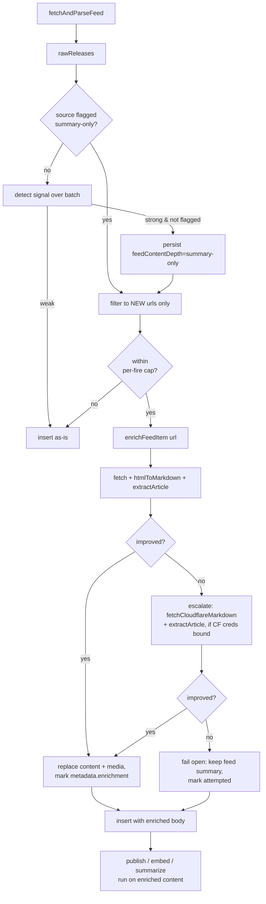

# 2026-05-21 — Feed content enrichment

## Problem

Many `type: feed` sources emit **summary-only** items: the RSS/Atom `<description>`
(or JSON Feed `summary`) carries one or two sentences, and there is no
`<content:encoded>` body. The real article — multiple paragraphs, headings,
lists, images — lives only at the item's link, and we never fetch it.

Concrete case (the report that prompted this): the **Webflow Product Updates**
source (`src_DVy0aE8GRBGEDkHJdcc5-`, `type: feed`, feed
`https://webflow.com/updates/rss.xml`) stores `content` byte-identical to the
one-line `summary` on every recent release. For example
`rel_B96EiKEf4nhePFYt7id2T` stores only:

> Webflow's translation engine now uses Gemini and translates formatted text as
> complete sentences, not fragments.

while the linked page
(`https://webflowmarketingmain.com/updates/ai-translation-that-handles-formatted-content-naturally`)
carries ~200 words across three sections (LLM engine, whole-element approach,
availability). This is **not Webflow-specific** — it affects any feed that
ships `<description>`-only items.

### What already exists (and why it doesn't cover this)

The repo has a _half-built_ version of this idea:

- `source.metadata.feedContentDepth?: "full" | "summary-only"`
  (`packages/adapters/src/source-meta.ts:100`) — a field with **no code that
  ever sets it automatically**.
- `shouldDelegateToCrawl()` (`workers/api/src/cron/poll-fetch.ts:588`) reads that
  flag, but **only fires for `source.type === "scrape"`** and requires
  `metadata.crawlEnabled === true`, handing the source to the managed-agent
  crawl worker.

A pure `type: feed` source like Webflow therefore never enriches: the thin
content lands as-is.

## Goal

When a feed source is summary-only, follow each new item's link, fetch the real
article, and store it as the release `content` — on a lightweight path that
stays off the managed-agent spend surface.

## Non-goals

- **Title cleanup.** Feed titles carry noise (e.g. `… | Webflow Updates`), but
  `title` is the dedup/identity anchor; rewriting it is a separate concern.
- **Clearing the flag** when a feed later upgrades to full `content:encoded`
  bodies — a noted future refinement, not v1.
- **Automatic backfill of all history.** Backfill is operator-triggered only.
- **Managed-agent involvement.** Enrichment is a lightweight fetch + extract,
  never a managed-agent crawl session.

## Decisions

| Axis            | Decision                                                                                   | Rationale                                                                                          |
| --------------- | ------------------------------------------------------------------------------------------ | -------------------------------------------------------------------------------------------------- |
| Trigger scope   | Auto-detect once, persist a per-source flag                                                | Reuses `feedContentDepth`; bounded, predictable steady state without per-source manual tagging.    |
| Backfill        | Forward path + operator-triggered, capped, dry-run-able backfill                           | Closes the gap on already-ingested thin content without a blanket re-crawl.                        |
| Fetch mechanism | Lightweight HTTP fetch + AI extract, escalate to CF Browser Rendering only when still thin | Cheap for the common (SSR) case, robust for JS pages, off the managed-agent budget.                |
| Rollout         | Ship gated **off** behind a kill switch                                                    | Validate on staging before incurring per-fetch cost; matches `EXTRACT_TOOLLOOP_ENABLED` precedent. |

## Architecture



Enrichment runs **before insert** so `contentChars`, `contentHash`,
embeddings, and summary all compute on the real body — no thin→full update
churn, no double-embed.

## Components

### 1. Detection — set the flag automatically

A new pure helper in `packages/adapters/` (e.g. `feed-depth.ts`):

```ts
// An item is "thin" if it carries no real body beyond its own teaser.
function isThinItem(raw: RawRelease, opts: ThinOpts): boolean;
// Returns "summary-only" | "full" | null (null = not enough signal to decide).
function assessFeedDepth(items: readonly RawRelease[], opts: ThinOpts): FeedContentDepth | null;
```

`isThinItem` is true when content is empty/whitespace, equals the item's
description (normalized: trimmed, collapsed whitespace, case-insensitive), or is
below `FEED_THIN_CHARS` (default **600**).

`assessFeedDepth` returns `"summary-only"` only when the batch has **≥ 3 items**
and **≥ 60%** are thin and none carry a distinct `content:encoded`-derived body.
Otherwise `null` (don't flip the flag on a sparse or ambiguous fetch).

In `fetchOne`: after parsing, if `meta.feedContentDepth` is unset and
`assessFeedDepth(...) === "summary-only"`, persist it into `source.metadata`
(same write path that already persists `etag`/`lastModified`). Detection and the
first enrichment can happen on the same fire.

> **Note:** `RawRelease` (`packages/adapters/src/types.ts`) does not currently
> distinguish "content came from `content:encoded`" vs. "content is the
> description." The feed parser maps `content:encoded` first, falling back to
> `description` (`feed.ts:496`). To detect "no distinct body," the parser must
> expose whether the body fell back to the description — add a transient
> `contentFromSummary?: boolean` (or compare against a retained `summary`/
> `description` field) on `RawRelease`. This is a small parser change, in scope.

### 2. Article extraction + the `enrichFeedItem` orchestrator

The heavy multi-entry extractor (`extract-from-body.ts`) is the wrong tool for a
single known article — it wants the full `ExtractDeps` repo shim and is built to
pull _many_ entries from an index page. Instead, two new, focused pieces:

**`extractArticle` (new, `packages/ai/src/article-extract.ts`).** A single
one-shot Claude call that takes page markdown + the known title and returns the
**verbatim main article body** as clean markdown — dropping nav, sidebars,
footers, and "more updates" lists that would otherwise contaminate `content`
(and embeddings). Caller passes the Anthropic client + model (Haiku-class is
enough); no `ExtractDeps`. Prompt is explicitly extract-not-rewrite to preserve
fidelity. This mirrors the marketing-classifier's placement in `packages/ai`.

```ts
// packages/ai/src/article-extract.ts
async function extractArticle(
  client: Anthropic,
  args: { markdown: string; title: string; model: string },
): Promise<{ content: string; usage: TokenUsage }>;
```

**`enrichFeedItem` (new orchestrator, `workers/api/src/cron/feed-enrich.ts`).**
Lives in the worker because that's where both the fetch and the Anthropic client
are available (matching how `classifyMarketingForReleases` is wired). Flow:

```ts
interface EnrichDeps {
  fetchImpl?: typeof fetch; // injectable for tests
  cloudflare?: { accountId: string; apiToken: string } | null; // render escalation; null = skip
  anthropic: { client: Anthropic; model: string };
  logEvent: typeof logEvent;
}
interface EnrichResult {
  status: "enriched" | "no_improvement" | "error";
  via?: "fetch" | "render";
  content?: string;
  media?: ReleaseMedia[];
}
async function enrichFeedItem(
  item: { url: string; summary: string },
  deps: EnrichDeps,
): Promise<EnrichResult>;
```

1. **Cheap path — no CF call:** `fetch(item.url, { headers: { "User-Agent":
RELEASES_BOT_UA } })` → HTML → `htmlToMarkdown()` (existing export). Run
   `extractArticle()` on that markdown; collect media via
   `extractMediaFromMarkdown()` (existing export).
2. **Improvement bar:** accept only if
   `content.length >= max(FEED_THIN_CHARS, 1.5 * summary.length)`. Otherwise
   continue.
3. **Escalate to render** (only if not yet accepted **and** `deps.cloudflare` is
   non-null): `fetchCloudflareMarkdown(url, accountId, apiToken)`
   (`packages/adapters/src/cloudflare.ts:46`) → rendered markdown → `extractArticle()`
   → re-check the bar. When `deps.cloudflare` is null (creds not bound),
   escalation is skipped — the cheap path is the whole behavior.
4. **Fail open:** any thrown error, timeout, or `no_improvement` returns without
   content; the caller keeps the feed summary and the item is never lost.

### 3. Wiring into the ingest path

In `fetchOne` (`workers/api/src/cron/poll-fetch.ts`), between marketing-classify
(~1124) and row-mapping (~1126):

- **New-URL filter:** query existing release URLs for the batch
  (`SELECT url FROM releases WHERE source_id = ? AND url IN (...)`, chunked at 90
  per `inArray`). Enrich **only** URLs not already present, so we never pay
  enrichment cost on items `onConflictDoNothing` would drop.
- Iterate new thin items up to `FEED_ENRICH_MAX_PER_FIRE` (default **10**). For
  each, call `enrichFeedItem`. On `enriched`, overwrite `raw.content` (and
  `raw.media` when empty). Record the marker (see §4) regardless of outcome.
- Items beyond the cap insert with feed content; the operator backfills.

Enrichment runs **inline inside `fetchOne`**, exactly where and how the
marketing classifier already runs (`poll-fetch.ts:1121`) — so it is covered by
the workflow's existing `fetch-and-persist` `step.do` retry boundary without a
new step. It does **not** need its own boundary: every failure is fail-open
(caught, logged, summary kept), so it never throws to the step and never needs
independent retry. Splitting `fetchOne` to give enrichment a separate step would
be a large refactor for no resilience gain.

The Anthropic client is already resolvable in both paths
(`env.ANTHROPIC_API_KEY` / AI Gateway — same build as the marketing classifier
at `poll-fetch.ts:860`). **The CF render escalation is the one missing
binding:** the API worker today carries no Cloudflare account/token (scrape
rendering runs in the _discovery_ worker, which is why summary-only scrape
sources are _delegated_ rather than rendered inline). Bind
`CLOUDFLARE_ACCOUNT_ID` + `CLOUDFLARE_API_TOKEN` to the API worker in
`workers/api/wrangler.jsonc`, reusing the existing Secrets Store entries the
discovery worker already references (`workers/discovery/wrangler.jsonc:96-103`)
— no new secret _values_, just a binding. `fetchOne` reads them into
`deps.cloudflare`; when either is absent, `deps.cloudflare` is `null` and
`enrichFeedItem` runs cheap-path-only (so the feature still ships and fixes
SSR feeds even if the binding is deferred).

### 4. Idempotency & cost controls

- **Marker:** write to the `releases.metadata` JSON column
  (`packages/core/src/schema.ts`, default `"{}"`):
  `metadata.enrichment = { attemptedAt: ISO, succeeded: boolean, via?: "fetch" | "render" }`.
  The marker bounds retries — a genuinely one-line release is attempted once,
  marked `succeeded: false`, and never re-fetched.
- **Per-fire cap:** `FEED_ENRICH_MAX_PER_FIRE` (default 10).
- **Kill switch:** `FEED_ENRICH_ENABLED` (default **off**). Enrichment also
  requires the per-source `feedContentDepth === "summary-only"` flag. Enrichment
  is **not** gated on `org.autoGenerateContent` — it improves stored content
  regardless of whether AI summaries are generated.
- **Dedup interaction:** because we enrich only new URLs and `UNIQUE(source_id,
url)` skips re-seen items, steady-state enrichment cost is bounded to
  genuinely new items per fire.

### 5. Backfill — operator-triggered

New admin-gated endpoint under the job-trigger namespace (per the route
convention in AGENTS.md — async triggers live under `/v1/workflows/*`):

```http
POST /v1/workflows/enrich-feed-content
{ "sourceId": "src_…" | ("orgSlug": "...", "sourceSlug": "..."),
  "limit": 25, "dryRun": true }
```

- Selects thin, un-enriched releases for the source:
  `metadata.enrichment IS NULL` (or `json_extract(metadata,'$.enrichment') IS
NULL`) **and** the row is still thin (`content == summary`-style predicate),
  ordered newest-first, capped at `limit`.
- For each, run `enrichFeedItem`. On success, `UPDATE` `content`, `media`
  (when empty), `contentChars`/`contentTokens`/`contentHash`, and the marker.
- For successfully-enriched IDs: null out `summary`/`titleGenerated`/
  `titleShort` and set `embeddedAt = NULL`, then call
  `generateContentForReleases(db, env, source, ids)`. Nulling first lets the
  existing `title_generated IS NULL` short-circuit re-fill them from the richer
  body without modifying that function; clearing `embeddedAt` queues the row for
  re-embed on the next embed pass.
- `dryRun: true` reports per-release `{ id, currentChars, wouldEnrich,
estimatedVia }` without writing.
- Returns a summary `{ scanned, enriched, skipped, failed, dryRun }`.

The CLI wrapper (`releases admin source enrich <slug> [--limit] [--dry-run]`)
lives in the OSS CLI repo (`~/Code/releases-cli`) and is a thin follow-up, out
of this monorepo's scope.

### 6. Content shape

- `content` ← enriched full article.
- `summary` ← unchanged (the feed teaser remains the fallback). Downstream Haiku
  summarization, when `org.autoGenerateContent` is set, regenerates
  `summary`/`titleGenerated`/`titleShort` from the richer body — so enrichment
  improves summaries too.
- `media` ← backfilled from the article only when feed media is empty.
- `title` ← untouched (non-goal).

## Configuration

| Var                        | Default | Purpose                                                         |
| -------------------------- | ------- | --------------------------------------------------------------- |
| `FEED_ENRICH_ENABLED`      | `false` | Global kill switch; ship off, flip on after staging validation. |
| `FEED_ENRICH_MAX_PER_FIRE` | `10`    | Per-fetch enrichment cap.                                       |
| `FEED_THIN_CHARS`          | `600`   | Below this, an item's content is "thin."                        |

Document in `.env.example` (no direct `.env` edits).

Plus two **wrangler bindings** on the API worker (`workers/api/wrangler.jsonc`,
prod + staging blocks), pointing at the Secrets Store entries the discovery
worker already uses — no new secret values: `CLOUDFLARE_ACCOUNT_ID` and
`CLOUDFLARE_API_TOKEN`. These enable the render-escalation step; when absent,
`enrichFeedItem` silently runs cheap-path-only.

## Error handling

- Every enrichment failure is **fail-open**: log a `logEvent("warn", { component:
"feed-enrich", event: "enrich-failed", sourceSlug, url, err })` and keep the
  feed summary. An item is never dropped or left empty because enrichment failed.
- Render escalation is attempted at most once per item; the marker prevents
  retry storms across fires.
- Detection never flips the flag on a sparse/empty fetch (min batch size 3).

## Testing

- **Unit — detection:** `isThinItem` / `assessFeedDepth` across edge cases
  (empty content, content == description, `content:encoded` present, batch < 3,
  60% boundary).
- **Unit — `extractArticle`:** mocked Anthropic client returning a tool/text
  response; assert it returns the model's verbatim body and surfaces usage.
- **Unit — `enrichFeedItem`:** injected `fetchImpl` + stubbed `extractArticle`
  and render; assert accept/discard against the improvement bar, the
  fetch→render escalation (and that it's skipped when `cloudflare` is null), and
  fail-open on thrown errors.
- **Unit — idempotency:** marker written on success and on no-improvement;
  re-enrichment skipped when marker present.
- **Integration — `fetchOne`:** enriches new thin items before insert, skips
  URLs already in the DB, honors `FEED_ENRICH_MAX_PER_FIRE` and
  `FEED_ENRICH_ENABLED`. Use `createTestDb()` for query-builder reads (per the
  `makeD1Shim` limitation noted in repo memory).
- **Integration — backfill endpoint:** `dryRun` reports without writing; real
  run updates content, forces re-summarization, and clears `embeddedAt`.
- No live-AI eval required — `extractArticle` is tested with a mocked client;
  the orchestration stubs it out. Real extraction quality is validated manually
  on staging during rollout (step 2).

## Rollout

1. Land gated off (`FEED_ENRICH_ENABLED=false`).
2. On staging, set `feedContentDepth: "summary-only"` on Webflow's source and
   run the backfill endpoint with `dryRun`, then for real on a small `limit`;
   verify enriched content + regenerated summaries.
3. Flip `FEED_ENRICH_ENABLED=true` in production; let detection flag feeds
   automatically and the forward path enrich new items.
4. Backfill Webflow (and other detected summary-only feeds) on demand.

## Open questions / future

- Clearing `feedContentDepth` when a feed starts shipping full bodies.
- Whether to prefer the extractor's cleaner title once we trust extraction
  quality (currently a non-goal).
- A periodic re-assessment cadence for the detection flag.
