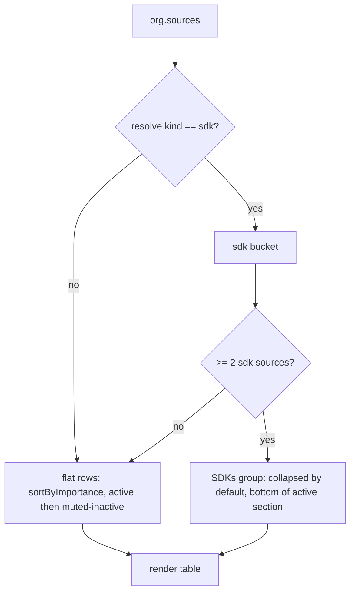

# SDK grouping on the org sources page

**Date:** 2026-05-21
**Issue:** [#1080](https://github.com/buildinternet/releases/issues/1080) — Source kind enum, follow-up "Web: `kind` chips on org/product pages"
**Status:** Design approved, pending implementation plan

## Goal

Make the org `/sources` page stop drowning its primary changelog under a wall of
per-language SDK rows. A multi-SDK org (Stripe, AWS, OpenAI…) lists every client
library as its own flat row, so the one platform changelog most visitors came for
competes with a dozen SDKs for attention. Fold the SDK family into a single
collapsible group, collapsed by default, so SDK churn is one tidy line instead of
N rows.

This is the first **user-facing** consumer of the `kind` enum (#1080 Phase A/B
shipped the data model, API filters, CLI flags, and the curated backfill that
classified every visible prod row). The data is classified and live; this is the
web surface catching up.

## Scope

**In scope:** A frontend-only change to the org `/sources` tab — grouping
`sdk`-kind sources into one collapsible block in `web/src/components/source-table.tsx`.

**Out of scope** (each its own later step under #1080):

- Kind chips / labels on non-SDK rows.
- Grouping by every kind (platform / tool / mobile / …). This cut is **SDK-only** by
  deliberate choice — it solves the named noise problem without imposing subheadings
  on every org. Generalizing to all kinds is a later decision if it proves useful.
- The releases-feed `?kind=` filter UI, the homepage / latest feed, and overview
  downweighting by kind.
- Any API, schema, or DB change.

## Blast radius

Zero backend change. `kind` already rides on the wire:

- `SourceListItem.kind` (`packages/api-types/src/schemas/sources.ts`) — present on
  `OrgDetail.sources[]`.
- `ProductListItem.kind` (`packages/api-types/src/schemas/products.ts`) — present on
  `OrgDetail.products[]`.

So `org.sources` and `org.products` (already passed into `SourceTable` from
`web/src/app/[orgSlug]/(org)/sources/page.tsx`) carry everything needed. Orgs with
no SDK sources render byte-for-byte identical to today.

## Membership: what counts as an SDK

A source joins the group when its **resolved** kind is `sdk`:

```
resolveSourceKind(source, product) === "sdk"
```

`resolveSourceKind` (from `@buildinternet/releases-core/kinds`) returns the source's
own `kind` if set, else the parent product's `kind`, else `null`. To do the
inheritance lookup we build a `productSlug → kind` map from the `products` prop and
resolve each source against its `productSlug`.

This matches the project-wide resolution rule (`source.kind` wins; inherit from
product when null) so the web surface agrees with the API's release-feed COALESCE
behavior.

## Threshold: when the group forms

The collapsible group only forms at **≥ 2** resolved SDK sources. With 0 or 1, the
SDK source(s) render as normal flat rows — a collapsible "group of one" is friction
with no payoff.

## Structure and placement



- **Non-SDK sources:** render exactly as today — flat, sorted by `sortByImportance`
  (primary first, then release count desc), active rows then muted-inactive rows.
- **SDKs group:** a single collapsible block placed at the **bottom of the active
  section**, just above the muted-inactive rows. Collapsed by default. This pushes
  SDK churn down so it never competes for the top of the list.

## Group header (no chips)

The header is a full-width row inside the same `<table>` (`<tr><td colSpan>`),
styled as a plain text subheading — **no color chip, no count badge**.

- **Collapsed:** subheading **SDKs** + a member preview + a `▸` caret.
  - Preview = member display names, ordered by release count desc, joined with
    `·`, on a single line, truncated with CSS `text-overflow: ellipsis`. No
    trailing "+N", no count — the line just clips to the column width.
  - Example: `SDKs   node · python · php · ruby · go · java · .NET   ▸`
- **Expanded:** subheading **SDKs** + a `▾` caret, then the SDK rows beneath in the
  existing indented row style, keeping every current column (Type, Product when the
  org has products, Releases, sparkline, Last update).

## Within-group ordering and inactive SDKs

- SDK rows are sorted by the existing `sortByImportance` (release count desc;
  primary-ness is irrelevant inside an SDK family but the comparator is reused
  as-is).
- **Inactive SDK sources** (`isInactive` → hidden / paused / 0 releases) are pulled
  _into_ the group and shown muted at its bottom, rather than scattered into the
  global inactive section. The SDK family stays whole as one collapsible unit.

## Interactivity

Expand/collapse is local React state and resets on navigation — no persistence in
this first cut.

`SourceTable` is currently a server component. Rather than make the whole table a
client component, extract **only** the collapsible block into a small
`"use client"` child — `SdkSourceGroup` — that owns the open/closed state and
renders the subheading `<tr>` plus its member `<tr>`s. The rest of the table stays
server-rendered. A client component rendering `<tr>` children inside a
server-rendered `<tbody>` is fine.

## Pure helper + testing

Factor the partitioning out of the React tree into a pure, unit-testable helper:

```ts
partitionSdkSources(
  sources: SourceListItem[],
  products: OrgDetail["products"],
): { flat: SourceListItem[]; sdk: SourceListItem[] }
```

It applies the resolve-kind lookup and the ≥2 threshold: when fewer than 2 SDK
sources resolve, they're returned in `flat` and `sdk` is empty (so the caller
renders no group). Tests cover:

- Membership via the source's own `kind`.
- Membership via inherited `product.kind` when `source.kind` is null.
- Threshold boundary: 1 SDK → flat; 2 SDK → grouped.
- A source with `kind: "sdk"` whose product is `platform` still groups (source wins).
- The preview string: ordering by release count, `·` join.

Component-level rendering (collapsed vs expanded, placement at bottom of active) can
be exercised against the helper output.

## Files

**Modify**

- `web/src/components/source-table.tsx` — partition sources, render the non-SDK flat
  rows as today, render the `SdkSourceGroup` block at the bottom of the active
  section.

**Create**

- `web/src/components/sdk-source-group.tsx` — `"use client"` collapsible block
  (subheading row + member rows + toggle). (Or co-locate in `source-table.tsx` if it
  stays small; the plan can decide.)
- A pure helper module for `partitionSdkSources` + its preview-string builder
  (location to be set in the plan — likely alongside `source-table.tsx` or in
  `web/src/lib/`).
- Tests for the helper.

## Open questions

None outstanding. Confirmed during design: SDK-only scope, treatment B (collapsible
groups) with plain text subheadings, member preview instead of count, bottom
placement, ≥2 threshold, inactive SDKs pulled into the group, no expand-state
persistence.
