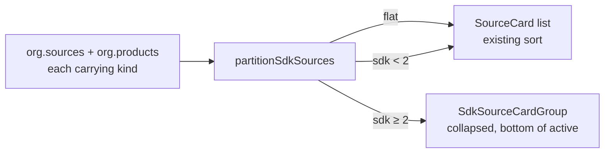
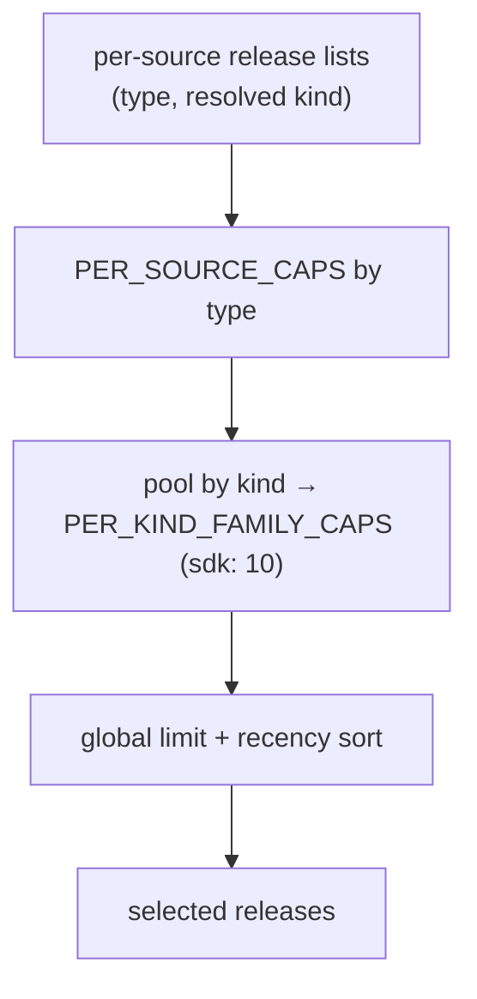

# SDK weighting: org overview page grouping + summary cap

**Date:** 2026-05-21
**Issue:** [#1080](https://github.com/buildinternet/releases/issues/1080) (source `kind` enum — Phase B follow-ups)
**Status:** Design — awaiting review

## Problem

An org that ships many SDKs lets that SDK churn dominate the surfaces meant to
summarize the org as a whole. The canonical changelog/blog (the high-signal
"what's new" source) gets weighted the same as each of N SDK repos, so it is
visually and semantically buried.

Concretely, on `releases.sh/posthog`:

- The **org overview page** renders the source-activity cards as a flat list
  (no products on PostHog), so `posthog-js` (698+ releases) sits as a peer
  _above_ the actual `PostHog Changelog` (4 releases). The SDK-grouping that
  shipped in #1116 only applies to the separate `/sources` **table**, not this
  page.
- The **AI-generated org overview** selects releases via
  `selectReleasesForOverview`, which caps _per source_ (`github: 10`) but not
  per _kind_. Ten SDK repos still feed ~100 SDK releases into the 50-release
  window and crowd the changelog out of the model's context.

This is the parked #1080 follow-up: _"Overview generation: downweight/cluster
releases by `kind` so SDK churn doesn't dominate the platform's overview."_

## Goal

Make a company's SDK family read as **one prominent voice** rather than N peers,
in two places:

1. **Display** — collapse loose SDK sources into one group on the org overview
   page, mirroring the #1116 `/sources` treatment.
2. **AI summaries** — cap the SDK family's collective contribution to overview
   generation so the changelog/platform releases survive into the model input.

Out of scope (deliberately deferred): reweighting the timeline chart / summary
stats, and system-wide feed/ranking down-ranking (homepage "latest", org
`.atom`, MCP `get_latest_releases`). Those change numbers/ordering people may
rely on and are tracked separately under #1080.

## Part 1 — SDK grouping on the org overview page (web-only)

No API change: `GET /v1/orgs/:slug` already emits each source's own `kind` and
each product's `kind` (shipped as the #1116 prerequisite), so `org.sources` and
`org.products` already carry what's needed. Reuses the generic helpers in
`web/src/lib/sdk-grouping.ts` (`partitionSdkSources`, `sdkPreview`,
`SDK_GROUP_MIN`).

### Where the list is rendered

`web/src/components/release-timeline.tsx` renders the source list two ways:

- **No products** → flat `SourceCard` list (`activeSources.map(...)`). This is
  PostHog's case (the screenshot).
- **Has products** → `ProductGroupedSources`, which splits into `grouped`
  (per-product) + `ungrouped` via `groupSourcesByProduct`.

### New component

`web/src/components/sdk-source-card-group.tsx` (`"use client"`).

The shipped `SdkSourceGroup` is bound to `<tr>/<td>` table markup and can't drop
into the card list's `<div className="space-y-2">`. The new component renders a
`<div>` disclosure header + `SourceCard` children, but **copies the #1116 a11y
decisions verbatim**:

- collapsed by default,
- chevron (`rotate-90` on open),
- stable `aria-label="N SDK source(s)"` with open/closed conveyed by
  `aria-expanded` — **no Expand/Collapse verb** (it double-speaks against the
  announced state; there's an inline comment in the original explaining this),
- `≥ SDK_GROUP_MIN` (2) threshold — a lone SDK stays a normal card,
- collapsed header shows `sdkPreview(sdk)` (member names, busiest first,
  `·`-joined).

> Rejected for this pass: extracting a shared headless hook and refactoring the
> table version to match. More churn against shipped, prod-verified code than
> this pass warrants. Filed as a follow-up instead.

### Placement & rule

Consistent across both branches (chosen over product-less-only): **loose SDK
sources collapse whether or not the org has products; SDK sources already inside
a product stay with their product** (a product is itself a cluster — desired).

- **No-products branch:** `partitionSdkSources(activeSources, products)` →
  render `flat` cards in existing sort order, then the collapsed SDK group at
  the bottom of the active list (mirrors #1116's "bottom of active" placement).
- **Products branch:** apply the same partition to the `ungrouped` remainder
  inside `ProductGroupedSources`; product groups themselves are untouched.

### Data flow



## Part 2 — kind-aware family cap in overview generation

`selectReleasesForOverview` (`packages/core/src/overview.ts`) is a pure function
that today applies `PER_SOURCE_CAPS` (keyed by adapter `type`) then a global
`limit`, sorted by recency. We add a per-**kind** family cap on top.

### Signature change (backward compatible)

```ts
selectReleasesForOverview(
  perSource: Array<{ type: Source["type"]; kind?: Kind | null; releases: Release[] }>,
  limit?: number,
): { releases: Release[]; totalAvailable: number }
```

`kind` is optional → untagged orgs and existing tests/callers that omit it are
unaffected (no family cap applies to entries without a capped kind).

### Cap semantics

New constant:

```ts
// The SDK family collectively contributes like a single source, so N SDK repos
// read as one prominent voice rather than N peers. Tunable; start at 10.
export const PER_KIND_FAMILY_CAPS: Partial<Record<Kind, number>> = { sdk: 10 };
```

Pipeline (order matters):

1. Apply existing `PER_SOURCE_CAPS[type]` per entry (unchanged).
2. **New:** pool the capped releases by resolved `kind`. For each kind present
   in `PER_KIND_FAMILY_CAPS`, sort that pool by `publishedAt` desc and keep only
   the most-recent N. Releases whose kind isn't in the map pass through.
3. Apply the global `limit` + recency sort (unchanged).
4. `totalAvailable` keeps reporting the true pre-cap total (for transparency in
   the inputs payload).

**Cap value (10) is a starting point**, tuned during implementation against a
real org (PostHog) by reading the generated overview.



### Threading resolved kind through both callers

Both callers currently select `{ id, slug, name, type }` only:

- `workers/api/src/routes/overview-inputs.ts` (the `GET …/overview/inputs`
  endpoint).
- `packages/core-internal/src/overview-eligibility.ts` →
  `fetchOverviewInputsForOrg` (the batch-overview workflow path).

Each adds `kind` + `productId` to the source select, fetches the org's products'
kinds (one small query), and computes
`resolveSourceKind(source, productById.get(source.productId))` per source,
passing the result into the `perSource` entries. `resolveSourceKind` already
encodes `source.kind ?? product.kind ?? null`.

## Testing

- **Pure function** (`tests/unit/overview-selection.test.ts`): 10 SDK sources +
  1 changelog → changelog releases survive into `selected`; null/undefined kind
  unchanged from current behavior; family of `< cap` is a no-op; `totalAvailable`
  unaffected by the family cap.
- **Web** (`tests/unit/sdk-grouping.test.ts` is already green for the lib):
  add coverage for placement in both `release-timeline` branches via
  `partitionSdkSources` (group appears at bottom of active in the flat branch;
  ungrouped SDK sources collapse in the products branch; `< 2` renders flat).
- **Manual smoke:** `releases.sh/posthog` shows the SDKs collapsed; regenerate
  PostHog's overview and confirm the changelog is represented (tune cap if not).

## Files touched

**Part 1 (web):**

- `web/src/components/sdk-source-card-group.tsx` — new `"use client"` group.
- `web/src/components/release-timeline.tsx` — partition + placement in the
  flat branch and the `ProductGroupedSources` ungrouped remainder.

**Part 2 (core + workers):**

- `packages/core/src/overview.ts` — `PER_KIND_FAMILY_CAPS`, extended signature,
  family-cap step.
- `workers/api/src/routes/overview-inputs.ts` — select `kind`/`productId`,
  resolve kind, pass through.
- `packages/core-internal/src/overview-eligibility.ts` — same threading in
  `fetchOverviewInputsForOrg`.

## Rollout

- Part 1 ships as a web deploy (auto on merge). Inert risk: only affects orgs
  with ≥2 loose SDK sources.
- Part 2 is a pure-function + read-endpoint change; it alters _future_ overview
  regenerations only (existing `knowledge_pages` are untouched until an org is
  re-run through the batch-overview workflow). No migration.
- `@buildinternet/releases-core` carries `PER_KIND_FAMILY_CAPS` + the new
  signature; the OSS CLI is an unaffected consumer (it doesn't call
  `selectReleasesForOverview`). A core version bump follows the usual release
  flow but isn't required for the in-repo workers, which consume `workspace:*`.
