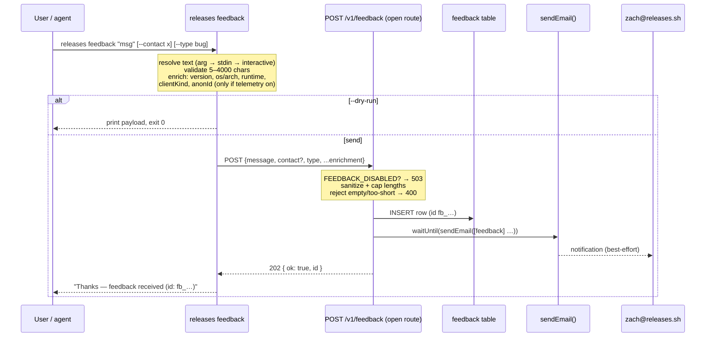

# 2026-05-22 — `releases feedback` CLI command + `/v1/feedback` backend

## Goal

Give CLI users (humans and agents) a one-line way to send free-text feedback
about the `releases` CLI / registry, persist it in D1, and notify
`zach@releases.sh` on arrival. Loosely modeled on
[ramp-cli's `feedback` command](https://github.com/ramp-public/ramp-cli/blob/06df3312be70400a63defdd1af5416d73a3fe7e5/src/ramp_cli/commands/feedback.py)
(single text arg → enriched → POST to a public endpoint), adapted to this
codebase's conventions.

Non-goals (this spec): a full triage/ticketing UI, web/MCP feedback surfaces,
status-mutation workflow, or threaded replies. See **Out of scope**.

## Prior art reused (do not reinvent)

| Concern                                             | Existing thing                                                                | Location                                                 |
| --------------------------------------------------- | ----------------------------------------------------------------------------- | -------------------------------------------------------- |
| Lightweight CLI → API → D1 POST                     | `telemetry` (open, unauthenticated POST → `telemetry_events`)                 | CLI `src/lib/telemetry.ts`, API `routes/telemetry.ts`    |
| Client-kind / version / os-arch enrichment          | `detectClientKind()`, `VERSION`                                               | CLI `src/lib/telemetry.ts`, `src/cli/version.ts`         |
| Anonymous local ID (opt-out aware)                  | `getOrCreateAnonId()`, `isTelemetryEnabled()`                                 | CLI `src/lib/telemetry.ts`                               |
| Interactive / stdin input                           | readline prompt + `Bun.stdin.text()`                                          | CLI `src/lib/input.ts`                                   |
| `--json` machine output                             | `writeJson()`                                                                 | CLI `src/lib/output.ts`                                  |
| Command registration                                | `registerXCommand(parent)`                                                    | CLI `src/cli/program.ts`                                 |
| Transactional email (fire-and-forget, non-throwing) | `sendEmail(env, {subject,text,html})`                                         | API `src/lib/email.ts`                                   |
| Recipient binding                                   | `EMAIL_NOTIFY_TO=zach@releases.sh`, `SEND_EMAIL`, `EMAIL_NOTIFY_ENABLED=true` | `workers/api/wrangler.jsonc`                             |
| Open-route mount                                    | `v1.route("/", telemetryRoutes)`                                              | API `src/v1-routes.ts`                                   |
| Rate-limit middleware                               | `publicRateLimitMiddleware`                                                   | API `src/index.ts`                                       |
| ID generators                                       | `new<Entity>Id = () => \`<prefix>\_${nanoid()}\``                             | `packages/core/src/id.ts`                                |
| Schema source of truth                              | Drizzle `sqliteTable` + raw-SQL migration                                     | `packages/core/src/schema.ts`, `workers/api/migrations/` |

This feature spans **two repos**: the monorepo (`~/Code/releases`) for schema,
migration, routes, and email; the OSS CLI (`~/Code/releases-cli`) for the two
commands.

## Architecture



The email send is on `c.executionCtx.waitUntil(...)`: it never blocks the 202
and never fails the submit. Insert success is the source of truth; a failed
email is logged (`logEvent`) and swallowed.

## CLI command — `src/cli/commands/feedback.ts`

Registered as a **top-level public command** (next to `telemetry`, `whoami`) in
`src/cli/program.ts` via `registerFeedbackCommand(program)`.

```
releases feedback [message]
```

**Text resolution** (first match wins):

1. Positional `[message]` arg.
2. Piped stdin — when `!process.stdin.isTTY`, read `Bun.stdin.text()`.
3. Bare invocation in a TTY — interactive readline prompt. Blank input cancels
   (exit 0, "Cancelled — no feedback sent.").

This keeps it non-interactive for agents/scripts (arg or pipe) while remaining
friendly for humans, matching the repo's `cli-for-agents` posture.

**Flags:**

| Flag                        | Behavior                                                                                                                                                                                        |
| --------------------------- | ----------------------------------------------------------------------------------------------------------------------------------------------------------------------------------------------- |
| `--contact <value>`         | Optional contact (freeform: email/handle/Slack). Capped 200 chars. **Not** email-validated — people paste handles. Interactive flow also asks a second optional "Contact (blank to skip)" line. |
| `--type <bug\|idea\|other>` | Optional category. Omitted → server defaults to `general`. Invalid value → CLI error before sending.                                                                                            |
| `--json`                    | Output `{ ok, id }` (or `{ ok: false, error }`) via `writeJson()`.                                                                                                                              |
| `--dry-run`                 | Print the resolved payload and exit 0 without POSTing.                                                                                                                                          |

**Validation (client-side, pre-send):** trim message; reject `< 5` chars
("Feedback is too short — add a sentence or two."); reject `> 4000` chars
("Feedback is too long (max 4000 chars).").

**Enrichment (auto):** `cliVersion` (`VERSION`), `os` (`process.platform`),
`arch` (`process.arch`), `runtime` (bun/node), `clientKind`
(`detectClientKind().kind` → external/internal-ci/agent), `surface: "cli"`, and
`anonId` — **included only when `isTelemetryEnabled()` is true**. If telemetry is
disabled or `DO_NOT_TRACK=1`, `anonId` is omitted, honoring that opt-out. The
free-text `message` and optional `contact` are the only user-identifying data,
both intentional.

**Send semantics:** foreground (unlike telemetry's fire-and-forget) — `await`
the POST with a ~10s `AbortController` timeout, because the user wants
confirmation. Uses a plain `fetch` to `${getApiUrl()}/v1/feedback` with
`User-Agent: RELEASES_CLI_UA` (no auth header needed; endpoint is open). On
2xx: `Thanks — feedback received (id: fb_…)`. On failure (timeout / non-2xx /
network): friendly stderr message + fallback hint to open an issue at
`github.com/buildinternet/releases-cli/issues`, exit 1. `--json` mirrors both
outcomes.

> Implementation note: prefer a small direct `fetch` here rather than `apiFetch`
> from `src/api/client.ts`, since `apiFetch` injects the mutation-audit log and
> auth header machinery that an anonymous open POST doesn't want. Mirror the
> shape of `recordEvent()` in `src/lib/telemetry.ts`.

## API route — `workers/api/src/routes/feedback.ts`

`feedbackRoutes.post("/feedback", …)`, mounted as an **open, unauthenticated
route** in `src/v1-routes.ts` (`v1.route("/", feedbackRoutes)`), exactly like
`telemetryRoutes`. Anonymous CLI users must be able to submit.

Differences from telemetry (this carries free text → higher abuse surface):

- **Rate limit:** wrap the path with `publicRateLimitMiddleware` in
  `src/index.ts` (telemetry isn't rate-limited; free-text submit is a spam
  vector). Add a dedicated `v1.use("/feedback", publicRateLimitMiddleware, dbHealthCheck)`
  before the v1 mount, mirroring the `graphqlRoutes` dedicated-middleware pattern.
- **Kill switch:** `FEEDBACK_DISABLED` env (string `"true"`) → handler returns
  `503 { error: "feedback_disabled" }` early. Matches the repo's
  `SEARCH_QUERY_LOG_DISABLED` convention. Add to `workers/api/wrangler.jsonc`
  (default `"false"`) and to the `Env` type in `src/index.ts`.

**Handler:**

1. Kill-switch check → 503.
2. Parse JSON; invalid → `400 { error: "invalid_json" }`.
3. Sanitize via existing `sanitizeString`/`sanitizeInt`:
   - `message`: required, trim, **min 5 / max 4000** → empty/short → `400 { error: "message_required" }`.
   - `contact`: optional, cap 200.
   - `type`: validate against `FEEDBACK_TYPES` (`["bug","idea","other","general"]`),
     fallback `"general"`.
   - `cliVersion` cap 32, `clientKind` validated against the telemetry kinds set
     (reuse `TELEMETRY_CLIENT_KINDS`), `anonId` cap 64, `os`/`arch`/`runtime`/`surface` cap 64.
4. `INSERT` row (`id = newFeedbackId()`, `createdAt = Date.now()`,
   `status = "new"`).
5. `c.executionCtx.waitUntil(notifyFeedback(c.env, row))` — best-effort email.
6. Return `202 { ok: true, id }`.

Outside the **OpenAPI coverage gate** (not under a `publicReadRoutes` prefix —
same as `telemetry`). No `describeRoute` required, though a lightweight one is
welcome.

### Email notification

A pure formatter + thin sender, kept testable:

```ts
// workers/api/src/lib/feedback-email.ts
export function formatFeedbackEmail(row: FeedbackRow): { subject: string; text: string };
export async function notifyFeedback(env: EmailEnv, row: FeedbackRow): Promise<void>;
```

- **Subject:** `[feedback] ${type}: ${truncate(message, 60)}` — `[feedback]`
  prefix mirrors `send-alert.ts`'s `[alert]` so inbox filters work.
- **Body (text):** full `message`, then a metadata block — `contact` (or
  "(none)"), `type`, `id`, `cliVersion`, `clientKind`, `os/arch`, `runtime`,
  `anonId`, `createdAt` (ISO).
- `notifyFeedback` calls `sendEmail(env, { subject, text })` (recipient defaults
  to `EMAIL_NOTIFY_TO`), logs the `{sent:false, reason}` outcome via `logEvent`,
  never throws. Automatically respects `EMAIL_NOTIFY_ENABLED` on top of
  `FEEDBACK_DISABLED`.
- No HTML part for v1 (plain text is enough for an internal notification).

## Schema + migration

**`packages/core/src/schema.ts`** — new `feedback` table (mirror the
`telemetryEvents` block's style):

| Column                    | Type                                   | Notes                              |
| ------------------------- | -------------------------------------- | ---------------------------------- |
| `id`                      | `text` pk, `$defaultFn(newFeedbackId)` | `fb_` prefix                       |
| `created_at`              | `integer` notNull                      | ms epoch                           |
| `message`                 | `text` notNull                         | free text                          |
| `contact`                 | `text` null                            | optional                           |
| `type`                    | `text` notNull default `'general'`     | bug/idea/other/general             |
| `status`                  | `text` notNull default `'new'`         | new/triaged/closed (triage handle) |
| `cli_version`             | `text` null                            |                                    |
| `client_kind`             | `text` notNull default `'external'`    |                                    |
| `anon_id`                 | `text` null                            | present only if telemetry on       |
| `os` / `arch` / `runtime` | `text` null                            |                                    |
| `surface`                 | `text` notNull default `'cli'`         | future web/MCP feedback            |

Indexes: `idx_feedback_created (created_at)`,
`idx_feedback_status_created (status, created_at)`,
`idx_feedback_anon (anon_id)`.

Export `Feedback` / `NewFeedback` inferred types and a
`FEEDBACK_TYPES = ["bug","idea","other","general"] as const`.

**`packages/core/src/id.ts`** — add `export const newFeedbackId = () => \`fb\_${nanoid()}\`;`

**`workers/api/migrations/20260522010000_add_feedback.sql`** — raw `CREATE TABLE`

- the three `CREATE INDEX` statements, matching the Drizzle definition exactly.
  Purely additive (new table). Auto-applies on merge per repo convention; flag for
  explicit go-ahead at prod-deploy time. Test against staging with
  `bunx wrangler d1 migrations apply DB --env staging --remote --config workers/api/wrangler.jsonc`
  (records the `d1_migrations` row), **not** raw `d1 execute`.

## Admin read-back

Feedback must not be write-only (you chose "query/triage via an admin command").

**API:** `GET /v1/admin/feedback` — admin-gated. Add `"admin/feedback"` to the
`adminRoutes` array in `workers/api/src/route-namespaces.ts` (auto-wires
`authMiddleware`). New `routes/admin-feedback.ts`. Cursor-paginated (newest
first by `(created_at, id)`, matching the feed-shaped cursor convention),
optional `?status=` and `?type=` filters, `?limit=` (default 50, cap 200).
Returns `{ items: FeedbackRow[], nextCursor: string | null }`.

**CLI:** `releases admin feedback list` — under the `admin` subtree (inherits
the admin gate). `registerFeedbackAdminCommand(admin)` in `program.ts`.
Options: `--status <s>`, `--type <t>`, `--limit <n>`, `--json`, `--cursor <c>`.
Renders a table (id, created, type, status, contact, truncated message) via the
existing `render/table.ts` helper; `--json` passes through.

**Deferred:** status-mutation (triage) endpoint/command — v1 is submit + list.

## Wire contract / api-types

Keep it lightweight, matching telemetry (which builds its body inline and does
not round-trip through `@buildinternet/releases-api-types`). The CLI defines the
request body inline and types the response as `{ ok: boolean; id: string }`. We
do **not** add new exported shapes to `api-types` for v1; if the admin-list
response is consumed beyond the CLI later, promote `FeedbackRow` then.

## Privacy & abuse

- **Privacy:** Only `message` + optional `contact` are user-identifying, both
  intentional. `anonId` omitted when telemetry is opted out. Distinct from
  `telemetry_events`, which stays PII-clean — feedback is a separate table with
  no such contract. Document the distinction in a code comment on the table.
- **Abuse:** open endpoint ⇒ `publicRateLimitMiddleware` + length caps +
  `FEEDBACK_DISABLED` kill switch. No per-anon daily cap in v1 (rate limit +
  caps suffice); revisit if abused.

## Testing

- **CLI unit tests** (`tests/unit/feedback.test.ts`): text resolution precedence
  (arg > stdin > interactive), validation bounds (4 / 5 / 4000 / 4001 chars),
  `--dry-run` prints-and-doesn't-send, `--json` output shape, `anonId` omitted
  when telemetry disabled. Mock `fetch`.
- **API route tests** (`workers/api/test/feedback.test.ts`): kill switch → 503,
  invalid JSON → 400, missing/short message → 400, happy path → 202 + row
  inserted, type fallback to `general`, length caps. Use the in-process route
  smoke pattern (`routes.request(path, init, env)`) with a `createTestDb()` D1
  and a fake `SEND_EMAIL` binding (`{ send: async () => {} }`) to assert
  `notifyFeedback` is invoked without sending real mail.
- **Email formatter test**: `formatFeedbackEmail` subject truncation + body
  fields (pure function, no bindings).
- **Admin-list test**: pagination cursor + `status`/`type` filters.
- Gates: root `npx tsc --noEmit`, `workers/api` tsc, `bun test`, `bun run lint`,
  `bun run format:check` (both repos).

## File-by-file change list

**Monorepo (`~/Code/releases`):**

- `packages/core/src/schema.ts` — `feedback` table + types + `FEEDBACK_TYPES`.
- `packages/core/src/id.ts` — `newFeedbackId`.
- `workers/api/migrations/20260522010000_add_feedback.sql` — new table + indexes.
- `workers/api/src/routes/feedback.ts` — open POST handler.
- `workers/api/src/routes/admin-feedback.ts` — admin GET list.
- `workers/api/src/lib/feedback-email.ts` — `formatFeedbackEmail` + `notifyFeedback`.
- `workers/api/src/v1-routes.ts` — mount `feedbackRoutes` + `adminFeedbackRoutes`.
- `workers/api/src/route-namespaces.ts` — add `"admin/feedback"` to `adminRoutes`.
- `workers/api/src/index.ts` — `Env.FEEDBACK_DISABLED`; dedicated
  `publicRateLimitMiddleware` on `/feedback`.
- `workers/api/wrangler.jsonc` — `FEEDBACK_DISABLED: "false"` (prod + staging blocks).
- Tests as above.

**OSS CLI (`~/Code/releases-cli`):**

- `src/cli/commands/feedback.ts` — `registerFeedbackCommand` (submit) +
  `registerFeedbackAdminCommand` (admin list).
- `src/cli/program.ts` — register both (public submit; admin list under `admin`).
- `tests/unit/feedback.test.ts`.
- `.changeset/*.md` — bump `@buildinternet/releases` (per CLI changeset convention).
- README / help text mention if warranted.

## Out of scope (follow-ups)

- Triage status mutation (`releases admin feedback resolve <id>`) + endpoint.
- Web / MCP feedback surfaces (the `surface` column future-proofs this).
- HTML email + threaded replies.
- Per-anon daily submission cap.
- Promoting feedback shapes into `@buildinternet/releases-api-types`.

## Open defaults (reversible)

- Min/max message length **5 / 4000**.
- `--type` retained (cheap triage signal); server default `general`.
- Admin-list **included** in v1; status mutation deferred.
- `anonId` attached only when telemetry enabled.
