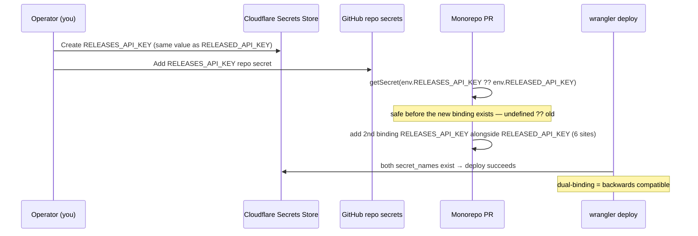

# Standardize `RELEASED_` → `RELEASES_` environment variables

**Date:** 2026-05-22
**Status:** Approved — implementation authorized
**Scope:** Monorepo (`buildinternet/releases`) + OSS CLI (`buildinternet/releases-cli`)

## Problem

The project was originally "Released". A handful of environment variables still
carry the legacy `RELEASED_` prefix, while newer vars (`RELEASES_PROXY_KEY`,
`RELEASES_INDEX`, `RELEASES_API_KEY_ADMIN`, `RELEASES_RUN_DIR`, …) already use
`RELEASES_`. The result is an inconsistent surface that confuses operators and
contributors and undermines the rename the rest of the product completed.

We want to **standardize on `RELEASES_`** across both repos while keeping the old
`RELEASED_` names working during a transition window, then retire the legacy
names in a tracked follow-up.

This supersedes the AGENTS.md "Legacy naming" guidance that env vars deliberately
keep the `RELEASED_` prefix. (Cloudflare _resource_ names — D1 `released-db`, R2
`released-media` — and the historical store `secret_name` remain documented as
deliberate; only the env-var/binding surface is being standardized.)

## Decisions (locked)

1. **Full rename now.** The canonical name for the static root API token becomes
   `RELEASES_API_KEY` end-to-end: Cloudflare Secrets Store secret, GitHub Actions
   repo secret, worker binding, and all code reads. The operator (repo owner)
   creates the new store secret + GitHub secret; this spec sequences the code so
   no deploy ever references a secret that doesn't exist yet.
2. **Warn on fallback.** Code prefers the `RELEASES_` var silently. When only the
   legacy `RELEASED_` var is present, it is still honored but emits a one-time
   deprecation notice (stderr via the logger in CLI/scripts, `logEvent('warn')`
   in workers, `console.warn` in the web app).
3. **All live vars in scope.** Every `RELEASED_` var with a real code/config read
   in either repo is migrated. The dead `RELEASED_DISCOVERY_URL` (no consumer) is
   dropped from docs/templates rather than shimmed.

## Backwards-compat mechanism

A small **`legacyEnv(canonical, legacy)` helper per runtime** is the single place
the fallback + warn-once logic lives. It returns the new value if set; otherwise,
if the legacy value is set, it warns once (keyed on the legacy name in a
module-level `Set`) and returns it; otherwise `undefined`/the caller's default.

| Runtime              | Reads          | Logger                                               | Helper home                                 |
| -------------------- | -------------- | ---------------------------------------------------- | ------------------------------------------- |
| Node / CLI / scripts | `process.env`  | `@buildinternet/releases-lib/logger`                 | `packages/lib/src/legacy-env.ts` (per repo) |
| Workers              | `env` bindings | `logEvent('warn', …)` from `@releases/lib/log-event` | worker-safe picker (see below)              |
| Web (Next.js)        | `process.env`  | `console.warn`                                       | `web/src/lib/env.ts`                        |

**Workers:** the API token is read through a Secrets Store _binding_, not
`process.env`. During the transition both bindings (`RELEASES_API_KEY` and
`RELEASED_API_KEY`) are present, so call sites read
`getSecret(env.RELEASES_API_KEY ?? env.RELEASED_API_KEY)`. Because both bindings
resolve in prod, the warn path effectively never fires there (no log noise); it
exists to cover dev shells that set only one. A tiny worker-safe picker
(`pickLegacyBinding(primary, legacy, { event, legacyName })`) centralizes the
`??` + optional `logEvent` so the pattern is uniform; given dual-binding it is
mostly cosmetic and may be inlined where a helper import is awkward.

**Web:** the app has ~15 scattered `process.env.RELEASED_API_URL` reads plus
`RELEASED_API_KEY`, `RELEASED_BASE_URL`, `RELEASED_DEV_MODE`. Rather than 25
inline fallbacks, funnel them through small accessors in `web/src/lib/env.ts`
(`apiBaseUrl()`, `serverApiKey()`, `staticBaseUrlEnv()`, `devModeEnabled()`) so
the fallback + warn lives once. Existing chokepoints (`web/src/lib/api.ts`,
`web/src/lib/base-url.ts`) adopt the accessors; route handlers import from there
instead of reading `process.env` directly.

## The secret (full rename, safe rollout)

A Secrets Store binding fails to deploy if its `secret_name` does not exist in the
store. All three workers (api, mcp, discovery), prod + staging — **6 binding
sites total** — reference one shared store (`store_id a887a71cab084105b79706df23380723`).
The ordering below never breaks prod:

**Step 1 (operator, prerequisite for the wrangler hunk):** create
`RELEASES_API_KEY` in the store with the same value as the existing
`RELEASED_API_KEY`; add a `RELEASES_API_KEY` GitHub Actions repo secret.

**Step 2 (code, ships any time):** all reads become
`env.RELEASES_API_KEY ?? env.RELEASED_API_KEY`. This is harmless before the new
binding exists — `env.RELEASES_API_KEY` is simply `undefined` and the read falls
back to the old binding.

**Step 3 (wrangler, after Step 1):** add a second `secrets_store_secrets` entry
`{ binding: "RELEASES_API_KEY", store_id: …, secret_name: "RELEASES_API_KEY" }`
alongside the existing `RELEASED_API_KEY` entry in all 6 blocks. Type the new
binding on each worker's `Env`.

**Step 4 (follow-up issue, after soak):** remove the old `RELEASED_API_KEY`
binding, the `?? env.RELEASED_API_KEY` fallback, and the old store + GitHub
secret. Tracked as a separate teardown issue, not part of this PR.

**GitHub Actions:** in `deploy-workers.yml`, the webhook e2e smoke test becomes
`RELEASES_API_KEY: ${{ secrets.RELEASES_API_KEY || secrets.RELEASED_API_KEY }}`
and the script reads `RELEASES_API_KEY`. The `||` keeps the job green whether or
not the new GH secret exists yet. `RELEASED_API_URL` there is a plain value, not a
secret — just rename the env key to `RELEASES_API_URL`.

## Variable-by-variable treatment

### Monorepo

| Var                                                                                                                                                         | Sites                                                                                                                                                                                                                        | Treatment                                                                                                                                                            |
| ----------------------------------------------------------------------------------------------------------------------------------------------------------- | ---------------------------------------------------------------------------------------------------------------------------------------------------------------------------------------------------------------------------- | -------------------------------------------------------------------------------------------------------------------------------------------------------------------- |
| `RELEASED_API_KEY`                                                                                                                                          | secret binding (6×), `packages/lib/src/config.ts`, web, scripts, `workers/discovery/src/managed-agents-session.ts`, `workers/mcp/src/auth.ts`, `workers/api/src/middleware/auth.ts`, `src/agent/managed-discovery.ts`, tests | dual binding + worker `??` picker; `legacyEnv` in `config.ts`/scripts; web accessor; test fixtures updated to new name (a few keep an explicit legacy-fallback test) |
| `RELEASED_API_URL`                                                                                                                                          | `workers/discovery/wrangler.jsonc` `vars`, web (~15), scripts, GHA env, `package.json` `preview:web`                                                                                                                         | wrangler `vars` rename (atomic, no ops) with worker `??`; web accessor; `legacyEnv` in `config.ts`/scripts; GHA key rename; `package.json` script updated            |
| `RELEASED_DATA_DIR`                                                                                                                                         | `packages/lib/src/config.ts`, `drizzle.config.ts`, `workers/discovery/Dockerfile`                                                                                                                                            | `legacyEnv`; Dockerfile `ENV RELEASES_DATA_DIR=/app/data`                                                                                                            |
| `RELEASED_INGEST_MODEL`, `RELEASED_QUERY_MODEL`, `RELEASED_AGENT_MODEL`, `RELEASED_SUMMARY_MODEL`, `RELEASED_GROUPING_MODEL`, `RELEASED_WORKER_AGENT_MODEL` | `packages/lib/src/config.ts`, `scripts/sync-agent-skills.ts`                                                                                                                                                                 | `legacyEnv`                                                                                                                                                          |
| `RELEASED_STAGING_API_URL`                                                                                                                                  | `scripts/run-eval-task.ts`                                                                                                                                                                                                   | `legacyEnv`                                                                                                                                                          |
| `RELEASED_BASE_URL`                                                                                                                                         | `web/src/lib/base-url.ts` (3)                                                                                                                                                                                                | web accessor                                                                                                                                                         |
| `RELEASED_DEV_MODE`                                                                                                                                         | web (`local-admin-flag.ts` etc.)                                                                                                                                                                                             | web accessor                                                                                                                                                         |
| `RELEASED_INSTALL_DIR`                                                                                                                                      | `scripts/install.sh`                                                                                                                                                                                                         | `INSTALL_DIR="${RELEASES_INSTALL_DIR:-${RELEASED_INSTALL_DIR:-/usr/local/bin}}"`                                                                                     |
| `RELEASED_DISCOVERY_URL`                                                                                                                                    | `.env` only — no code consumer                                                                                                                                                                                               | **drop** from docs/`.env.example`; nothing to shim                                                                                                                   |
| `RELEASED_TELEMETRY_DISABLED`                                                                                                                               | docs only in this repo (impl is in CLI)                                                                                                                                                                                      | docs → `RELEASES_TELEMETRY_DISABLED`                                                                                                                                 |

### CLI (separate repo, separate PR + changeset)

| Var                                                                                                    | Sites                                                                                                   | Treatment                                                                                                                           |
| ------------------------------------------------------------------------------------------------------ | ------------------------------------------------------------------------------------------------------- | ----------------------------------------------------------------------------------------------------------------------------------- |
| `RELEASED_API_KEY`                                                                                     | `src/lib/mode.ts`, error/warn strings, `src/cli/commands/auth.ts`, `src/index.ts`, `src/cli/program.ts` | `legacyEnv`; user-facing strings updated to `RELEASES_API_KEY`                                                                      |
| `RELEASED_API_URL`                                                                                     | `src/lib/mode.ts`, `src/lib/telemetry.ts` (duplicate read)                                              | route `telemetry.ts` `endpoint()` through `getApiUrl()` so the fallback lives once in `mode.ts`                                     |
| `RELEASED_DATA_DIR`                                                                                    | `packages/lib/src/config.ts`                                                                            | `legacyEnv`                                                                                                                         |
| `RELEASED_TELEMETRY_DISABLED`                                                                          | `src/lib/telemetry.ts`                                                                                  | `legacyEnv`; user-facing strings updated                                                                                            |
| `RELEASED_CLIENT_KIND`, `RELEASED_CLIENT_SESSION_ID`, `RELEASED_CLIENT_AGENT`, `RELEASED_CLIENT_MODEL` | `src/lib/telemetry.ts`, `src/cli/completion/hint.ts`                                                    | `legacyEnv` (consumer-only; the managed-agent **vault** is the external producer and flips later — fallback decouples the ordering) |
| `RELEASED_DISCOVERY_ENGINE`                                                                            | `src/cli/commands/onboard.ts`                                                                           | `legacyEnv`                                                                                                                         |
| `RELEASED_INSTALL_DIR`                                                                                 | README only (script hosted at `releases.sh/install`, sourced from monorepo `scripts/install.sh`)        | docs → `RELEASES_INSTALL_DIR`                                                                                                       |

### Env files

`.env`, `web/.env.local` (gitignored, real secrets) are **not** edited — the owner
has already mirrored both prefixes locally. The tracked templates `.env.example`
and `web/.env.example` are updated to the new names (legacy names dropped from
templates; the running code still honors them via fallback).

## Cross-repo coupling

- The monorepo's managed-agent **vault** (external Anthropic config, not in either
  repo) injects `RELEASED_CLIENT_*` into the CLI subprocess. The CLI is a pure
  consumer; its fallback means the CLI works whether the vault still sets
  `RELEASED_CLIENT_*` or has switched to `RELEASES_CLIENT_*`. Flipping the vault is
  an out-of-repo ops change tracked alongside the teardown follow-up.
- `src/agent/managed-discovery.ts` (local dev path) and the discovery worker both
  read the API URL/key; both are covered by the `legacyEnv`/binding plan above.

## PR / rollout strategy

- **Monorepo PR** — branch → PR; auto-deploys on merge. The code fallback,
  non-secret renames, web accessors, scripts, GHA `||`, templates, and docs are
  deploy-safe immediately. The wrangler dual-binding hunk is a **merge
  precondition**: the PR body states the operator must first create the
  `RELEASES_API_KEY` store secret + GitHub repo secret. (Optionally land the
  code-fallback commits first and add the wrangler hunk last.)
- **CLI PR** — in `~/Code/releases-cli`, separate PR, changeset targeting
  `@buildinternet/releases` (the fixed group cascades to the published packages).
  No infra coupling — ships independently.
- **AGENTS.md** "Legacy naming" section rewritten: env vars move off the
  "deliberately kept" list and into "standardized to `RELEASES_`, legacy honored
  via fallback until the teardown follow-up"; `released-db` / `released-media` and
  the store-secret history stay documented as deliberate.

## Verification

- **Monorepo:** `npx tsc --noEmit` (root + each worker), `bun test`,
  `bun run lint`, `bun run format:check`. Plus a grep gate: no `process.env.RELEASED_`
  or `env.RELEASED_` reads remain **outside** the `legacyEnv` helper, the worker
  `??` picker sites, and the wrangler dual-binding entries.
- **CLI:** `bun test --isolate` (the isolate flag is required — see repo memory),
  type-check. Manual smoke: `RELEASED_API_KEY` still authenticates _and_ prints
  the deprecation notice; `RELEASES_API_KEY` authenticates with no notice.
- **Deprecation visibility:** confirm the warn-once fires exactly once per process
  for a given legacy var (not per read).

## Out of scope (follow-up issue)

- Removing the legacy `RELEASED_*` bindings, the `?? RELEASED_*` fallbacks, the old
  Cloudflare store secret, and the old GitHub repo secret after a soak period.
- Flipping the managed-agent vault to inject `RELEASES_CLIENT_*`.
- Renaming Cloudflare _resources_ (`released-db`, `released-media`) — explicitly
  retained.
