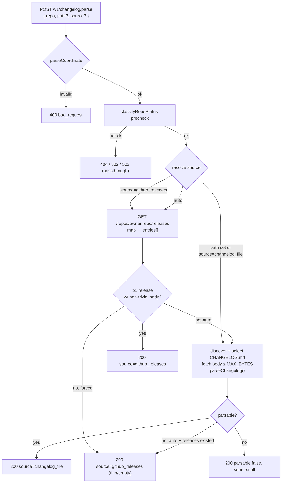

# On-demand changelog — structured releases for any repo, without persistence

**Date:** 2026-05-23
**Status:** Design — approved, pending spec review
**Sibling of:** `039e917a` (`POST /v1/changelog/fetch`, experimental no-persistence inventory)

## Problem

`POST /v1/changelog/fetch` (#1123) discovers every CHANGELOG file in a GitHub
repo and returns an inventory with raw ~2 KB excerpts. The excerpt is unparsed
markdown — a caller asking "what releases are in this changelog?" still has to
parse it themselves, and the answer differs in shape from an indexed release
served by `GET /v1/releases/:id`.

We want a coordinate-driven endpoint that returns a repo's changelog as
**structured release entries in the same shape as our stored releases** —
whether or not we've indexed that repo.

The motivation is **utility and consistency, not backfill.** We track on the
order of a hundred orgs; there is a whole universe of repos we don't. An agent
(via CLI/MCP) or a person should be able to ask "what's the changelog for
`owner/repo`?" knowing nothing more than the coordinate, and get a consistent
structured answer in seconds — the only difference for an un-indexed repo being
a little latency, not a different (or absent) answer. The eventual front-end is
a Mintlify-style web route (`/gh/owner/repo`) that renders any public repo's
changelog as a clean changelog page, so people don't have to go spelunking
through GitHub. This spec defines the JSON contract underneath that.

Indexed releases are produced by an AI extraction pass; that costs tokens and
adds latency. This endpoint instead resolves changelogs **deterministically**
from two structured-or-near-structured sources, so the common case is free and
fast.

## Scope

**In:** a single repo coordinate per call resolved to one changelog from the
best available **deterministic** source — GitHub Releases (already structured)
or a parsed `CHANGELOG.md` — returned as release entries in the stored-release
shape, with a `source` discriminator. No persistence.

**Out (v1):** AI fallback for repos with neither source, fan-out across every
file in a monorepo, persistence of any kind, the `type: "rollup"` classification
(AI-only), per-change `media` extraction, typed section breakdowns, and the web
`/gh/...` route itself (this is its JSON contract; the rendered page is a
follow-up).

## Decisions (locked during brainstorming)

1. **Utility/presentation surface, not an ingest tier.** This is deliberately a
   read-only path that _presents_ a repo's changelog. It is **not** a cheaper
   feeder into the AI ingest pipeline, and is not reconciled against indexed
   releases — keeping the two cleanly separate avoids a "two sources of truth
   disagree" problem. (If a deterministic ingest tier is ever wanted, that's a
   separate, conscious decision with its own validation.)
2. **Deterministic only.** No Claude calls. A repo with neither a usable GitHub
   Releases feed nor a parseable `CHANGELOG.md` returns `parsable: false` with
   `releases: []`.
3. **Two deterministic sources, one shape, prefer-one-fallback.** GitHub
   Releases and `CHANGELOG.md` both resolve into the same
   `ParsedChangelogRelease[]`. A single `source` answers per response (no
   per-entry merge/dedup — that would reintroduce reconciliation). Resolution
   order in `auto` mode (the default): prefer GitHub Releases when it yields ≥1
   release with a non-trivial body; else a parseable `CHANGELOG.md`; else any
   releases that exist (even thin); else `parsable: false`.
4. **Mirror the stored release shape.** Each entry carries the parse-relevant
   subset of `ReleaseDetailResponseSchema`. AI-only fields (`summary`,
   `titleGenerated`, `titleShort`) are always `null`; `media` is always `[]`.
5. **New endpoint, coordinate input only.** `POST /v1/changelog/parse`
   `{ repo, path?, source? }`. Not an extension of `/changelog/fetch` — that
   endpoint only downloads a 2 KB excerpt for the first 20 files, incompatible
   with full resolution. `/fetch` stays the lightweight inventory scout.
6. **`type` is always `"feature"`.** `RELEASE_TYPES` is `["feature", "rollup"]`
   — an entry-level "ordinary release vs. seasonal rollup" distinction, _not_
   feature/fix/security. Deterministic resolution can't identify a rollup, so
   every entry is `"feature"`, exactly as a stored bugfix release is. (The
   GitHub Releases API has no rollup concept either.) The fix/feature/security
   signal lives in the `### Added`/`### Fixed`/`### Security` subheadings inside
   `content`; a structured `sections`/`kinds` breakdown was considered and
   deferred.

## Inputs

```jsonc
{
  "repo": "owner/repo", // required; also accepts "github:owner/repo"
  "path": "packages/x/CHANGELOG.md", // optional; forces the changelog_file source at this path
  "source": "auto", // optional; "auto" (default) | "github_releases" | "changelog_file"
}
```

- `path` implies `source: "changelog_file"` (you're naming a file), and lets a
  caller target a specific monorepo workspace changelog.
- `source` is an escape hatch to force one resolver; `auto` applies the
  prefer-one-fallback order from decision #3.

## Architecture

The release-producing logic is **pure and runtime-neutral**, in
`@buildinternet/releases-core`: `parseChangelog()` for markdown and
`mapGitHubReleases()` for the API shape, both emitting `ParsedChangelogRelease[]`.
The worker route owns only fetch + auth + resolution-order plumbing. This keeps
the producers unit-testable in isolation and reusable by the CLI (which consumes
core) so it can fetch + resolve client-side too.



### Pure producers (core)

New `packages/core/src/changelog-parse.ts`, exported as
`@buildinternet/releases-core/changelog-parse`. Lives beside `changelog-slice.ts`
and reuses its `findHeadings`, plus `isPrereleaseVersion` from `prerelease.ts`.

```ts
export interface ParsedChangelogRelease {
  version: string | null;
  type: "feature"; // deterministic default; never "rollup"
  title: string; // version (file) or release name (GH)
  content: string; // markdown body, trimmed
  url: string | null; // version-link href (file) / html_url (GH)
  publishedAt: string | null; // ISO date; authoritative from GH, parsed from file
  prerelease: boolean; // GH: authoritative flag; file: isPrereleaseVersion(version)
  summary: null; // AI-only — shape parity
  titleGenerated: null; // AI-only
  titleShort: null; // AI-only
  media: []; // not extracted in v1
}

export interface ParseChangelogResult {
  parsable: boolean;
  format: "keep-a-changelog" | "conventional" | "plain" | "unknown";
  releases: ParsedChangelogRelease[];
  headingsScanned: number;
  skipped: number; // Unreleased / version-less headings
}

export function parseChangelog(markdown: string): ParseChangelogResult;

/** Minimal structural shape of a GitHub Releases API row — avoids a core→adapters dep. */
export interface GitHubReleaseLike {
  tag_name: string;
  name: string | null;
  body: string | null;
  html_url: string;
  published_at: string | null;
  prerelease: boolean;
}

export function mapGitHubReleases(releases: GitHubReleaseLike[]): ParsedChangelogRelease[];
```

#### `parseChangelog` (the `changelog_file` source)

**Anchor.** Split on `##` headings whose text begins with a version-ish token.
Covers the dominant conventions:

| Convention                                | Heading example                                                           | `format`           |
| ----------------------------------------- | ------------------------------------------------------------------------- | ------------------ |
| Keep a Changelog                          | `## [1.4.0] - 2026-05-01`                                                 | `keep-a-changelog` |
| conventional-changelog / semantic-release | `## [1.4.0](https://github.com/o/r/compare/v1.3.0...v1.4.0) (2026-05-01)` | `conventional`     |
| conventional (no link)                    | `## 1.4.0 (2026-05-01)`                                                   | `conventional`     |
| plain tag                                 | `## v1.4.0` / `## 1.4.0`                                                  | `plain`            |

Per-entry extraction:

- **version** — first bracket/paren-stripped token after optional leading `v`.
- **url** — the href if the version is a markdown link `[ver](href)`, else `null`.
- **publishedAt** — an ISO `YYYY-MM-DD` found in the heading (after a `-`
  separator or inside `(...)`), else `null`. No fuzzy date parsing in v1; a
  non-ISO date is left `null` rather than guessed.
- **prerelease** — `isPrereleaseVersion(version)`.
- **content** — markdown from after the heading line up to the next `##` (or
  EOF), trimmed.
- **title** — the version string.

`parsable` is `true` when ≥1 `##` heading yields a recognizable version;
`format` reports the matched family, `"unknown"` when nothing parsed. A prose
release-notes file returns `parsable: false, releases: [], format: "unknown"`.
`## [Unreleased]` and version-less headings are skipped and counted in `skipped`.

#### `mapGitHubReleases` (the `github_releases` source)

Maps the GitHub Releases API rows (reference shape in
`packages/adapters/src/github.ts`'s `GitHubRelease`) straight into entries — no
parsing needed, the API is already structured:

- **version** ← `tag_name`; **title** ← `name || tag_name`; **content** ←
  `body ?? ""`; **url** ← `html_url`; **publishedAt** ← `published_at`
  (already ISO); **prerelease** ← `prerelease` (authoritative). `format` is not
  applicable to this source (response carries `format: null`).

### Worker route

Add a handler to the existing `workers/api/src/routes/changelog.ts`, sibling to
`/changelog/fetch`. Reuses, unchanged: the `classifyRepoStatus` precheck;
`buildGitHubHeaders`/`createListingCache`; `discoverChangelogPathsViaTree` +
`selectChangelogFile(discovered, path)` (root by default) for the file source;
and the same full-body fetch pattern (`headers.rawHeaders`, `MAX_BYTES = 1 MB`
cap, `truncated` flag). The GitHub Releases source is a lightweight
`GET /repos/{owner}/{repo}/releases?per_page=100` fetch (one page in v1) → JSON
→ `mapGitHubReleases`, mirroring how `/fetch` does its own fetch rather than
importing the Node-flavored adapter.

The handler applies the decision-#3 resolution order, then returns:

```jsonc
{
  "repo": "owner/repo",
  "source": "github_releases", // "changelog_file" | "github_releases" | null
  "parsable": true,
  "format": null, // populated only for source=changelog_file
  "file": null, // {path,url,rawUrl,size,truncated} only for source=changelog_file
  "releases": [
    /* ParsedChangelogRelease[] */
  ],
  "stats": {
    "releasesParsed": 37,
    "headingsScanned": 0, // file source only
    "skipped": 0, // file source only
    "githubRequests": 2, // precheck + releases (or + tree + raw body)
    "bytes": 0, // file source: fetched body size
    "elapsedMs": 120,
  },
}
```

Auth/OpenAPI/registration mirror `/fetch`: Bearer (write) via
`publicReadAuthMiddleware`'s non-SAFE_METHODS branch (the `/changelog` prefix is
already registered in `route-namespaces.ts`); `hide: hideInProduction` (absent
from the production spec, outside the coverage gate, no allowlist entry); the
zod response schema lives locally in the route file, as `/fetch`'s does
(promotion to `@buildinternet/releases-api-types` is a post-experiment
follow-up).

## Error handling

| Condition                                        | Status | Body                                          |
| ------------------------------------------------ | ------ | --------------------------------------------- |
| Missing/blank `repo`                             | 400    | `{ error: "bad_request", message }`           |
| `repo` not a parseable `owner/repo`              | 400    | `{ error: "bad_request", message }`           |
| Invalid `source` value                           | 400    | `{ error: "bad_request", message }`           |
| Repo not found on GitHub                         | 404    | `classifyRepoStatus` body                     |
| GitHub auth error / upstream 5xx                 | 502    | `classifyRepoStatus` body                     |
| GitHub rate limited                              | 503    | `classifyRepoStatus` body                     |
| `source: changelog_file` + `path` not found      | 404    | `{ error: "not_found", message }`             |
| Repo exists, no usable releases and no changelog | 200    | `parsable: false, releases: [], source: null` |

"Nothing to show" is a **200, not a 404** — the repo exists; it just has no
deterministic changelog. (`source`-forced misses are the exception: an explicit
`path` that doesn't exist is a 404, since the caller asserted a specific file.)

## Testing

**Unit (`tests/unit/changelog-parse.test.ts`, pure producers):**

- `parseChangelog`: Keep a Changelog with `## [Unreleased]` + versioned sections
  (Unreleased skipped, dates + prerelease correct); conventional output with
  linked headings (`url` extracted, `format: "conventional"`); plain `## vX.Y.Z`
  with no dates (`publishedAt: null`); a prerelease tag → `prerelease: true`; a
  prose file → `parsable: false, format: "unknown"`.
- `mapGitHubReleases`: maps tag/name/body/url/date/prerelease; empty `body` →
  `content: ""`; preserves authoritative `prerelease` and ISO `published_at`.

**Worker (`workers/api/test/changelog-parse.test.ts`, mocked GitHub fetch,
mirroring `changelog-fetch.test.ts`):**

- auto → GitHub Releases wins (repo with rich releases), `source: "github_releases"`;
- auto → falls back to `CHANGELOG.md` when releases are absent/empty,
  `source: "changelog_file"`, `file` + `format` populated;
- auto → `parsable: false, source: null` when neither exists;
- `source: "changelog_file"` forces the file path even when releases exist;
- explicit `path` targets a monorepo workspace changelog; missing `path` → 404;
- repo-not-found / rate-limit passthrough from `classifyRepoStatus`;
- invalid `source` → 400.

## Success metric

The question this experiment answers is **coverage**: for an arbitrary public
repo, how often does `auto` return a usable changelog (`parsable: true`), and via
which `source`? A simple offline sweep over a sample of repos (mix of tracked +
random popular + long-tail) records the `parsable`/`source`/`releasesParsed`
distribution. High coverage justifies the `/gh/...` web route; a high
empty-rate says the deterministic bet needs the AI fallback before it's a public
surface. The `source`/`parsable`/`format` fields are exactly what that sweep
reads.

## Files

- **new** `packages/core/src/changelog-parse.ts` — `parseChangelog` + `mapGitHubReleases` + types
- **new** `tests/unit/changelog-parse.test.ts` (root `tests/unit/`, beside `changelog-slice.test.ts`)
- **edit** `packages/core/package.json` exports map — add `"./changelog-parse": "./src/changelog-parse.ts"` (match `./changelog-slice`)
- **edit** `workers/api/src/routes/changelog.ts` — add route + handler (both resolvers + resolution order) + local zod schema
- **new** `workers/api/test/changelog-parse.test.ts`
- **verify** `workers/api/src/route-namespaces.ts` — `/changelog` prefix already write-gated by `/fetch`; no change expected, confirm during impl

## Open questions / future work

- **Web `/gh/owner/repo` route** — the Mintlify-style rendered changelog page on
  top of this contract. Inverts the auth model (public, not Bearer-gated), so it
  needs: edge/KV caching of resolved results, per-IP rate limiting, and a repo
  size cap before it ships — this endpoint is an open proxy to GitHub on our
  rate budget otherwise. Tracked as the primary follow-up.
- **AI fallback** for `parsable: false` — a `mode: "auto-ai"` that escalates to
  `extractFromBody`. The `source`/`parsable` fields are the seam.
- **Fan-out** across all discovered files (`parseAll`) for monorepos — `/fetch`
  already enumerates the inventory.
- **Promote response shape to `@buildinternet/releases-api-types`** once the
  endpoint graduates from experimental; then wire CLI/MCP surfaces.
- **Typed `sections` / `kinds`** breakdown if a caller needs machine-readable
  change kinds without re-parsing `content`.
- **GitHub Releases pagination** beyond the first 100 for very release-heavy repos.
