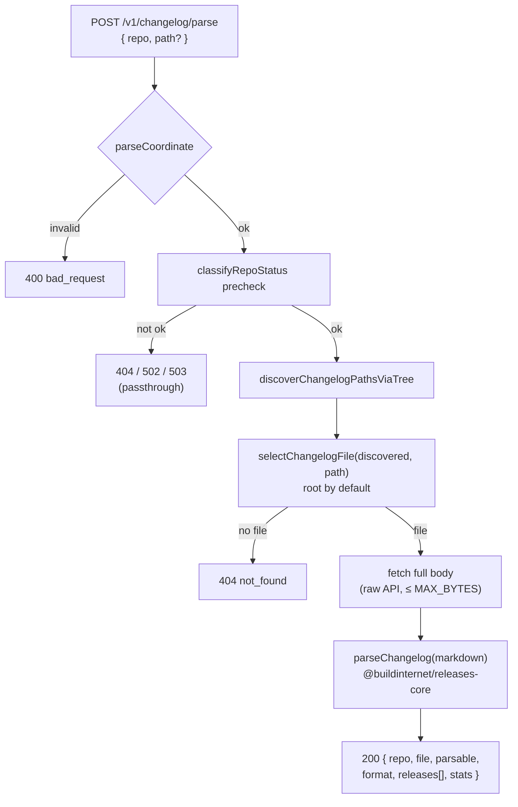

# On-demand changelog parse — structured releases without persistence

**Date:** 2026-05-23
**Status:** Design — approved, pending spec review
**Sibling of:** `039e917a` (`POST /v1/changelog/fetch`, experimental no-persistence inventory)

## Problem

`POST /v1/changelog/fetch` (#1123) discovers every CHANGELOG file in a GitHub
repo and returns an inventory with raw ~2 KB excerpts. The excerpt is unparsed
markdown — a caller asking "what releases are in this changelog?" still has to
parse it themselves, and the answer differs in shape from an indexed release
served by `GET /v1/releases/:id`.

We want a coordinate-driven endpoint that returns a changelog as **structured
release entries in the same shape as our stored releases**, so a caller gets a
consistent answer whether or not we've indexed the repo yet. Indexed releases
are produced by an AI extraction pass; that costs tokens and adds latency. But
the dominant changelog conventions are predictable enough that a deterministic
markdown parser handles the common case with zero AI cost — which is the bet
this endpoint makes.

## Scope

**In:** one changelog file per call (root by default, or a caller-specified
`path`), deterministic parsing only, response shaped like a stored release.

**Out (v1):** AI fallback for non-conforming files, fan-out across all
discovered files, persistence of any kind, the `type: "rollup"` classification
(AI-only), per-change `media` extraction, typed section breakdowns.

## Decisions (locked during brainstorming)

1. **Deterministic only.** No Claude calls. A file that doesn't match a known
   convention returns `parsable: false` with `releases: []`; the caller falls
   back to `/changelog/fetch`'s raw excerpt.
2. **Mirror the stored release shape.** Each entry carries the parse-relevant
   subset of `ReleaseDetailResponseSchema`. AI-only fields (`summary`,
   `titleGenerated`, `titleShort`) are always `null`; `media` is always `[]`.
3. **New endpoint, coordinate input only.** `POST /v1/changelog/parse`
   `{ repo, path? }`. Not an extension of `/changelog/fetch` — that endpoint
   only downloads a 2 KB excerpt for the first 20 files, which is incompatible
   with full-body parsing. `/fetch` stays the lightweight inventory scout.
4. **`type` is always `"feature"`.** The `RELEASE_TYPES` enum is
   `["feature", "rollup"]` — an entry-level "ordinary release vs. seasonal
   rollup" distinction, _not_ feature/fix/security. Deterministic parsing can't
   tell a rollup from an ordinary release, so every parsed entry is `"feature"`,
   exactly as a stored bugfix release is. The fix/feature/security signal lives
   in the `### Added`/`### Fixed`/`### Security` subheadings inside `content`;
   the caller reads it there (a structured `sections`/`kinds` breakdown was
   considered and deferred).

## Architecture

A pure, runtime-neutral parser in `@buildinternet/releases-core` does the work;
the worker route only handles fetch + auth + plumbing. This keeps the parsing
logic unit-testable in isolation and reusable (CLI, future ingest, the eventual
AI-fallback caller) without dragging in worker concerns.



### Layer 1 — pure parser (core)

New `packages/core/src/changelog-parse.ts`, exported as
`@buildinternet/releases-core/changelog-parse`. Lives beside `changelog-slice.ts`
and reuses its `findHeadings`, plus `isPrereleaseVersion` from `prerelease.ts`.

```ts
export interface ParsedChangelogRelease {
  version: string | null;
  type: "feature"; // deterministic default; never "rollup"
  title: string; // the version string
  content: string; // markdown body under the heading, trimmed
  url: string | null; // version-link href when the heading links it
  publishedAt: string | null; // ISO date from the heading, else null
  prerelease: boolean; // isPrereleaseVersion(version)
  summary: null; // AI-only — shape parity
  titleGenerated: null; // AI-only
  titleShort: null; // AI-only
  media: []; // not extracted in v1
}

export interface ParseChangelogResult {
  parsable: boolean;
  format: "keep-a-changelog" | "conventional" | "plain" | "unknown";
  releases: ParsedChangelogRelease[];
  headingsScanned: number;
  skipped: number; // Unreleased / version-less headings
}

export function parseChangelog(markdown: string): ParseChangelogResult;
```

**Anchor.** Split on `##` headings whose text begins with a version-ish token.
This covers the dominant conventions:

| Convention                                | Heading example                                                           | `format`           |
| ----------------------------------------- | ------------------------------------------------------------------------- | ------------------ |
| Keep a Changelog                          | `## [1.4.0] - 2026-05-01`                                                 | `keep-a-changelog` |
| conventional-changelog / semantic-release | `## [1.4.0](https://github.com/o/r/compare/v1.3.0...v1.4.0) (2026-05-01)` | `conventional`     |
| conventional (no link)                    | `## 1.4.0 (2026-05-01)`                                                   | `conventional`     |
| plain tag                                 | `## v1.4.0` / `## 1.4.0`                                                  | `plain`            |

**Per-entry extraction:**

- **version** — first bracket/paren-stripped token after optional leading `v`.
- **url** — the href if the version is a markdown link `[ver](href)`, else `null`.
- **publishedAt** — an ISO `YYYY-MM-DD` found in the heading (after a `-`
  separator or inside `(...)`), else `null`. No fuzzy date parsing in v1; a
  non-ISO date is left `null` rather than guessed.
- **prerelease** — `isPrereleaseVersion(version)`.
- **content** — the markdown from just after the heading line up to the next
  `##` (or EOF), trimmed.
- **title** — the version string (matches how stored releases often title `vX`).

**parsable / format.** `parsable` is `true` when at least one `##` heading
yields a recognizable version. `format` reports the family that matched the
majority of headings; `"unknown"` when nothing parsed. A file with zero
version-shaped `##` headings (e.g. a prose release-notes page) returns
`parsable: false, releases: [], format: "unknown"`.

**Skipped.** `## [Unreleased]` and any version-less `##` heading are not emitted
(they aren't published releases) and counted in `skipped`.

### Layer 2 — worker route

Add a handler to the existing `workers/api/src/routes/changelog.ts`, sibling to
`/changelog/fetch`. It reuses, unchanged:

- `classifyRepoStatus` precheck — so a transient GitHub failure surfaces as
  404/502/503 instead of an empty parse.
- `discoverChangelogPathsViaTree` (the single recursive Git Trees call, with the
  workspace-walk fallback) to enumerate candidate files and their sizes.
- `selectChangelogFile(discovered, path)` from core — root CHANGELOG by default
  (no slash in path), exact match when `path` is supplied, `null` → 404.
- The same full-body fetch loop pattern `/fetch` uses (`headers.rawHeaders`,
  `MAX_BYTES = 1 MB` cap, `truncated` flag), but for the single selected file.

Then it calls `parseChangelog(body)` and returns:

```jsonc
{
  "repo": "owner/repo",
  "file": {
    "path": "CHANGELOG.md",
    "url": "...",
    "rawUrl": "...",
    "size": 48213,
    "truncated": false,
  },
  "parsable": true,
  "format": "keep-a-changelog",
  "releases": [
    /* ParsedChangelogRelease[] */
  ],
  "stats": {
    "releasesParsed": 37,
    "headingsScanned": 38,
    "skipped": 1,
    "githubRequests": 2, // precheck + tree (+1 raw body fetch)
    "bytes": 48213,
    "elapsedMs": 120,
  },
}
```

Auth, OpenAPI, and registration mirror `/fetch`:

- **Auth:** Bearer (write) via `publicReadAuthMiddleware`'s non-SAFE_METHODS
  branch — `/changelog` is registered in `route-namespaces.ts`.
- **OpenAPI:** `hide: hideInProduction`, so it's absent from the production spec
  and outside the coverage gate (matching `/fetch`). No `check-openapi-coverage`
  allowlist entry needed.
- **Response schema:** defined locally in the route file (zod), mirroring how
  `/fetch` keeps `ChangelogFetchResponseSchema` inline rather than in
  `@buildinternet/releases-api-types`. It's experimental and hidden; promoting
  the shape to api-types is a follow-up if/when it stabilizes.

## Error handling

| Condition                               | Status | Body                                |
| --------------------------------------- | ------ | ----------------------------------- |
| Missing/blank `repo`                    | 400    | `{ error: "bad_request", message }` |
| `repo` not a parseable `owner/repo`     | 400    | `{ error: "bad_request", message }` |
| Repo not found on GitHub                | 404    | `classifyRepoStatus` body           |
| GitHub auth error / upstream 5xx        | 502    | `classifyRepoStatus` body           |
| GitHub rate limited                     | 503    | `classifyRepoStatus` body           |
| No changelog file (or `path` not found) | 404    | `{ error: "not_found", message }`   |
| File found but non-conforming           | 200    | `parsable: false, releases: []`     |

Non-conforming is a **200, not an error** — discovery and fetch succeeded; the
file just isn't in a deterministic shape. The caller decides whether to fall
back to `/changelog/fetch`.

## Testing

**Unit (`packages/core`, pure `parseChangelog`):** fixtures per family —

- Keep a Changelog with `## [Unreleased]` + several versioned sections (asserts
  Unreleased skipped, dates + prerelease flags correct).
- conventional-changelog output with linked version headings (asserts `url`
  extraction, `format: "conventional"`).
- plain `## vX.Y.Z` headings, no dates (asserts `publishedAt: null`).
- a prerelease tag (`## 2.0.0-rc.1 - ...`) → `prerelease: true`.
- a prose/non-conforming file → `parsable: false`, `format: "unknown"`.

**Worker (`workers/api/test/changelog-parse.test.ts`, mocked GitHub fetch,
mirroring `changelog-fetch.test.ts`):**

- happy path (root selected, releases parsed, stats coherent),
- explicit `path` targeting a monorepo workspace changelog,
- non-conforming file → 200 `parsable: false`,
- repo-not-found / rate-limit passthrough from `classifyRepoStatus`,
- `path` not found → 404.

## Files

- **new** `packages/core/src/changelog-parse.ts`
- **new** `tests/unit/changelog-parse.test.ts` (root `tests/unit/`, beside `changelog-slice.test.ts`)
- **edit** `workers/api/src/routes/changelog.ts` — add route + handler + local zod schema
- **edit** `packages/core/package.json` exports map — add `"./changelog-parse": "./src/changelog-parse.ts"` (match `./changelog-slice`)
- **new** `workers/api/test/changelog-parse.test.ts`
- **verify** `workers/api/src/route-namespaces.ts` — `/changelog` prefix already write-gated by `/fetch`; no change expected, confirm during impl

## Open questions / future work

- **AI fallback** for `parsable: false` (the deferred 20%) — a `mode: "auto"`
  that escalates to `extractFromBody`. Out of scope; the `format`/`parsable`
  fields are the seam for it.
- **Fan-out** across all discovered files (`parseAll`) — `/fetch` already
  enumerates the inventory; a future flag parses each.
- **Promote response shape to `@buildinternet/releases-api-types`** once the
  endpoint graduates from experimental.
- **Typed `sections` / `kinds`** breakdown if a caller needs machine-readable
  change kinds without re-parsing `content`.
