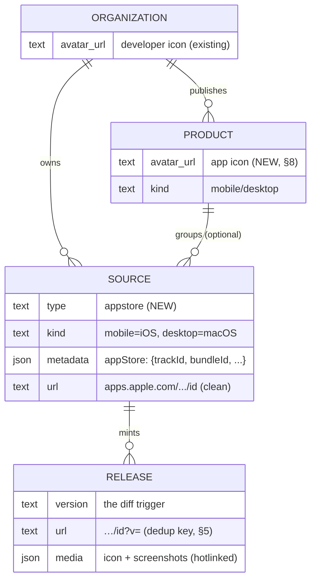
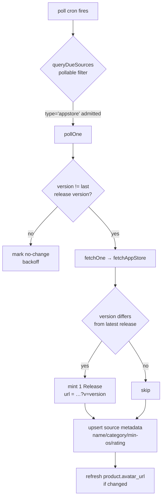

# 2026-05-25 — App Store Ingestion (`appstore` adapter)

**Status:** design / approved-for-planning
**Scope:** Apple App Store ingestion (iOS + macOS) as a new source fetch
adapter. Each store version becomes a Release. Forward-only history
(latest-version polling). Android, historical backfill, R2 asset mirroring, and
the on-demand coordinate path are explicitly out of scope for v1 (see
[§10](#10-out-of-scope-v1)).

This supersedes the draft `mobile-app-ingestion-spec.md`, which was written
without inspecting the codebase. Its core direction is sound, but it mislabels
the central change, over-specifies the schema, and misses a release-dedup
collision. The corrections are folded in below.

---

## 1. Background: grounding against the codebase

Three things the draft got wrong, and one bug it missed:

1. **`mobile` is a `kind`, not a fetch mechanism.** Two orthogonal columns:
   - **`kind`** (`packages/core/src/kinds.ts`) — _what a row is_:
     `platform | sdk | mobile | desktop | docs | integration | tool`. `mobile`
     and `desktop` already exist. **No change.**
   - **`type`** (`packages/core/src/source-enums.ts`) — _how we fetch it_:
     `github | scrape | feed | agent`. This is the real new work: a 5th value,
     `appstore`. `sources.type` has **no SQL CHECK constraint** (drizzle's
     `enum:` hint doesn't emit one), so adding a value is a constant edit plus a
     view recreation — not a data migration.

2. **Almost none of the draft's "Source schema" fields become columns.** Project
   convention: `source.url` is for humans, everything machine-facing lives in
   `source.metadata` JSON. There are no `external_id` / `bundle_id` /
   `platform` / `developer` / `rating` / `icon_url` columns and we won't add
   them. `trackId`, `bundleId`, storefront, etc. go in `metadata.appStore`.

3. **Release dedup collides on URL (the missed bug).** Releases are unique on
   `(source_id, url)` and the cron insert path uses `onConflictDoNothing()`.
   Every iOS version shares the same `trackViewUrl`, so mapping the release
   `url` to `trackViewUrl` would collapse every version into one release —
   v9.0.13 silently dropped as a dup of v9.0.12. Fix in [§5](#5-version-dedup).

The one thing it got right and is load-bearing: Apple's iTunes Lookup is a
plain authless `fetch()` returning JSON, so it drops straight into the existing
Cloudflare Worker ingest pipeline with no new runtime or infra.

---

## 2. Data model

The registry model is **Org → (optional Product) → Source → Release**. App Store
apps map on with one new `type` value and one new column (`products.avatar_url`,
[§8](#8-product-icons)).



| Registry entity | App Store concept                | Key                              |
| --------------- | -------------------------------- | -------------------------------- |
| Org             | Developer / seller               | developer slug (`spotify`)       |
| Product         | One app across platforms         | `spotify/spotify`                |
| Source          | One store listing (one platform) | `spotify/spotify-ios`, `…-macos` |
| Release         | One store version                | `rel_<nanoid>`                   |

- iOS and macOS apps have **distinct `trackId`s** → **separate Sources**, even for
  the same app. `kind` distinguishes them: iOS → `mobile`, macOS → `desktop`.
- For App Store apps we **always create a Product** (even single-platform), so
  the app icon has a home and iOS/macOS roll up under one parent. Products stay
  optional everywhere else. Product grouping is **curated manually** for v1 — no
  auto-linking by developer+name.

### 2.1 Source `metadata.appStore` shape

New optional block on `SourceMetadata` (`packages/adapters/src/source-meta.ts`):

```jsonc
metadata: {
  appStore: {
    trackId: "324684580",          // refresh + change-detect key
    bundleId: "com.spotify.client",
    storefront: "us",              // canonical locale (§9)
    platform: "ios" | "macos",     // which iTunes entity we queried
    firstPublishedAt: "2011-07-14T01:34:08Z", // releaseDate (original launch)
    minOsVersion: "13.0"
  }
}
```

### 2.2 Field mapping (corrected)

| iTunes field                            | Target                                  | Level                             | Notes                   |
| --------------------------------------- | --------------------------------------- | --------------------------------- | ----------------------- |
| `trackId`                               | `metadata.appStore.trackId`             | Source                            | Refresh/dedup key       |
| `bundleId`                              | `metadata.appStore.bundleId`            | Source                            |                         |
| `trackName`                             | `name`                                  | Source                            | Refresh each poll       |
| `version`                               | `version`                               | **Release**                       | Diff trigger            |
| `currentVersionReleaseDate`             | `publishedAt`                           | **Release**                       | Store's date (trusted)  |
| `releaseNotes`                          | `content`                               | **Release**                       | "What's New" → body     |
| `trackViewUrl` (stripped `?uo=4`)       | `url`                                   | Source (clean) / Release (+`?v=`) | §5                      |
| `artistName` / `sellerName`             | Org name                                | Org                               |                         |
| `primaryGenreName`                      | `category`                              | Source                            |                         |
| `artworkUrl512` (→1024)                 | `products.avatar_url` + release `media` | Product / Release                 | §7, §8                  |
| `screenshotUrls` / `ipadScreenshotUrls` | release `media[]`                       | Release                           | Best-effort, §7         |
| `minimumOsVersion`                      | `metadata.appStore.minOsVersion`        | Source                            |                         |
| `releaseDate`                           | `metadata.appStore.firstPublishedAt`    | Source                            | Original launch         |
| `averageUserRating` / `userRatingCount` | _(dropped for v1)_                      | —                                 | Drifts; not modeled yet |

---

## 3. The adapter — `packages/adapters/src/appstore.ts`

Pure, worker-safe. Two exports:

- **`resolveAppStore(identifier, { platform })`** — accepts a numeric `trackId`
  or an `apps.apple.com/.../id<trackId>` URL. One `fetch()` to
  `https://itunes.apple.com/lookup?id=<trackId>&country=<storefront>`, adding
  `&entity=macSoftware` for `platform: "macos"`. Returns the single result (or
  `null` on `resultCount: 0`). This is the shared primitive behind every entry
  path ([§6](#6-entry-manual-add--resolver)).
- **`fetchAppStore(source): Promise<RawRelease[]>`** — calls `resolveAppStore`
  with the source's stored `trackId`/`platform`, maps the current version into
  **one** `RawRelease`:
  - `version` = `version`
  - `title` = `${trackName} ${version}`
  - `content` = `releaseNotes`
  - `url` = version-distinct release URL (§5)
  - `publishedAt` = `currentVersionReleaseDate`
  - `media` = icon + screenshots (best-effort, §7)

Dispatch matches the existing pattern: a new `isAppStoreFetched(source)` helper
in `source-meta.ts` (true when `source.type === "appstore"`) plus a new
`else if` branch in `fetchOne`. **No adapter registry** — we follow the existing
`isGitHubFetched`-style if/else dispatch rather than refactoring it (YAGNI).

The adapter never throws on a missing/empty result — it logs and returns `[]`,
so a flaky lookup is a no-op poll, not an error that bumps backoff counters.

---

## 4. Ingest flow

Reuses the poll-and-diff pipeline verbatim. The only new code is admitting
`appstore` through the existing guards and a change-detect branch.



New wiring points in `workers/api/src/cron/poll-fetch.ts`:

- `queryDueSources` pollable filter — add `OR type = 'appstore'`.
- fetchable pre-filter — admit changed `appstore` sources to `fetchOne`.
- `pollOne` — change-detect branch: compare current `version` to latest
  release version (cheap; the lookup is one `fetch`, so we can poll-and-compare
  in one shot rather than a separate HEAD check).
- `fetchOne` — `else if (isAppStoreFetched(source))` branch.

Idempotent: re-running with no store-side change mints nothing; only the source
row refreshes mutable listing metadata.

---

## 5. Version dedup

**Decision: version-distinct release URL (approach A).**

Releases are unique on `(source_id, url)`. To keep each version a distinct
release without touching the global unique index or the insert path, the
per-release `url` carries the version as a query param:

```
source.url   = https://apps.apple.com/us/app/id324684580          (clean, human)
release.url  = https://apps.apple.com/us/app/id324684580?v=9.0.12  (dedup key)
```

Apple ignores the `?v=` param, so the link still resolves to the listing. The
source's display URL stays clean. Zero schema change; the existing
`(source_id, url)` uniqueness and `onConflictDoNothing()` do the right thing.

Rejected — **approach B (per-type `(source_id, version)` keying):** would touch
the global unique index and the batch insert path for a problem approach A
solves with a query param.

Each release also records `metadata.firstSeenAt` (our fetch time) alongside the
trusted `publishedAt` (`currentVersionReleaseDate`), for audit against Apple's
cache lag (§9).

---

## 6. Entry: manual add + resolver

Build the resolver and a manual "add by store URL or `appstore:<trackId>`" path
now; structure it so the on-demand coordinate path can adopt it later with no
rework.

- **Now:** an admin/CLI add path takes `https://apps.apple.com/.../id324684580`
  or `appstore:324684580`, calls `resolveAppStore`, and creates: the Org (from
  developer) if absent, the Product (always, §2), and the Source — then mints
  the first Release. Matches how curated sources are added.
- **Designed-for, not built:** `parseCoordinate()`
  (`packages/core/src/lookup-coordinate.ts`) gains an `appstore:` provider arm
  returning `{ provider: "appstore", trackId }`. The existing on-demand
  `/v1/lookups` path, search, and MCP can then fire the same `resolveAppStore`
  on a coordinate-shaped miss, mirroring the `github:org/repo` UX (hidden source
  on first hit, embed on second). Not wired in v1.

---

## 7. Assets — hotlink now, mirror later

- Store icon + screenshot CDN URLs directly in the release `media[]` array.
  The mzstatic URL dimension suffix is swapped to pull 1024px
  (`.../512x512bb.jpg` → `.../1024x1024bb.png`).
- **Best-effort, never blocking:** `screenshotUrls` intermittently returns empty
  even for listings that clearly have screenshots — a Release is never blocked
  on assets.
- **Deferred:** per-version R2 screenshot snapshots (the draft's
  `meta.screenshots_snapshot`). That's the existing roadmap item #1033 and
  net-new ingest infra. v1 hotlinks; mirroring is a later enhancement.

---

## 8. Product icons

New requirement: products should carry an app icon so users can visually
identify what they're looking at. Today only `organizations` has `avatar_url`.

- **Schema:** add `avatar_url` (nullable text) to the `products` table — a real
  Drizzle migration (column add). Add it to the `products_active` view (which
  enumerates columns via `.existing()`, so the view's underlying SQL is
  recreated to include the column) and to the api-types product wire shape.
- **Convention:** mirrors org avatars exactly — a pointer column, writable via
  `PATCH /v1/products/:slug { avatarUrl }` (the org PATCH handler is the
  template). This is a general win: any product can now carry an icon.
- **Population (App Store):** seed `avatar_url` from iTunes `artworkUrl512`
  bumped to 1024. v1 **hotlinks** the mzstatic CDN URL directly, consistent with
  §7; R2 mirroring to `products/{productId}.{ext}` is the same deferred
  enhancement. Refresh on poll if the listing's artwork URL changes.
- **Fallback:** extend `resolveAvatarUrl` (`web/src/lib/og.tsx`) so a
  source/release resolves its display icon as **product.avatar_url → org.avatar_url
  → GitHub fallback**. App Store apps always have a product (§2), so the app icon
  is always reachable.

The icon stays on products, not sources — scoping the new field to the level the
requirement asked for.

---

## 9. Cadence, locale, stale-cache

- **Cadence:** falls out of the existing tier model. App versions ship every few
  weeks, so the daily `retier` job lands these in the **`low` tier (24h)** from
  release-gap history. New sources start `normal` (4h) and settle to `low` after
  a few polls. No new scheduling, no special-casing.
- **Locale:** one canonical storefront — `us` / `en`. Per-locale fan-out (notes
  are localized) is a future option, not v1.
- **Stale-cache:** accept-and-correct. Trust `currentVersionReleaseDate` for
  `publishedAt`; keep `metadata.firstSeenAt` on the release for audit. Skip the
  draft's "require two stable polls before minting" guard unless the rare
  cache-flip is observed in practice — it adds per-source state for an edge case.

---

## 10. Touchpoints

| File                                          | Change                                                                                                                                                     |
| --------------------------------------------- | ---------------------------------------------------------------------------------------------------------------------------------------------------------- |
| `packages/core/src/source-enums.ts`           | add `"appstore"` to `SOURCE_TYPES`                                                                                                                         |
| `packages/core/src/schema.ts`                 | add `appstore` to `sources.type` enum hint + `sources_active` / `sources_visible` views; **add `avatar_url` to `products` table + `products_active` view** |
| `packages/core/src/lookup-coordinate.ts`      | (designed-for) `appstore:` provider arm                                                                                                                    |
| `packages/adapters/src/source-meta.ts`        | `metadata.appStore` fields + `isAppStoreFetched()`                                                                                                         |
| `packages/adapters/src/appstore.ts`           | **new** — `resolveAppStore` + `fetchAppStore`                                                                                                              |
| `packages/api-types/.../products`             | add `avatarUrl` to product wire shape                                                                                                                      |
| `workers/api/src/cron/poll-fetch.ts`          | pollable filter + fetchable pre-filter + `pollOne` + `fetchOne` branches                                                                                   |
| `workers/api/src/workflows/onboard-source.ts` | backfill eligibility for `appstore`                                                                                                                        |
| `workers/api/src/routes/products.ts`          | `avatarUrl` accepted on `PATCH`                                                                                                                            |
| migration                                     | add `products.avatar_url`; recreate `products_active` view                                                                                                 |
| `web/src/lib/og.tsx`                          | `resolveAvatarUrl` product-avatar arm                                                                                                                      |
| `web/src/app/admin/status/dashboard.tsx`      | add `appstore` to the source-type filter                                                                                                                   |

`SourceTypeSchema` (api-types), the GraphQL `SourceTypeEnum`, and the
`source-types.ts` parsers all derive from `SOURCE_TYPES` automatically — no edit.

---

## 11. Testing

- **Adapter unit tests** (`packages/adapters`): `resolveAppStore` URL/trackId
  parsing + macOS `entity` param; `fetchAppStore` field mapping against a fixed
  iTunes JSON fixture (iOS + macOS); empty-result → `[]` (no throw).
- **Dedup regression:** two polls with the same version mint one release; a
  version bump mints a second with a distinct `?v=` URL. Same version across two
  sources stays independent.
- **Product icon:** `PATCH /v1/products/:slug { avatarUrl }` round-trips;
  `resolveAvatarUrl` falls product → org → GitHub.
- **Worker tests** read via `createTestDb()` per the in-repo D1 test convention.

---

## 12. Out of scope (v1)

- **Android / Google Play** — `google-play-scraper` is a Node HTML scraper that
  won't run in the Workers runtime; needs the crawl/agent path. Future
  `playstore` sibling type.
- **Historical changelog backfill** — neither API backfills; forward-only.
- **R2 asset mirroring** — icons and screenshots hotlinked in v1 (roadmap #1033).
- **On-demand coordinate path** — resolver is structured for it; not wired.
- **Multi-locale release notes** — single canonical storefront in v1.
- **Ratings** — `averageUserRating` / `userRatingCount` drift and aren't modeled
  yet.

---

## 13. Open questions (resolved)

1. Product grouping → **curated manually**; always create a product for App
   Store apps. No auto-linking.
2. Asset storage → **hotlink** in v1; R2 mirror deferred.
3. Stale-cache guard → **accept-and-correct**; no two-poll gate.
4. Seed list → **manual add by store URL / `appstore:<trackId>`**; on-demand
   designed-for, not built.
