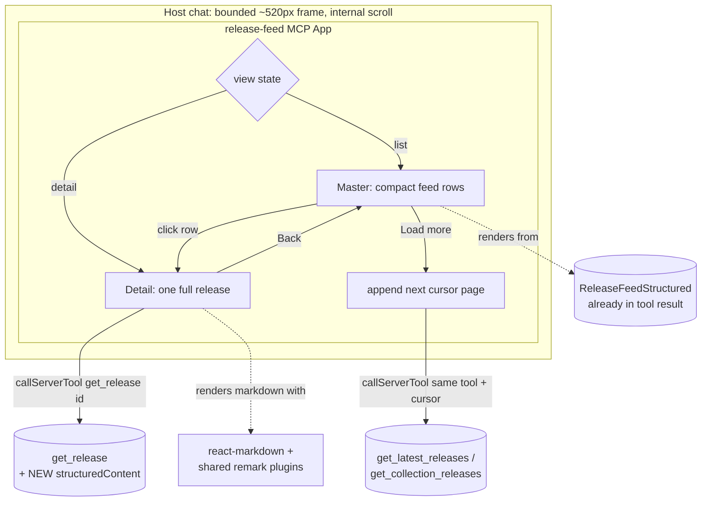

# 2026-05-25 — Release-feed MCP App: master/detail, real markdown, fixed height

## Problem

The `release-feed` MCP App UI (shared by `get_collection_releases` and
`get_latest_releases`, in `workers/mcp/ui/release-feed/`) has five problems,
all visible when rendering a 40-item collection feed:

1. **Unbounded height.** The feed `<main>` grows to fit every release, so the
   embedded app takes over the whole chat column. It should be a fixed-height
   block that scrolls internally.
2. **Truncated bodies.** Each row renders `summary || contentPreview` (a ~500-char
   slice) clamped to 6 CSS lines. There is no way to read the full release.
3. **Raw markdown leaks.** Bodies render as plain text (`<p>{body}</p>`), so
   `## What's changed`, `**bold**`, list markers, etc. show as literal source
   instead of rendered markdown — unlike the web app.
4. **No drill-down.** The only path to full content is the "Ask about this"
   button, which sends a chat message asking the model to call `get_release` —
   it leaves the app entirely.
5. **The model-facing text isn't self-describing.** The text the model reads
   (`content[0].text`, built identically at `tools.ts:658` and `tools.ts:2417`)
   renders each release as title/byline + a silent 500-char slice. It omits the
   release `id`, any content-size signal, and any truncation marker — so the
   model can't tell a complete short release from a 1%-of-50K preview, and has no
   `rel_…` handle to pass to `get_release` for the rest. The structured payload
   carries `id`/`contentChars`/`contentTokens` (for the App UI), but the model
   never sees structured content — only the text channel.

The goal: make the feed take less vertical space, render markdown the way the
web app does, allow drilling into a single release to read its full content
inline, and make every tool response self-describing enough that the agent knows
whether and how to fetch more — with the overall presentation heavily inspired by
the existing web feed.

## Decisions (settled during brainstorming)

| Decision            | Choice                                                                                                                                                                           |
| ------------------- | -------------------------------------------------------------------------------------------------------------------------------------------------------------------------------- |
| Drill-down model    | **Master → detail swap** — clicking a row replaces the list with a single full-release view + Back button                                                                        |
| Full-content source | **Lazy-fetch on expand** via the `get_release` tool through `app.callServerTool` (keeps the feed payload lean)                                                                   |
| Markdown fidelity   | **Web parity, text + structure** — reuse the web's `react-markdown` + remark stack (GFM, emoji, GitHub alerts, GitHub refs)                                                      |
| Media               | **Inline images kept** (height-capped); video iframes (YouTube/Vimeo/Loom) and shiki syntax highlighting **excluded**                                                            |
| Fixed height        | **~520px** (header + ~2–3 rows visible, scroll for the rest)                                                                                                                     |
| Model-facing text   | **Self-describing releases** — each text block carries the release `id`, a content-size signal (chars + tokens), and a truncation/`get_release` hint when the preview is partial |
| Scope               | The shared `release-feed` app, its two backing feed tools' text fallback, and `get_release` → both `get_collection_releases` and `get_latest_releases` improve at once           |

## Architecture



The app stays a **single bundle** with a top-level `view` discriminated union:
`{ kind: "list" }` or `{ kind: "detail"; id: string }`. The list state
(`releases`, `nextCursor`, `hasMore`, scroll offset) is preserved while in
detail so Back is instant and lossless.

## Components

### 1. Layout & sizing — `styles.css` + root container

The fix for unbounded height is to **bound the scroll container the host
measures**, rather than letting content dictate frame height.

- Root (`html, body, #root`) gets `height: 520px` and the scrolling region
  (`.app-shell`) gets `overflow-y: auto`. With overflow contained, the height
  the host observes stays fixed at ~520px and overflow scrolls internally.
- The detail view reuses the same shell; its long markdown body scrolls inside
  the same 520px region (sticky Back/header, scrolling body).

**Verification gate (plan phase, before relying on CSS alone):**

- Confirm the host honors a CSS-bounded root (frame stops growing).
- Inspect `@modelcontextprotocol/ext-apps` (installed under `workers/mcp/ui/`)
  for an explicit display-mode / size API. If one exists, prefer it over
  relying on content measurement; otherwise the bounded-root approach stands.

### 2. Master view (feed list)

Compact, dense rows replacing today's tall cards. Per row:

- **Meta line:** source coordinate (mono) · rollup badge (if `type === "rollup"`) · relative date (right-aligned).
- **Title:** `pickTitle(release)` (unchanged precedence).
- **Chips:** version chip (when distinct from title).
- **Snippet:** a **one-line, markdown-stripped** plain-text preview derived from
  `summary || contentPreview`. A small `stripMarkdown()` helper removes heading
  markers, emphasis, list bullets, and link syntax so no raw `##`/`**` leaks.
  Single line, ellipsis on overflow.
- **Affordance:** whole row is the click target (button semantics: role, keyboard
  Enter/Space, focus ring) with a subtle chevron. → sets `view = { kind: "detail", id }`.

Per-row "Open source" / "Ask about this" buttons are **removed** from rows (they
move to the detail view) to keep rows tight. The feed header
(`COLLECTION FEED` / title / `N releases · more available`) and the bottom
"Load more" button are unchanged in behavior.

### 3. Detail view (one release)

- **Sticky header:** "‹ Back" (returns to list, restoring scroll + appended pages),
  then source byline, relative date, title, version + rollup chips.
- **Body:** full release content rendered as markdown (see §4). Scrolls within the
  bounded shell.
- **Footer actions:** **Open source** (`app.openLink(url)`) and **Ask about this**
  (`app.sendMessage(...)`, same text contract as today).
- **States:** while `get_release` is in flight, show a lightweight loading state;
  on error, show a message with a retry and an "Open source" escape hatch (when a
  url is known from the originating row).

### 4. Markdown rendering — shared remark stack + app-local component map

- Add `react-markdown`, `remark-gfm`, `remark-gemoji` to
  `workers/mcp/ui/package.json`.
- **Share the remark plugins.** Extract `remark-github-alerts`,
  `remark-github-refs`, and `createRemarkPlugins` from `web/src/lib/` into
  `packages/rendering/` (runtime-neutral remark AST transforms — the package's
  remit). Re-export from a new entry, e.g. `@releases/rendering/markdown-plugins`.
  - `web/src/lib/markdown-plugins.ts` re-exports from the shared module (or web
    imports the shared module directly) so the two surfaces can't drift.
  - The MCP UI build (`workers/mcp/ui/build.ts`, Bun.build) consumes the same
    source.
  - **Resolution risk + fallback:** `workers/mcp/ui/` is an isolated package
    (own lockfile, not a root workspace). The plan first verifies that the UI
    build can resolve `@releases/rendering/markdown-plugins`; if cross-workspace
    resolution is painful, the fallback is to vendor the two small plugin files
    into `ui/` and still share via `packages/rendering` for web.
- **App-local component map** (the web's `markdownComponents` is Tailwind-coupled
  and can't be reused). A plain-CSS map that:
  - Demotes headings (h1→h3, etc.) like the web cards.
  - Routes `<a>` through `app.openLink` instead of native navigation.
  - Renders `` inline with a `max-height` cap.
  - **Excludes** video iframe embeds (YouTube/Vimeo/Loom) and shiki highlighting;
    code blocks render as plain `<pre><code>`.
- Markdown is rendered **only in the detail view**. Master rows use the stripped
  one-line snippet (no react-markdown on the list for density + cost).

### 5. Data flow & the `get_release` change

- **Master list** renders from the existing `ReleaseFeedStructured` payload — no
  payload growth, no new fetch on initial render.
- **Load more** is unchanged: `app.callServerTool` against the same tool with the
  next cursor, append rows.
- **Detail** calls `app.callServerTool({ name: "get_release", arguments: { id } })`
  and reads a **new `structuredContent`** field.

**`get_release` change (additive, backward-compatible):** `getRelease()` in
`workers/mcp/src/tools.ts` currently returns only `text(...)` — a pre-formatted
markdown blob (title/id/version/published/source/org/url header + body). It will
**additionally** attach `structuredContent`:

```ts
interface ReleaseDetailStructured {
  id: string;
  title: string | null;
  titleShort: string | null;
  titleGenerated: string | null;
  version: string | null;
  type: "feature" | "rollup";
  content: string; // full body markdown (falls back to summary)
  summary: string | null;
  publishedAt: string | null;
  url: string | null;
  source: { name: string; coordinate: string };
  org: { name: string; slug: string } | null;
}
```

The existing text fallback is untouched, so non-app hosts and the model see the
same response as today. `coordinate` is built the same way the feed row builds it
(`org.slug/source.slug`, falling back to source slug).

### 6. Model-facing text: self-describing releases

The App UI is only half the response — the model reads `content[0].text`. Both
feed tools must make each release block answer three questions for the agent:
_what is this (handle), how big is it, and do I need to fetch more?_

Per-release text block becomes:

```
<title> | <version> | <date>
ID: rel_<nanoid>
Source: <name> (<coordinate>) | Version: <…> | Date: <…>
<preview — first 500 chars>
[… truncated — ~<N> tokens / <M> chars total. Call get_release(id: "rel_<nanoid>") for the full release.]
```

Rules:

- **`id` line always present** — it's the handle for `get_release` (and for
  "Ask about this" in the UI). Without it the agent can't fetch more.
- **Size signal** — surface `contentChars` and `contentTokens` so the agent can
  budget. `get_latest_releases` already selects these columns; the collection
  feed query (`packages/core-internal/src/collection-feed.ts`, `AggregateReleaseRow`)
  does **not** — add `r.content_chars` / `r.content_tokens` to its SELECT + row
  type. This also backfills the collection App-UI payload, which currently passes
  `null` for both, and benefits the REST `/v1/collections/:slug/releases` surface.
- **Truncation hint is conditional** — only appended when the preview is actually
  shorter than the full body (`contentChars > preview.length`, or content was
  sliced). A short release whose full body fits in 500 chars gets no hint and no
  wasted "fetch more" nudge.
- Implement once in a shared `renderFeedReleaseText(row)` helper used by both
  `getLatestReleases` and `getCollectionReleases` (today the two duplicate the
  block). Cursor footer is unchanged.
- `get_release` already emits `ID:` + full body, so the loop closes once the feed
  hands the agent the id.

This keeps the same self-describing contract on the structured side too: the App
UI's `ReleaseFeedRow` already carries `id`/`contentChars`/`contentTokens` — the
collection path just needs the columns threaded through so they're non-null.

## Out of scope

- Other MCP tools' UI (this is the first of several; only `release-feed` here).
- Extending the self-describing text contract (`id` + size + fetch hint) to other
  tools — the `search` / `search_releases` release hits are the obvious next
  candidate, but they're a separate follow-up, not this spec.
- Video iframe embeds, shiki syntax highlighting, image galleries / thumbnails.
- Changing pagination semantics, cursor shape, or tool inputs.
- Web app changes beyond re-pointing its markdown-plugin import at the shared
  module.

## Testing

- **Worker unit test:** new `get_release` `structuredContent` shape — fields
  present, `content` falls back to `summary`, suppressed releases still 404, text
  fallback unchanged. Use the in-process worker pattern already established in the
  MCP test suite.
- **Self-describing text:** assert both feed tools' text emits an `ID:` line per
  release, surfaces a size signal, and appends the `get_release` hint only when
  the body is longer than the preview (not for short, fully-shown releases).
  Assert the collection feed query now returns non-null `contentChars` /
  `contentTokens`.
- **Shared plugins:** a smoke test that `@releases/rendering/markdown-plugins`
  exports the expected plugin array and that web still imports it cleanly
  (`web` + worker `tsc --noEmit`).
- **UI bundle:** `bun run mcp:ui:build` succeeds and `src/ui-bundles.ts`
  regenerates (build-smoke). Manual verification in a host for: fixed height +
  internal scroll, row click → detail, Back restores list, markdown parity
  (headings/lists/tables/alerts/emoji/images), error/loading states.
- **Gates:** root + worker `tsc --noEmit`, `bun test`, `bun run lint`,
  `bun run format:check`.

## Risks & mitigations

| Risk                                                            | Mitigation                                                                                                                |
| --------------------------------------------------------------- | ------------------------------------------------------------------------------------------------------------------------- |
| Host ignores CSS-bounded root and still sizes to content        | Plan-phase verification gate; prefer an ext-apps display/size API if one exists                                           |
| `@releases/rendering` won't resolve in the isolated `ui/` build | Verify first; fallback = vendor the two plugin files into `ui/`                                                           |
| Bundle size growth from react-markdown + remark + emoji map     | Acceptable for a single inlined app; measure post-build; emoji is the largest single add — revisit if the bundle balloons |
| Sandboxed frame blocks remote `` / `app.openLink`          | Images degrade to alt text gracefully; links already use `app.openLink` today                                             |

## Addendum — org identity, view-source, and web-parity grouping

Refinements layered on top of the master/detail base after host testing, to close
the gap with the web collection view:

- **Org identity on every row.** Feed rows and the detail byline now carry the
  org's company icon (avatar) plus a human-readable label. `ReleaseFeedRow` /
  `ReleaseDetailStructured` gained `source.type`, `org { name, slug, avatarUrl,
githubHandle }`, and `product { name, slug }`; the shared collection-feed
  `SELECT` and the latest-releases / `get_release` queries now resolve
  `avatar_url` plus the first linked GitHub handle (`org_accounts`,
  `platform = 'github'`) for the `OrgAvatar` fallback chain (stored avatar →
  `github.com/{handle}.png` → monogram).
- **Display-name preference.** Labels favor human-readable org/product/source
  names, except GitHub sources, which keep the `org/repo` coordinate (the
  recognizable handle) in mono.
- **View source promoted.** The detail "Open source" footer button became a
  header action (external-link SVG icon, not the `↗` glyph) mirroring the web
  byline; "Ask about this" stays in the footer. Back is collection/feed-aware
  ("‹ Back to {collection or feed title}").
- **Day → org grouping (cross-org feeds).** Collections and the across-registry
  "Latest" feed now group by day (weekday + date + count header) then by org
  (avatar + name + count sub-header), matching the web `CollectionTimeline`
  structure. In grouped mode the org avatar sits in the sub-header and the date
  in the day header, so rows drop both and lead with the product/source name.
  Single-org / product feeds keep the flat list since the header already names
  the org. (Out of scope, deferred: the web view's post-vs-tag hero/commit-log
  split, same-product rollup collapsing, member filter chips, type tabs,
  prerelease toggle, format links, and inline list thumbnails.)
- **Tests.** Added: collection-feed query carries `org_avatar_url` /
  `org_github_handle`; both feed tools' structured rows carry `org` identity,
  `source.type`, and `product`; `get_release` detail carries the widened
  `org` / `source.type` / `product` shape.
