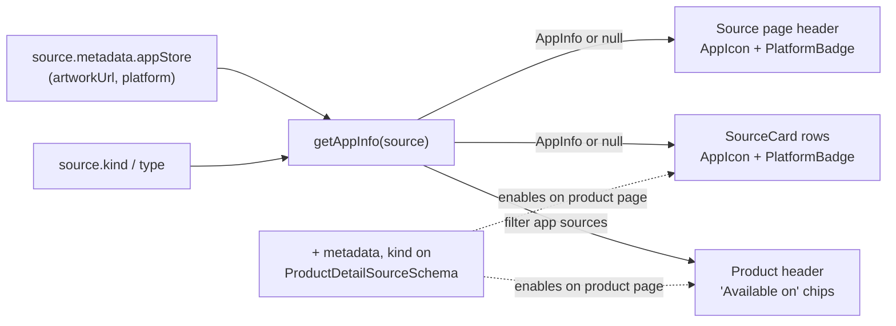

# App-source icon + platform badge + "Available on" affordance

**Date:** 2026-05-25
**Status:** Design approved, ready for implementation plan
**Branch:** `worktree-appstore-app-icon`

## Context

App Store ingestion (PR #1160) added `appstore` sources: an app becomes a
Product, each store version a Release, and the app icon is stored two places —
the parent `products.avatar_url` (backfilled at materialize) and the source's
`metadata.appStore.artworkUrl`. The first live one is Claude's iOS app
(`anthropic` → Claude product → `claude-ios` source, `kind: "mobile"`).

Today nothing in the web UI signals that a source _is_ a mobile/desktop app.
A reader scanning an org or product can't tell the App Store listing apart from
a scrape changelog, and the app icon — already stored — is never shown except
incidentally as the product avatar.

**Goal:** when a source is an app, show its app icon and a platform badge
wherever the source appears, and surface an "Available on" affordance on the
product page. Make it work for `macos`/`desktop` too, so the future Mac app
needs no extra work.

## Non-goals

- **Low-signal app release handling** — boilerplate App Store notes ("various
  bug fixes and improvements") flooding/diluting an org's real changelog
  content. Real concern, separate subsystem (ingest detection + read/ranking),
  wider blast radius. Gets its own spec next. See [Future considerations](#future-considerations).
- A `sources.avatar_url` column. The icon data is already reachable without one;
  PR #1160 deliberately scoped the icon field to products.
- Org-page **header** "Available on" chip — ambiguous when an org has many
  products/apps. Per-row treatment via `SourceCard` covers the org's sources
  surface instead.
- Release-timeline rows (release-centric, not source-centric) and the
  `/v1/orgs/:slug/catalog` endpoint (not consumed by the surfaces below).
- Showing `product.avatar_url` as a product-header avatar — would duplicate the
  "Available on" chip icon. Possible later.

## Data & wire

The "is this an app, what's its icon + platform" signal derives entirely from
data we already store. `type === "appstore"` plus `metadata.appStore`
(`artworkUrl`, `platform`) is the whole input. No migration, no new column.

| Surface                | Source shape                | Carries `metadata` + `kind`?                | Wire change                 |
| ---------------------- | --------------------------- | ------------------------------------------- | --------------------------- |
| Source detail page     | `SourceDetailSchema`        | yes (`metadata` required, `kind`)           | none                        |
| Org sources / org page | `SourceListItemSchema`      | yes (both optional)                         | none                        |
| **Product page**       | `ProductDetailSourceSchema` | **no** — `{id, slug, name, type, url}` only | **add `metadata` + `kind`** |

**The one change:** add `metadata: z.string().nullable().optional()` and
`kind: z.enum(KIND_VALUES).nullable().optional()` to `ProductDetailSourceSchema`
(`packages/api-types/src/schemas/products.ts`), matching `SourceListItemSchema`,
and select those columns in the product-detail handler
(`workers/api/src/routes/products.ts`). Additive and optional — older clients
ignore it. This is REST only (the product page uses the `@/lib/api` client, not
GraphQL), so no GraphQL snapshot / web codegen regen.

## Shared helper

One derivation, read identically by every surface:

```ts
// web/src/lib/app-source.ts
interface AppInfo {
  platform: "ios" | "macos";
  label: "iOS" | "macOS";
  iconUrl: string | null;
}
// Returns null unless source.type === "appstore" with a parseable
// metadata.appStore block. Tolerant of null/missing/malformed metadata.
function getAppInfo(source: { type: string; metadata?: string | null }): AppInfo | null;
```

Centralizing this keeps the badge/icon logic uniform and out of the JSX.

## Components

Two small presentational pieces:

- **`AppIcon`** — a rounded-**square** `next/image` (app-icon convention;
  deliberately distinct from the circular `OrgAvatar`), with the first-letter
  fallback when `iconUrl` is null. Square corners are the signal that this is an
  app, not an org.
- **`PlatformBadge`** — a labelled chip rendering `label` ("iOS" / "macOS"),
  styled like the existing badges in `SourceCard` (`text-[10px]`,
  `rounded`, muted background). Labelled text, **no emoji and no arrow glyph**
  (house style — see Constraints).

## Rendering surfaces

| Where                | File                                                   | Change                                                                                                                                                                                                    |
| -------------------- | ------------------------------------------------------ | --------------------------------------------------------------------------------------------------------------------------------------------------------------------------------------------------------- |
| Source detail header | `web/src/app/[orgSlug]/[sourceSlug]/layout.tsx`        | `AppIcon` before the `<h1>`, `PlatformBadge` beside the title. Layout already parses `source.metadata`.                                                                                                   |
| Source rows          | `web/src/components/source-card.tsx`                   | When `getAppInfo(source)`: `AppIcon` before the name, `PlatformBadge` among the existing badges. Covers the product page rows and the org `/sources` page rows automatically.                             |
| Product header       | `web/src/app/[orgSlug]/product/[productSlug]/page.tsx` | "Available on" row derived from `product.sources.filter(getAppInfo)` — one chip per app source (`AppIcon` + platform label) linking to that source's in-app page. Renders only when ≥1 app source exists. |

## Constraints

- **No emoji / no arrow glyphs in the web UI** (house style). The "Available on"
  affordance is chip-based: `AppIcon` + platform label, no `📱` and no trailing
  `›`/`↗`. The earlier ASCII mockup used a phone emoji and chevron purely to
  sketch the idea.
- App icons are hot-linked mzstatic CDN URLs (consistent with PR #1160); render
  with `unoptimized` per the existing `isOptimizableImage` check in `OrgAvatar`.

## Data flow



## Testing

- **`getAppInfo` unit tests** — appstore source with valid metadata → AppInfo;
  ios vs macos label mapping; null metadata / malformed JSON / non-appstore type
  → null.
- **api-types** — `ProductDetailSourceSchema` parses with and without the new
  optional fields (back-compat).
- **Worker** — product-detail handler returns `metadata` + `kind` on its
  sources (in-process route smoke per the repo's worker-test pattern).
- **Manual preview** — `claude-ios` source page shows icon + "iOS" badge; the
  Claude product page shows the "Available on" chip + the badged row; a non-app
  source (e.g. the `claude` scrape source) is visually unchanged.

## Future considerations

- **Low-signal app release handling (next spec).** App Store release notes are
  frequently boilerplate ("various bug fixes and improvements"). We want those
  to not flood or dilute an org's real changelog content. The machinery already
  exists: the marketing classifier marks items `suppressed=true` +
  `suppressedReason` at ingest, and the org release feed
  (`queries/releases.ts`) + search already exclude suppressed rows. The design
  decisions for that spec: cheap heuristic vs AI detection, and suppress-entirely
  vs soft-demote (keep on the app's own source page, exclude only from
  org-aggregate surfaces). Out of scope here.
- Showing `product.avatar_url` as the product-header avatar.
