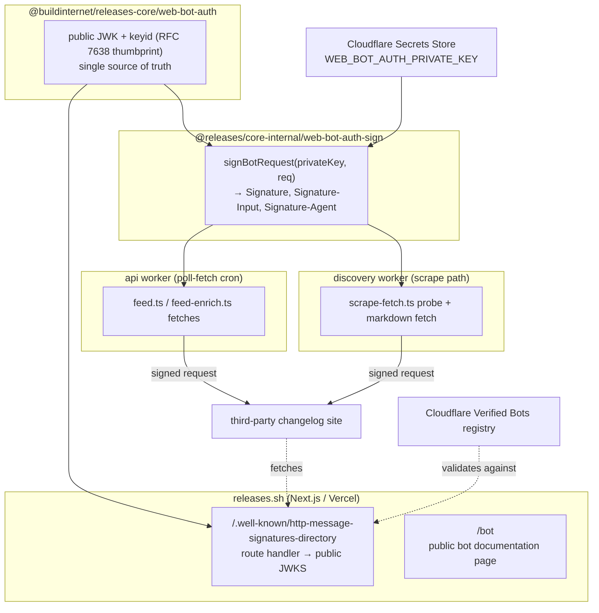

# 2026-05-26 — Web Bot Auth for the Releases crawler

## Goal

Let the Releases crawler cryptographically identify itself using **Web Bot Auth**
(HTTP Message Signatures, RFC 9421) so that:

1. `https://releases.sh/.well-known/http-message-signatures-directory` publishes our
   public key(s) — clearing the "Web Bot Auth directory not found" check on
   isitagentready.com.
2. Our crawler's **direct outbound `fetch()` requests** carry `Signature`,
   `Signature-Input`, and `Signature-Agent` headers signed with our Ed25519 key.
3. We can register as a **Cloudflare Verified Bot** (AI Crawler, "Request signature"
   verification) so receiving sites recognize our traffic as a known, legitimate bot:
   <https://developers.cloudflare.com/bots/concepts/bot/verified-bots/>.

## Background

Web Bot Auth relies on two IETF drafts:

- **Directory draft** (`draft-meunier-http-message-signatures-directory`) — how a crawler
  publishes its public keys.
- **Protocol draft** (`draft-meunier-web-bot-auth-architecture`) — how those keys sign
  outbound requests via RFC 9421 HTTP Message Signatures.

Cloudflare's integration: <https://developers.cloudflare.com/bots/reference/bot-verification/web-bot-auth/>.

### Critical architectural constraint: two identity buckets

Our outbound crawl traffic originates from two different places, and only one can carry
_our_ identity:

| Path                                                                                                                            | Origin                                                       | Web Bot Auth identity            | Can we control it?                                                                                                          |
| ------------------------------------------------------------------------------------------------------------------------------- | ------------------------------------------------------------ | -------------------------------- | --------------------------------------------------------------------------------------------------------------------------- |
| **Direct `fetch()` from our Workers** — feed discovery, HEAD/body probes, feed-enrich cheap fetch, scrape status/markdown probe | Our Worker runtime, UA `releases/0.1 (+https://releases.sh)` | **`releases`** (this project)    | **Yes** — we sign these                                                                                                     |
| **Cloudflare Browser Rendering + `/crawl` API** — JS-rendered SPAs, multi-page changelogs, scrape fallback                      | Cloudflare's headless browser                                | **Cloudflare Browser Rendering** | **No** — Cloudflare auto-attaches its own `Signature*` headers since 2025-06-30, and they "cannot be removed or overridden" |

Reference: <https://developers.cloudflare.com/browser-run/reference/automatic-request-headers/>.

**Consequence:** after this work, direct fetches verify as `releases`; browser-rendered
crawls remain verifiable as _Cloudflare Browser Rendering_ (itself a recognized verified
entity). Both are "valid as verified bots," but under two distinct identities. There is no
way to stamp the `releases` identity onto the browser-rendered path. This is accepted, not
a gap to close.

### Verified Bot vs. Signed Agent

The crawler is **owner-directed** (runs on our cron / discovery schedule), not carrying out
a per-request end-user goal. Therefore **Verified Bot**, not Signed Agent.

## Architecture



## Components

### 1. Shared key material — `@buildinternet/releases-core/web-bot-auth`

New module in `packages/core/`. Public-safe, runtime-neutral. Exports:

- `WEB_BOT_AUTH_PUBLIC_JWK` — the Ed25519 public key as a JWK:
  `{ kty: "OKP", crv: "Ed25519", x: "<base64url>", kid: "<thumbprint>" }`.
- `WEB_BOT_AUTH_KEY_ID` — the RFC 7638 JWK thumbprint, used as `keyid` in signatures.
- `WEB_BOT_AUTH_SIGNATURE_AGENT` — `"https://releases.sh"`.
- `WEB_BOT_AUTH_DIRECTORY_URL` — `"https://releases.sh/.well-known/http-message-signatures-directory"`.

This is the **single source of truth** for the published key + `keyid`, imported by both
the web directory route and the worker signer so the published key and the signing `keyid`
can never drift. The public key is not secret; it is committed.

### 2. Directory route — web frontend

New App Router route handler:
`web/src/app/.well-known/http-message-signatures-directory/route.ts` (mirrors the existing
`web/src/app/.well-known/api-catalog/route.ts`).

- Returns `{ "keys": [WEB_BOT_AUTH_PUBLIC_JWK] }` (array — supports rotation).
- `Content-Type: application/http-message-signatures-directory+json`.
- Cache headers: `public, max-age=3600` (key is stable).
- Served **unsigned** (keys only). The directory self-signature is optional per the
  directory draft; Cloudflare verifies our _requests_ from the public key, not from a
  directory signature. See Risk 1 for the fallback.

A route handler (not a static `public/.well-known/` file) is required to set the exact
non-standard `Content-Type`.

`web/src/app/robots.ts` currently `Disallow:`es `/.well-known/`. Verifiers fetch the
directory directly (not via crawl), so this does not block verification. Optionally add an
`Allow:` exception for the directory path for cleanliness — not required.

### 3. Request signer — `@releases/core-internal/web-bot-auth-sign`

New worker-side helper in `packages/core-internal/` (private, workspace-only — sits next to
the existing `webhook-sign` HMAC helper; not shipped to the OSS CLI).

```text
signBotRequest(privateKey, { url, method }) -> {
  "Signature": "sig1=:<base64>:",
  "Signature-Input": 'sig1=("@authority" "signature-agent");created=…;expires=…;keyid="…";alg="ed25519";nonce="…";tag="web-bot-auth"',
  "Signature-Agent": '"https://releases.sh"'
}
```

- **Signed components:** `("@authority" "signature-agent")` — exactly Cloudflare's
  documented example, and within their RFC 9421 limitations (must **not** include
  `@query-params`, `@status`, `sf`, `bs`, `key`, `req`, `name`).
- **Params:** `alg="ed25519"`, `keyid=WEB_BOT_AUTH_KEY_ID`, `tag="web-bot-auth"`,
  `created=now`, `expires=now+300s`, random base64 `nonce`.
- **Implementation:** prefer Cloudflare's `web-bot-auth` npm helper for signature-base
  assembly. Verify it imports cleanly in the Workers runtime during implementation; if not,
  hand-roll with `crypto.subtle.sign("Ed25519", …)` (Workers support Ed25519 in Web Crypto).
  The signature base + structured-field serialization is the fiddly part the library
  handles.
- **Key format:** private key stored as JWK (or PKCS8) in Secrets Store, imported via
  `crypto.subtle.importKey`.

### 4. Fetch-path integration

Thread an optional `signRequest?: (req: { url: string; method: string }) => Promise<Record<string,string>>`
through the adapters, mirroring how `RELEASES_BOT_UA` is already threaded. Each worker
entrypoint constructs the signer from its Secrets Store binding and passes it down; the
adapters stay pure (they call the injected signer, they do not read secrets).

**Sign these (third-party content targets):**

- `packages/adapters/src/feed.ts`: `discoverFromHead`, `probeFeedPath`, `fetchAndParseFeed`,
  `headCheckUrl`, `bodyHashCheck`.
- `workers/discovery/src/scrape-fetch.ts`: `probeUpstreamStatus`, markdown URL fetch.
- `workers/api/src/cron/feed-enrich.ts`: the cheap `fetch(item.url, …)`.

**Do not sign (first-party platform APIs — they do not verify Web Bot Auth, signing only
adds noise):** `api.github.com`, `raw.githubusercontent.com` (`github-discovery.ts`,
`github-probe.ts`), `itunes.apple.com` (`appstore.ts`).

**Leave unchanged:** Cloudflare Browser Rendering (`packages/adapters/src/cloudflare.ts`) and
the `/crawl` API (`packages/adapters/src/crawl.ts`) — already auto-signed by Cloudflare under
its own identity.

### 5. Bot documentation page — `/bot`

New public page on releases.sh (the form's required "Bot documentation URL"). Describes:

- Purpose (changelog indexer / registry crawler for AI agents and developers).
- User-Agent string: `releases/0.1 (+https://releases.sh)`.
- Web Bot Auth directory URL.
- Crawl cadence and exponential backoff behavior; that we honor robots and per-source tiers.
- That heavy rendering goes via Cloudflare Browser Rendering (so operators may also see the
  Cloudflare Browser Rendering identity).
- Contact / how to request exclusion.

### 6. Registration runbook

Spec ships a step-by-step for the Bot Submission Form (Manage Account → Configurations →
Bot Submission Form):

| Field                     | Value                                                               |
| ------------------------- | ------------------------------------------------------------------- |
| Bot name                  | `Releases` (or `releases.sh crawler`)                               |
| I own this bot            | checked                                                             |
| Bot documentation URL     | `https://releases.sh/bot`                                           |
| Short description         | Changelog indexer & registry crawler for AI agents and developers.  |
| Bot type                  | **Verified Bot**                                                    |
| Bot crawler category      | **AI Crawler**                                                      |
| Verification method       | **Request signature (beta)**                                        |
| Validation instructions   | `https://releases.sh/.well-known/http-message-signatures-directory` |
| User-Agents header values | `releases/0.1 (+https://releases.sh)`                               |
| User-Agents match pattern | `releases`                                                          |

## Key management

Run by the user (per project rule: Claude never edits `.env` / secrets):

```bash
# Generate Ed25519 keypair
openssl genpkey -algorithm ed25519 -out web-bot-auth-private.pem
openssl pkey -in web-bot-auth-private.pem -pubout -out web-bot-auth-public.pem
```

- Derive the public JWK (`x` = base64url of the raw 32-byte public key) and the RFC 7638
  thumbprint (`keyid`). A small `scripts/` helper will print both, plus the JWK to paste into
  the `@buildinternet/releases-core/web-bot-auth` constant.
- Store the **private** key in Cloudflare Secrets Store as binding `WEB_BOT_AUTH_PRIVATE_KEY`
  on **both** the api worker and the discovery worker (the only two runtimes that make signed
  direct fetches). Format: JWK JSON (preferred for `importKey`) or PKCS8.
- The **public** JWK + `keyid` are committed to `packages/core/` (not secret).

**Rotation:** publish the new public key in the directory `keys` array alongside the old one,
flip the signer to the new private key, then drop the old key from the array after the
overlap window.

## Error handling & gating

- **Fail-open.** Any signer error, missing binding, or import failure → log a warning and
  send the request **unsigned**. Signing must never block ingestion. Matches the existing
  fail-open conventions (marketing classifier, feed enrichment). Worker logs via `logEvent`
  with `component: "web-bot-auth"`, kebab-case `event` (e.g. `sign-failed`, `key-missing`).
- **Env gate** `WEB_BOT_AUTH_ENABLED` (default off) controls the signing path so it ships
  dark and is flipped on after the key is in Secrets Store. The directory route and `/bot`
  page have no gate — both are harmless and can go live immediately.

## Testing

- **Unit (signer):** emitted `Signature-Input` has the correct components, params, `tag`,
  `alg`, and a parseable `Signature`; the signature round-trips — verify with
  `crypto.subtle.verify("Ed25519", publicKey, …)` against the published public JWK.
- **Unit (directory route):** 200, `Content-Type: application/http-message-signatures-directory+json`,
  valid JWKS shape, `kid` equals `WEB_BOT_AUTH_KEY_ID`.
- **Manual / integration:**
  - Signed request → `https://crawltest.com/cdn-cgi/web-bot-auth` → expect `401` (well-formed,
    key not yet known to Cloudflare) before registration, `200` after Cloudflare ingests our
    key post-submission.
  - isitagentready.com scan → `checks.botAccessControl.webBotAuth.status: "pass"`.
  - Confirm a real changelog fetch in prod carries the three headers (Axiom `logEvent` or a
    smoke fetch against a request-echo endpoint).

## Open risks

1. **Unsigned directory rejected by a strict validator.** Mitigation: validate against
   crawltest + isitagentready first. If rejected, self-sign the directory response (requires
   the private key at the serving edge — would move key custody onto Vercel; only done if
   forced).
2. **`web-bot-auth` npm Workers-compat unconfirmed.** Hedge: hand-rolled Web-Crypto Ed25519
   signer as the fallback.
3. **Identity coverage.** Only direct fetches carry the `releases` identity; browser-rendered
   crawls remain _Cloudflare Browser Rendering_. Accepted (see Background).

## Out of scope

- Signing browser-rendered / `/crawl` traffic (impossible — Cloudflare-controlled).
- Signed Agent registration (we are a Verified Bot).
- Pay-Per-Crawl payment headers / the Discovery API (separate Cloudflare feature; could reuse
  this signer later).
- Signing first-party platform API calls (GitHub, iTunes).
