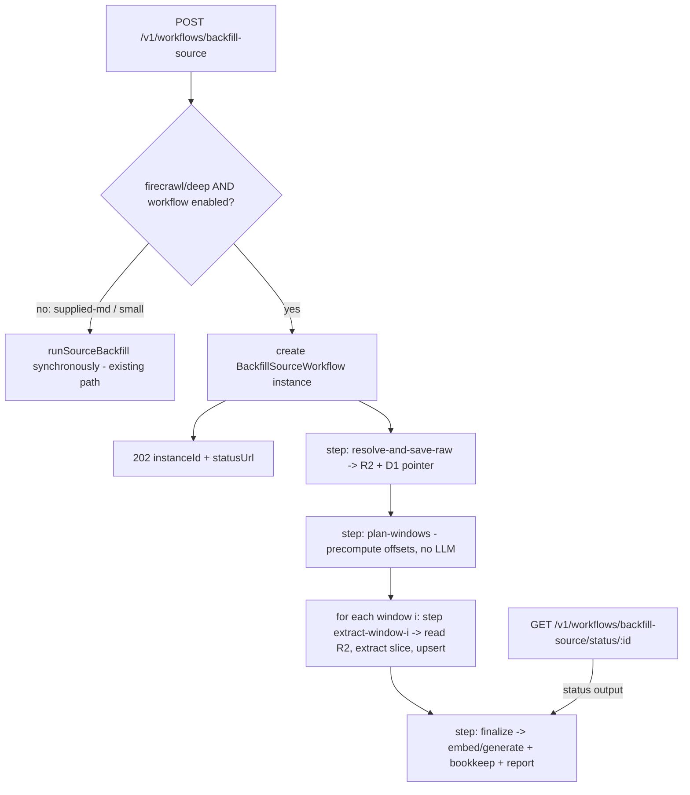

# Durable backfill: `BackfillSourceWorkflow` + R2 raw snapshot + per-window resumable extraction

- **Issue:** https://github.com/buildinternet/releases/issues/1281
- **Date:** 2026-05-30
- **Status:** Design — approved (via discussion)
- **Supersedes the root-cause analysis of:** #1271 / PR #1280 (the window-cap; kept as an upper bound)

## Root-cause correction (the premise that motivated this)

#1271/#1280 capped the Firecrawl backfill at 8 windows, justified by _"the ~106s `scrapeOnce` is the long pole."_ **That premise is false.** The Firecrawl dashboard shows each scrape completes in **~0.1–0.2s** (1 credit). The real cost is **sequential Haiku extraction**, scaling with the number of entries written out at **~1.8s/entry**:

| Entries                            | Time | per-entry |
| ---------------------------------- | ---- | --------- |
| 2 (supplied md)                    | 1.5s | 0.75s     |
| 55 (`maxWindows:1`)                | 108s | 1.96s     |
| 203 (full `chatgpt-release-notes`) | 355s | 1.75s     |

So a window-_count_ cap is the wrong lever (cost is per-entry), and for the canonical OpenAI source it never engaged (4 windows). The shipped cap is harmless as an upper bound but does not meet #1271's acceptance — _"completes reliably without depending on a client staying connected for minutes."_

## Problems with the current synchronous endpoint

1. **All-or-nothing, client-coupled.** A dense backfill is ~6 min; the DB write happens only after every window completes. A disconnect or any LLM error during those minutes discards **all** extraction work and writes nothing (re-run is idempotent, but the Haiku minutes are wasted).
2. **Raw content never persisted.** The scraped markdown lives in memory only; `content_hash` stores only a hash. No faithful snapshot to audit/reprocess (Haiku sometimes _condenses_ entries), and the live page drifts.
3. **No retry/resumability.** A transient LLM error fails the whole request.

## Design

A Cloudflare `BackfillSourceWorkflow` (model: `FirecrawlIngestWorkflow`) decouples from the client, retries per-step, and checkpoints. Two enabling pieces make it actually resilient (a naive one-big-step Workflow would retry the whole extraction and risk the step-state size limit on a multi-MB markdown return):

1. **Save raw → R2 first** (instant, durable). Steps pass the small **R2 key**, not the blob.
2. **Per-window extract steps.** Each window: read raw from R2 → extract that slice → upsert (idempotent). A failure on window N retries only window N; earlier windows are checkpointed **and already written**.

### Component 1 — Raw-snapshot persistence (R2 + D1 pointer)

- **R2:** dedicated bucket **`released-raw`** (separate lifecycle from `released-media`: raw is ephemeral/expirable, media is permanent/public). Key: `sources/{sourceId}/raw/{contentHash}.md` (and `.html` when an original HTML body exists). Content-hash keying → an unchanged page does not re-store (ties into existing `content_hash` change detection). One-time deploy prereq: `wrangler r2 bucket create released-raw` + an R2 lifecycle rule expiring objects after **90 days** (documented; not created from this PR).
- **D1 pointer table `source_raw_snapshots`:** `id` (snap\_…), `source_id`, `r2_key`, `content_hash`, `format` (`markdown`|`html`), `bytes`, `created_at`. Latest-per-source is the live pointer; older rows are the audit trail (expire with the R2 objects). schema.ts change + paired migration (CI gate).
- **Helper `saveRawSnapshot(env, { sourceId, body, format })`:** content-hash the body; `R2.put` at the key if absent; upsert the pointer row; return `{ r2Key, contentHash, bytes }`. **Helper `loadRawSnapshot(env, r2Key)`** returns the body. Both R2-binding-injected so they're unit-testable with a fake R2.
- Saving raw is **intrinsic to the durable workflow path** (it's what lets steps pass a pointer instead of the blob) — it is not separately flagged. The single `BACKFILL_WORKFLOW_ENABLED` flag (Component 3) gates the whole path; a future raw-snapshot-on-cron-scrape feature would get its own flag then.

### Component 2 — `BackfillSourceWorkflow`

`workers/api/src/workflows/backfill-source.ts`, params `{ sourceId, maxWindows, dryRun, suppliedMarkdown? }`. Steps:

1. **`resolve-and-save-raw`** (`RETRY_FETCH`): acquire body (supplied / Firecrawl `scrapeOnce` / fetch), `saveRawSnapshot` → return the **R2 key + format** (small). The body is never returned through step state, so the Cloudflare step-state size limit is never at risk regardless of page size.
2. **`plan-windows`** (`RETRY_POLL`): load raw from R2, walk `sliceChangelog` offsets **without the LLM** (cheap, deterministic) to produce the window offset list, clamped by `effectiveBackfillWindows(via, maxWindows)` (the merged cap, demoted to an upper bound). Return the offset array.
3. **`extract-window-{i}`** (`RETRY_FETCH`, looped): load raw from R2, slice at offset i, `extractFromBody` (Haiku t0 one-shot) → `mapEntries` → dedup-within-window → **on `dryRun:false`, `ingestRawReleases` immediately** (idempotent upsert; resumable). Return per-window counts. On `dryRun:true`, return the entries' counts/date-range without writing.
4. **`finalize`** (`RETRY_POLL`): aggregate counts + date range across windows; on `dryRun:false`, `embedReleasesForSource` + `generateContentForReleases` (chunked at 20) for the union of inserted ids; write `fetch_log` + bookkeep. The instance's `status().output` carries the `SourceBackfillReport` (now sourced from per-window aggregation), incl. `guidance` when the cap bit.

`NonRetryableError` for terminal cases (source not found, non-scrape). Binding `BACKFILL_SOURCE_WORKFLOW` + `index.ts` export + `wrangler.jsonc` workflow entry.

### Component 3 — Adaptive trigger + status routes

- **`POST /v1/workflows/backfill-source`** stays. New behavior: when the body would resolve via **Firecrawl** (deep/slow) **and** `BACKFILL_WORKFLOW_ENABLED` **and** the binding is present, create a workflow instance and return **`202 { instanceId, statusUrl, async: true }`**. Otherwise (supplied-markdown / plain-fetch / flag-off) run **synchronously** as today (fast path preserved; backward compatible).
- **`GET /v1/workflows/backfill-source/status/:instanceId`** — thin pass-through to `WorkflowInstance.status()` (mirror `batch-summarize/status`). Dry-run counts come from `status().output`.
- **Flag `BACKFILL_WORKFLOW_ENABLED`** (default off). Flag-off: 100% current synchronous behavior (zero risk to the shipped path).

### Component 4 — Cap demotion + docs

- `effectiveBackfillWindows` / `FIRECRAWL_BACKFILL_MAX_WINDOWS` retained as an **upper bound** inside `plan-windows`; the wrong "scrape is the long pole" rationale is removed from its JSDoc + `firecrawl-monitoring.md` and replaced with the corrected per-entry cost model.
- `firecrawl-monitoring.md`: document the corrected root cause, the R2-snapshot + Workflow flow, the trigger/poll ergonomics, and the `BACKFILL_WORKFLOW_ENABLED` flag.

## Idempotency & resumability contract

Per-window `ingestRawReleases` uses `RELEASE_URL_UPSERT` on matching `mapEntries` slugs — re-running a window (Cloudflare step retry) re-upserts the same rows as no-ops. Window offsets are deterministic from the R2 snapshot (no LLM), so a replayed `plan-windows` yields identical offsets. The R2 object is content-hash-keyed and immutable, so every window in a run reads the exact same body even across retries/replays. Net: any retry or full replay converges with no duplicates and no lost completed-window work.

## Non-goals (this work)

- Saving raw on the steady-state cron scrape path (only backfill + the Firecrawl-ingest webhook path here; cron later).
- Reprocessing tooling / UI over saved snapshots (the data is captured; a re-extract endpoint is a follow-up).
- Migrating the existing sync endpoint away entirely (kept as the fast path).
- Creating the prod R2 bucket / lifecycle rule (documented deploy prereqs).

## Testing

- **`saveRawSnapshot` / `loadRawSnapshot`** (fake R2 + bun:sqlite): content-hash key, skip-if-present dedupe, pointer upsert, round-trip load. Flag-off no-op.
- **`plan-windows` offset walk** (pure): multi-window fixture → deterministic offsets; cap clamps the list; single small doc → one window.
- **Per-window extract step** (injected extractor + fake R2): dryRun aggregates counts without writing; real run upserts per window; a window that throws leaves prior windows' writes intact (resumability) + retries cleanly.
- **Workflow run** (the `_drizzleOverride` / `_extractOverride` / `_firecrawlClientOverride` pattern from `firecrawl-ingest.test.ts` + a fake R2): full happy path; a mid-run window failure replays from the failed window only.
- **Route** (in-process `app.fetch`): firecrawl + flag-on → 202 `{ instanceId }`; supplied-markdown → synchronous report (unchanged); status route pass-through (404 unknown id).
- Gates: `npx tsc --noEmit` (root + workers/api), `bun run test`, `bun run lint`, `bun run format:check`.

## Acceptance → coverage map

| Issue #1281 acceptance                         | Covered by                                                                  |
| ---------------------------------------------- | --------------------------------------------------------------------------- |
| Completes independent of client                | Workflow (instanceId + poll)                                                |
| No lost work on error/disconnect; no re-scrape | R2 snapshot + per-window steps + checkpointing                              |
| Raw persisted, reprocessable                   | `source_raw_snapshots` + `released-raw` R2                                  |
| Idempotent                                     | per-window `RELEASE_URL_UPSERT` + content-hash-immutable R2 body            |
| Trigger + status; dry-run via output           | adaptive POST (202) + status route                                          |
| Flag-gated; sync retained                      | `BACKFILL_WORKFLOW_ENABLED` (default off; flag-off = current sync behavior) |
| Docs corrected                                 | cap JSDoc + `firecrawl-monitoring.md`                                       |

## Deploy prerequisites (documented; not done from the PR)

1. `wrangler r2 bucket create released-raw` (+ staging) and an R2 lifecycle rule: expire objects after 90 days.
2. Create the `BACKFILL_WORKFLOW_ENABLED` flag key in both Flagship apps (`releases-platform{,-staging}`) — or leave as a wrangler-var flag initially.
3. Migration auto-applies on deploy (D1 migrations run before the worker deploy).
