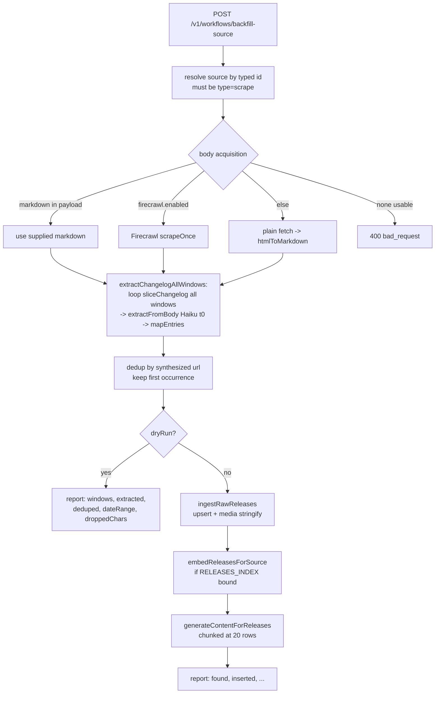

# Reusable full-history backfill primitive for windowed scrape/Firecrawl sources

- **Issue:** https://github.com/buildinternet/releases/issues/1265
- **Date:** 2026-05-30
- **Status:** Design — approved

## Problem

When a `scrape`/Firecrawl source onboards via a windowed baseline, `extractFirecrawlMarkdown` (`workers/api/src/lib/firecrawl-extract.ts:42`) slices the page to the recent `DEFAULT_CHANGELOG_SLICE_TOKENS` (10k) window so the one-shot extract stays under the output cap. Older history is structurally dropped. Recovering it today means hand-authoring a bespoke local Bun script per source (it bit us onboarding OpenAI `chatgpt-business-release-notes` 41→70 and `chatgpt-enterprise-edu-release-notes` 46→119). There is no turnkey, parameterized primitive a subagent, managed agent, or CLI can trigger.

A latent bug was also found during that manual backfill: `POST /v1/sources/:id/releases/batch` binds `media` as `string | null` directly; an array-valued `media` makes D1 reject the non-primitive bind. Because the endpoint is chunked + non-transactional, a bad row partial-inserts the preceding chunks then 500s.

## Goals

- A windowed/scrape source can be backfilled to full history with **one admin request** — no bespoke local script, no `node_modules`/worktree friction, no manual Firecrawl rate-pacing.
- `dryRun` (default) reports extracted/deduped counts + date range without writing.
- Re-running is **idempotent** (URL upsert; no duplicate rows).
- Backfilled rows are fully searchable + titled (inline embed + summary regeneration).
- The latent `/releases/batch` media-bind bug is fixed.

## Non-goals (this PR)

- CLI verb (`releases admin source backfill <slug>`). Lives in the separate `~/Code/releases-cli` repo; ships as a fast-follow PR that wraps this endpoint.
- A durable Cloudflare Workflow. The work is a bounded, cheap (Haiku temp-0), one-time-per-source operation triggered deliberately by an operator/agent — a synchronous endpoint mirroring `enrich-feed-content` is the right altitude. Revisit only if real histories prove too deep for a single request even with `maxWindows`.
- Browser Rendering escalation for the body fetch. The CF-challenge-blocked sources that would need it are exactly the ones that already moved to Firecrawl or are agent-browsed — they use the Firecrawl / agent-supplied-markdown paths instead.

## Execution & cost model (the "local agents orchestrate" intent)

The primary real-world trigger is a **local Claude Code sub-agent orchestrating a backfill at first-ingest time** — the endpoint is the mechanism that makes that a single request instead of a bespoke script. Cost is bounded and small by construction:

- Extraction is **Haiku 4.5 at temperature 0** (same model as `FirecrawlIngestWorkflow`), looping a fixed `DEFAULT_CHANGELOG_SLICE_TOKENS` window. A 100-entry full-history pass is ~6–10 windows ≈ a few cents — not the uncontrolled Sonnet loop that caused the MA-runaway incident.
- `maxWindows` caps the loop; `dryRun` (default `true`) previews counts before any spend or write.
- It is **not** wired into any cron/automation — it only runs when explicitly POSTed.
- The expensive/risky part (browsing a JS-heavy or CF-blocked page) is offloaded to the caller: a local agent that can render the page supplies the markdown directly (see "Body acquisition"), so the worker's job stays cheap Haiku extraction over agent-provided text.

## Design overview

The full pipeline already exists in-worker (`FirecrawlIngestWorkflow`). The only missing behavior is _loop-all-windows_ extraction; everything downstream (`ingestRawReleases`, `embedReleasesForSource`, `generateContentForReleases`, `RELEASE_URL_UPSERT`) is reused verbatim. Reusing the exact prod `extractFromBody` + `mapEntries` is the dedup-correctness contract (below) — that is why extraction stays server-side rather than free-handed by the agent.

## Components

### 1. `extractChangelogAllWindows()` — the reusable primitive

New export in `workers/api/src/lib/firecrawl-extract.ts`, sibling to `extractFirecrawlMarkdown`. Same `FirecrawlExtractDeps`. Loops `sliceChangelog` over the whole document (chaining `nextOffset`) instead of slicing once, accumulating `mapEntries` output. Returns `{ releases, windows, cappedAtWindow, droppedChars, totalInput, totalOutput }`. One-shot per window (`useToolLoop` unset — windowing keeps each call under the output cap). `maxWindows` (default 50) bounds the loop; if it stops before the end, `cappedAtWindow` is true and `droppedChars` reports the untouched tail (no silent caps). `extractFirecrawlMarkdown` stays as-is.

### 2. Body acquisition ladder

Full-page markdown, in priority order: (1) `markdown` supplied in the request body — primary local-agent path, works for any scrape source incl. JS/CF-blocked; (2) `metadata.firecrawl.enabled` → `scrapeOnce`; (3) plain `fetch` → `htmlToMarkdown` (`@releases/adapters/feed.js`) for static pages; (4) none usable → `400`/`502`/`503` with guidance.

### 3. `runSourceBackfill()` — DI core

New module `workers/api/src/lib/source-backfill.ts`. Mirrors `runEnrichBackfill`: pure-ish core taking injected pipeline functions (`resolveBody`, `extract`, `ingest`, `embedAndGenerate`) so it's unit-testable without the Workers runtime and so the route lazy-imports the `cloudflare:workers`-bound functions (the OpenAPI coverage check loads route modules under plain Bun). In-memory dedup by synthesized url (keep first); `dryRun` returns the report without `ingest`/`embedAndGenerate`; real run ingests then enriches inserted ids.

### 4. Route — `POST /v1/workflows/backfill-source`

In `workers/api/src/routes/workflows.ts`, beside `enrich-feed-content`. Inherits the v1 Bearer auth. Body `{ sourceId?, sourceSlug?, markdown?, maxWindows?, dryRun? }`. Reject bare slugs (typed `src_…`, per #690); 404 missing; 400 non-scrape; clamp `maxWindows` (1–200, default 50); `dryRun` default `true`; 503 if no Anthropic key (unless a test override is set). Lazy-import `resolveFetchEnv` + `generateContentForReleases` from `../workflows/poll-and-fetch.js` only on the non-dryRun path; `ingestRawReleases` + `embedReleasesForSource` come from `../cron/poll-fetch.js` (already top-level-importable under Bun). `embedAndGenerate` skips embed when `RELEASES_INDEX` is unbound, and **chunks inserted ids at 20** before `generateContentForReleases` (which bails entirely above `MAX_AUTOGEN_ROWS_PER_FIRE = 20`).

### 5. Batch media-bind fix

Extract a tiny pure helper `normalizeMediaBind(media: unknown): string` (`workers/api/src/lib/media-bind.ts`): string passthrough, null/undefined → `"[]"`, array/object → `JSON.stringify`. Use it at `sources.ts:725` so an array-valued `media` is stringified instead of bound as a non-primitive. The downstream R2 `JSON.parse` path already tolerates non-array results.

## Dedup & idempotency contract

`mapEntries` synthesizes the dedup URL as `` `${sourceUrl}#${slug(version ?? title)}` `` (inline slug: lowercase, `[^a-z0-9]+`→`-`, trim dashes, ≤60 chars — `shared.ts:348`). That URL is the `UNIQUE(source_id, url)` upsert key. Reusing the exact prod `extractFromBody` + `mapEntries` means re-submitting already-stored rows produces identical slugs → `RELEASE_URL_UPSERT` no-ops them. A single D1 `INSERT ... ON CONFLICT` cannot touch the same `(source_id, url)` twice, so the in-memory dedup before ingest is mandatory. This is why a free-handed agent parse is disallowed: drifted titles → drifted slugs → duplicate rows.

## Error handling

Unresolvable/empty body → `400`; non-scrape → `400`; missing source → `404`; missing `ANTHROPIC_API_KEY` → `503`; missing `FIRECRAWL_API_KEY` on a firecrawl source → `503`; Firecrawl scrape failure → `502` (surface the status); `cappedAtWindow`/`droppedChars > 0` → logged via `logEvent` and reported.

## Testing

- Unit (`extractChangelogAllWindows`): multi-window fixture; assert window count + accumulation, `maxWindows` cap sets `cappedAtWindow` + `droppedChars`, single small doc completes uncapped.
- Unit (`runSourceBackfill`): injected deps; dryRun writes nothing + reports counts/date range; real run ingests then enriches only when rows inserted; dedup collapses duplicate slugs.
- Unit (`normalizeMediaBind`): string passthrough, null→`"[]"`, array/object→stringified.
- Route smoke (in-process `app.fetch`, per `workflows-embed.test.ts`): bare-slug 400, unknown-id 404, non-scrape 400, 503 with no key, supplied-markdown dryRun report via a `_backfillExtractOverride` test hook.
- Gates: `npx tsc --noEmit` (root + `workers/api`), `bun test`, `bun run lint`, `bun run format:check`.

## Docs

- New section in `docs/architecture/firecrawl-monitoring.md`: the backfill endpoint, body-acquisition ladder, dedup contract.
- One-line entry in `AGENTS.md` Conventions pointing at it.

## Acceptance criteria mapping

| Issue acceptance                                          | Covered by                                                                                             |
| --------------------------------------------------------- | ------------------------------------------------------------------------------------------------------ |
| Full-history backfill via one admin call, no local script | `POST /v1/workflows/backfill-source`                                                                   |
| `dryRun` reports counts + date range                      | `SourceBackfillReport` on `dryRun: true`                                                               |
| Re-running idempotent (no dupes)                          | `RELEASE_URL_UPSERT` + reused `mapEntries` slugs + in-memory dedup                                     |
| `media`-bearing rows insert without error                 | `ingestRawReleases` (stringifies) on the backfill path; `normalizeMediaBind` for the legacy batch path |

## Open follow-ups (out of this PR)

- `releases admin source backfill <slug>` CLI verb (releases-cli).
- Optional Browser Rendering escalation in the body-acquisition ladder.
