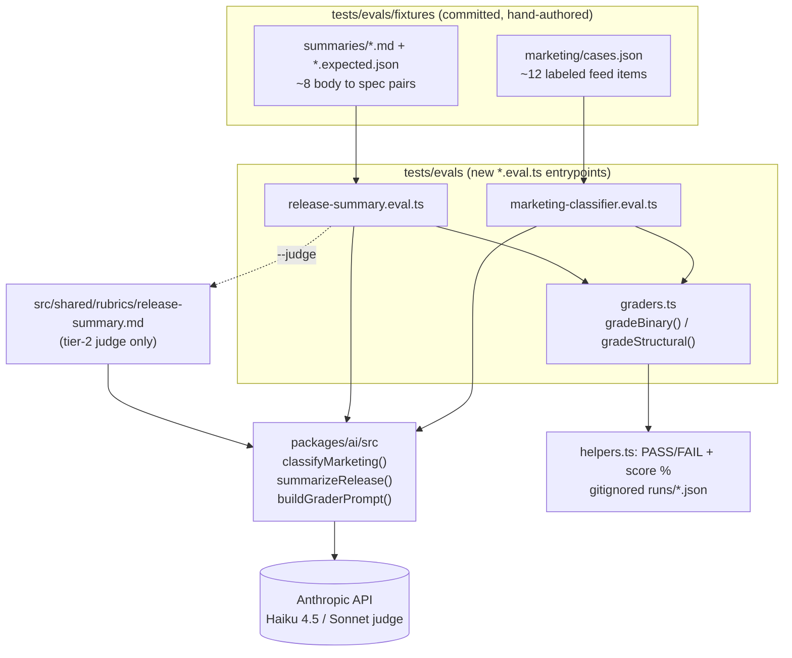

# 2026-06-01 — Local ad-hoc regression evals for the ingest-time AI passes

## Context

The repo has three eval shapes today: `eval:evaluation` (code-graded, deterministic, URL routing — no AI calls), a fixture grader for changelog parsing whose _run_ lives in the OSS CLI repo, and `tool-ux/` (manual, telemetry-based managed-agent comparison). The monorepo-specific AI surfaces that run on real ingest traffic — the **marketing classifier** and **release summarization** Haiku passes — have no local eval.

This spec adds two small, code-graded-first regression evals for those two surfaces. Both target functions are already eval-ready by design: their system prompts, input builders, and output parsers are exported "for cross-provider evaluation parity," and a rubric-grader scaffold (`packages/ai/src/grader-prompt.ts`, `buildGraderPrompt`) plus one rubric (`src/shared/rubrics/overview.md`) already exist. This is wiring, not new infrastructure.

## Goal

Catch regressions before/after a prompt or model change to either pass. Each eval is a **gate**: it exits non-zero below a committed threshold, so the workflow is "run it, change the prompt, run it again, compare."

## Non-goals / hard constraints

- **Local, ad-hoc only. Never CI.** These call the Anthropic API and cost money. They are run by hand via `bun run eval:*` and nothing else. Naming the files `*.eval.ts` is load-bearing: Bun's default test collector matches `*.test.ts`/`*.spec.ts`, **not** `*.eval.ts`, so `bun test tests/` (the root `test` script) will not pick them up. The existing `eval:evaluation` relies on the same fact.
- **Fail safe without a key.** If `ANTHROPIC_API_KEY` is absent, the eval prints a skip notice and exits 0 — an accidental invocation never spends money or hard-fails.
- Not a quality-score tracker, not an A/B prompt/model harness, not a human-grading pipeline. (All three are plausible fast-follows; none are in scope here.)
- No new shared eval framework. Reuse `helpers.ts` reporting and the `buildGraderPrompt` scaffold.

## Architecture



File layout (all new unless noted):

```text
tests/evals/
  marketing-classifier.eval.ts
  release-summary.eval.ts
  graders.ts
  helpers.ts                          # existing — reuse printResults/saveResults
  fixtures/
    marketing/cases.json
    marketing/runs/.gitignore         # *.json (mirror tool-ux)
    summaries/<name>.md
    summaries/<name>.expected.json
    summaries/runs/.gitignore
src/shared/rubrics/
  release-summary.md                  # new; tier-2 only
package.json                          # + eval:marketing, eval:summary scripts
```

Both evals construct the client the way `scripts/generate-release-content.ts` does — direct API, not AI Gateway — `new Anthropic({ apiKey: process.env.ANTHROPIC_API_KEY })`, guarded by the skip check above.

## Eval 1 — marketing classifier (binary, code-graded)

For each fixture, call `classifyMarketing(client, input)` and exact-match the predicted `isMarketing` against the label.

**Fixture shape** (`fixtures/marketing/cases.json`, one array):

```jsonc
{
  "id": "clickhouse-customer-case-study",
  "input": {
    "sourceName": "ClickHouse Blog",
    "title": "...",
    "content": "...",
    "url": "https://...",
    "hint": null,
  },
  "expected": { "isMarketing": true, "reason": "case_study" }, // reason optional, soft-checked
}
```

**Direction-weighted gate.** The classifier's own `<bias>` block makes the two error types asymmetric, so the report breaks the confusion matrix out by direction:

- **False positive** — predicted marketing, actually a real release → a real release gets hidden. The costly error.
- **False negative** — marketing slips through. Explicitly "cheaper" per the prompt.

Pass condition: `accuracy ≥ ACCURACY_FLOOR` **AND** `falsePositives ≤ MAX_FALSE_POSITIVES`. A change that starts hiding real releases fails even if aggregate accuracy looks fine. `reason` is reported but not gated (secondary signal).

**Noise.** Haiku is stochastic. A `RUNS_PER_CASE` constant (default `1`) with majority vote absorbs flit as the fixture set grows; start at 1 and size thresholds with margin.

## Eval 2 — release summarization (two tiers)

Per fixture, call `summarizeRelease(client, input)` once.

**Fixture shape** — markdown body + `<name>.expected.json` spec, mirroring `fixtures/changelogs/`. Borrow real bodies from the existing `fixtures/changelogs/` set, add explicit empty/boilerplate cases. Spec fields are structural, not exact-text:

````jsonc
{
  "expectDiscarded": false, // true => summary/titleShort must be null (empty-body path)
  "summaryMustBeNonEmpty": true,
  "forbidInSummary": ["<", "```", "Body:"], // augments the always-on leakage checks
}
````

**Tier 1 — structural (default, free).** Deterministic assertions that map to real past bugs in this code:

- Empty/boilerplate body → result discarded (`summary === null` / `skipped === true`); real body → non-null summary.
- The empty-body fallback sentinel never appears in a non-empty summary (this leaked to the live release page before — see `parseReleaseContent` comments).
- No XML tag / markdown-fence / `Body:` / `Here is` leakage in summary or `titleShort`.
- `titleShort` within the smart-brevity length bound.
- `parseReleaseContent` does not throw — catches prompt drift that breaks the `<empty>/<title>/<title_short>/<summary>/<composition>` tag contract.
- (Soft, reported not gated) composition non-null with plausible counts when the body clearly has bugs/features.

**Tier 2 — faithfulness (opt-in `--judge`, costs money).** Feed body + produced summary through `buildGraderPrompt` against a new `src/shared/rubrics/release-summary.md`, judged by Sonnet (the grader-prompt default rationale). Require top-level verdict `satisfied`. Catches "summary misrepresents / invents / contradicts the body" — the semantic regressions Tier 1 cannot see. Off unless `--judge` is passed; built in the same PR so the rubric ships with its consumer.

## Grading utilities (`graders.ts`)

Two small pure functions next to the existing `helpers.ts`:

- `gradeBinary(cases, predictions) → { accuracy, falsePositives, falseNegatives, perCase[] }`.
- `gradeStructural(spec, result) → { passed, fields: FieldResult[] }`, reusing the existing `FieldResult`/`printResults` shape so output looks like the current evals.

Reporting goes through the existing `helpers.ts` `printResults` / `saveResults`; JSON snapshots land in the gitignored `runs/` dirs.

## Thresholds (starting values, tune as fixtures grow)

Named constants at the top of each eval file with rationale comments:

| Constant                          | Start  | Rationale                                                               |
| --------------------------------- | ------ | ----------------------------------------------------------------------- |
| `ACCURACY_FLOOR` (marketing)      | `0.85` | Below current expected; leaves headroom for 1-run noise on ~12 cases.   |
| `MAX_FALSE_POSITIVES` (marketing) | `0`    | Encodes the prompt's cost asymmetry — no real release should be hidden. |
| `RUNS_PER_CASE` (marketing)       | `1`    | Single call; raise + majority-vote when the set grows.                  |
| `TITLE_SHORT_MAX_CHARS` (summary) | `120`  | Eval-defined smart-brevity bound; no code constant exists.              |

## Start-small scope (v1 PR)

In: Tier-1 structural checks for both evals, ~12 marketing fixtures + ~8 summary fixtures (hand-authored from each prompt's documented categories and the existing changelog fixtures), the `--judge` tier + `release-summary.md` rubric (off by default), and the two `package.json` scripts.

Out (fast-follows, noted not built): mining real labeled fixtures from prod `suppressed` rows (`suppressedReason=marketing_classifier:*`), an A/B prompt/model comparison harness, and an overview-generation eval reusing the Tier-2 rubric machinery.

## Risks / open questions

- **Fixture realism.** Hand-authored marketing fixtures may not match prod's hard cases. Accepted for v1 (determinism + no prod coupling); prod-mining is the first fast-follow.
- **Haiku non-determinism at the boundary.** A fixture near the real/marketing boundary may flip run-to-run. Mitigation: keep v1 fixtures clearly-labeled (save genuinely ambiguous cases for when `RUNS_PER_CASE` > 1), and size `ACCURACY_FLOOR` with margin.
- **Judge cost/noise.** Tier 2 is opt-in precisely because Sonnet grading costs money and adds variance; it is never part of the default gate.
