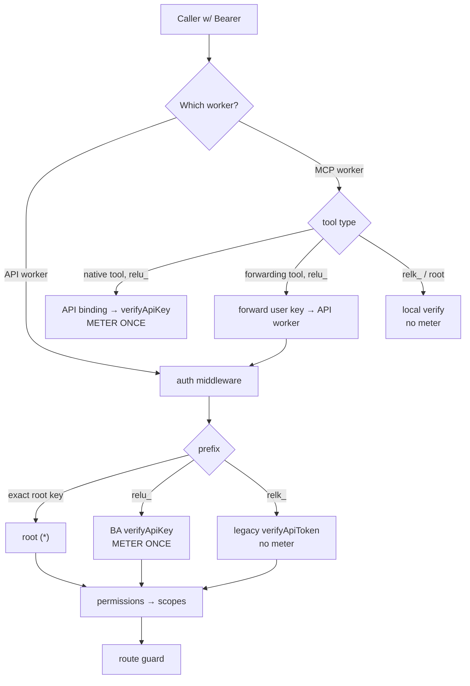

# Better Auth API Keys — Design

**Date:** 2026-06-04
**Status:** Approved (design); pending implementation plan
**Surface:** API worker (`workers/api/`) as system-of-record for user keys; MCP worker (`workers/mcp/`) enforces over the existing `API` service binding; web frontend (`web/`) for self-serve management.
**Supersedes (in part):** the user-facing future-work items of [`2026-05-20-scoped-api-tokens-design.md`](./2026-05-20-scoped-api-tokens-design.md) — per-token rate limiting and user-facing self-service. The `relk_`/`api_tokens` system from that spec is retained as the **machine lane** (see §1).

## Summary

We already ship a deliberately engineered scoped-token system: opaque `relk_<lookupId>_<secret>` tokens in `api_tokens`, a monotonic `read ⊂ write ⊂ admin` scope ladder, a constant-time verifier shared by the API and MCP workers, a static `RELEASES_API_KEY` implicit root, and the `API_TOKENS_DISABLED` kill switch. What it does **not** have — and what the next few weeks of work need — is **logged-in users minting their own keys**, **per-key rate limiting**, and **usage quotas / metering**. Those last two are the parts that are fiddly to build correctly on serverless D1, and they are exactly what Better Auth's [`@better-auth/api-key`](https://better-auth.com/docs/plugins/api-key) plugin ships.

Better Auth is already integrated into the API worker (human sessions: email/password, magic link, Google/GitHub OAuth, D1 rate limiting, `backgroundTasks: waitUntil`). This design **adopts the Better Auth API key plugin as the system-of-record for user-owned keys**, while keeping the existing `relk_` system as a thin, unmetered **machine lane** for `internal`/`agent` principals. The two lanes are distinguished by prefix so routing is unambiguous. Three facts make adoption cheap rather than painful, and each is verified against the current tree:

1. **MCP already calls the API worker over a Cloudflare service binding** (`env.API` → `releases-api`, used today in `maybeLookup`), so "MCP can't run Better Auth" is a non-issue — MCP verifies user keys over that same in-Cloudflare hop.
2. **`backgroundTasks: { handler: waitUntil }` is already wired** into the Better Auth `advanced` config, so the plugin's `deferUpdates` (deferred metering/rate-limit writes) works out of the box.
3. **No live `relk_` tokens exist yet** (system merged 2026-05-20, bootstrap not done, only the internal `mint-token.ts`) — and the `relk_` machine lane is left untouched, so adding the new `relu_` user-key prefix is zero-migration.

## Goals

- Authenticated users mint, name, list, and revoke their **own** API keys from the web app, self-service.
- **Per-key rate limiting** (request ceiling per time window), enforced automatically on both the REST API and the MCP server.
- **Usage quotas / metering** (`remaining` + `refillInterval`/`refillAmount`) per key.
- Preserve the existing scope semantics (`read ⊂ write ⊂ admin`) so every current route guard keeps working unchanged.
- Give user keys a fresh `relu_` prefix; leave the existing `relk_` machine lane untouched (both GitHub secret-scanning candidates).
- Keep `internal`/`agent` machine tokens and the static root credential working, fast, and unmetered.
- Adopt a maintained plugin rather than hand-build the metering/rate-limit engine.

## Non-goals (named boundaries)

- **Organization-owned keys** — not requested. They would require the Better Auth `organization` plugin, which is currently held. Out of scope; revisit if team keys become a need.
- **Multiple Better Auth API-key configurations** — v1 uses a single default config. Tiers are modeled via `metadata.plan` + per-key rate-limit/quota fields, not separate `configId`s.
- **`enableSessionForAPIKeys`** — we verify keys explicitly; we do **not** mock user sessions from keys (Better Auth's own docs warn this enables impersonation from a leaked key).
- **Secondary storage (Redis)** — D1 is the only backend at current scale. No `secondaryStorage` for API keys.
- **Migrating machine tokens into Better Auth** — `internal`/`agent` tokens stay on the unchanged `relk_` lane (decided: a thin machine lane, not synthetic service-user accounts).
- **Replacing the static root key** — `RELEASES_API_KEY` remains a separate, local, break-glass credential, unmetered and unaffected by the plugin.

## Decisions and rationale

| Decision             | Choice                                                            | Why                                                                                                                                                                                                                 |
| -------------------- | ----------------------------------------------------------------- | ------------------------------------------------------------------------------------------------------------------------------------------------------------------------------------------------------------------- |
| Build vs. adopt      | **Adopt** `@better-auth/api-key` for user keys                    | Rate limiting + metering are the hard parts on serverless D1; the plugin ships them, maintained. The three usual frictions (MCP, deferred writes, migration) are already neutralized.                               |
| Machine tokens       | Keep on the existing **`relk_`** system, unchanged                | Least disruption; preserves the fast cross-worker pure verifier for machines; keeps the metered human path and the unmetered machine path cleanly separated.                                                        |
| Lane routing         | By **prefix** (`relu_` user, `relk_` machine, exact root key)     | Unambiguous; each verifier returns an authoritative verdict — no fall-through guessing across verifiers, no double-metering risk.                                                                                   |
| Scope model bridge   | Cumulative actions on one `api` resource + a translation shim     | Better Auth permissions are a flat all-present map; encoding cumulative arrays reproduces the monotonic ladder and lets the middleware translate back to the existing `scopes` array so route guards are untouched. |
| Self-serve scope cap | Users may mint `read`/`write` only; `admin` stays operator-only   | A logged-in user must never mint a key that outranks their own privilege.                                                                                                                                           |
| Metering placement   | **Exactly one** metering verify per inbound request               | Better Auth's `verifyApiKey` mutates state (rate counter + `remaining`); double-verifying would double-count. The MCP routing in §4 guarantees the single-meter invariant.                                          |
| Deferred writes      | `deferUpdates: true`                                              | `waitUntil`/`backgroundTasks` is already configured; keeps the hot auth path off the metering write.                                                                                                                |
| Key prefix           | `relu_` for user keys; `relk_` machine lane untouched             | New user keys get a fresh prefix via the plugin's `defaultPrefix`, so the existing `relk_` references (constant, regex, tests, both workers) don't move — zero ripple. Both are GitHub secret-scanning candidates.  |
| Rollout gate         | Flagship `user-api-keys-enabled` + existing `API_TOKENS_DISABLED` | Boolean kill switch for the new user-key path and self-serve creation, separate from the whole-token-path switch.                                                                                                   |

## 1. Two lanes, routed by prefix

| Lane             | Prefix               | Owner                          | Stored in                   | Metered? | Verifier                       |
| ---------------- | -------------------- | ------------------------------ | --------------------------- | -------- | ------------------------------ |
| **User keys**    | `relu_`              | a Better Auth `user`           | Better Auth `apikey` table  | yes      | `auth.api.verifyApiKey`        |
| **Machine keys** | `relk_`              | `internal` / `agent` principal | existing `api_tokens` table | no       | existing pure `verifyApiToken` |
| **Static root**  | (none — exact match) | implicit root                  | —                           | no       | constant-time string compare   |

Routing is by prefix, so a token is eligible for exactly one verifier and each verdict is authoritative. The existing machine lane keeps `relk_` **unchanged**; user keys introduce the new `relu_` prefix, so no existing reference (the core constant/regex, `core-internal`, both workers, `api-types`, tests) moves. If GitHub secret-scanning partner registration is pursued, both `relk_` and `relu_` patterns are registered.

**Key format note:** user keys adopt Better Auth's `<prefix><opaque-secret>` shape (the `relu_` prefix set via the plugin's `defaultPrefix`; lookup is by the stored hash of the whole key). They do **not** use the legacy `relk_<lookupId>_<secret>` tri-part structure — that structure stays on the unchanged `relk_` machine lane.

## 2. Scope ladder → Better Auth permissions

Better Auth permissions are a resource→actions record checked for all-present membership; our model is a monotonic ladder. Bridge by storing **cumulative** actions on a single `api` resource at key creation:

| Scope   | Stored permissions                    |
| ------- | ------------------------------------- |
| `read`  | `{ api: ["read"] }`                   |
| `write` | `{ api: ["read", "write"] }`          |
| `admin` | `{ api: ["read", "write", "admin"] }` |

A small pure shim (`workers/api/src/auth/api-key-scope.ts`, worker-local) sits beside the existing scope helpers:

- `scopeToPermissions(scope)` — expand a ladder scope to its cumulative permission set (creation side).
- `apiScopesFromPermissions(perms)` — read a verified key's `api` actions back as a `scopes` array (verify side).

Because the stored permissions are _cumulative_ (`{ api: ["read","write"] }`), the `api` actions array **is** a valid `scopes` array. After a successful Better Auth verify, the middleware sets that array on the Hono context **exactly as today** — so every existing scope-based guard (`publicReadAuthMiddleware`, `authMiddleware`, the admin `isValidBearerAuth` field-unlock predicate) keeps working with no change beyond the new verify branch; `scopeSatisfies` does the gating and no per-route permission argument is needed at verify time.

**Self-serve safety rule:** the user-facing create path accepts only `read` and `write`. `admin` keys are operator-only (machine lane / `mint-token.ts`). This is enforced server-side, not just in the UI.

## 3. API-worker middleware (the heart)

`workers/api/src/middleware/auth.ts` Bearer resolution becomes a four-way branch:

1. exact `RELEASES_API_KEY` → root, `scopes = ["*"]` _(unchanged path)_.
2. starts with `relu_` → `auth.api.verifyApiKey({ body: { key } })`. On `valid`, attach the user principal and set `scopes = apiScopesFromPermissions(key.permissions)` (the cumulative `api` actions). **This is the single metering verify** (rate-limit counter + `remaining` decrement, deferred via `waitUntil`). Gated by `API_TOKENS_DISABLED` and `user-api-keys-enabled`.
3. starts with `relk_` → existing `verifyApiToken` against `api_tokens` _(unchanged logic and prefix; unmetered machine lane)_.
4. else → reject (`401`).

Failure-mode mapping is preserved: auth failures → `401`; valid-but-insufficient-scope → `403`; rate-limited → `429` (with Better Auth's `tryAgainIn`); quota-exhausted key → auto-disabled by the plugin, subsequently `401`. One inbound request triggers exactly one `verifyApiKey`, so it meters exactly once.

## 4. MCP worker — and the meter-once invariant

**Invariant: each inbound request meters the presented user key exactly once.** MCP already reaches the API worker over the `API` service binding (`releases-api` / `releases-api-staging`), so enforcement is a local-Cloudflare hop, not a public round-trip. `workers/mcp/src/auth.ts` identity resolution becomes:

The rule is **behavioral**, not a fixed tool list: classify each MCP tool by whether it already calls the API worker.

- **Static root** → local constant-time check _(unchanged; unmetered)_.
- **`relk_` machine key** → local `verifyApiToken` via the shared pure verifier _(unchanged; unmetered)_.
- **`relu_` user key, MCP-native tool** (a tool that resolves entirely inside MCP and never calls the API worker — e.g. the AI tools `summarize_changes` / `compare_products`) → MCP calls a new `verifyApiKey` endpoint over the `API` binding → **metered once here**.
- **`relu_` user key, forwarding tool** (a tool that already proxies to the API worker — e.g. `maybeLookup` → `/v1/lookups`) → MCP **forwards the user key unchanged**; the API-worker middleware (§3) verifies + meters **once at the operation**. MCP does _not_ pre-verify these, so there is no double count — it propagates the API worker's `200`/`403`/`429` verbatim.

Metering therefore happens in exactly one place per request: native → MCP, forwarding → API. The only new internal surface is an **`API`-binding-only `verifyApiKey` endpoint** (rejects anything not arriving via the service binding — same internal-trust posture the staging-key bridge already uses). No "non-metering introspection" endpoint is needed, because forwarding tools defer entirely to the operation's own verify.

**Implementation checklist item:** enumerate every MCP tool and tag it native vs. forwarding (does it call `env.API`?). Mis-tagging a forwarding tool as native would double-meter; mis-tagging a native tool as forwarding would let it skip metering. The `search*` tools in particular must be classified by inspecting whether they proxy to `/v1/search` or query their own binding directly.

## 5. Self-serve surface (web)

A new **API Keys** panel in account settings on `releases.sh`, using Better Auth's `apiKeyClient()` against `api.releases.sh/api/auth/*` (the cross-subdomain `.releases.sh` session cookie is already established):

- **List:** name, `start` (first chars for identification), scope, created, last-used, tier, `remaining`.
- **Create:** name + scope (`read`/`write` only) → reveal the full key **exactly once**.
- **Revoke / delete.**

No emojis / arrow glyphs in the UI (house rule). This panel can land as its own phase after the server side is verified; the server side (plugin config + middleware + MCP) is the gating work.

## 6. Tiers, rate-limit & quota config

v1 ships a **single default tier**: per-key `rateLimit { maxRequests, timeWindow }`, optional `remaining` + `refillInterval`/`refillAmount`, assigned via `metadata.plan`. `deferUpdates: true` keeps metering writes off the hot path. Rate-limit `enabled` gates on `ENVIRONMENT === "production"` with a local opt-out, mirroring the existing Better Auth auth rate-limit. Numeric tunables (limits, windows, refill amounts) live in code/env, **not** Flagship, per the feature-flags convention (Flagship is boolean kill switches only). The tier definition is a structured table so adding tiers later is data, not rework.

## 7. Flags, schema, migration

- **Kill switches:** reuse `API_TOKENS_DISABLED` to disable the whole token path (both lanes); add a Flagship boolean **`user-api-keys-enabled`** to gate only the Better Auth user-key verify branch + self-serve creation, for staged rollout. Create the key in both Flagship apps (`releases-platform` and `releases-platform-staging`) per the flag-adding process.
- **Schema:** add the Better Auth `apikey` table to the Drizzle composite schema (`workers/api/src/db/schema-auth.ts`, alongside the other Better Auth tables) **and** a hand-written paired D1 migration under `workers/api/migrations/` — required by the schema-pairing CI gate. Columns follow the plugin reference (`id`, `name`, `start`, `prefix`, `key` (hash), `referenceId`, `refillInterval`/`refillAmount`/`lastRefillAt`, `enabled`, `rateLimitEnabled`/`rateLimitTimeWindow`/`rateLimitMax`/`requestCount`, `remaining`, `lastRequest`, `expiresAt`, `createdAt`, `updatedAt`, `permissions`, `metadata`); index the hashed `key` and `referenceId`.
- **`api_tokens`** and its `relk_` machine lane are **entirely unchanged** — the core generator, `parseApiToken`, `isApiTokenShaped`, `mint-token.ts`, and every existing `relk_` reference/test stay as-is. Only two pure additions land in `core` (`USER_API_KEY_PREFIX = "relu_"`, `isUserApiKeyShaped`).
- **Local parity:** local D1 picks up the new table via `bun run db:reset:local`. Staging migration is tested via `bunx wrangler d1 migrations apply DB --env staging --remote` (records the `d1_migrations` row), then prod with confirmation.

## 8. Security considerations

1. **Hashing on** — `disableKeyHashing` stays false; only the SHA-style hash is stored, never plaintext. The full key is shown exactly once at creation.
2. **Lane isolation** — a `relu_` token is verified by Better Auth only; `relk_` by the legacy verifier only; the static key by exact compare only. No token is eligible for two verifiers, so there is no overlap-bypass and no double-meter.
3. **Single metering path** — the §4 invariant guarantees one meter per request; a leaked-or-shared key can't be made to under- or over-count by routing it through MCP vs. REST.
4. **Internal verify endpoint is binding-only** — the MCP-native `verifyApiKey` endpoint rejects any request not arriving via the `API` service binding; it never widens scope (returns the key's own verified scope, never root).
5. **Self-serve privilege ceiling** — server-side enforcement that user-minted keys cap at `write`; `admin` is operator-only.
6. **Redaction** — the `Authorization` header / full key never appear in `logEvent`, `search_queries`, telemetry, or error traces; only `start`/`id` are loggable.
7. **Bearer-only** — keys accepted only via `Authorization: Bearer` (and the MCP Bearer bridge), never a query param.
8. **Instant revocation** — D1-backed, no verification cache, so a revoked or quota-exhausted key fails on the next request.
9. **Rate-limit fail-closed in prod** — consistent with the existing auth rate-limit posture (`ENVIRONMENT === "production"`), not coupled to any signing secret.

## 9. Testing

- **Pure unit:** `scopeToPermissions` / `apiScopesFromPermissions` round-trip across `read`/`write`/`admin`; prefix routing (`relu_` vs `relk_` vs root vs garbage).
- **API middleware (`tests/db-helper.ts` fixtures):** valid user key grants per scope; insufficient scope → `403`; expired → `401`; rate-limit exceeded → `429`; quota exhaustion auto-disables then `401`; machine `relk_` key still works and is **not** metered; static root unaffected; self-serve create rejects `admin` scope.
- **Meter-once:** assert a native MCP tool meters exactly once; assert a forwarding MCP tool meters exactly once (at the API worker, **not** twice); assert REST meters once.
- **Constant-time:** keep the existing constant-time test on the machine lane.
- **Web:** create→reveal-once→list→revoke against `api.releases.sh/api/auth/*` with a session cookie.

## 10. Rollout

1. Add the plugin + `apikey` table behind `user-api-keys-enabled` (off) — no behavior change.
2. Land middleware §3 + MCP §4 + the binding-only verify endpoint; enable in **staging**, smoke create/verify/rate-limit/quota end to end (REST + MCP native + MCP forwarding).
3. Confirm `internal`/`agent` machine paths + static root unaffected (the `relk_` lane is unchanged — nothing to re-prefix).
4. Ship the web self-serve panel.
5. Flip `user-api-keys-enabled` on in prod; mint the first user keys.

Rollback at any step: flip `user-api-keys-enabled` off (user path) or `API_TOKENS_DISABLED=true` (whole token path), leaving the static root key as break-glass.

## 11. Future work

- Organization-owned keys (needs the held `organization` plugin) if team keys become a need.
- Multiple tiers / `configId`s if pricing tiers diverge enough to warrant separate prefixes or rate-limit defaults.
- OSS CLI verbs for user key management (downstream `releases-cli`).
- Optional short-TTL verification cache only if authed volume grows enough to matter (trades revocation latency for read load — deliberately deferred).
