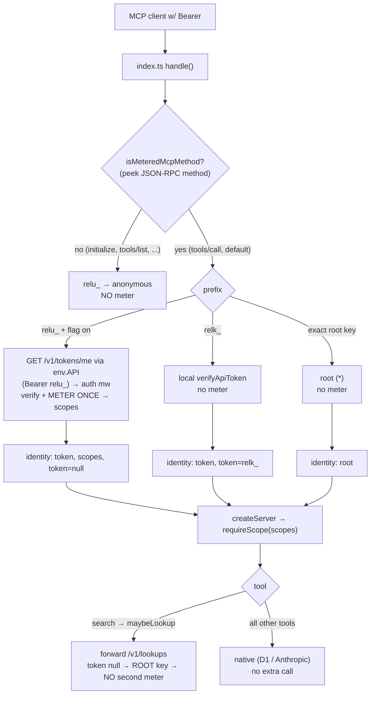

# Better Auth API Keys — Phase 2 (MCP Enforcement) Design

**Date:** 2026-06-05
**Status:** Approved (design); pending implementation plan
**Surface:** MCP worker (`workers/mcp/`) enforces `relu_` user keys over the existing `API` service binding; API worker (`workers/api/`) extends `GET /v1/tokens/me` as the introspection/metering touchpoint.
**Builds on:** Phase 1 — [`2026-06-04-better-auth-api-keys-phase1-server-core.md`](../plans/2026-06-04-better-auth-api-keys-phase1-server-core.md) (server core: `relu_` lane, `apikey` table, scope shim, middleware, `user-api-keys-enabled` flag). Parent design: [`2026-06-04-better-auth-api-keys-design.md`](./2026-06-04-better-auth-api-keys-design.md) §4.

## Summary

Phase 1 made `relu_` user keys work on the **REST API** (verify + meter via Better Auth's `verifyApiKey`, scope-translated, rate-limited, flag-gated OFF). The MCP worker still knows nothing about `relu_` — `workers/mcp/src/auth.ts` resolves only `relk_` (machine), the static root key, and anonymous read. Phase 2 makes `relu_` keys work through the remote MCP server **metered exactly once per billable tool call**, mirroring the REST behavior.

The design rests on three facts verified against the current tree:

1. **MCP resolves auth exactly once per inbound POST**, at a single chokepoint — `resolveMcpAuth` (`workers/mcp/src/index.ts:30`) — _before_ any tool routing. Each MCP `tools/call` is its own HTTP POST, so it gets its own auth resolution.
2. **There is exactly one place in the entire MCP worker that forwards to the API worker:** `maybeLookup` (`workers/mcp/src/mcp-agent.ts:379`), a write-gated fallback _inside_ the `search` tool. Every other tool queries D1 directly (the two AI tools call Anthropic directly). So the spec's "native vs. forwarding" classification collapses to **one** tool needing special handling.
3. **The MCP worker never needs to instantiate Better Auth.** It authenticates the caller's `relu_` key against the API worker over the existing `env.API` binding; the API worker's existing auth pipeline verifies + meters. This keeps all `better-auth`/`kysely`/`zod` out of the MCP bundle — avoiding the MCP-zod-pin landmine ([`reference_mcp_worker_zod_pinned_to_sdk_nested`]).

**Metering is a property of `relu_` authentication, not of any bespoke endpoint.** Every time a `relu_` key is authenticated against the API worker, Better Auth's `verifyApiKey` meters it (rate-limit counter + optional `remaining`) — and that is exactly the "meter all authenticated calls" policy chosen for this phase. So MCP does not need a custom "verify" verb: it authenticates the caller's key against `GET /v1/tokens/me` over the binding, and the existing middleware meters once as a side effect. This is holder-presented token introspection (RFC 7662 in spirit).

## Goals

- `relu_` user keys authenticate to the MCP server and receive their resolved scopes (`read`/`write`/`admin`), gating the AI tools and the on-demand lookup exactly as `relk_` does today.
- **Meter exactly once per billable MCP tool call** — never zero (a tool ran unmetered), never twice (double-counted).
- **Do not meter protocol overhead** — `initialize`, `tools/list`, `resources/list`, `prompts/list`, `ping`, notifications, etc. consume no quota.
- Keep `relk_` machine keys and the static root credential **local and unmetered**, unchanged.
- Reuse the existing `user-api-keys-enabled` flag; the whole path is inert in prod until Phase 3 flips it.
- No new public route surface; reuse `GET /v1/tokens/me` as the introspection touchpoint.

## Non-goals (named boundaries)

- **Web self-serve panel + self-serve `admin` scope cap** — Phase 3.
- **Rich `relu_` introspection fields** (key name, `remaining`, `userId`, last-used) on `GET /v1/tokens/me` — Phase 2 returns `scopes` (all MCP consumes); fuller metadata is a Phase 3 enrichment.
- **MCP-side IP rate limiting for anonymous callers** — unchanged; anonymous MCP reads are not rate-limited today and this phase does not add it. The `relu_` per-key rate limit comes for free via the API worker's Better Auth instance.
- **Flipping `user-api-keys-enabled` ON** — rollout happens after Phase 3 (the self-serve scope cap must exist before keys can be minted).
- **Changing the API worker's public-read metering of `relu_`** — it already meters a presented `relu_` key, which matches the chosen "meter all authenticated calls" policy; no change.

## Decisions and rationale

| Decision                   | Choice                                                                  | Why                                                                                                                                                                                                                               |
| -------------------------- | ----------------------------------------------------------------------- | --------------------------------------------------------------------------------------------------------------------------------------------------------------------------------------------------------------------------------- |
| Metering policy            | **All authenticated tool calls** meter once; protocol overhead excluded | Consistent with the API worker; v1 tier is rate-limit-primary with a generous ceiling, so free reads counting is acceptable. Overhead excluded because metering lives in the per-tool-call path, not the handshake.               |
| Meter site                 | **Boundary + method check** (`resolveMcpAuth`)                          | The single existing auth chokepoint. Peek the JSON-RPC method; verify+meter only for billable methods. Reuses all existing plumbing (`authScopes`/`authToken` → `createServer`, `requireScope` unchanged).                        |
| Verify/meter touchpoint    | **`GET /v1/tokens/me`** over `env.API` (no new route)                   | Metering rides on `relu_` authentication; the existing `tokensAuthMiddleware` verifies+meters once (`RESOLVE_MEMO`). Reframes as token introspection, not an RPC verb. Closes the known Phase-1 `/me` `relu_` 401 gap as a bonus. |
| `maybeLookup` double-meter | Set `identity.token = null` for `relu_`                                 | The existing `authToken ?? rootKey` fallback then routes the `/v1/lookups` forward through the root key — so a `search`-triggered lookup never adds a second meter. **Zero change to `maybeLookup`.**                             |
| Trust posture              | None beyond authentication (no proxy-key)                               | `/v1/tokens/me` is self-introspection: you must present a valid key to learn about _that_ key. Not a verification oracle; probing random strings yields 401s, already rate-limited.                                               |
| Error posture              | Fail-open to anonymous; 429 only on rate-limit                          | Matches current MCP handling of an invalid `relk_` (degrade to anonymous read) and the API worker's public-read posture.                                                                                                          |
| Flag gate                  | Reuse `user-api-keys-enabled` (+ `API_TOKENS_DISABLED`)                 | One flag flips both workers together at Phase 3 rollout; inert in prod today.                                                                                                                                                     |

## 1. The meter-once invariant for this architecture

**Each inbound billable MCP request meters the presented `relu_` key exactly once.**



Metering happens in exactly one place per billable request: the `GET /v1/tokens/me` call made at the MCP boundary. Non-billable methods skip it. The only forwarding path (`maybeLookup`) is neutralized by `token: null`.

## 2. Introspection/metering touchpoint — `GET /v1/tokens/me` (API worker)

No new route. The MCP worker authenticates the caller's `relu_` key against the existing endpoint:

```
GET https://internal/v1/tokens/me
Authorization: Bearer relu_<...>
X-Releases-Staging-Key: <staging secret>   # only when bound (staging); no-op in prod/local
```

- The request flows through the existing `tokensAuthMiddleware → requireReadAuthMiddleware` pipeline. For a `relu_` Bearer this calls Phase 1's `verifyUserKey` (memoized per request via `RESOLVE_MEMO`), so the key is **verified + metered exactly once**.
- **Handler extension** (`workers/api/src/routes/api-tokens.ts`, the `GET /tokens/me` handler at line 119): today, after the `root`/local-dev branches, it queries the `api_tokens` lane by `auth.tokenId`. A `relu_` identity has `tokenId = USER_API_KEY_PREFIX + keyId`, finds no `api_tokens` row, and returns 401 — the known Phase-1 gap. Add a branch **before** the `api_tokens` query:

  ```ts
  if (isUserApiKeyShaped(auth.tokenId)) {
    return c.json({
      kind: "token",
      name: null, // Phase 3 enrichment: real key name
      scopes: auth.scopes, // already resolved by the middleware
      principalType: "user",
      principalId: null, // Phase 3 enrichment: BA userId
      expiresAt: null,
      lastUsedAt: null,
    } satisfies TokenIdentity);
  }
  ```

  No DB query — `scopes` is already on the resolved `auth` context. This both serves MCP (which reads `scopes`) and closes the `relu_` 401 self-introspection gap.

- **Not an oracle, no proxy-key needed.** Self-introspection requires presenting a valid key to learn about that key; an invalid `relu_` yields 401 (already rate-limited at the auth layer). `RELEASES_PROXY_KEY` is **not** bound to the MCP worker for this.
- **Coupling note:** `/v1/tokens/me` must stay a cheap call whose `relu_` path triggers no heavy work — metering rides on the auth middleware, and the handler returns context scopes directly. Keep it that way; it is now on the MCP hot path.

## 3. MCP boundary — `relu_` branch + method-aware metering (`workers/mcp/src/auth.ts`)

### 3.1 Billable-method peek

A small helper determines whether the inbound POST is a billable tool call. It clones the request, parses the JSON-RPC body, and returns `false` only for an allowlist of non-billable methods; **default `true`** (fail-toward-metering on parse failure or unknown method):

```ts
const NON_BILLABLE = new Set([
  "initialize",
  "tools/list",
  "resources/list",
  "resources/templates/list",
  "prompts/list",
  "ping",
  "logging/setLevel",
  "completion/complete",
]);

function isBillableMethod(method: unknown): boolean {
  if (typeof method !== "string") return true; // unknown/absent method → meter (safe)
  if (method.startsWith("notifications/")) return false; // fire-and-forget, no response
  return !NON_BILLABLE.has(method);
}

async function isMeteredMcpMethod(request: Request): Promise<boolean> {
  if (request.method !== "POST") return false; // GET = SSE stream, never billable
  try {
    const body = await request.clone().json();
    // Batch: bill if ANY entry is billable (not just the first). A
    // [tools/list, tools/call] batch must meter.
    return Array.isArray(body)
      ? body.some((m) => isBillableMethod(m?.method))
      : isBillableMethod(body?.method);
  } catch {
    return true; // parse failure → meter (safe)
  }
}
```

Cloning before reading leaves the original request stream intact for `createMcpHandler`.

### 3.2 `relu_` resolution

In `resolveMcpAuth` (or a `resolveIdentity` extension), add a `relu_` branch parallel to the `relk_` branch, **gated** on `user-api-keys-enabled` AND not `API_TOKENS_DISABLED` (mirroring the API worker's `auth.ts:121-124`):

- Detect `isUserApiKeyShaped(presented)`.
- If the flag is off (or `API_TOKENS_DISABLED`) → fall through to anonymous (inert; matches today's behavior, where no `relu_` branch exists).
- If `isMeteredMcpMethod(request)` is `false` → treat as anonymous (no meter; `tools/list` is scope-independent, so the listing is identical regardless).
- Otherwise call `GET /v1/tokens/me` over `env.API` with the `relu_` Bearer (+ staging key when bound) and interpret the response (see §4).

On a successful 200, the resolved identity is:

```ts
{ kind: "token", scopes, tokenId: USER_API_KEY_PREFIX + keyId, token: null }
```

- `tokenId` carries the `USER_API_KEY_PREFIX` so usage-tracking can detect a user key (see §5).
- **`token: null` is deliberate** — it routes `maybeLookup`'s `authToken ?? rootKey` fallback through the root key, preventing a second meter (§1). The `/v1/tokens/me` response does not return the raw key (and must not), so there is nothing to forward anyway.

**On `tokenId` precision:** in the MCP worker the user-key `tokenId` is used for _exactly one_ thing — being recognized as user-key-shaped so `touchLastUsed` is skipped (§5). Nothing in MCP keys off the specific id. So a prefix-only marker (`USER_API_KEY_PREFIX`) satisfies Phase 2. The API worker already builds the precise `USER_API_KEY_PREFIX + keyId` on its own `auth.tokenId` (`middleware/auth.ts:126`); surfacing that on the `/me` response so MCP can carry the real per-key id is an optional, additive refinement the plan may choose — not load-bearing for the meter-once invariant.

### 3.3 `McpIdentity` type change (`workers/mcp/src/mcp-agent.ts`)

Widen the `token` variant so a user-key identity carries no forwardable credential:

```ts
export type McpIdentity =
  | { kind: "root"; scopes: string[]; tokenId: null; token: null }
  | { kind: "token"; scopes: string[]; tokenId: string; token: string | null } // relk_ → string, relu_ → null
  | { kind: "anonymous"; scopes: string[]; tokenId: null; token: null };
```

`maybeLookup` already treats `authToken` as `string | null` (`mcp-agent.ts:384-388`), so no change there.

## 4. Error / flag / fail posture

MCP interprets the `GET /v1/tokens/me` response:

| `/me` outcome                                                    | MCP behavior                                                                                                                                                   |
| ---------------------------------------------------------------- | -------------------------------------------------------------------------------------------------------------------------------------------------------------- |
| **200** `{ scopes }`                                             | Token identity with those scopes; tool proceeds under `requireScope`. Metered once (by the auth middleware).                                                   |
| **401** (invalid/unknown/revoked, or flag off in the API worker) | Degrade to **anonymous read** (fail-open) — matches current MCP handling of an invalid `relk_`. Read tools run; write/AI tools return a scope error. No meter. |
| **429** (rate-limited)                                           | `resolveMcpAuth` returns HTTP **429** (same shape as the existing staging-gate 401 return), rejecting the tool call.                                           |
| **non-OK / unreachable / throws**                                | Fail-open to **anonymous** + `logEvent("warn", { component: "mcp-auth", event: "user-key-introspect-error" })`. Never 500 a read.                              |

- **Flag off** → MCP short-circuits before the `/me` call (no round-trip); the API worker also fail-closes `relu_` to 401 (defense-in-depth).
- The existing staging access gate is unaffected: in staging, clients present the staging key (header or Bearer) as today; `relu_` resolution is orthogonal and only metered on billable tool calls.

## 5. Usage tracking (`workers/mcp/src/index.ts`)

`index.ts:35-36` calls `touchLastUsed(createDb(env.DB), identity.tokenId)` for any `kind: "token"` identity. For a `relu_` identity this would be a zero-row UPDATE against the `api_tokens` machine lane (the key lives in Better Auth's `apikey` table, metered by `verifyApiKey`). Skip it:

```ts
if (identity.kind === "token" && !isUserApiKeyShaped(identity.tokenId)) {
  ctx.waitUntil(touchLastUsed(createDb(env.DB), identity.tokenId).catch(() => undefined));
}
```

This mirrors the API worker's `recordAuth` (`workers/api/src/middleware/auth.ts:257`).

## 6. Tool classification (spec §4 checklist, resolved)

Verified by inspection: only `maybeLookup` (`mcp-agent.ts:399`) calls `env.API`; no tool in the registry calls out otherwise (the AI tools call Anthropic directly).

| Tool                                                                                                                                                                                                  | Scope | Class                                                                         | Metering under Approach C                                                             |
| ----------------------------------------------------------------------------------------------------------------------------------------------------------------------------------------------------- | ----- | ----------------------------------------------------------------------------- | ------------------------------------------------------------------------------------- |
| `search`                                                                                                                                                                                              | read  | native + **forwarding fallback** (`maybeLookup` → `/v1/lookups`, write-gated) | Metered once at the boundary; the forward uses `token: null` → root → no second meter |
| `get_latest_releases`, `list_catalog`, `get_catalog_entry`, `list_organizations`, `get_organization`, `lookup_domain`, `list_collections`, `get_collection`, `get_collection_releases`, `get_release` | read  | native (D1)                                                                   | Metered once at the boundary                                                          |
| `summarize_changes`, `compare_products`                                                                                                                                                               | write | native (Anthropic direct; behind `enableAiTools`)                             | Metered once at the boundary                                                          |

Under Approach C the native/forwarding distinction collapses to a single meter site (the boundary `/me` call) for every billable `tools/call`; the only residual special case is `search`'s forward, neutralized by `token: null`.

## 7. Testing — the meter-once invariant

Tests assert metering happens exactly once per billable request and zero times otherwise. Landmines from Phase 1 apply: set `ENVIRONMENT: "production"` to exercise rate-limiting (the plugin-level master switch), and flush `deferUpdates` writes with `await new Promise((r) => setTimeout(r, 0))` between requests.

1. **Billable `relu_` tool call** → exactly one `GET /v1/tokens/me` (one `verifyApiKey`/meter). Assert the count (mock `env.API.fetch` / count `verifyApiKey` invocations on the API side).
2. **`search` triggers `maybeLookup`** (coordinate-shaped query, no entity hit) → still **one** meter; `/v1/lookups` is reached with the root credential, **not** metered as the user key.
3. **`tools/list` / `initialize` with a `relu_` Bearer** → **zero** meters (and tool listing identical to anonymous).
4. **Rate-limited `relu_`** → boundary returns HTTP 429.
5. **Invalid `relu_`** → anonymous: a read tool succeeds, a write/AI tool returns a scope error; no meter.
6. **Flag off** → `relu_` inert (anonymous), no `/me` round-trip.
7. **`relk_` / root** → unchanged and unmetered (regression guard).
8. **`GET /v1/tokens/me` handler unit** → a `relu_` identity returns `{ kind: "token", scopes }` (was 401).

## 8. Files touched

**`workers/api/`**

- `src/routes/api-tokens.ts` — extend the `GET /tokens/me` handler with a `relu_` (user-key-shaped `tokenId`) branch returning `{ kind: "token", scopes }`.
- (`verifyUserKey` is already invoked transparently by the existing middleware on the `/me` route — no export or new endpoint required.)

**`workers/mcp/`**

- `src/auth.ts` — `relu_` branch in identity resolution (flag-gated); `isMeteredMcpMethod` body-peek helper; 429/anonymous/fail-open handling; the `GET /v1/tokens/me` binding call.
- `src/index.ts` — skip `touchLastUsed` for user-key-shaped `tokenId`.
- `src/mcp-agent.ts` — widen `McpIdentity` `token` variant to `string | null`.

**No** new route, **no** `RELEASES_PROXY_KEY` binding to the MCP worker, **no** schema/migration, **no** Better Auth in the MCP bundle.

## 9. Rollout

1. Ship Phase 2 with `user-api-keys-enabled` OFF — entirely inert in prod (`relu_` keys resolve to anonymous in MCP, exactly as today).
2. The manual Flagship step (create `user-api-keys-enabled` in both apps, default OFF) is **not** a Phase 2 blocker — the flag falls back to the wrangler var (`"false"`), so an absent Flagship key still resolves OFF.
3. The flag flips ON only after Phase 3 (web self-serve panel + self-serve `admin` scope cap) ships, so keys can actually be minted and the scope cap is enforced at the create boundary.

## 10. Future work (Phase 3)

- `@better-auth/api-key/client` `apiKeyClient()` in the web auth client; account-settings "API Keys" panel (list / create `read`|`write` reveal-once / revoke) against `api.releases.sh/api/auth/*`.
- Server-side self-serve scope cap (reject `admin` from the session-gated create path).
- Enrich `GET /v1/tokens/me` for `relu_` with real key name, `remaining`, and `userId`.
- Flip `user-api-keys-enabled` ON in prod.
