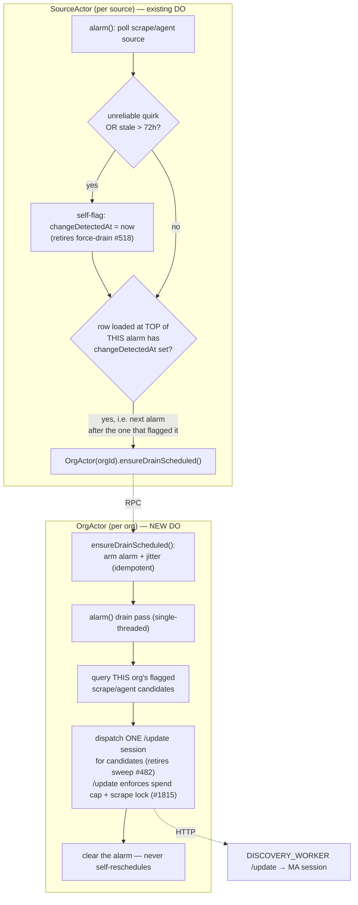

# OrgActor drain coordinator — retire the scrape-agent-sweep + force-drain crons

**Date:** 2026-07-01
**Issue:** #1777 (cron-absorption slice; the cross-source _reconciliation_ slice stays deferred)
**Status:** design approved, pending implementation plan

## Goal

Absorb the two daily cross-source crons into the Durable Object actor model, finishing
the cron-collapse that `SourceActor` (#1776) started for the hourly poll path:

- **`force-drain-sweep` (#518)** — the _producer_ that flags stranded scrape/agent sources
  (`changeDetectedAt = now`) so they get picked up.
- **`scrape-agent-sweep` (#482)** — the _consumer_ that drains flagged sources into per-org
  managed-agent (MA) `/update` sessions.

After this change, no cron drives scrape/agent drain: each `SourceActor` flags itself, and a
new per-org `OrgActor` drains its org's flagged sources on its own alarm.

## Scope

**In scope:** retire #518 and #482 by moving their work into `SourceActor` (self-flag) and a
new `OrgActor` (drain).

**Explicitly out of scope:**

- **ProductActor cross-source coverage reconciliation** — the original #1777 scope. The
  un-defer trigger from #1775 (cross-source coverage links > ~50, or > 1% of new links over a
  trailing 90d) has **not** fired: a fresh prod re-check on 2026-07-01 showed **4,729 coverage
  links, 0 cross-source** (100% same-source, unchanged from the 2026-06-29 check). Reconciliation
  stays deferred. The `OrgActor` we introduce here hosts _only_ the drain responsibility; the
  reconciliation-escalation behavior described in `durable-objects-exploration.md` is added to the
  **same class** later, when demand exists.
- **In-app cost budgeting.** Cost is enforced upstream (Anthropic monthly cap + OpenRouter/AI
  gateway budgets), so no DO holds a spend ceiling. See [Why no budget layer](#why-no-budget-layer).
- **Other crons** (retier, overview-regen, `.well-known` sync). Separate absorption, not here.

## Background: how the two crons work today

They are a producer/consumer pair over the `sources.change_detected_at` column, for
`type in (scrape, agent)` sources that aren't paused/hidden, aren't Firecrawl-owned, and whose
`metadata.feedUrl` is unset (feed-shaped scrape sources drain via the feed path).

- **`force-drain-sweep`** (04:00 UTC, `cron/force-drain-sweep.ts`) selects sources whose
  playbook marks `changeDetector: unreliable` (never emits a change signal) **or** that are
  stale (`lastFetchedAt < now - FORCE_DRAIN_STALE_HOURS`, default 72h) and **not already
  flagged**. It sets `changeDetectedAt = now` on up to `FORCE_SWEEP_MAX_SESSIONS` (default 10)
  of them — oldest-first. It dispatches nothing.
- **`scrape-agent-sweep`** (01:00 UTC, `cron/scrape-agent-sweep.ts`) selects sources with
  `changeDetectedAt IS NOT NULL`, oldest-first, capped at `SCRAPE_AGENT_MAX_SESSIONS` candidate
  rows (default 20), groups them by org, and dispatches **one `/update` MA session per org**
  (payload: `company`, `sourceIdentifiers[]`, `orgId`, `correlationId`) at dispatch concurrency 3.
  A cheap `models.list()` preflight aborts the whole run on auth/credits failure.

The MA cost unit is the **`/update` session** (one per org), not the candidate source — the
`SCRAPE_AGENT_MAX_SESSIONS` name caps candidate _rows_, which then collapse to ≤ that many
sessions after org-grouping.

## Design

Two components. No third coordinator, no shared budget state.

### 1. Producer → `SourceActor` self-flag (retires #518)

In the existing `SourceActor` alarm, for `type in (scrape, agent)` sources that pass the same
exclusions the crons use (not paused, not hidden, `metadata.feedUrl` unset, not
`metadata.firecrawl.enabled`, org not `fetch_paused`):

- After the existing change-detection poll, **self-flag**: if the source's
  `changeDetector === 'unreliable'` **or** it is stale
  (`lastFetchedAt < now - FORCE_DRAIN_STALE_HOURS`, default 72h), and `changeDetectedAt` is
  currently null, set `changeDetectedAt = now`.
- The `changeDetector` quirk is already loaded on the poll path (`pollScrapeOrAgentByQuirk`),
  so this adds no new D1 read.
- **No producer cap.** Force-drain's cap of 10 was a crude flood-guard; with the budget layer
  gone the consumer no longer needs a producer-side throttle. Rate is shaped on the consumer
  via alarm smear (below).

Then, whenever the `Source` row loaded at the **top** of `alarm()` already has `changeDetectedAt`
set, the actor calls `OrgActor(orgId).ensureDrainScheduled()` — best-effort. Because that row is
read _before_ the same firing's workflow runs (and the workflow is what may set
`changeDetectedAt` via the self-flag above), the notify for a freshly-flagged source doesn't fire
on the alarm that flagged it — it fires on the **next** alarm, which re-reads the row and sees the
flag. First arming can therefore lag the self-flag by up to one tier interval (4h/24h), not just
by an RPC drop.

**At-least-once without a markers table or a cron:** the flag persists in D1 until the source
actually drains, and the `SourceActor` fires on its own recurring poll interval. If the
`ensureDrainScheduled` RPC is dropped or the `OrgActor` is mid-eviction, the next poll re-notifies.
The recurring alarm _is_ the safety net — it's what eventually arms `OrgActor`, not just a backstop
for a dropped RPC.

### 2. Consumer → `OrgActor` (retires #482)

A new DO class, `getByName(orgId)`. Single-threaded, storage-gated drain — the org-grain actor
`durable-objects-exploration.md` identifies as the natural home for per-org MA coordination.

**State (DO storage):** just an alarm-armed flag. No budget-day, no quota counters.

**`ensureDrainScheduled()` RPC:** idempotent. If no alarm is armed, `setAlarm(now + jitter)`
where jitter is a bounded random offset (the `seedJitterMs` pattern already in the tree). The
jitter smears independent orgs' drains across a window so aggregate MA-dispatch rate stays
bounded with zero shared state.

**`alarm()` (drain pass):** always clears its own alarm first — `OrgActor` never self-reschedules;
it is a single-shot drain pass per arming, not a loop.

1. Clear the alarm (re-arming is driven entirely by the next `SourceActor.ensureDrainScheduled`
   notify, not by anything `OrgActor` does itself).
2. Query _this org's_ candidates: same filter as `scrape-agent-sweep`'s `queryCandidates`, scoped
   to `orgId` — scrape/agent, not paused/hidden/firecrawl/feed, org not `fetch_paused`,
   `changeDetectedAt IS NOT NULL`, ordered `lastFetchedAt ASC`. (`queryCandidates` is extended with
   an optional `orgId` param rather than hand-rolling a second copy of the filter.)
3. If none, log and return — nothing to dispatch.
4. Dispatch **one `/update` session** for the candidate set (same payload as today's
   `dispatchOne`). `OrgActor` does **not** acquire the per-source scrape lock (#1815) itself —
   the discovery `/update` endpoint owns that check (and the per-org/global spend cap) before it
   mints a session.
5. Log the outcome (dispatched / discovery-binding-missing / api-key-missing / failed / error) and
   return. A rejected or errored `/update` (cap hit, locked, network failure) is **not** retried
   here — there is no backlog reschedule and no lock to release. The source stays flagged in D1,
   and the next `SourceActor` alarm that observes the still-set flag re-notifies `OrgActor`,
   re-arming a fresh drain pass. The recurring `SourceActor` poll alarm is the retry mechanism, not
   `OrgActor` itself.

**Preflight:** dropped as a standalone step. Today's batch preflight avoided dispatching ~20
doomed sessions on an auth/credits failure. With one session per org and no batch, an auth/credits
failure surfaces cheaply in the `/update` response; the `OrgActor` logs it and moves on — the
source stays flagged and re-drains on the next `SourceActor` notify (see above). A persistently bad
account is handled by the kill switch (below), not a per-org `models.list()` call.

### 3. Rate shaping (replaces the budget)

- **Alarm smear** on `ensureDrainScheduled` spreads orgs across a window — the only rate control,
  and it needs no coordinator.
- **One session per org per drain pass** keeps per-org volume naturally ~1.
- **Cost ceiling is upstream** (Anthropic monthly + gateway budgets).

### Why no budget layer

An earlier draft added a singleton `MaBudgetActor` semaphore + per-org daily quotas to hold a
global spend ceiling. That was cut: the ceiling is enforced better upstream (account-level monthly
cost controls; OpenRouter/AI-gateway budgets), so an in-app budget DO would duplicate it while
reintroducing exactly the "single global DO" the exploration doc warns against. Deleting it drops
a whole class plus `tryAcquire`/`release`/day-roll/preflight-cache machinery, and collapses the
design to two components.

**Accepted residual risk:** without a global cap, a pathological burst (e.g. a deploy bug that
flags _every_ source at once) would spike MA _session count_ within the smear window. Cost stays
capped upstream, but you could see a session spike and possibly Anthropic 429s. Mitigations: the
alarm smear spreads the burst, and the kill switch stops it. At current volume (the sweep handled
≤ 20 sources/day total) smear has large headroom, so no hard ceiling ships now; add one only if
429s appear in practice.

## Migration, kill switch, double-dispatch guard

This path dispatches **billable** MA sessions, so it ships more carefully than the #1819
scaffolding removal.

- **Kill switch `ORG_DRAIN_ACTOR_ENABLED` (Flagship).** A genuine kill switch for a
  billable/external path — meets the "a flag must earn its keep" bar. With the budget layer gone,
  this flag is the _only_ app-level guard, so it is load-bearing.
  - **off** → `SourceActor` self-flag + `OrgActor` notify path are inert; both crons run as today.
  - **on** → actor path drives, and **both crons early-return** so only one path drains.
- **Double-dispatch guard.** Even during a flag-flip overlap window, the per-source scrape lock
  (#1815) structurally prevents a cron and an `OrgActor` from both minting a session for the same
  source.
- **Rollout is a single flag flip, not a per-source cohort ramp** — the drain is per-org and there
  is no global budget to stage. Ship flag **off**, flip **on**, watch Axiom for one drain cycle,
  and roll back instantly by flipping **off** (crons resume with their existing caps).
- **Bindings-absent fallback** (local dev, no DO infra): the crons remain the drain path, exactly
  as `SourceActor` keeps the inline `pollAndFetch` fallback.

## Observability

- `SourceActor`: a `self-flagged` event (with `reason: unreliable | stale`) when it sets
  `changeDetectedAt`; keep the existing `fired` events.
- `OrgActor`: `drain-scheduled`, `drain-dispatched` (with `orgId`, `sourceCount`, `sessionId`),
  `drain-skipped` (no candidates / all locked), `drain-failed`.
- Watch: no `scrape-agent-cron`/`force-drain-cron` `done` events once the flag is on (they should
  early-return); `drain-dispatched` volume ≈ prior sweep session volume; zero `drain-failed` in a
  clean cycle; no double-dispatch (a source's `changeDetectedAt` cleared exactly once per cycle).

## Testing

- **SourceActor self-flag:** stale → flags; `unreliable` quirk → flags; fresh + reliable → does
  not; paused/hidden/firecrawl/feed → excluded; already-flagged → left alone.
- **OrgActor drain:** org-scoped candidate query matches the sweep filter; one dispatch per pass;
  an errored or rejected `/update` (cap hit, locked, network failure, discovery binding or API key
  missing) is logged and dropped — no reschedule, no lock to release, the source stays flagged;
  empty candidate set is a no-op; the alarm is always cleared at the top of `alarm()` regardless of
  outcome (no self-rescheduling).
- **Kill switch / parity:** flag-on makes both crons early-return; the actor path selects the same
  candidate set the crons would for a shared fixture.
- **No double-dispatch:** with the flag on and a source flagged, only one `/update` is minted per
  drain pass (the per-source scrape lock, enforced by `/update` itself, prevents an overlapping
  cron/actor pass from double-minting).

## Open questions to settle during implementation

1. **`OrgActor` per-session chunk size** — the max `sourceIdentifiers` per `/update` call before
   the drain splits an org across passes. Default generous (the sweep never chunked); revisit only
   if a single org's flagged set is large enough to strain one session.
2. **Smear window size** — reuse `SEED_JITTER_WINDOW_MS` (5 min) or a wider drain-specific window.
   Wider spreads bursts more; start with the existing 5 min and widen only if needed.
3. **`FORCE_DRAIN_STALE_HOURS` home** — currently a cron env var; the `SourceActor` self-flag needs
   the same value. Thread it through the actor env (keep the default 72h).
